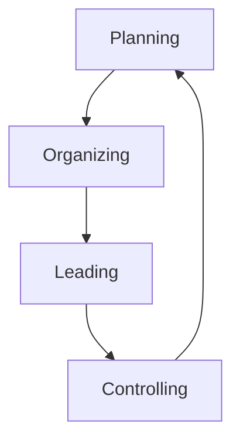

# Chapter 1: Managing in Today's World

> [!abstract] Overview
> Modern management is defined by navigating a complex business landscape shaped by rapid change, digital transformation, and evolving workforce expectations. Managers today are **strategic enablers**, **change agents**, and **people developers**.

## Part 1: Lecture Notes - Introduction to Modern Management

### 1.1 The Evolving Role of the Manager
The shift from traditional to modern management marks a transition from authority to empowerment.

| Traditional Approach | Modern Approach |
| :--- | :--- |
| Command & Control | **Strategic Enabler** |
| Top-Down Decisions | **Change Agent** |
| Task Supervision | **People Developer** |
| Information Gatekeeping | **Collaborative Leader** |

> [!quote] Key Insight
> Today's managers navigate complexity through empowerment, not authority.

### 1.2 Adapting to Rapid Change

#### Managerial Agility
- **Responsive:** Adapting to technological, economic, and social shifts.
- **Confident Leadership:** Leading through uncertainty with confidence.
- **Adaptive Decision-Making:** Quick pivoting and adaptive decision-making.

#### Continuous Learning
- Foster a **growth mindset** across teams.
- Stay current with industry trends and tools.
- Encourage experimentation and knowledge sharing.

#### Culture of Resilience
- Build **psychological safety** for innovation.
- Transform challenges into opportunities.
- Strengthen team adaptability and cohesion.

> [!tip] Extra Notes: Psychological Safety
> Psychological safety is the belief that one will not be punished or humiliated for speaking up with ideas, questions, concerns, or mistakes. It is a critical factor in team success and innovation.

### 1.3 Interpersonal Skills and Emotional Intelligence (EQ)
> [!info] 80/20 Rule in Management
> Modern managers spend **80%** of their time in interpersonal interactions, making EQ as important as IQ for leadership success.

**Key Interpersonal Competencies:**
- **Active Listening:** Deep engagement with team members' perspectives and concerns.
- **Conflict Resolution:** Mediating disputes and finding win-win solutions.
- **Trust Building:** Creating reliable relationships through consistency and transparency.
- **Psychological Safety:** Fostering environments where people feel safe to contribute and take risks.
- **Cultural Sensitivity:** Adapting communication styles to diverse backgrounds and preferences.

### 1.4 Decision-Making Under Uncertainty
Effective managers combine **analytical rigor** with **intuitive wisdom** to navigate complexity and uncertainty.
- **Data-Driven Insights:** Modern managers leverage real-time analytics and business intelligence tools to identify patterns and trends.
- **Human Intuition:** Experience, emotional intelligence, and contextual understanding complement analytical data.
- **Filtering Information Noise:** Distinguishing between relevant signals and distracting data overload in fast-paced environments.
- **Rapid Response Capability:** Making quality decisions quickly when complete information isn't available.

### 1.5 The P-O-L-C Framework Overview
Foundational management functions are integrated as adaptive, continuous processes rather than sequential steps.

- **Planning:** Strategic Vision & Goals.
- **Organizing:** Structure & Resources.
- **Leading:** Influence & Inspiration.
- **Controlling:** Monitor & Improve.

#### Planning: From Static to Dynamic
- **Static Approach:** Fixed annual plans, linear forecasting, rigid milestones, top-down approach.
- **Dynamic Approach:** Rolling forecasts, environmental scanning, scenario modeling, data-driven insights.
- *Transformation:* Strategic flexibility through continuous adaptation and real-time market intelligence.

#### Organizing for Agility
- **Traditional Structure:** Rigid Hierarchy.
- **Agile Structure:** Networked Teams enabled by Digital Collaboration (e.g., Microsoft Teams, Asana).
- **Key Benefits:** Faster decision-making, enhanced collaboration, rapid response to change.

#### Leading through Influence
- **From Authority to Influence:** Leadership through inspiration (not command), building trust and psychological safety.
- **Empowerment & Inclusion:** Involving diverse voices in decision-making, creating environments for growth and initiative.
- **The Leader as Coach:** Guiding and developing team members, focusing on individual and collective success.

#### Modern Controlling Systems
- **Traditional Control:** Annual audits, compliance focus, reactive approach, manual reporting.
- **Real-Time Control:** Live dashboards, AI-powered insights, proactive monitoring, continuous feedback.
- *Transformation:* Focus shifts from punishment to learning and rapid course correction.

### 1.6 Leadership: Servant and Transformational
Both styles complement each other in modern leadership practice.

- **Servant Leadership:** Prioritizes team well-being and development, acts as facilitator and supporter, removes barriers for team success, focuses on empowerment and growth, builds trust through service.
- **Transformational Leadership:** Inspires through compelling vision, motivates change and innovation, challenges status quo thinking, creates emotional connection to goals, drives organizational transformation.

### 1.7 The Core of Emotional Intelligence (EI)
Emotional Intelligence integrates these components to enhance leadership effectiveness and team dynamics:
1. **Self-Awareness:** Understanding your emotions, recognizing personal triggers, knowing your strengths and limits.
2. **Self-Regulation:** Managing impulses effectively, staying composed under pressure, adapting to change gracefully.
3. **Empathy:** Understanding others' perspectives, reading emotional cues, responding with compassion.
4. **Social Skills:** Building strong relationships, communicating effectively, resolving conflicts constructively.

> [!tip] Extra Notes: Emotional Intelligence
> Emotional intelligence (EI or EQ) is widely recognized as a stronger predictor of leadership success than traditional IQ. It allows managers to navigate complex social situations and build high-performing, cohesive teams.

### 1.8 Diversity, Equity, and Inclusion (DEI)
Inclusive leaders don't just manage diversity – they actively cultivate it as a strategic advantage for innovation and organizational excellence.
- **Challenging Unconscious Bias:** Active awareness and interruption of implicit assumptions that affect decision-making.
- **Creating Psychological Safety:** Environments where all team members feel valued and safe to contribute authentically.
- **Leveraging Diverse Perspectives:** Harnessing varied backgrounds and experiences for enhanced innovation and problem-solving.
- **Equitable Processes:** Fair systems for hiring, promotion, recognition, and development opportunities.

### 1.9 Entrepreneurship & Intrapreneurship
- **Entrepreneurship (External Innovation):** Starting new ventures, market disruption, independent risk-taking.
- **Intrapreneurship (Internal Innovation):** Innovation within existing organizations, identifying unmet internal needs, taking initiative with company resources.
- **Manager's Role (Enabling Environment):** Encourage experimentation, provide resources and support, celebrate both success and learning.

> [!quote] 
> "Intrapreneurs drive innovation from within, combining entrepreneurial spirit with organizational stability" - Borges et al. (2023)

### 1.10 Cultivating a Culture of Innovation
- **Psychological Safety (Creating Safe Spaces):** Encourage risk-taking without fear of punishment, celebrate constructive failures as learning, foster open dialogue and idea sharing.
- **Structured Innovation Time:** Google's 20% Time (One day per week for passion projects), 3M's 15% rule for experimental work, Dedicated innovation labs and maker spaces.
- **Institutionalizing Creativity (Supporting Practices):** View failures as learning opportunities.
- **Enabling Environment:** Cross-functional collaboration opportunities, resource allocation for experimentation, recognition and rewards for innovative thinking.

### 1.11 Human-Centered Design Thinking
A problem-solving framework for modern managers that puts human needs first, leading to more innovative and effective solutions:
1. **Empathize:** Understand user needs and emotions.
2. **Define:** Clarify the core problem to solve.
3. **Ideate:** Generate creative solutions.
4. **Prototype:** Build testable solutions quickly.
5. **Test:** Validate with real users.

### 1.12 Global Management and Cultural Intelligence (CQ)
**What is Cultural Intelligence (CQ)?**
The ability to understand, adapt to, and effectively interact with people from different cultural backgrounds. Essential skill for managing multicultural teams and global markets.

**Key Components of CQ:**
- **Cultural Awareness:** Understanding different values and norms.
- **Behavioral Adaptation:** Adjusting communication and leadership styles.
- **Empathy & Respect:** Appreciating diverse perspectives.

**Why CQ Matters:** Reduces misunderstandings, builds trust, enhances team collaboration and innovation, drives success in global business environments.

> [!tip] Extra Notes: Cultural Intelligence (CQ)
> Unlike standard intelligence (IQ) or emotional intelligence (EQ), CQ specifically relates to a person's capability to function effectively in situations characterized by cultural diversity.

### 1.13 Global Strategy and Local Responsiveness
Balancing integration with customization:
- **Global Integration:** Standardized processes, shared resources, cost efficiency, knowledge transfer.
- **Strategic Balance:** Flexible frameworks, adaptive structures, cultural intelligence, regulatory compliance.
- **Local Responsiveness:** Market adaptation, cultural sensitivity, legal compliance, customer preferences.

> [!example] Example: McDonald's
> McDonald's operates globally with standardized systems but adapts menus locally (e.g., McRice in Taiwan, vegetarian options in India).

### 1.14 Ethics and Corporate Social Responsibility (CSR)
- **Core CSR Elements:** Sustainable Operations (Environmental stewardship), Ethical Sourcing (Fair labor practices and supply chain responsibility), Community Engagement (Local investment and social programs), Stakeholder Value (Balancing profit with purpose).
- **Strategic Benefits:** Enhanced Brand Reputation and Trust, Long-term Risk Mitigation, Improved Employee Engagement and Retention.

> [!quote]
> "Organizations that embed ethics into daily operations create sustainable competitive advantages while contributing to societal well-being"

### 1.15 Technology & Digital Transformation
- **Digital Tools Enhancing Management:** Video Conferencing & Collaboration Platforms (Breaking geographical barriers), AI-Powered Analytics & Decision Support (Data-driven insights), Automation of Routine Tasks (Efficiency gains).
- **Managing Digital Challenges:** Cybersecurity & Data Protection (Safeguarding information), Privacy Compliance & Ethics (Responsible use of technology).

### 1.16 The Manager as a Strategist
Strategic thinking transforms managers from reactive problem-solvers to proactive opportunity creators.
- **SWOT Analysis:** Evaluates internal capabilities and external market dynamics. (Strengths, Weaknesses, Opportunities, Threats).
- **PESTLE Framework:** Analyzes macro-environmental forces affecting strategy. (Political, Economic, Social, Technological, Legal, Environmental).

### 1.17 Competitive Advantage and Scenario Planning
Strategic managers balance current strengths with future preparedness.
- **Identifying Competitive Advantage:** Valuable resources that create customer value, rare capabilities competitors cannot easily obtain, difficult to imitate or substitute, organized to capture value effectively. (Examples: Patent protection, brand loyalty, specialized expertise, operational efficiency).
- **Scenario Planning Process:** Identify key uncertainties and driving forces -> Develop 3-4 plausible future scenarios -> Create strategic responses for each scenario -> Monitor indicators and adapt strategies. (Prepare for: Economic shifts, technological disruption, geopolitical changes).

### 1.18 Performance & Accountability
Accountability thrives when employees understand how their work contributes to larger goals and feel supported in achieving them.
- **KPIs & OKRs:** Align individual efforts with organizational objectives through measurable goals and transparent tracking.
- **360-Degree Feedback:** Multi-perspective evaluation from peers, supervisors, and team members for comprehensive development insights.
- **Continuous Development:** Replace annual reviews with ongoing coaching, real-time recognition, and growth-focused conversations.

> [!success] Conclusion
> The future manager is agile and adaptable, emotionally intelligent, globally aware, technology-savvy, and purpose-driven.
> 
> *"Leadership is not about being in charge. It's about taking care of those in your charge."* — Simon Sinek

---

## Part 2: Textbook Notes - Fundamentals of Management

> [!info] Definition: Management
> The process of getting things done effectively and efficiently, with and through people.

### 1.19 What is Management?

- **Effectiveness:** Doing the right things. Attaining organizational goals.
- **Efficiency:** Doing things right. Getting the most output from the least amount of inputs.

> [!example] Example: Efficiency vs Effectiveness
> - *Efficiency*: Producing high-quality parts at a low cost.
> - *Effectiveness*: Producing the parts that customers actually want to buy.

> [!tip] Extra Notes: Efficiency vs Effectiveness
> It's possible for an organization to be efficient but not effective (e.g., producing a product nobody wants very cheaply) or effective but not efficient (e.g., achieving a goal but at a massive cost). Good management requires both.

### 1.20 Who are Managers?

A manager is someone who coordinates and oversees the work of other people so that organizational goals can be accomplished.

#### Levels of Management

1. **Top Managers:** Individuals who are responsible for making organization-wide decisions and establishing plans and goals that affect the entire organization (e.g., CEO, President).
2. **Middle Managers:** Individuals who manage the work of first-line managers (e.g., Regional Manager, Store Manager).
3. **First-line Managers:** Individuals who manage the work of non-managerial employees (e.g., Supervisors, Shift Managers).
4. **Non-Managerial Employees:** People who work directly on a job or task and have no responsibility for overseeing the work of others.

### 1.21 What Do Managers Do?

#### Management Functions (Henri Fayol)
1. **Planning:** Defining goals, establishing strategies to achieve goals, and developing plans to integrate and coordinate activities.
2. **Organizing:** Arranging and structuring work to accomplish organizational goals.
3. **Leading:** Working with and through people to accomplish goals.
4. **Controlling:** Monitoring, comparing, and correcting work.

#### Management Roles (Henry Mintzberg)

> [!note] Important
> Mintzberg concluded that what managers *do* can best be described by looking at the roles they play at work.

1. **Interpersonal Roles:** Involve people and other duties that are ceremonial and symbolic in nature.
   - *Figurehead, Leader, Liaison*
2. **Informational Roles:** Involve collecting, receiving, and disseminating information.
   - *Monitor, Disseminator, Spokesperson*
3. **Decisional Roles:** Entail making decisions or choices.
   - *Entrepreneur, Disturbance Handler, Resource Allocator, Negotiator*

#### Management Skills (Robert Katz)

1. **Technical Skills:** Knowledge and proficiency in a specific field. (Most important for lower-level managers).
2. **Human/Interpersonal Skills:** The ability to work well with other people individually and in a group. (Equally important across all levels of management).
3. **Conceptual Skills:** The ability to think and conceptualize about abstract and complex situations concerning the organization. (Most important for top managers).

### 1.22 The Organization

> [!info] Definition: Organization
> A deliberate arrangement of people to accomplish some specific purpose.

#### Common Characteristics of Organizations
- **Distinct Purpose:** Expressed in terms of a goal or set of goals.
- **Composed of People:** Takes people to perform the work necessary for the organization to achieve its goals.
- **Deliberate Structure:** Develops a structure so members can do their work.

### 1.23 Why Study Management?

1. **Universality of Management:** The reality that management is needed in all types and sizes of organizations, at all organizational levels, in all organizational areas, and in organizations no matter where located.
2. **Reality of Work:** You will either manage or be managed.
3. **Rewards and Challenges of Being a Manager:**
   - *Rewards:* Create a work environment where members can work to the best of their ability, support, coach, and nurture others.
   - *Challenges:* Hard work, may have duties that are more clerical than managerial, have to deal with a variety of personalities.

---

# Chapter 2: Management, its Environment and Culture

## Part 1: Lecture Notes - Management, its Environment and Culture

*Introduction to Management Principles:*
*Modern management integrates traditional functions with contemporary challenges in our globalized, multicultural world.*
- **Management Foundations:** Planning, organizing, leading, and controlling resources. Managerial roles and decision-making processes.
- **Dynamic Environment:** External forces: political, economic, social, technological. Environmental uncertainty and strategic adaptation.
- **Organizational Culture:** Shared values, beliefs, and behavioral norms. Cultural influence on performance and leadership.

### 2.1 Defining Management
Management is the process of planning, organizing, leading, and controlling resources to achieve organizational goals efficiently and effectively.

**The Four Core Functions:**
- Planning
- Organizing
- Leading
- Controlling

**Dual Focus:**
- **Efficiency** - Doing things right
- **Effectiveness** - Doing the right things

### 2.2 The Four Functions of Management (The Building Blocks)
These functions are interdependent and continuous. Planning informs organizing, leading supports execution, controlling provides feedback.

- **Planning:** Setting objectives and determining the best course of action.
- **Organizing:** Arranging resources and activities to implement plans.
- **Leading:** Guiding and motivating employees toward goals.
- **Controlling:** Monitoring performance and taking corrective action.

#### Planning and Organizing Functions
- **Planning:** Setting clear objectives and goals, determining strategic courses of action, anticipating future challenges and opportunities, resource allocation and timeline development.
- **Organizing:** Arranging and coordinating resources effectively, designing optimal organizational structures, assigning roles and responsibilities clearly, creating communication channels and workflows.

#### Leading and Controlling Functions
- **Leading:** Motivating employees toward goals, influencing behavior and attitudes, building team cohesion, inspiring innovation and creativity, communicating vision effectively.
- **Controlling:** Setting performance standards, measuring actual results, comparing performance to goals, taking corrective action when needed, ensuring quality and efficiency.

### 2.3 Mintzberg's Managerial Roles
Beyond the Four Functions: What Managers Actually Do.

- **Interpersonal Roles:**
  - *Figurehead:* Ceremonial duties and symbolic leadership.
  - *Leader:* Motivating and guiding team members.
  - *Liaison:* Building networks and external relationships.
- **Informational Roles:**
  - *Monitor:* Gathering internal and external information.
  - *Disseminator:* Sharing information with team members.
  - *Spokesperson:* Representing organization to outsiders.
- **Decisional Roles:**
  - *Entrepreneur:* Initiating change and innovation.
  - *Disturbance Handler:* Resolving conflicts and crises.
  - *Resource Allocator:* Distributing budgets and resources.
  - *Negotiator:* Bargaining with stakeholders.

> [!example] Example: In Practice
> A hospital administrator may act as figurehead at a ceremony (interpersonal), share policy updates with staff (informational), and allocate the annual budget (decisional) - all in one day!

### 2.4 The Management Environment
Organizations operate within a complex system of internal and external forces.
- **Internal Forces:** Culture, structure, resources, capabilities.
- **External Forces:** Economic, political, social, technological factors.
- **Dynamic Interaction:** Constant adaptation and response required.
- **Strategic Impact:** Environment shapes opportunities and constraints.

#### External Environment: PESTEL Framework
Analyzing Macro-Level Environmental Forces.
- **P**olitical: Government policies, regulations, political stability.
- **E**conomic: Interest rates, inflation, economic growth, unemployment.
- **S**ocial: Demographics, lifestyle trends, cultural values.
- **T**echnological: Innovation, automation, digital transformation.
- **E**nvironmental: Climate change, sustainability, resource scarcity.
- **L**egal: Labor laws, consumer protection, safety regulations.

> [!tip] Extra Notes: PESTEL
> PESTEL helps managers anticipate external changes and prepare strategic responses.

#### The Task Environment
Stakeholders with Direct Operational Impact.
- **Suppliers:** Provide essential resources and materials.
- **Customers:** Drive demand and revenue generation.
- **Competitors:** Influence market dynamics and strategy.
- **Regulators:** Set rules and compliance requirements.
- **Strategic Partners:** Enable collaboration and resource sharing.

#### Environmental Uncertainty
Classifying Business Environments based on Degree of Change (Stable vs Dynamic) and Degree of Complexity (Simple vs Complex).
- **Simple & Stable (Low Uncertainty Environment):** Traditional factory or retail store, steady and predictable environment. Orderly operations.
- **Complex & Stable (Complex, stable Environment):** Complex, stable university and hospital systems. Interconnected elements with stable operations.
- **Simple & Dynamic (Moderate-Low Uncertainty):** Fashion retail chain with seasonal business. Regular, manageable changes.
- **Complex & Dynamic (High Uncertainty Environment):** High-tech companies or startups with rapid, often dramatic change. Dynamic, swirling environment.

### 2.5 Understanding Organizational Culture
Culture is a system of shared assumptions, values, and beliefs that guides how people think, act, and make decisions within an organization.
- Culture operates like an invisible framework.
- Influences daily behaviors and decision-making.
- Shapes communication patterns and work relationships.
- Determines what is considered 'normal' or 'acceptable'.

#### Edgar Schein's Levels of Culture
> [!quote]
> 'Culture's true power lies beneath the surface'

1. **Visible Elements (Artifacts):** Office layout and design, dress codes and rituals, language and symbols, ceremonial and stories.
2. **Stated Beliefs (Espoused Values):** Mission statements, corporate policies, declared goals, official philosophies.
3. **Deep Beliefs (Basic Assumptions):** Human nature views, unconscious beliefs, taken-for-granted truths, core worldviews.

#### Culture Types: Competing Values Framework
Four Primary Organizational Culture Types.
- **Clan Culture (Collaborative & Family-like):** Employee-centered approach, team collaboration focus, participative leadership, high morale emphasis.
- **Adhocracy Culture (Innovative & Entrepreneurial):** Risk-taking encouraged, creativity and flexibility, visionary leadership, rapid adaptation.
- **Market Culture (Results-driven & Competitive):** Performance-focused, goal achievement priority, directive leadership, competitive environment.
- **Hierarchy Culture (Structured & Process-oriented):** Stability and control, clear procedures, consistency emphasis, formal structure.

#### Culture and Organizational Performance
The Performance Connection: Research shows organizations with strong cultures outperform competitors by 2-3x in key metrics.
- **Strong Culture Foundation:** Builds Trust and Shared Values.
- Leads to:
  - **Financial Performance:** Higher profitability, sustainable growth, market share gains.
  - **Employee Engagement:** Higher retention rates, increased motivation, stronger commitment.
  - **Innovation & Adaptability:** More creative solutions, faster adaptation, breakthrough thinking.
  - **Customer Satisfaction:** Improved service quality, stronger loyalty, positive reviews.

#### Culture's Influence on Management Practices
How Cultural Values Shape Management Functions:
- **Clan Culture:** Collaborative & Long-term Planning, Supportive & Mentoring Leadership, Development-focused & Relational Control.
- **Adhocracy Culture:** Flexible & Adaptive Planning, Visionary & Empowering Leadership, Feedback-driven & Experimental Control.
- **Market Culture:** Goal-oriented & Results-focused Planning, Task-oriented & Competitive Leadership, Performance-based & Reward-linked Control.
- **Hierarchy Culture:** Structured & Detailed Planning, Directive & Process-driven Leadership, Compliance-based & Standardized Control.

> [!quote] Key Insight
> Culture doesn’t just influence what managers do - it fundamentally shapes how they think about their role and responsibilities.

### 2.6 Globalization and Cultural Diversity
The Global Business Reality: Modern organizations operate across borders and cultures. Teams include members from diverse cultural backgrounds. Success requires understanding and adapting to cultural differences.
- **Communication Challenges:** Direct vs. indirect communication styles, High-context vs. low-context cultures, Language barriers and translation nuances, Non-verbal communication differences.
- **Decision-Making Variations:** Individual vs. consensus-based decisions, Risk tolerance and uncertainty avoidance, Time orientation and planning horizons, Authority and hierarchy expectations.
- **Teamwork Dynamics:** Collaborative vs. competitive orientations, Relationship-building.

> [!tip] Extra Notes: Cultural Intelligence (CQ)
> Cultural Intelligence (CQ) is the key competency for global managers - the ability to function effectively across cultural boundaries while respecting and leveraging diversity.

#### Hofstede's Cultural Dimensions
Framework for Cross-Cultural Management:
- **Power Distance:** Acceptance of hierarchical authority. (e.g., High in Malaysia, China vs Low in Denmark, Sweden).
- **Individualism vs Collectivism:** Focus on personal vs group goals. (e.g., High Individualism in USA, UK vs Collectivism in Japan, Indonesia).
- **Uncertainty Avoidance:** Comfort with ambiguity and change. (e.g., High Avoidance in Germany, Japan vs Low in Singapore, India).
- **Masculinity vs Femininity:** Achievement vs quality of life focus. (e.g., High Masculinity in Japan, Germany vs Femininity in Sweden, Norway).
- **Long-term vs Short-term Orientation:** Future vs immediate results focus. (e.g., Long-term in China, South Korea vs Short-term in USA, UK).
- **Indulgence vs Restraint:** Expression vs control of desires. (e.g., Indulgence in Mexico, USA vs Restraint in Russia, China).

Cultural intelligence requires understanding these dimensions to adapt leadership styles and communication approaches in global teams.

#### Cultural Intelligence (CQ)
The Four Components of Cross-Cultural Effectiveness:
1. **Cognitive CQ (Understanding Cultural Systems):** Knowledge of cultural values, norms, and practices. Awareness of how culture shapes behavior.
2. **Metacognitive CQ (Cultural Self-Awareness):** Planning and monitoring cross-cultural interactions. Checking assumptions and adjusting strategies.
3. **Motivational CQ (Drive to Engage):** Confidence and persistence in cultural adaptation. Enjoyment of diverse cultural experiences.
4. **Behavioral CQ (Adaptive Actions):** Flexibility in verbal and non-verbal communication. Adjusting behavior to cultural contexts.

High CQ enables managers to build trust, reduce misunderstandings, and create inclusive environments in multicultural teams.

### 2.7 Diagnosing and Changing Culture
Culture diagnosis is the critical first step - you cannot change what you don't understand.
**Diagnose $\rightarrow$ Understand $\rightarrow$ Plan $\rightarrow$ Transform**

Three Essential Diagnostic Tools:
1. **Cultural Audits:** Systematic evaluation of practices, policies, and behaviors. Identifies alignment between stated and actual values.
2. **Employee Surveys:** Anonymous feedback on workplace perceptions. Gathers insights on fairness, communication, and morale.
3. **In-Depth Interviews:** One-on-one discussions across organizational levels. Uncovers unspoken norms and underlying assumptions.

#### Kotter's 8-Step Model for Culture Change
A Structured Roadmap for Leading Transformation.
*Foundation Phase:*
1. Create Urgency
2. Form Coalition
3. Create Vision
*Implementation Phase:*
4. Communicate Vision
5. Remove Barriers
6. Create Quick Wins
7. Build on Change
8. Anchor in Culture

Culture change is not a one-time event but a sustained journey requiring leadership commitment and systematic approach.

### 2.8 Ethics and Organizational Climate
**Ethical climate** refers to the prevailing atmosphere regarding ethical behavior in an organization.

**Characteristics of Strong Ethical Climate:**
- Transparency in decision-making and communication
- Accountability at all organizational levels
- Open reporting channels and whistleblower protection
- Leadership modeling ethical behavior
- Consistent consequences for misconduct

**Organizations with integrity-driven cultures experience:**
- Reduced risk of scandals and legal issues
- Higher employee trust and engagement
- Stronger stakeholder relationships
- Enhanced reputation and brand value

### 2.9 Islamic Management Principles
Integrating Spiritual Values into Modern Management Practice. These principles create a holistic management framework that emphasizes ethics, social responsibility, and long-term sustainability.
- **Sidiq (Honesty):** Truthfulness in all business dealings, communication, and reporting.
- **Amanah (Trustworthiness):** Responsibility and accountability in safeguarding organizational resources.
- **Adl (Justice):** Fairness and equity in decision-making and employee treatment.
- **Mas'uliyah (Accountability):** Personal responsibility for actions and ethical standards.

### 2.10 Case Studies: Local and Global
Real-World Applications of Management and Culture.
- **Malaysian SME (Cultural Diversity Success):** Manufacturing firm with multicultural workforce.
  - *Challenge:* Economic volatility + cultural differences.
  - *Solution:* Culture of Collaboration initiative.
  - *Results:* 25% productivity increase, market expansion.
- **Tech Firm (Vietnam Market Entry):** US technology company expanding to Southeast Asia.
  - *Challenge:* Western vs. Vietnamese cultural clash.
  - *Solution:* Cultural Intelligence approach.
  - *Results:* 40% satisfaction increase, revenue targets met.

### 2.11 Summary and Conclusion
Effective management requires a holistic approach: environmental awareness + cultural strength = sustainable competitive advantage.
- Management functions are interdependent and culturally influenced.
- Environmental forces shape strategic decisions and organizational responses.
- Organizational culture serves as both strategic asset and control mechanism.
- Cultural intelligence enables success in diverse, global contexts.
- Ethical leadership and values alignment drive long-term sustainability.

> [!success] Conclusion
> The most effective managers combine traditional management skills with deep cultural awareness and ethical leadership.

---

## Part 2: Textbook Notes - Management, its Environment and Culture

> [!info] Definition: External Environment
> The factors and forces outside the organization that affect its performance.

### 2.12 The External Environment

The external environment consists of two main components:
1. **Specific Environment (Microenvironment):** External forces that have a direct and immediate impact on the organization's decisions and actions and are directly relevant to the achievement of the organization's goals.
   - *Customers:* The people who pay for the organization's products or services.
   - *Suppliers:* The organizations that provide materials and equipment.
   - *Competitors:* Other organizations competing for the same customers.
   - *Pressure Groups:* Special-interest groups that attempt to influence the organization's actions.
2. **General Environment (Macroenvironment):** Broad economic, socio-cultural, political/legal, demographic, technological, and global conditions that may affect the organization.
   - *Economic Conditions:* Interest rates, inflation, disposable income, stock market fluctuations.
   - *Political/Legal Conditions:* Federal, state, and local laws, as well as global laws and laws of other countries.
   - *Socio-cultural Conditions:* Values, attitudes, trends, traditions, lifestyles, beliefs, tastes, and patterns of behavior.
   - *Demographic Conditions:* Trends in population characteristics such as age, race, gender, education level, geographic location, income, and family composition.
   - *Technological Conditions:* Scientific and industrial innovations.
   - *Global Conditions:* Issues associated with globalization and a world economy.

> [!tip] Extra Notes: Specific vs General Environment
> Changes in the specific environment usually affect a single industry or organization directly and immediately. Changes in the general environment usually affect all organizations, but the impact is often indirect or delayed.

### 2.13 How the External Environment Affects Managers

1. **Jobs and Employment:** The external environment can create or eliminate jobs. Economic conditions strongly impact employment.
2. **Assessing Environmental Uncertainty:** The degree of change and complexity in an organization's environment.
   - *Degree of Change:* Dynamic (frequent change) vs. Stable (minimal change).
   - *Degree of Complexity:* The number of components in an organization's environment and the extent of the organization's knowledge about those components.
3. **Managing Stakeholder Relationships:** The nature of stakeholder relationships is another way in which the environment influences managers. The more obvious and secure these relationships, the more influence managers will have over organizational outcomes.

> [!info] Definition: Stakeholders
> Any constituencies in the organization's environment that are affected by an organization's decisions and actions. Examples include employees, customers, suppliers, local communities, shareholders, etc.

### 2.14 Organizational Culture

> [!info] Definition: Organizational Culture
> The shared values, principles, traditions, and ways of doing things that influence the way organizational members act and that distinguish the organization from other organizations.

#### Dimensions of Organizational Culture
- **Attention to Detail:** Degree to which employees are expected to exhibit precision, analysis, and attention to detail.
- **Outcome Orientation:** Degree to which managers focus on results or outcomes rather than on how these outcomes are achieved.
- **People Orientation:** Degree to which management decisions take into account the effects on people in the organization.
- **Team Orientation:** Degree to which work is organized around teams rather than individuals.
- **Aggressiveness:** Degree to which employees are aggressive and competitive rather than cooperative.
- **Stability:** Degree to which organizational decisions and actions emphasize maintaining the status quo.
- **Innovation and Risk Taking:** Degree to which employees are encouraged to be innovative and take risks.

#### Strong vs. Weak Cultures

> [!note] Important
> Organizations have cultures, but not all cultures have an equal impact on employees' behavior and actions.

- **Strong Cultures:** Organizational cultures in which the key values are intensely held and widely shared. They have a greater influence on employees than weak cultures.
- **Weak Cultures:** Values are limited to a few people - usually top management. The culture sends contradictory messages about what's important.

#### How Employees Learn Culture
- **Stories:** Organizational stories typically contain a narrative of significant events or people.
- **Rituals:** Repetitive sequences of activities that express and reinforce the values of the organization.
- **Material Artifacts and Symbols:** Physical assets distinguishing the organization (e.g., layout of facilities, how employees dress, size of offices).
- **Language:** Unique terms, acronyms, and jargon used by employees.

### 2.15 How Culture Affects Managers

An organization's culture constrains what managers can and cannot do. These constraints are rarely explicit; they're not written down.

> [!example] Example: Cultural Constraints
> A manager in a culture with a high risk-taking orientation will be more comfortable proposing bold, innovative projects. A manager in a culture emphasizing stability will likely propose more conservative, incremental changes.

---
# Chapter 3: Managing in the Global Economy

> [!info] Definition: Global Management
> The process of managing operations and making decisions in an environment where resources, markets, and competition are worldwide in scope.

## 3.1 Perspectives on Global Business

Understanding different perspectives is crucial for effective global management:

1. **Parochialism:** Viewing the world solely through one's own eyes and perspectives. People with a parochial attitude do not recognize that others have different ways of living and working. They ignore others' values and customs and rigidly apply an attitude of "ours is better than theirs."
2. **Ethnocentric Attitude:** The parochial belief that the best work approaches and practices are those of the home country (the country in which the company's headquarters are located).
3. **Polycentric Attitude:** The view that the managers in the host country (the foreign country in which the organization is doing business) know the best work approaches and practices for running their business.
4. **Geocentric Attitude:** A world-oriented view that focuses on using the best approaches and people from around the globe.

> [!tip] Extra Notes: Parochialism vs Ethnocentrism
> Parochialism is a lack of awareness of other cultures entirely. Ethnocentrism is an awareness of other cultures, but a belief that one's own culture is superior. Successful global management requires moving towards a geocentric attitude.

## 3.2 Regional Trading Alliances and Global Trade Mechanisms

Global trade is shaped by regional alliances and international organizations:

- **European Union (EU):** An economic and political partnership of European countries created as a unified economic and trade entity.
- **North American Free Trade Agreement (NAFTA):** An agreement among the Mexican, Canadian, and U.S. governments in which barriers to trade have been eliminated.
- **Association of Southeast Asian Nations (ASEAN):** A trading alliance of Southeast Asian nations.
- **World Trade Organization (WTO):** The only global organization dealing with the rules of trade among nations.

## 3.3 Types of International Organizations

1. **Multinational Corporation (MNC):** A broad term that refers to any and all types of international companies that maintain operations in multiple countries.
2. **Multidomestic Corporation:** An MNC that decentralizes management and other decisions to the local country (polycentric attitude).
3. **Global Company:** An MNC that centralizes management and other decisions in the home country (ethnocentric attitude).
4. **Transnational or Borderless Organization:** An MNC in which artificial geographical barriers are eliminated (geocentric attitude).

## 3.4 How Organizations Go Global

Organizations can expand globally using several approaches, typically moving from minimal investment to significant investment:

1. **Global Sourcing (Outsourcing):** Purchasing materials or labor from around the world wherever it is cheapest.
2. **Exporting:** Making products domestically and selling them abroad.
3. **Importing:** Acquiring products made abroad and selling them domestically.
4. **Licensing:** An organization gives another organization the right to make or sell its products using its technology or product specifications.
5. **Franchising:** An organization gives another organization the right to use its name and operating methods.
6. **Strategic Alliance:** A partnership between an organization and a foreign company partner(s) in which both share resources and knowledge in developing new products or building production facilities.
   - *Joint Venture:* A specific type of strategic alliance in which the partners form a separate, independent organization for some business purpose.
7. **Foreign Subsidiary:** Directly investing in a foreign country by setting up a separate and independent production facility or office.

> [!example] Example: Foreign Subsidiary
> A foreign subsidiary represents the greatest commitment to global expansion. For example, a US car manufacturer building a factory in Germany.

## 3.5 Managing in a Global Environment

Managing globally requires adapting to different environments:

1. **The Political/Legal Environment:** Managers must understand the stability of the foreign country's laws and government. Are there political risks or unstable governments?
2. **The Economic Environment:**
   - *Free Market Economy:* Resources are primarily owned and controlled by the private sector.
   - *Planned Economy:* Economic decisions are planned by a central government.
3. **The Cultural Environment:** Managers must understand National Culture – the values and attitudes shared by individuals from a specific country that shape their behavior and beliefs about what is important.

### Hofstede's Framework for Assessing Cultures
Geert Hofstede developed a framework for understanding cultural differences:
- **Power Distance:** Degree to which members of a society expect power to be unequally shared.
- **Individualism vs. Collectivism:** Degree to which individuals are encouraged by societal institutions to be integrated into groups.
- **Quantity of Life vs. Quality of Life (Masculinity vs. Femininity):** Degree to which society values assertiveness and materialism (Quantity) vs. relationships and sensitivity (Quality).
- **Uncertainty Avoidance:** Degree to which members of a society feel uncomfortable with uncertainty and ambiguity.
- **Long-term vs. Short-term Orientation:** Degree to which society emphasizes future-oriented values (e.g., thrift) vs. present/past-oriented values (e.g., tradition).