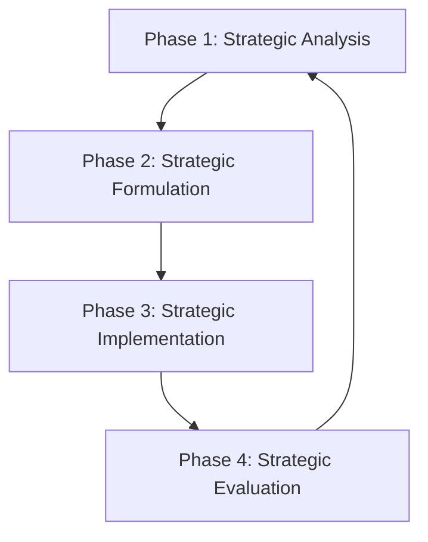
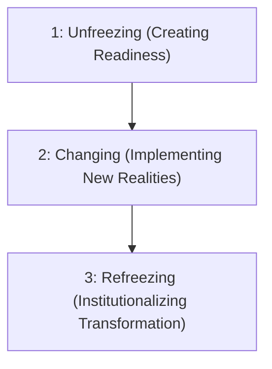
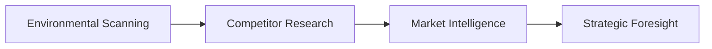
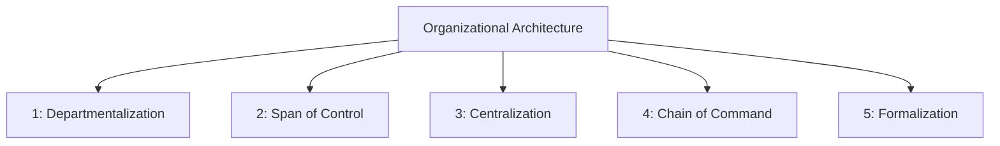
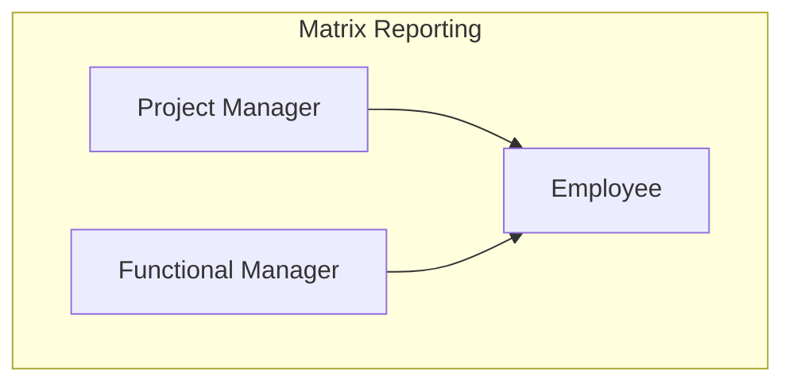
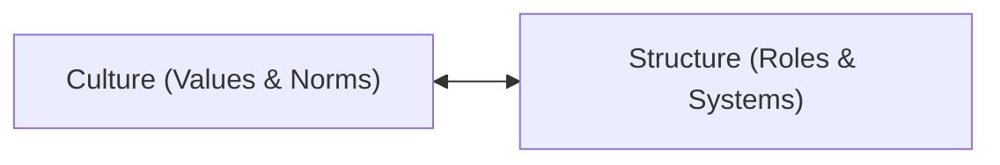
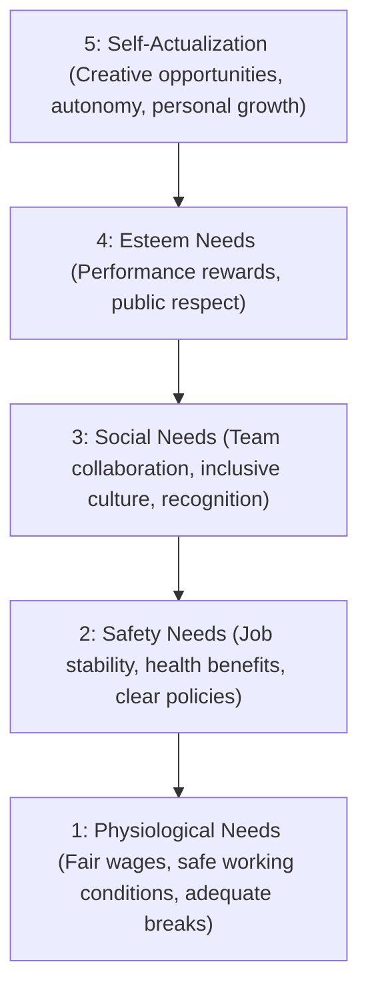
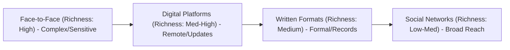

# Chapter 1: Managing in Today's World
Subtitle: Principles of Management

## 1.1 Introduction to Modern Management
Modern managers navigate a complex business landscape characterized by:
- Dynamic global environment shaped by rapid change.
- Digital transformation reshaping how we work and lead.
- Evolving workforce expectations driving new approaches.

> [!info] Modern Managers
> Modern managers are strategic enablers, change agents, and people developers.

## 1.2 The Evolving Role of the Manager
The role of a manager has evolved from a traditional approach to a modern approach:

**Traditional Approach:**
- Command & Control
- Top-Down Decisions
- Task Supervision
- Information Gatekeeping

**Modern Approach:**
- Strategic Enabler
- Change Agent
- People Developer
- Collaborative Leader

> [!note] Important
> Today's managers navigate complexity through empowerment, not authority.

## 1.3 Adapting to Rapid Change
- **Managerial Agility:** Responsive to technological, economic, and social shifts. Lead through uncertainty with confidence. Quick pivoting and adaptive decision-making.
- **Continuous Learning:** Foster growth mindset across teams. Stay current with industry trends and tools. Encourage experimentation and knowledge sharing.
- **Culture of Resilience:** Build psychological safety for innovation. Transform challenges into opportunities. Strengthen team adaptability and cohesion.

## 1.4 Interpersonal Skills and Emotional Intelligence
Building human connections in modern management involves key interpersonal competencies:
- **Active Listening:** Deep engagement with team members' perspectives and concerns.
- **Conflict Resolution:** Mediating disputes and finding win-win solutions.
- **Trust Building:** Creating reliable relationships through consistency and transparency.
- **Psychological Safety:** Fostering environments where people feel safe to contribute and take risks.
- **Cultural Sensitivity:** Adapting communication styles to diverse backgrounds and preferences.

> [!tip] Extra Notes: Importance of Interpersonal Skills
> Modern managers spend 80% of their time in interpersonal interactions, making EQ (Emotional Quotient) as important as IQ for leadership success.

## 1.5 Decision-Making Under Uncertainty
- **Data-Driven Insights:** Modern managers leverage real-time analytics and business intelligence tools to identify patterns and trends.
- **Human Intuition:** Experience, emotional intelligence, and contextual understanding complement analytical data.
- **Filtering Information Noise:** Distinguishing between relevant signals and distracting data overload in fast-paced environments.
- **Rapid Response Capability:** Making quality decisions quickly when complete information isn't available.

> [!note] Effective Decision Making
> Effective managers combine analytical rigor with intuitive wisdom to navigate complexity and uncertainty.

## 1.6 The P-O-L-C Framework Overview
Foundational management functions are integrated as adaptive, continuous processes rather than sequential steps.
- **Planning:** Strategic Vision & Goals
- **Organizing:** Structure & Resources
- **Leading:** Influence & Inspiration
- **Controlling:** Monitor & Improve

## 1.7 Planning: From Static to Dynamic
Modern planning evolution:

**Static Approach:**
- Fixed annual plans
- Linear forecasting
- Rigid milestones
- Top-down approach

**Dynamic Approach:**
- Rolling forecasts
- Environmental scanning
- Scenario modeling
- Data-driven insights

> [!note] Strategic Flexibility
> Strategic flexibility is achieved through continuous adaptation and real-time market intelligence.

## 1.8 Organizing for Agility
From rigid hierarchies to flexible networks, enabled by digital collaboration (e.g., Microsoft Teams, Asana).

- **Traditional Structure:** Rigid Hierarchy
- **Agile Structure:** Networked Teams

**Key Benefits of Agile Structure:**
- Faster Decision-Making
- Enhanced Collaboration
- Rapid Response to Change

## 1.9 Leading through Influence
21st Century leadership is redefined:
- **From Authority to Influence:** Leadership through inspiration, not command. Building trust and psychological safety.
- **Empowerment & Inclusion:** Involving diverse voices in decision-making. Creating environments for growth and initiative.
- **The Leader as Coach:** Guiding and developing team members. Focusing on individual and collective success.

## 1.10 Modern Controlling Systems
Evolution from traditional control to real-time control:

**Traditional Control:**
- Annual audits
- Compliance focus
- Reactive approach
- Manual reporting

**Real-Time Control:**
- Live dashboards
- AI-powered insights
- Proactive monitoring
- Continuous feedback

> [!tip] Extra Notes: Shift in Focus
> In modern controlling, the focus shifts from punishment to learning and rapid course correction.

## 1.11 Leadership: Servant and Transformational
Both styles complement each other in modern leadership practice.

**Servant Leadership:**
- Prioritizes team well-being and development.
- Acts as facilitator and supporter.
- Removes barriers for team success.
- Focuses on empowerment and growth.
- Builds trust through service.

**Transformational Leadership:**
- Inspires through compelling vision.
- Motivates change and innovation.
- Challenges status quo thinking.
- Creates emotional connection to goals.
- Drives organizational transformation.

## 1.12 The Core of Emotional Intelligence (EI)
Essential components for modern leadership:
- **Self-Awareness:** Understanding your emotions, recognizing personal triggers, knowing your strengths and limits.
- **Self-Regulation:** Managing impulses effectively, staying composed under pressure, adapting to change gracefully.
- **Empathy:** Understanding others' perspectives, reading emotional cues, responding with compassion.
- **Social Skills:** Building strong relationships, communicating effectively, resolving conflicts constructively.

> [!info] Emotional Intelligence
> Emotional Intelligence integrates these components to enhance leadership effectiveness and team dynamics.

## 1.13 Diversity, Equity, and Inclusion (DEI)
Building inclusive leadership involves:
- **Challenging Unconscious Bias:** Active awareness and interruption of implicit assumptions that affect decision-making.
- **Creating Psychological Safety:** Environments where all team members feel valued and safe to contribute authentically.
- **Leveraging Diverse Perspectives:** Harnessing varied backgrounds and experiences for enhanced innovation and problem-solving.
- **Equitable Processes:** Fair systems for hiring, promotion, recognition, and development opportunities.

> [!note] Inclusive Leaders
> Inclusive leaders don't just manage diversity – they actively cultivate it as a strategic advantage for innovation and organizational excellence.

## 1.14 Entrepreneurship & Intrapreneurship
Fostering innovation within organizations:
- **Entrepreneurship (External Innovation):** Starting new ventures, market disruption, independent risk-taking.
- **Intrapreneurship (Internal Innovation):** Innovation within existing organizations, identifying unmet internal needs, taking initiative with company resources.
- **Manager's Role (Enabling Environment):** Encourage experimentation, provide resources and support, celebrate both success and learning.

> [!quote] Intrapreneurs
> “Intrapreneurs drive innovation from within, combining entrepreneurial spirit with organizational stability” - Borges et al. (2023)

## 1.15 Cultivating a Culture of Innovation
- **Psychological Safety (Creating Safe Spaces):** Encourage risk-taking without fear of punishment. Celebrate constructive failures as learning opportunities. Foster open dialogue and idea sharing.
- **Structured Innovation Time:** E.g., Google's 20% Time (One day per week for passion projects), 3M's 15% rule for experimental work, dedicated innovation labs and maker spaces.
- **Institutionalizing Creativity (Enabling Environment):** Cross-functional collaboration opportunities, resource allocation for experimentation, recognition and rewards for innovative thinking.

## 1.16 Human-Centered Design Thinking
A problem-solving framework for modern managers that puts human needs first, leading to more innovative and effective solutions:
1. **Empathize:** Understand user needs and emotions.
2. **Define:** Clarify the core problem to solve.
3. **Ideate:** Generate creative solutions.
4. **Prototype:** Build testable solutions quickly.
5. **Test:** Validate with real users.

## 1.17 Global Management and Cultural Intelligence
**What is Cultural Intelligence (CQ)?**
- The ability to understand, adapt to, and effectively interact with people from different cultural backgrounds.
- Essential skill for managing multicultural teams and global markets.

**Key Components of CQ:**
- **Cultural Awareness:** Understanding different values and norms.
- **Behavioral Adaptation:** Adjusting communication and leadership styles.
- **Empathy & Respect:** Appreciating diverse perspectives.

**Why CQ Matters:**
- Reduces misunderstandings and builds trust.
- Enhances team collaboration and innovation.
- Drives success in global business environments.

## 1.18 Global Strategy and Local Responsiveness
Balancing integration with customization:
- **Global Integration:** Standardized processes, shared resources, cost efficiency, knowledge transfer.
- **Local Responsiveness:** Market adaptation, cultural sensitivity, legal compliance, customer preferences.
- **Strategic Balance:** Flexible frameworks, adaptive structures, cultural intelligence, regulatory compliance.

> [!example] Example: McDonald's
> McDonald's operates globally with standardized systems but adapts menus locally - McRice in Taiwan, vegetarian options in India.

## 1.19 Ethics and Corporate Social Responsibility
Building sustainable business practices:
- **Core CSR Elements:**
  - Sustainable Operations: Environmental stewardship and sustainability.
  - Ethical Sourcing: Fair labor practices, and supply chain responsibility.
  - Community Engagement: Local investment and social programs.
  - Stakeholder Value: Balancing profit with purpose.

- **Strategic Benefits:**
  - Enhanced Brand Reputation and Trust.
  - Long-term Risk Mitigation.
  - Improved Employee Engagement and Retention.

> [!quote] Ethics in Daily Operations
> “Organizations that embed ethics into daily operations create sustainable competitive advantages while contributing to societal well-being”

## 1.20 Technology & Digital Transformation
- **Digital Tools Enhancing Management:**
  - Video Conferencing & Collaboration Platforms: Breaking geographical barriers.
  - AI-Powered Analytics & Decision Support: Data-driven insights for processes.
  - Automation of Routine Tasks: Efficiency gains to enhance performance.
- **Managing Digital Challenges:**
  - Cybersecurity & Data Protection: Safeguarding information and security.
  - Privacy Compliance & Ethics: Responsible use of technology.

## 1.21 The Manager as a Strategist
Strategic thinking transforms managers from reactive problem-solvers to proactive opportunity creators.
- **SWOT Analysis:** Evaluates internal capabilities and external market dynamics (Strengths, Weaknesses, Opportunities, Threats).
- **PESTLE Framework:** Analyzes macro-environmental forces affecting strategy (Political, Economic, Social, Technological, Legal, Environmental).

## 1.22 Competitive Advantage and Scenario Planning
Strategic positioning for future success. Strategic managers balance current strengths with future preparedness.
- **Identifying Competitive Advantage:**
  - Valuable resources that create customer value.
  - Rare capabilities competitors cannot easily obtain.
  - Difficult to imitate or substitute.
  - Organized to capture value effectively.
  - *Examples:* Patent protection, brand loyalty, specialized expertise, operational efficiency.
- **Scenario Planning Process:**
  - Identify key uncertainties and driving forces.
  - Develop 3-4 plausible future scenarios.
  - Create strategic responses for each scenario.
  - Monitor indicators and adapt strategies.
  - *Prepare for:* Economic shifts, technological disruption, geopolitical changes.

## 1.23 Performance & Accountability
Building a culture of continuous growth. Accountability thrives when employees understand how their work contributes to larger goals and feel supported in achieving them.
- **KPIs & OKRs:** Align individual efforts with organizational objectives through measurable goals and transparent tracking.
- **360-Degree Feedback:** Multi-perspective evaluation from peers, supervisors, and team members for comprehensive development insights.
- **Continuous Development:** Replace annual reviews with ongoing coaching, real-time recognition, and growth-focused conversations.

## 1.24 Conclusion: Leading for the Future
The Future Manager is:
- Agile and adaptable
- Emotionally intelligent
- Globally aware
- Technology-savvy
- Purpose-driven

Key principles for sustainable success include Strategic Thinking, Ethical Leadership, and Digital Literacy.

> [!quote] Leadership
> Leadership is not about being in charge. It's about taking care of those in your charge. — Amon Erantaler

---

# Chapter 3: Management, its Environment and Culture

## 3.1 Introduction to Management Principles
Modern management integrates traditional functions with contemporary challenges in our globalized, multicultural world.
- **Management Foundations:** Planning, organizing, leading, and controlling resources. Managerial roles and decision-making processes.
- **Dynamic Environment:** External forces (political, economic, social, technological). Environmental uncertainty and strategic adaptation.
- **Organizational Culture:** Shared values, beliefs, and behavioral norms. Cultural influence on performance and leadership.

## 3.2 Defining Management
Management is the process of planning, organizing, leading, and controlling resources to achieve organizational goals efficiently and effectively.

> [!info] Dual Focus
> - **Efficiency:** Doing things right
> - **Effectiveness:** Doing the right things

## 3.3 The Four Functions of Management
The building blocks of managerial success:
- **Planning:** Setting objectives and determining the best course of action.
- **Organizing:** Arranging resources and activities to implement plans.
- **Leading:** Guiding and motivating employees toward goals.
- **Controlling:** Monitoring performance and taking corrective action.

> [!tip] Extra Notes: Interdependence
> These functions are interdependent and continuous. Planning informs organizing, leading supports execution, and controlling provides feedback.

## 3.4 Planning and Organizing Functions in Detail
**Planning:**
- Setting clear objectives and goals
- Determining strategic courses of action
- Anticipating future challenges and opportunities
- Resource allocation and timeline development

**Organizing:**
- Arranging and coordinating resources effectively
- Designing optimal organizational structures
- Assigning roles and responsibilities clearly
- Creating communication channels and workflows

## 3.5 Leading and Controlling Functions in Detail
**Leading:**
- Motivating employees toward goals
- Influencing behavior and attitudes
- Building team cohesion
- Inspiring innovation and creativity
- Communicating vision effectively

**Controlling:**
- Setting performance standards
- Measuring actual results
- Comparing performance to goals
- Taking corrective action when needed
- Ensuring quality and efficiency

## 3.6 Mintzberg's Managerial Roles
Beyond the four functions, what managers actually do:

**Interpersonal Roles:**
- **Figurehead:** Ceremonial duties and symbolic leadership.
- **Leader:** Motivating and guiding team members.
- **Liaison:** Building networks and external relationships.

**Informational Roles:**
- **Monitor:** Gathering internal and external information.
- **Disseminator:** Sharing information with team members.
- **Spokesperson:** Representing organization to outsiders.

**Decisional Roles:**
- **Entrepreneur:** Initiating change and innovation.
- **Disturbance Handler:** Resolving conflicts and crises.
- **Resource Allocator:** Distributing budgets and resources.
- **Negotiator:** Bargaining with stakeholders.

> [!example] In Practice
> A hospital administrator may act as a figurehead at a ceremony (interpersonal), share policy updates with staff (informational), and allocate the annual budget (decisional) - all in one day!

## 3.7 The Management Environment
Organizations operate within a complex system of internal and external forces.
- **Internal Forces:** Culture, structure, resources, capabilities.
- **External Forces:** Economic, political, social, technological factors.
- **Dynamic Interaction:** Constant adaptation and response required.
- **Strategic Impact:** Environment shapes opportunities and constraints.

## 3.8 External Environment: PESTEL Framework
Analyzing macro-level environmental forces:
- **Political:** Government policies, regulations, political stability.
- **Economic:** Interest rates, inflation, economic growth, unemployment.
- **Social:** Demographics, lifestyle trends, cultural values.
- **Technological:** Innovation, automation, digital transformation.
- **Environmental:** Climate change, sustainability, resource scarcity.
- **Legal:** Labor laws, consumer protection, safety regulations.

> [!note] Strategic Use of PESTEL
> PESTEL helps managers anticipate external changes and prepare strategic responses.

## 3.9 The Task Environment
Stakeholders with direct operational impact:
- **Suppliers:** Provide essential resources and materials.
- **Customers:** Drive demand and revenue generation.
- **Competitors:** Influence market dynamics and strategy.
- **Regulators:** Set rules and compliance requirements.
- **Strategic Partners:** Enable collaboration and resource sharing.

## 3.10 Environmental Uncertainty
Classifying Business Environments based on degree of complexity and change:
- **Simple & Stable (Low Uncertainty):** Traditional factory or retail store, steady predictable environment. Orderly operations.
- **Complex & Stable:** Complex, stable university and hospital systems. Interconnected elements with stable operations.
- **Simple & Dynamic (Moderate-Low Uncertainty):** Fashion retail chain with seasonal business. Regular, manageable changes.
- **Complex & Dynamic (High Uncertainty):** High-tech companies or startups with rapid, dramatic change. Swirling environment.

## 3.11 Understanding Organizational Culture
Culture is a system of shared assumptions, values, and beliefs that guides how people think, act, and make decisions within an organization.
- Operates like an invisible framework.
- Influences daily behaviors and decision-making.
- Shapes communication patterns and work relationships.
- Determines what is considered ‘normal’ or ‘acceptable’.

## 3.12 Edgar Schein's Levels of Culture
- **Visible Elements (Artifacts):** Office layout and design, dress codes and rituals, language and symbols, ceremonies and stories.
- **Stated Beliefs (Espoused Values):** Mission statements, corporate policies, declared goals, official philosophies.
- **Deep Beliefs (Basic Assumptions):** Human nature views, unconscious beliefs, taken-for-granted truths, core worldviews.

> [!quote] Culture's True Power
> 'Culture's true power lies beneath the surface'

## 3.13 Culture Types: Competing Values Framework
Four primary organizational culture types:
- **Clan Culture:** Collaborative & Family-like. Employee-centered approach, team collaboration focus, participative leadership, high morale emphasis.
- **Adhocracy Culture:** Innovative & Entrepreneurial. Risk-taking encouraged, creativity and flexibility, visionary leadership, rapid adaptation.
- **Market Culture:** Results-driven & Competitive. Performance-focused, goal achievement priority, directive leadership, competitive environment.
- **Hierarchy Culture:** Structured & Process-oriented. Stability and control, clear procedures, consistency emphasis, formal structure.

## 3.14 Culture and Organizational Performance
Research shows organizations with strong cultures outperform competitors by 2-3x in key metrics.
Strong culture foundation shared values and trust leads to:
- **Employee Engagement:** Higher retention rates, increased motivation, stronger commitment.
- **Innovation & Adaptability:** More creative solutions, faster adaptation, breakthrough thinking.
- **Customer Satisfaction:** Improved service quality, stronger loyalty, positive reviews.
- **Financial Performance:** Higher profitability, sustainable growth, market share gains.

## 3.15 Culture's Influence on Management Practices
How cultural values shape management functions:
- **Clan Culture:** Collaborative & Long-term planning, Supportive & Mentoring leadership, Development-focused & Relational control.
- **Adhocracy Culture:** Flexible & Adaptive planning, Visionary & Empowering leadership, Feedback-driven & Experimental control.
- **Market Culture:** Goal-oriented & Results-focused planning, Task-oriented & Competitive leadership, Performance-based & Reward-linked control.
- **Hierarchy Culture:** Structured & Detailed planning, Directive & Process-driven leadership, Compliance-based & Standardized control.

> [!tip] Extra Notes: Insight on Culture
> Culture doesn’t just influence what managers do – it fundamentally shapes how they think about their role and responsibilities.

## 3.16 Globalization and Cultural Diversity
The Global Business Reality: Modern organizations operate across borders; teams include diverse cultural backgrounds.
- **Communication Challenges:** Direct vs indirect styles, high-context vs low-context cultures, language barriers, non-verbal differences.
- **Decision-Making Variations:** Individual vs consensus-based decisions, risk tolerance, time orientation, authority expectations.
- **Teamwork Dynamics:** Collaborative vs competitive building orientations, relationship-building.

> [!info] Cultural Intelligence (CQ)
> CQ is the key competency for global managers - the ability to function effectively across cultural boundaries while respecting and leveraging diversity.

## 3.17 Hofstede's Cultural Dimensions
Framework for cross-cultural management:
- **Power Distance:** Acceptance of hierarchical authority (e.g., Malaysia, China vs Denmark, Sweden).
- **Individualism vs Collectivism:** Focus on personal vs group goals (e.g., USA, UK vs Japan, Indonesia).
- **Uncertainty Avoidance:** Comfort with ambiguity and change (e.g., Germany, Japan vs Singapore, India).
- **Masculinity vs Femininity:** Achievement vs quality of life focus (e.g., Japan, Germany vs Sweden, Norway).
- **Long-term vs Short-term Orientation:** Future vs immediate results focus (e.g., China, South Korea vs USA, UK).
- **Indulgence vs Restraint:** Expression vs control of desires (e.g., Mexico, USA vs Russia, China).

## 3.18 Cultural Intelligence (CQ)
The four components of cross-cultural effectiveness:
1. **Cognitive CQ (Understanding Cultural Systems):** Knowledge of values/norms/practices, awareness of how culture shapes behavior.
2. **Metacognitive CQ (Cultural Self-Awareness):** Planning/monitoring cross-cultural interactions, checking assumptions and adjusting strategies.
3. **Motivational CQ (Drive to Engage):** Confidence/persistence in adaptation, enjoyment of diverse experiences.
4. **Behavioral CQ (Adaptive Actions):** Flexibility in verbal/non-verbal communication, adjusting behavior to contexts.

## 3.19 Diagnosing and Changing Culture
Diagnose → Understand → Plan → Transform.
Three Essential Diagnostic Tools:
1. **Cultural Audits:** Systematic evaluation of practices, policies, and behaviors. Identifies alignment between stated and actual values.
2. **Employee Surveys:** Anonymous feedback on workplace perceptions. Gathers insights on fairness, communication, and morale.
3. **In-Depth Interviews:** One-on-one discussions across organizational levels. Uncovers unspoken norms and underlying assumptions.

> [!note] Culture Diagnosis
> Culture diagnosis is the critical first step - you cannot change what you don't understand.

## 3.20 Kotter's 8-Step Model for Culture Change
A structured roadmap for leading transformation:
1. Create Urgency
2. Form Coalition
3. Create Vision
4. Communicate Vision
5. Remove Barriers
6. Create Quick Wins
7. Build on Change
8. Anchor in Culture

> [!warning] Culture Change
> Culture change is not a one-time event but a sustained journey requiring leadership commitment and a systematic approach.

## 3.21 Ethics and Organizational Climate
Ethical climate refers to the prevailing atmosphere regarding ethical behavior in an organization.

**Characteristics of Strong Ethical Climate:**
- Transparency in decision-making and communication
- Accountability at all organizational levels
- Open reporting channels and whistleblower protection
- Leadership modeling ethical behavior
- Consistent consequences for misconduct

**Benefits of Integrity-Driven Cultures:**
- Reduced risk of scandals and legal issues
- Higher employee trust and engagement
- Stronger stakeholder relationships
- Enhanced reputation and brand value

## 3.22 Islamic Management Principles
Integrating spiritual values into modern management practice:
- **Sidiq (Honesty):** Truthfulness in all business dealings, communication, and reporting.
- **Amanah (Trustworthiness):** Responsibility and accountability in safeguarding organizational resources.
- **Adl (Justice):** Fairness and equity in decision-making and employee treatment.
- **Mas'uliyah (Accountability):** Personal responsibility for actions and ethical standards.

> [!info] Holistic Framework
> These principles create a holistic management framework that emphasizes ethics, social responsibility, and long-term sustainability.

## 3.23 Case Studies: Local and Global
Real-world applications of management and culture:
- **Malaysian SME (Cultural Diversity Success):** Manufacturing firm with multicultural workforce.
  - *Challenge:* Economic volatility + cultural differences.
  - *Solution:* Culture of Collaboration initiative.
  - *Results:* 25% productivity increase, market expansion.
- **Tech Firm (Vietnam Market Entry):** US tech company expanding to Southeast Asia.
  - *Challenge:* Western vs Vietnamese cultural clash.
  - *Solution:* Cultural Intelligence approach.
  - *Results:* 40% satisfaction increase, revenue targets met.

## 3.24 Summary and Conclusion
- Management functions are interdependent and culturally influenced.
- Environmental forces shape strategic decisions and organizational responses.
- Organizational culture serves as both a strategic asset and control mechanism.
- Cultural intelligence enables success in diverse, global contexts.
- Ethical leadership and values alignment drive long-term sustainability.

> [!quote] Effective Management
> The most effective managers combine traditional management skills with deep cultural awareness and ethical leadership. Effective management requires a holistic approach: environmental awareness + cultural strength = sustainable competitive advantage.

---

# Chapter 4: Managing in the Global Economy

## 4.1 Overview of Globalization
Globalization refers to the increasing economic integration and interdependence of national economies.
- **Economic Integration:** Seamless flow of goods, services, and capital across borders.
- **Multinational Operations:** Firms operating in multiple countries to leverage global resources.
- **Interconnectedness:** Decisions in one region impact markets worldwide.

## 4.2 Drivers of Global Economy
Key factors propelling globalization:
- **Technology:** Advances in ICT (Information and Communication Technology) and transport reduce costs and enable real-time global coordination.
- **Liberalization:** Reduction of trade barriers and tariffs through international agreements and the WTO (World Trade Organization).
- **Convergence:** Consumer tastes and market demands are becoming more similar across different nations.

## 4.3 PESTLE Analysis in Global Context
Analyzing global factors for management focus:
- **Political:** Government stability, trade regulations, and geopolitical risks.
- **Economic:** Exchange rates, inflation, and GDP growth across regions.
- **Social:** Cultural norms, demographics, and consumer behavior shifts.
- **Legal:** International law, intellectual property, and labor standards.

## 4.4 Hofstede's Cultural Dimensions in Global Economy
- **Power Distance:** Acceptance of unequal power distribution in society.
  - *Management Implication:* Managers must adapt leadership styles: High Power Distance requires hierarchy; low Power Distance values equality.
- **Individualism vs. Collectivism:** Preference for loose vs. tight social frameworks.
  - *Management Implication:* Individualism values personal initiative, whereas collectivism values group harmony.
- **Uncertainty Avoidance:** Degree of comfort with ambiguity and risk (Accounts for about 40% in some cultural mixes).
- **Masculinity vs. Femininity:** Achievement and competition vs. quality of life (Accounts for about 30% in some cultural mixes).
- **Long-term Orientation:** (Accounts for about 20% in some cultural mixes).
- **Indulgence:** (Accounts for about 10% in some cultural mixes).

> [!tip] Extra Notes: Adjusting Leadership
> Managers working globally must adapt their leadership styles significantly. For instance, high Power Distance cultures expect clear directives from authoritative figures, whereas high Individualism cultures reward independent thought and personal achievement.

## 4.5 Global Entry Strategies
Strategies for entering international markets vary by risk and control:
- **Exporting:** Low Risk Level, Low Control Level.
- **Licensing/Franchising:** Medium Risk Level, Moderate Control Level.
- **Joint Ventures:** High Risk Level, Shared Control Level.
- **Wholly-owned Subsidiary:** Very High Risk Level, Full Control Level.

## 4.6 Challenges in Global Management
Key difficulties faced by global managers:
- **Cultural Clashes:** Misunderstandings in communication and work values.
- **Political Risks:** Changes in government policy or civil unrest.
- **Economic Volatility:** Currency fluctuations affecting profitability.

## 4.7 Conclusion: Global Efficiency and Local Responsiveness
> [!quote] Success in the Global Economy
> "Success in the global economy requires a balance of global efficiency and local responsiveness." — Principles of Management, 2nd Edition

Effective global managers must be culturally intelligent and strategically flexible.

---

# Chapter 5: Ethics and Corporate Social Responsibility

## 5.1 Introduction to Ethics and CSR in Management
Ethics and CSR are no longer optional add-ons—they are central to modern business strategy.
- **Strategic Decision-Making:** Ethics guide critical business choices and resource allocation.
- **Organizational Reputation:** CSR initiatives build trust and brand credibility with stakeholders.
- **Long-term Success:** Sustainable practices ensure resilience and competitive advantage.
- **Global Expectations:** Consumers, investors, and regulators demand responsible business conduct.

In today's interconnected world, responsible management is not just ethical—it's essential for survival and growth.

## 5.2 Defining Ethics and Business Ethics
- **Ethics:** A system of moral principles that guide individuals in distinguishing right from wrong. Involves moral values and beliefs, individual behavior guidance, and foundation for decision-making.
- **Business Ethics:** Application of ethical principles to corporate actions, policies, and practices. Includes transparency and honesty, stakeholder respect, and trust and accountability.

Business ethics transforms moral principles into practical corporate guidelines that build lasting stakeholder trust.

## 5.3 Foundational Ethical Theories
Structured frameworks for moral decision-making:
- **Utilitarianism:** 
  - *Core Principle:* Greatest good for the greatest number. 
  - *Key Focus:* Maximizing overall well-being and happiness. 
  - *Business Application:* Cost-benefit analysis for stakeholder impact.
- **Deontology:** 
  - *Core Principle:* Duty-based ethics regardless of consequences. 
  - *Key Focus:* Following moral rules and obligations. 
  - *Business Application:* Adhering to codes of conduct and policies.
- **Virtue Ethics:** 
  - *Core Principle:* Character-based moral decision-making. 
  - *Key Focus:* Cultivating virtues like honesty and integrity. 
  - *Business Application:* Leadership development and role modeling.
- **Justice Theory:** 
  - *Core Principle:* Fairness and equity in all decisions. 
  - *Key Focus:* Equal treatment and impartial distribution. 
  - *Business Application:* Fair hiring, compensation, and resource allocation.

## 5.4 The Role of Stakeholder Theory
Organizational success depends on creating value for ALL parties affected by operations (Employees, Customers, Suppliers, Environment, Organization, Investors, Government, Community).
- **Stakeholder-Centric Approach:** Organizations must balance diverse interests.
- **Shared Value Creation:** Success measured by impact on all stakeholders.
- **Long-term Sustainability:** Beyond short-term profit maximization.

> [!tip] Extra Notes: Strategic Advantage
> Moving beyond purely financial performance metrics to sustainable, multi-stakeholder value creation. Companies that actively engage stakeholders achieve 5x higher growth rates and stronger resilience during market challenges.

## 5.5 Internal vs. External Stakeholders
Balancing diverse interests in ethical management.
- **Internal Stakeholders:** Directly involved in daily operations, direct impact on organizational performance. Examples: Employees and workers, Managers and executives, Board of directors, Shareholders and investors.
- **External Stakeholders:** Affected by but not directly employed, influence organizational license to operate. Examples: Local communities, Government and regulators, Customers and suppliers, Environmental groups.

**Ethical Challenge:** How do managers balance competing interests while maintaining organizational integrity?

## 5.6 Defining Corporate Social Responsibility (CSR)
CSR is the strategic commitment of businesses to contribute positively to society and the environment while pursuing economic goals.
- Integrates social, environmental, and ethical concerns into core operations.
- Goes beyond compliance and philanthropy to strategic value creation.
- Creates shared value for all stakeholders while maintaining profitability.

## 5.7 CSR: Environmental Responsibility
Reducing our environmental impact involves companies actively reducing their carbon footprint and ecological impact through sustainable business practices:
- **Energy-Efficient Buildings:** Green construction and renewable energy.
- **Local Sourcing:** Reduced transportation emissions and community support.
- **Waste Reduction Programs:** Recycling, circular economy principles, and resource conservation.

> [!example] Real-World Example
> The Bingham Hotel sources 90% of food within a 10-mile radius, significantly reducing carbon emissions while supporting local farmers.

## 5.8 CSR: Philanthropy and Labor Practices
- **Philanthropy (Creating Social Impact):** Charitable donations and community investment, education, healthcare, and social programs. Building goodwill and strengthening community ties. 
  - *Example:* Nu Skin's Nourish the Children program has delivered over 500 million meals to children since 2002.
- **Ethical Labor Practices:** Fair wages and safe working conditions, elimination of child and forced labor, supply chain responsibility and transparency. Ethical labor practices enhance productivity while protecting human rights.

## 5.9 The Triple Bottom Line (TBL) Framework
A holistic approach to measuring success, introduced by John Elkington in 1994. Evaluates organizational performance across three interconnected dimensions:
- **Profit:** Financial performance and economic sustainability.
- **People:** Social equity and human capital investment.
- **Planet:** Environmental stewardship and resource responsibility.

> [!note] Sustainable Success
> Success requires balance across all three dimensions. This framework challenges the traditional profit-only mindset, demonstrating that sustainable success requires harmony between economic, social, and environmental goals.

## 5.10 Understanding Ethical Dilemmas
Situations where individuals face conflicting values, principles, or interests, making it difficult to determine the 'right' course of action.
- Whistleblowing vs. loyalty to organization.
- Data privacy vs. business efficiency.
- Employee welfare vs. profit maximization.
- Personal ethics vs. organizational culture.

*Statistic from Wall Street Journal:* 36% of workers admit to calling in sick while lying, and 35% remain silent when witnessing coworker misconduct.

## 5.11 Ethical Decision-Making Framework
A Seven-Step Process for Ethical Management to navigate ethical dilemmas with confidence and accountability:
1. **Recognize the Ethical Dilemma:** Acknowledge conflicts between values, principles, or stakeholder interests.
2. **Gather All Facts:** Collect relevant information, stakeholder perspectives, and legal implications.
3. **Identify All Options:** List every possible course of action available.
4. **Test Each Option:** Ask: Is it Legal? Is it Right? Is it Beneficial?
5. **Choose the Best Option:** Select the course that balances legal, ethical, and practical considerations.
6. **Apply the Spotlight Test:** How would you feel if this decision were made public?
7. **Take Accountable Action:** Implement with integrity and transparency.

> [!info] Remember
> Ethical decisions require both head and heart - analytical thinking combined with moral intuition.

## 5.12 The Spotlight Test
A powerful ethical evaluation tool. Purpose: Simulates public scrutiny to guide ethical decisions. Application: Use before making any significant choice. Benefit: Helps identify potential ethical blind spots.

**Ask yourself:**
- How would I feel if my family found out about this decision?
- How would I feel if this appeared in tomorrow's newspaper?
- Would I be comfortable if this decision was shared on social media?

---

# Chapter 8: Planning in Organisation

## 8.1 Introduction to Planning
Planning is the foundational management function that involves setting goals and determining the best course of action to achieve them.

**What Planning Encompasses:**
- **Goal Setting & Direction:** Transforms vision into actionable strategies.
- **Resource Allocation:** Guides efficient use of organizational assets.
- **Organizational Alignment:** Ensures all efforts work toward common objectives.

> [!info] The Roadmap
> Planning provides the roadmap from uncertainty to clarity, enabling proactive rather than reactive management.

## 8.2 Definition and Core Purpose
**What is Planning?**
Planning involves:
- Forecasting future conditions
- Identifying multiple alternatives
- Selecting the most effective actions
- Creating frameworks for implementation

**Why Plan?**
Planning ensures:
- Coordinated organizational activities
- Efficient resource utilization
- Clear performance benchmarks
- Reduced uncertainty and ambiguity

## 8.3 Nature of Planning
Planning is a continuous, dynamic, and systematic process that permeates all management levels. It involves a logical sequence of interrelated steps to ensure organizational coherence.

- **Continuous:** Never-ending cycle of assessment and adjustment.
- **Systematic:** Follows logical, structured methodology.
- **Dynamic:** Adapts to changing internal and external conditions.
- **Pervasive:** Involves all organizational levels and functions.

## 8.4 Formal vs. Informal Planning

**Formal Planning:**
- Documented & Systematic
- Long-term Focus
- Organization-wide Scope
- Structured Processes
> [!example] Example
> Annual strategic plan with documented objectives, timelines, and performance metrics.

**Informal Planning:**
- Spontaneous & Flexible
- Short-term Focus
- Individual/Team Level
- Immediate Responses
> [!example] Example
> Daily task assignments and quick team decisions for immediate project needs.

## 8.5 Importance of Planning
- **Reduces Uncertainty:** Environmental scanning helps anticipate future challenges and market shifts.
- **Enhances Coordination:** Aligns departments and teams toward common organizational goals.
- **Improves Decision-Making:** Proactive approach leads to higher quality strategic choices.

## 8.6 Strategic vs. Operational Planning

**Strategic Planning:**
- Long-term direction and goals.
- Time horizon: 3-5+ years.
- Organization-wide scope.
- High-level decision making.
- Focuses on competitive advantage.

**Operational Planning:**
- Day-to-day execution.
- Time horizon: Up to 1 year.
- Department-specific scope.
- Detailed task management.
- Focuses on efficiency.

> [!note] Interconnection
> Both types of planning are essential and interconnected - strategic plans guide operational decisions, while operational feedback informs strategic adjustments.

## 8.7 The Planning Hierarchy
- **Corporate Box (Corporate Level):** 5-10 years. Sets organizational mission and vision. Resource allocation across business units. Strategic positioning decisions. Long-term Vision & Direction.
- **Business Box (Business Level):** 2-5 years. Develops competitive advantage. Market segmentation strategies. Product line management. Competitive Strategy for Units.
- **Functional Box (Functional Level):** 1 year or less. Translates strategy into action. Daily operational planning. Specific task coordination. Departmental Execution & Tasks.

## 8.8 Steps in the Planning Process
Planning is a systematic process that ensures organizations move strategically toward their goals.
1. **Setting Objectives:** Define clear, measurable goals.
2. **Environmental Scanning:** Analyze internal & external factors.
3. **Developing Alternatives:** Generate multiple courses of action.
4. **Evaluating Options:** Assess feasibility & effectiveness.
5. **Implementation & Monitoring:** Execute plan & track progress.

## 8.9 Setting SMART Objectives
A Framework for Effective Goal Setting:
- **S - Specific:** Clear and well-defined goals. (What exactly needs to be achieved?)
- **M - Measurable:** Quantifiable progress indicators. (How will progress be tracked?)
- **A - Achievable:** Realistic and attainable. (Is this goal realistic?)
- **R - Relevant:** Aligned with broader objectives. (Does this support our mission?)
- **T - Time-bound:** Specific deadline or timeframe. (When should this be completed?)

> [!example] Example SMART Objective
> Increase monthly sales revenue by 15% within the next six months through targeted marketing campaigns in the Klang Valley region.

## 8.10 Environmental Scanning
Systematic assessment of internal and external factors that may impact organizational planning and decision-making.

**Internal Environment:**
- Organizational strengths
- Resource capabilities
- Employee skills
- Financial position
- Technology assets

**External Environment:**
- Market trends
- Competitor activities
- Economic conditions
- Regulatory changes
- Social shifts

> [!tip] Extra Notes: Tool for External Scanning
> **PESTEL Analysis Tool** is a comprehensive framework for external environment analysis (Political, Economic, Social, Technological, Environmental, Legal).
> Proactive scanning enables organizations to identify opportunities and threats before they become critical.

## 8.11 Policies and Procedures

**Policies:**
General decision-making guidelines that provide direction and ensure consistency across the organization.
- Broad and flexible framework.
- Guide decision-making behavior.
- Ensure fairness and compliance.
- Reflect organizational values.

**Standard Operating Procedures (SOPs):**
Detailed, step-by-step instructions for carrying out specific tasks and processes.
- Specific and structured steps.
- Ensure quality control.
- Promote operational efficiency.
- Support training and consistency.

> [!example] Example
> A company policy states "Treat customers with respect and professionalism." The corresponding SOP details:
> 1) Answer calls within 3 rings,
> 2) Use standard greeting,
> 3) Document complaints within 24 hours.

## 8.12 Decision Making in Planning

**Types of Decisions:**
- **Programmed Decisions:** Routine and repetitive. Follow established procedures. Handled by lower-level managers. (Example: Inventory reordering).
- **Non-Programmed Decisions:** Unique and complex situations. Require careful analysis. Made by top-level managers. (Example: Market expansion).

**Decision-Making Approaches:**
- **Rational Model:** Complete information available. Objective evaluation of all alternatives. Optimal solution chosen.
- **Bounded Rationality:** Limited information and time. 'Satisficing' – good enough solutions. More realistic in practice.

## 8.13 Forecasting Techniques

**Qualitative Methods:**
- Expert judgment and subjective inputs.
- Delphi Method – structured expert consensus.
- Market Research – customer surveys and focus groups.
- Sales Force Composite – frontline insights.

**Quantitative Models:**
- Historical data and statistical techniques.
- Time Series Analysis – trends and patterns.
- Regression Analysis – relationship modeling.
- Moving Averages and exponential smoothing.

## 8.14 Contingency Planning and Risk
Effective contingency planning reduces business disruption by up to 70% during unexpected events.

**1. Risk Identification (Types of Risks):**
- *Internal risks:* System failures, employee issues, equipment breakdown.
- *External risks:* Natural disasters, economic downturns, cyberattacks.
- *Market risks:* Competition, regulatory changes, supply chain disruption.

**2. Risk Assessment Matrix (Impact vs. Likelihood Assessment):**
- High Impact / High Likelihood = Critical Priority
- Medium combinations = Moderate Priority
- Low Impact / Low Likelihood = Monitor Only

**3. Backup Strategies (Business Continuity Elements):**
- Business Continuity Plans (BCP)
- Disaster Recovery Plans (DRP)
- Alternative supplier networks
- Emergency communication protocols

## 8.15 Planning in Dynamic Environments

**Agile Planning Approaches:**
- Iterative cycles (1-4 week sprints)
- Continuous improvement and adaptation
- Customer collaboration over rigid contracts
- Responding to change over following fixed plans
- Frameworks: Scrum, Kanban, SAFe

**Adaptive Planning in Uncertainty:**
- Scenario planning for multiple futures
- Rolling wave planning approach
- Decentralized decision-making
- Real-time responsiveness
- Focus on resilience over prediction

## 8.16 Planning and Organizational Culture

**How Culture Shapes Planning Approaches:**
- **Collectivist Cultures:** Consensus-driven decision making, Group harmony and long-term relationships, Consultation and negotiation emphasis.
- **Individualistic Cultures:** Directive and fast-paced planning, Personal accountability focus, Measurable outcomes priority.

**Cultural Communication Styles:**
- **High-Context:** Less detailed documentation, shared understanding.
- **Low-Context:** Explicit written plans, clear objectives and timelines.

**Employee Engagement Through Inclusion:**
- Fosters ownership and commitment.
- Enhances decision quality through diverse perspectives.
- Reduces resistance to change.
- Improves implementation success.

## 8.17 Planning Tools: SWOT and PESTEL

- **SWOT Analysis:** Analyzes internal strengths and weaknesses alongside external opportunities and threats (Strengths, Weaknesses, Opportunities, Threats).
- **PESTEL Framework:** Examines macro-environmental factors for comprehensive strategic analysis (Political, Economic, Social, Technological, Environmental, Legal).

> [!info] Comprehensive Strategy
> Together, these tools provide internal + external perspective for complete strategic planning.

## 8.18 Planning in Islamic Management Context
Planning guided by Maqasid al-Shari'ah. Ensuring ethical conduct and social responsibility in organizational planning.

- **Preservation of Religion (al-Din):** Ethical conduct and moral principles.
- **Preservation of Life (an-Nafs):** Employee welfare and safety.
- **Preservation of Intellect (al-'Aql):** Knowledge development and innovation.
- **Preservation of Lineage (al-Nasl):** Family values and social harmony.
- **Preservation of Property (al-Mal):** Fair wealth distribution and stewardship.

## 8.19 Technology and Evaluation

**Technology in Planning (Modern Planning Technologies):**
- ERP Systems integrate core business processes for unified planning.
- AI-driven analytics predict trends and optimize resource allocation.
- Digital collaboration tools enable real-time plan updates.

**Evaluation Methods (Measuring Planning Effectiveness):**
- Key Performance Indicators (KPIs) track objective achievement.
- Post-implementation reviews assess plan success and failures.
- Continuous feedback loops ensure organizational alignment.

> [!note] Future of Planning
> Technology-enabled, data-driven, continuously evaluated.

---

# Chapter 9: Fundamentals of Strategic Management

## 9.1 Introduction to Strategic Management
Strategic management is a systematic, ongoing process of aligning resources and executing plans to achieve long-term goals and sustainable competitive advantage in dynamic environments. It bridges the gap between where an organization currently stands and where it wants to be in the future.

> [!info] Definition: Strategic Management
> A systematic, ongoing process of aligning resources and executing plans to achieve long-term goals and sustainable competitive advantage in dynamic environments.

### Key Components of Strategic Management
- **Systematic Process:** Follows a logical, structured sequence of analysis, formulation, implementation, and evaluation.
- **Resource Alignment:** Ensuring that the organization's assets (financial, physical, human, and intellectual) support its strategic direction.
- **Long-term Focus:** Looking beyond immediate operational horizons (typically 3 to 5+ years) to secure future viability.
- **Competitive Advantage:** Developing unique capabilities that allow the organization to outperform its rivals.
- **Dynamic Adaptation:** Continuously adjusting to shifting external and internal realities.

## 9.2 The Strategic Management Process Overview
The strategic management process is a continuous, cyclical framework that ensures organizational adaptability and alignment with environmental conditions. It consists of four integrated phases:

### The Four Phases of the Strategic Process
1. **Phase 1: Strategic Analysis (Environmental Scanning):** Conducting internal and external assessments, integrating SWOT analysis, and scanning the macro-environment.
2. **Phase 2: Strategic Formulation:** Defining goals, developing strategic alternatives, and selecting the most appropriate strategy.
3. **Phase 3: Strategic Implementation:** Allocating resources, designing organizational structures, aligning culture, and executing the plan.
4. **Phase 4: Strategic Evaluation (Control):** Monitoring performance, tracking KPIs, comparing results with goals, and implementing corrective actions.

> [!note] POLC Connection
> The strategic management process aligns directly with the core management functions: Planning (Analysis & Formulation), Organizing (Implementation / Structure), Leading (Implementation / Execution), and Controlling (Evaluation).

## 9.3 Strategic Analysis: External Environment
Organizations must continuously scan their external environment to identify opportunities and threats that could impact strategic success. External forces are largely uncontrollable but must be anticipated and integrated into strategic planning.

### PESTEL Analysis (Macro-Environment)
- **Political:** Government policies, tax regulations, trade tariffs, political stability, and investment incentives.
- **Economic:** GDP growth rates, inflation, interest rates, exchange rates, and business cycles.
- **Social:** Demographic shifts, lifestyle changes, consumer attitudes, cultural values, and education levels.
- **Technological:** Technological innovation, automation, digital transformation, R&D activity, and tech infrastructure.
- **Environmental:** Climate change, sustainability practices, waste management, natural resource availability, and green consumerism.
- **Legal:** Employment laws, consumer protection, health and safety regulations, and intellectual property rights.

> [!tip] Extra Notes: PESTEL Usage
> While PESTEL covers the macro-environment, managers must focus on the factors that are most critical to their specific industry. For example, a tech firm might prioritize Technological and Legal (data privacy) factors, while an agriculture business might focus heavily on Environmental and Economic variables.

### Porter’s Five Forces Model (Industry Competitiveness)
Michael Porter's framework helps analyze the competitiveness and profitability potential of an industry:

1. **Threat of New Entrants:** The ease with which new competitors can enter the market (determined by barriers to entry like capital requirements, economies of scale, and regulatory approvals).
2. **Threat of Substitutes:** The availability of alternative products or services from outside the industry that meet the same customer needs (e.g., taking a train instead of flying).
3. **Bargaining Power of Suppliers:** The ability of suppliers to dictate prices, quality, or terms (high when there are few suppliers or high switching costs).
4. **Bargaining Power of Buyers:** The ability of customers to drive down prices or demand higher quality (high when buyers are concentrated, buy in large volumes, or have low switching costs).
5. **Competitive Rivalry:** The intensity of competition among existing firms in the industry (high when there are many competitors, slow industry growth, or high exit barriers).

## 9.4 Internal Environmental Analysis
To formulate effective strategies, organizations must evaluate their internal strengths and capabilities to understand how they can create value.

### Resources & Capabilities
- **Physical Assets:** Facilities, state-of-the-art equipment, manufacturing plants, and location advantages.
- **Financial Resources:** Cash flow, capital reserves, borrowing capacity, and creditworthiness.
- **Human Capital:** Skills, specialized knowledge, employee experience, and training programs.
- **Intellectual Property:** Patents, trademarks, proprietary technologies, brand reputation, and corporate database.

### Core Competencies
Core competencies are the unique strengths that are deeply embedded within an organization, making them difficult for competitors to replicate. They serve as the source of a sustainable competitive advantage (e.g., Apple's innovative design and user experience, Walmart's supply chain management).

### Value Chain Analysis
Introduced by Michael Porter, Value Chain Analysis divides organizational activities into primary and support activities to identify where value is created and costs can be optimized.

- **Primary Activities (Directly related to the physical creation, sale, maintenance, and support of a product or service):**
  - *Inbound Logistics:* Receiving, storing, and distributing raw materials.
  - *Operations:* Transforming inputs into finished products or services.
  - *Outbound Logistics:* Distributing the finished product to customers.
  - *Marketing & Sales:* Advertising, pricing, and sales channel management.
  - *Service:* Customer support, installations, and repairs.
- **Support Activities (Provide the infrastructure and background systems that allow primary activities to function):**
  - *Firm Infrastructure:* General management, planning, finance, and legal affairs.
  - *HR Management:* Recruitment, training, compensation, and employee relations.
  - *Technology Development:* R&D, IT systems, equipment design, and product innovation.
  - *Procurement:* Purchasing raw materials, services, and machinery.

> [!info] Value Chain Value
> Value Chain Analysis helps organizations identify their competitive advantage by showing exactly where value is added and where efficiencies can be improved.

## 9.5 SWOT Analysis Integration
SWOT analysis combines internal analysis (Strengths and Weaknesses) with external analysis (Opportunities and Threats) to provide a comprehensive snapshot for developing strategic options.

| SWOT Category | Internal Analysis | External Analysis |
| :--- | :--- | :--- |
| **Positive / Helpful** | **Strengths (S):** Core competencies, valuable assets, strong brand. | **Opportunities (O):** Market growth, tech advances, changing regulations. |
| **Negative / Harmful** | **Weaknesses (W):** Resource gaps, outdated tech, high staff turnover. | **Threats (T):** Intense rivalry, economic downturn, new competitor entry. |

### Strategic SWOT Matrix Alignments
- **S-O Strategies (Maxi-Maxi):** Leverage internal strengths to exploit external opportunities.
- **W-O Strategies (Mini-Maxi):** Address internal weaknesses by taking advantage of external opportunities.
- **S-T Strategies (Maxi-Mini):** Use internal strengths to counter or mitigate external threats.
- **W-T Strategies (Mini-Mini):** Minimize internal weaknesses and avoid external threats (defensive strategies).

## 9.6 Three Levels of Strategy
Strategic alignment requires cascading objectives and strategies across three interconnected levels of the organization:

1. **Corporate Level Strategy:**
   - *Focus:* Overall direction and scope of the entire organization.
   - *Key Questions:* "What businesses should we be in? How do we allocate resources across business units?"
   - *Key Focus Areas:* Portfolio management, diversification, mergers and acquisitions (M&A), and resource allocation.
   - *Led by:* Chief Executive Officer (CEO), Board of Directors, Senior Executive Team, Corporate Strategy Office.
2. **Business Level Strategy:**
   - *Focus:* Competitive positioning within specific industries or markets.
   - *Key Questions:* "How do we compete in this specific market to win customers?"
   - *Key Focus Areas:* Cost leadership, differentiation, and focus strategies.
3. **Functional Level Strategy:**
   - *Focus:* Aligning departmental operations with strategic goals.
   - *Key Questions:* "How does each department support business and corporate objectives?"
   - *Key Focus Areas:* Department-specific plans for Marketing, Finance, Human Resources, Operations, and R&D.

## 9.7 Corporate Level Strategy: Diversification and M&A
Corporate strategy determines how an organization grows and manages its portfolio of businesses.

### Types of Diversification
- **Related Diversification:** Expanding into new businesses that leverage existing capabilities, technologies, or distribution channels, creating synergies.
  - *Example:* Samsung electronics expanding from home appliances into semiconductor manufacturing.
- **Unrelated Diversification:** Expanding into completely different industries with independent operations, primarily to spread financial risk.
  - *Example:* Berkshire Hathaway holding a portfolio of insurance, utilities, rail transport, and manufacturing companies.

### Mergers & Acquisitions (M&A)
- **Strategic Benefits:** Rapid market expansion, access to new technologies or intellectual property, achieving economies of scale, and acquiring specialized talent.
- **Integration Challenges:** Cultural alignment issues, overvaluation risks, high transaction costs, and post-merger integration complexity.

## 9.8 Business Level Strategy: Achieving Sustainable Competitive Advantage
Organizations outperform rivals by delivering greater value to customers through strategic positioning that competitors find difficult to replicate.

### Porter’s Generic Strategies
- **Cost Leadership Strategy:** Achieving the lowest operational cost structure in the industry while maintaining acceptable quality. 
  - *Example:* Walmart's supply chain efficiency and high-volume purchasing.
- **Differentiation Strategy:** Offering unique products or services valued by customers, allowing the firm to charge a premium price.
  - *Example:* Apple's innovative design, user experience, and premium ecosystem.
- **Focus Strategy:** Targeting a narrow market segment (niche) with either a cost advantage or a differentiation advantage.
  - *Example:* Rolex focusing on the luxury watch market (Focused Differentiation).

> [!note] Sustainable Competitive Advantage Requirements (VRIO)
> To achieve a sustainable advantage, resources and capabilities must be:
> 1. **Valuable:** Exploits opportunities or neutralizes threats.
> 2. **Rare:** Held by few, if any, competitors.
> 3. **Difficult to Imitate:** Costly or complex for rivals to copy.
> 4. **Organizationally Supported:** The company has the systems, structure, and culture to capture value.

## 9.9 Functional Level Strategy
Individual departments must align their operations and goals with broader business strategies to ensure effective execution.

- **Marketing:** Brand positioning, customer engagement, pricing, and distribution channels.
- **Finance:** Capital structure, resource allocation, and financial performance measurement.
- **Human Resources:** Talent development, recruitment, compensation, and culture alignment.
- **Operations:** Process efficiency, quality management (TQM), capacity planning, and supply chain control.
- **R&D:** Innovation, product development, technology adoption, and process improvement.

## 9.10 Strategy Formulation and Alternatives
Strategy formulation is the systematic process of developing and selecting strategic alternatives to achieve long-term organizational objectives.

### The Formulation Process
1. **Generation of Strategic Alternatives:** Utilizing brainstorming, creative thinking, scenario planning, and stakeholder input.
2. **Evaluation Criteria:**
   - **Feasibility:** Can we execute this? (Does the organization have the resources, capabilities, and technology?)
   - **Suitability:** Does it fit our situation? (Does it solve our strategic problems and align with opportunities?)
   - **Acceptability:** Will stakeholders support it? (Will shareholders, employees, and customers accept the risk-reward profile?)

> [!tip] Extra Notes: Strategic Fit
> Strategic fit refers to the degree of alignment between an organization's internal resources and capabilities and the external opportunities and threats it faces. A strategy that lacks strategic fit is highly likely to fail.

### Establishing SMART Strategic Objectives
Strategic objectives translate the broad strategic vision into specific targets:
- **Specific:** Clear and well-defined goals.
- **Measurable:** Quantifiable indicators and metrics.
- **Achievable:** Realistic and attainable targets.
- **Relevant:** Aligned with organizational strategy.
- **Time-bound:** Clear deadlines and timeframes.

#### Categories of Strategic Objectives
- **Financial Objectives:** Revenue growth targets, profit margin improvements, ROI goals.
- **Market Objectives:** Market share expansion, customer acquisition targets, brand recognition.
- **Operational Objectives:** Efficiency improvements, quality enhancement goals, supply chain optimization.
- **Innovation Objectives:** Product development timelines, R&D investment targets, sustainability initiatives.

## 9.11 Strategic Implementation: Organizational Design
Transformation of plans into action requires aligning organizational structure, systems, and processes with strategic goals.

### Structure Alignment Factors
- **Centralization vs. Decentralization:**
  - *Centralization:* Strategic decisions made by top management to maintain consistency, control, and standardization.
  - *Decentralization:* Delegating authority to lower-level managers for faster local responsiveness and employee empowerment.
- **Departmentalization:** Designing departments (functional, divisional, or matrix) that support the strategic goals.
- **Flexibility and Adaptability:** Ensuring the structure can adapt to environmental changes while maintaining clear roles.

> [!warning] Misalignment Trap
> Misalignment between strategy and structure leads to inefficiencies, confusion, and resistance to change. A dynamic strategy cannot succeed in a rigid, bureaucratic hierarchy.

### Leadership and Control Systems in Implementation
Successful execution depends on clear leadership and robust monitoring systems:

- **Leadership in Implementation:**
  - *Vision Communication:* Clear articulation of strategic direction, inspiring teams.
  - *Empowerment & Delegation:* Giving authority to execute decisions, building ownership.
  - *Change Champion:* Leading by example, managing resistance, and guiding employees through transitions.
- **Control Systems:**
  - *Performance Monitoring:* Tracking KPIs and strategic metrics with dashboards.
  - *Feedback Loops:* Conducting regular reviews and making course corrections.
  - *Corrective Actions:* Taking timely interventions to address performance gaps.

## 9.12 International Strategy and Global Entry
Global expansion involves choosing appropriate entry modes while balancing standardization with cultural localization.

### Global Entry Modes
- **Exporting:** Selling domestic products in foreign markets. Low risk, low investment, but limited control and high transportation costs.
- **Licensing & Franchising:** Sharing IP with a foreign partner in exchange for fees. Lower investment and faster entry, but reduced control over quality and IP risks.
- **Joint Ventures:** Collaborating with a local partner to establish a new entity. Shares resources, risks, and local expertise, but can lead to conflict.
- **Wholly-Owned Subsidiaries:** Establishing a fully owned operation in a foreign country. Maximum control, full protection of IP, but high investment and risk.

> [!note] Global Strategy Balance
> Managers must balance **Global Standardization** (achieving economies of scale through uniform products) and **Local Responsiveness** (adapting products and marketing to local cultural preferences and regulations).

## 9.13 Strategic Evaluation and Metrics: The Balanced Scorecard
The Balanced Scorecard, developed by Kaplan and Norton, provides a multi-dimensional framework to monitor strategic performance across four integrated perspectives:

1. **Financial Perspective:** "How do we look to shareholders?" (Metrics: ROI, revenue growth, profit margins).
2. **Customer Perspective:** "How do customers see us?" (Metrics: Satisfaction rates, customer retention, Net Promoter Score).
3. **Internal Business Process Perspective:** "What must we excel at?" (Metrics: Cycle time, quality standards, operational efficiency).
4. **Learning & Growth Perspective:** "How can we continue to improve and create value?" (Metrics: Employee skills, innovation rate, training hours).

## 9.14 Ethics, Sustainability, and Digital Strategy
Modern strategic management incorporates ethical frameworks, sustainability, and technological transformation.

### Ethics and ESG Framework in Strategy
Modern strategy integrates Corporate Social Responsibility (CSR) and Environmental, Social, and Governance (ESG) factors to build stakeholder trust, brand reputation, and long-term resilience:
- **Environmental:** Climate action, waste reduction, resource efficiency.
- **Social:** Fair labor practices, diversity, community development.
- **Governance:** Ethical leadership, transparency, and corporate accountability.

### Innovation & Digital Strategy
- **Digital Transformation:** Leveraging digital technologies (cloud computing, AI, big data, and IoT) to fundamentally change business operations and customer value creation.
- **Innovation Management:** Developing structured processes (like the Stage-Gate model) and encouraging open innovation through external collaboration.
- **Agile Strategy:** An adaptive planning approach emphasizing short cycles (sprints), continuous feedback, and rapid direction adjustments rather than rigid long-term plans.

## 9.15 Change Management and Strategic Pitfalls
Implementing new strategies always involves organizational change and potential pitfalls.

### Two Essential Change Management Models
- **Kotter’s 8-Step Process:** A top-down model emphasizing urgency, coalition building, vision communication, short-term wins, and anchoring changes in culture.
- **ADKAR Model:** A bottom-up, individual-focused change model: **A**wareness of need, **D**esire to support, **K**nowledge of how to change, **A**bility to implement skills, and **R**einforcement to sustain change.

### Common Strategic Pitfalls to Avoid
- **Overplanning (Analysis Paralysis):** Excessive analysis without decisive action, causing strategies to become outdated before implementation.
- **Lack of Alignment:** Misalignment between structure, culture, and strategy, leading to resistance and implementation failure.
- **Ignoring Feedback:** Failing to monitor performance and adapt to market shifts, leading to resource waste and obsolescence.

> [!quote] Success in Strategic Management
> "Success lies not just in crafting great plans, but in the relentless commitment to adaptation and growth. Strategic management is an ongoing, dynamic process of continuous adaptation and learning." — Principles of Management, 2nd Edition

---

# Chapter 10: Decision Making

## 10.1 Introduction to Decision Making
Decision making serves as the cornerstone of all managerial functions (Planning, Organizing, Leading, and Controlling). It is a systematic process that goes beyond simple choice-making, involving problem identification, option analysis, and solution implementation. 

- **Cornerstone of Management:** Every function of management requires choices. Planning requires choosing goals; organizing requires choosing structures; leading requires choosing motivational techniques; controlling requires choosing performance metrics.
- **Organizational Impact:** Quality decisions directly drive productivity, innovation, and employee engagement, shaping the organization's long-term success and performance.
- **Managerial Competency:** Effective decision-making requires a balance of analytical rigor, practical judgment, experience, and foresight.

## 10.2 Definition and Nature of Decisions
> [!info] Definition: Decision Making
> The systematic process of identifying problems, generating alternatives, evaluating options, and selecting the best course of action to achieve organizational goals.

### Key Characteristics of Decision Making
- **Cognitive Activity:** Involves mental processes of analysis, evaluation, and judgment.
- **Structured Process:** Follows a logical path rather than a random or arbitrary choice.
- **Information Dependency:** Relies on the quality, relevance, and timeliness of data.
- **Risk and Uncertainty:** Decisions are often made under varying levels of risk and incomplete information.
- **Commitment of Resources:** Translates choices into action by committing organizational assets.

## 10.3 Decision-Making Models
Different models describe how managers make decisions, ranging from ideal theoretical approaches to practical, real-world methods.

### 1. The Classical (Rational) Model
The Classical Model represents the ideal decision-making framework, assuming that managers are completely logical and objective, and that they seek to maximize organizational benefits.

#### Key Assumptions
- **Complete Information:** Managers have access to all necessary data and clear problem definitions.
- **Identifiable Alternatives:** All possible solutions and their outcomes can be identified and calculated.
- **Objective Evaluation:** Alternatives can be evaluated objectively against established criteria.
- **Optimal Outcomes:** The manager selects the absolute best solution (utility maximization).
- **Linear Process:** Follows a structured, sequential path from problem definition to optimal choice.

#### Application Context
- Best suited for routine, structured, and operational decisions.
- Highly effective in stable, predictable environments with clearly defined parameters.

### 2. The Administrative Model (Bounded Rationality)
Developed by Nobel laureate **Herbert Simon**, the Administrative Model describes how managers actually make decisions in the real world, recognizing that perfect rationality is impossible due to cognitive and environmental constraints.

#### Key Concepts
- **Bounded Rationality:** Managers have limited cognitive capacity to process information, are constrained by time and cost, and face real-world complexity.
- **Satisficing Approach:** Instead of searching for the optimal solution, managers choose a "good enough" solution that meets the minimum acceptable criteria.
- **Organizational Routines:** Decisions are heavily influenced by established organizational policies, procedures, and cultural norms.
- **Political Dynamics:** Power struggles, negotiation, and coalition-building among stakeholders significantly affect choices.

> [!tip] Extra Notes: Why Satisficing Works
> Satisficing is a highly practical approach. It reduces decision fatigue and analysis paralysis, enables faster responses in dynamic markets, and acknowledges human cognitive limitations while maintaining organizational effectiveness.

### 3. Incrementalism (Small Steps, Big Impact)
Incrementalism involves making small, step-by-step changes over time rather than attempting large-scale, risky transformations all at once.

- **Reduce Risk:** Lower stakes with reversible changes allow organizations to test assumptions safely.
- **Continuous Feedback:** Allows managers to learn, adjust, and refine strategies along the way.
- **Manage Resistance:** Gradual changes are easier for stakeholders and employees to accept, reducing organizational friction.
- *Example:* A company gradually rolling out new customer service protocols in one test region before expanding the initiative nationwide.

## 10.4 Programmed vs. Non-Programmed Decisions
Managers face different types of decisions depending on the frequency and complexity of the problem.

| Feature | Programmed Decisions | Non-Programmed Decisions |
| :--- | :--- | :--- |
| **Nature** | Routine, repetitive, and well-structured. | Unique, complex, and unstructured. |
| **Guidelines** | Follow established rules, policies, and procedures. | Require custom analysis, creativity, and judgment. |
| **Timeframe** | Quick decision-making process. | Longer, more deliberative process. |
| **Organizational Level** | Focuses on operational levels (lower management). | Focuses on strategic levels (top management). |
| **Example** | Reordering office supplies when inventory falls below a threshold. | Deciding whether to enter a new international market. |

## 10.5 Levels of Decision Making
Decision-making responsibilities are distributed hierarchically within an organization:

1. **Strategic Decisions:**
   - *Timeframe:* Long-term (5+ years).
   - *Responsibility:* Top Management.
   - *Scope:* Entire Organization (e.g., market expansion, M&A).
2. **Tactical Decisions:**
   - *Timeframe:* Medium-term (1-5 years).
   - *Responsibility:* Middle Management.
   - *Scope:* Specific Departments or Divisions (e.g., departmental budget allocation).
3. **Operational Decisions:**
   - *Timeframe:* Short-term (Daily or Weekly).
   - *Responsibility:* Supervisors and Frontline Employees.
   - *Scope:* Individual or Team Level (e.g., weekly staff scheduling).

## 10.6 The Five-Stage Decision-Making Process
A structured framework helps managers navigate complex decisions systematically:

### Step 1: Problem Identification
Recognizing the gap between the current state and the desired state. A problem exists when performance falls short of expectations or when opportunities for improvement become evident.
- **Early Detection Tools:** Performance dashboards (KPI monitoring), customer feedback channels, employee surveys, and benchmarking against competitors.
- *Example:* A sudden decline in customer satisfaction scores signals a need to reevaluate service delivery.

### Step 2: Information Gathering
Building a foundation of quality, reliable data. The quality of the gathered information directly determines the quality of the final decision. Triangulation of sources is essential.
- **Internal Sources:** Financial reports, employee HR records, operational process logs, customer feedback.
- **External Sources:** Market research, competitor analysis, government statistics/regulations, expert consultations.

### Step 3: Alternative Evaluation
Evaluating and comparing potential solutions using structured techniques.
- **SWOT Analysis:** Assessing internal strengths/weaknesses and external opportunities/threats for each option.
- **Cost-Benefit Analysis (CBA):** A quantitative approach comparing expected costs against anticipated benefits to identify the best ROI.
- **Decision Matrix:** Assigning weights to key criteria (cost, time, risk, impact) and scoring each alternative systematically.
- **Key Considerations:** Assessing feasibility (resource availability), evaluating potential risks, and considering ethical implications.

### Step 4: Decision Implementation
Translating choices into action.
- **Planning & Resource Allocation:** Developing timelines, budgets, and assigning personnel.
- **Communication Strategy:** Explaining the rationale behind the decision to all stakeholders to build trust.
- **Overcoming Resistance:** Anticipating pushback, addressing concerns, and involving key influencers early.
- **Ensuring Accountability:** Setting clear milestones and assigning ownership for each phase.

### Step 5: Review and Feedback
Monitoring the outcomes of the decision to ensure sustained organizational effectiveness.
- **Track KPIs:** Compare actual performance metrics against original objectives.
- **Gather Feedback:** Collect qualitative insights from users, teams, and external stakeholders.
- **Lessons Learned:** Foster a culture of continuous learning and conduct formal post-mortem reviews for complex strategic decisions.

## 10.7 Cognitive Biases in Decision Making
Managers often rely on heuristics (mental shortcuts) that can distort judgment and lead to systematic errors:

- **Confirmation Bias:** The tendency to seek out and favor information that supports existing beliefs while ignoring contradictory evidence.
  - *Example:* A project manager dismissing negative customer test results because it contradicts their personal product vision.
- **Overconfidence Effect:** Overestimating one's own knowledge, capabilities, and prediction accuracy. Leads to unrealistic timelines and underestimating risks.
  - *Example:* A CEO predicting 30% market share growth without conducting a thorough data-driven analysis.
- **Anchoring Bias:** Over-relying on the first piece of information encountered when making decisions, even if it is irrelevant or inaccurate.
  - *Example:* A manager fixating on a supplier's initial quote of $50,000, struggling to negotiate below $45,000 even when market data shows $35,000 is reasonable.
- **Availability Heuristic:** Judging the probability or frequency of an event based on how easily recent or vivid examples come to mind.
  - *Example:* A manager avoiding a lucrative new market entry because they recently read about a high-profile startup failure there, ignoring positive statistical data.

> [!note] How to Combat Biases
> Combat cognitive biases by seeking multiple reference points, relying on statistical data over anecdotes, encouraging devil's advocacy in teams, and using structured decision frameworks.

## 10.8 Group Decision Making
Harnessing collective intelligence is vital for strategic organizational choices.

### Advantages of Group Decisions
- **Diverse Perspectives:** Pooling different expertise, backgrounds, and experiences leads to comprehensive problem analysis.
- **Greater Commitment:** Involving team members in the decision process increases buy-in and reduces resistance during implementation.
- **Enhanced Creativity:** Collaborative brainstorming sparks innovative solutions that individuals might not discover alone.
- **Information Sharing:** Groups pool knowledge and data, creating a more complete understanding of complex situations.

### Challenges and Pitfalls in Group Dynamics
- **Groupthink:** A phenomenon where the desire for harmony and conformity within a group overrides a realistic, critical evaluation of alternatives. Dissenting opinions are actively or subtly suppressed.
- **Social Loafing:** Group members exerting less individual effort because they assume others will compensate.
- **Dominance by Vocal Members:** A few individuals controlling the discussion due to their status, personality, or seniority, marginalizing quieter members.
- **Conflict & Polarization:** Disagreements escalating into personal conflicts, or groups making decisions that are more extreme than any individual member would support.

### Group Decision-Making Techniques
- **Brainstorming:** A free-flowing idea generation technique where criticism is strictly prohibited during the session, quantity is prioritized over quality, and equal participation is encouraged. Best for creative problem-solving.
- **Nominal Group Technique (NGT):** A structured method where members write down ideas individually first, share them in a round-robin format, hold a structured discussion, and then conduct an anonymous vote. Best for reducing the influence of dominant personalities.
- **Delphi Method:** A systematic process involving a panel of experts who answer questionnaires in multiple anonymous rounds. A facilitator summarizes the responses and provides feedback, allowing experts to refine their answers. Best for long-term forecasting and strategic planning.

## 10.9 Ethical Frameworks and Stakeholder Analysis
Ethical considerations must guide managerial decisions to ensure long-term legitimacy and social responsibility.

### Key Ethical Approaches
- **Utilitarianism (Greatest Good):** Focuses on outcomes and consequences. Decisions should maximize overall utility and happiness for the majority of stakeholders. (E.g., implementing layoffs to preserve the remaining 90% of jobs).
- **Deontology (Duty & Rules):** Emphasizes moral principles, duties, and universal rules. Actions are inherently right or wrong, regardless of the outcome. (E.g., refusing to participate in false advertising even if it increases company profit).
- **Virtue Ethics (Character):** Focuses on character traits and the moral excellence of the decision-maker. Asks, "What would a virtuous leader do?" (E.g., choosing complete transparency in conflict-of-interest situations).

### Stakeholder Analysis Process
Stakeholder analysis ensures that all affected parties are considered during decision-making:
1. **Identify:** List all affected parties (Employees, Customers, Shareholders, Community).
2. **Assess:** Evaluate their level of influence and interest in the decision.
3. **Prioritize:** Rank stakeholder needs based on impact and power.
4. **Communicate:** Develop targeted communication and engagement strategies.

## 10.10 Technology & Decision Support Systems (DSS)
Modern organizations leverage technology to enhance decision accuracy:

- **Decision Support Systems (DSS):** Interactive software tools that transform raw data into actionable insights for complex problem-solving. They enable what-if scenarios, data integration, and analytical modeling.
- **Big Data & Artificial Intelligence (AI):** Machine learning algorithms analyze massive, unstructured datasets to uncover patterns, predict customer behavior, and optimize operational maintenance.
- **Data Visualization:** Transforms complex, multi-dimensional information into intuitive, real-time charts and dashboards for rapid comprehension and KPI monitoring.

## 10.11 Conclusion and Case Study
- **Case Study (XYZ Corp):** XYZ Corp, a Malaysian tech firm, planned to expand into Vietnam and Indonesia. Instead of rushing into direct entry, the management utilized a structured 5-step decision-making process. They evaluated options using a decision matrix and chose a partnership strategy over direct entry, resulting in a 35% revenue increase within 12 months.
- **Essential Elements of Effective Decision Making:**
  - *Structure:* Using systematic processes and evaluation frameworks.
  - *Ethics:* Incorporating stakeholder analysis and moral responsibility.
  - *Self-Awareness:* Actively recognizing and neutralizing cognitive biases.
  - *Technology:* Utilizing data-driven insights and AI support.

> [!quote] Decision Practice
> "Decision making is not a one-time skill but a continuous practice that transforms challenges into opportunities through thoughtful, well-informed choices."

---

# Chapter 10 Part 2: Change and Innovation

## 10.12 Introduction to Change and Innovation
The convergence of dynamic global challenges and rapid technological advancements necessitates a proactive and adaptive approach to institutional development. 
- **Proactive vs. Reactive Change:** In forward-thinking organizations, change is not merely a reactive response to external pressures but a deliberate driver of innovation, fostering a culture where transformation leads to excellence.
- **Driving Strategic Advantage:** Organizations must embrace change as a strategic advantage rather than a disruption to establish sustainable competitive differentiation.

## 10.13 A Holistic Framework for Change and Innovation
A strategic framework serves as the cornerstone for organizational transformation, embedding change and innovation directly into an institution's culture and operations.
- **Academic and Organizational Excellence:** Elevating operations, aligning research and teaching, and fostering continuous improvement as standard practice.
- **Innovation-Driven Ecosystems:** Transforming static systems into dynamic ecosystems where adaptability and creative problem-solving are standard practices across all academic and administrative units.

> [!info] Culture of Excellence
> A culture of excellence is one where continuous improvement, agility, and creative problem-solving are not exceptions but standard operating procedures.

## 10.14 Core Values of Sustainable Transformation
Sustainable transformation is anchored in three core organizational values:
1. **Excellence:** An unwavering commitment to achieving the highest standards in all outputs (e.g., research, teaching, and service).
2. **Harmony:** Maintaining balance and mutual respect in all interactions, fostering collaborative, inclusive, and psychologically safe environments.
3. **Togetherness:** Collective responsibility and unified commitment to shared institutional goals, breaking departmental barriers.

## 10.15 Foundations of Change: Lewin's Three-Phase Model
Kurt Lewin’s classic model describes institutional transformation as a three-phase journey:

### 1. Unfreezing (Creating Readiness for Change)
- Focuses on breaking down current mindsets and preparing the organization for change.
- *Actions:* Disseminating global competitiveness data, highlighting current performance gaps, and building urgency around emerging market trends.

### 2. Changing (Implementing New Realities)
- Involves executing the transition and deploying new systems.
- *Actions:* Restructuring academic departments, deploying digital collaboration and learning platforms, and providing continuous training and support.

### 3. Refreezing (Institutionalizing Transformation)
- Standardizes the new state to prevent regression to old habits.
- *Actions:* Embedding new behaviors in formal policies, establishing performance metrics, and creating recognition/reward systems.

## 10.16 Leading Transformation: Kotter's 8-Step Process
John Kotter provides a comprehensive, sequential framework for driving large-scale organizational innovation and managing resistance:

1. **Create Urgency:** Highlight the critical need for change using market realities and performance data.
2. **Build a Guiding Coalition:** Assemble a diverse group of change champions with sufficient power and influence.
3. **Form a Strategic Vision:** Define a clear, compelling picture of the future and the strategy to achieve it.
4. **Communicate the Vision:** Engage all stakeholders through constant, transparent communication.
5. **Enable Action (Empower Broad-Based Action):** Remove bureaucratic obstacles, systems, or structures that undermine the vision.
6. **Generate Quick Wins:** Plan and create visible, short-term performance improvements to build momentum.
7. **Sustain Acceleration (Consolidate Gains):** Use increased credibility to change policy, structures, and systems that don't fit the vision, driving continuous change.
8. **Anchor New Approaches:** Embed new behaviors in the organization’s culture, connecting them to organizational success.

## 10.17 The Individual Level: The ADKAR Model
While Kotter and Lewin focus on organizational steps, the **ADKAR Model** focuses on individual transformation to ensure change succeeds at the personal level:
- **Awareness:** Understanding the business need and reasons for the change.
- **Desire:** Personal motivation and decision to support and participate in the change.
- **Knowledge:** Understanding how to change, including the acquisition of new skills and behaviors.
- **Ability:** The practical capability to implement the required skills on a daily basis.
- **Reinforcement:** Sustaining the change over time through feedback, recognition, and rewards.

> [!important] The Human Side of Change
> Successful institutional transformation requires a people-centered approach. Without individual alignment (ADKAR), organizational frameworks (Lewin, Kotter) will fail.

## 10.18 The Innovation Ecosystem & Entrepreneurial Competencies
Organizational innovation performance relies on integrating research, competencies, and external market signals into a unified ecosystem.

### Catalytic Entrepreneurial Competencies
To build internal innovation capabilities, organizations must cultivate key competencies:
- **Strategic Abilities:** Vision-setting, long-term planning, and setting institutional direction.
- **Conceptual Skills:** Abstract thinking, complex problem-solving, and generating innovative solutions.
- **Opportunity Recognition:** The capacity to scan, identify, and evaluate emerging trends and market possibilities.
- **Implementation Focus:** Emphasizing team empowerment and cross-department collaboration to break down functional silos.

> [!note] Competency Feedback Loop
> Strategic and conceptual competencies have a direct positive influence on competitive intelligence, creating a virtuous cycle of innovation performance.

## 10.19 Competitive Intelligence (CI) as a Strategic Enabler
> [!info] Definition: Competitive Intelligence (CI)
> A systematic and ethical process of gathering, analyzing, and disseminating actionable information about external trends, competitor strategies, and market dynamics to enable proactive institutional adaptation.

### Key Components of the CI Radar
- **Environmental Scanning & Trend Analysis:** Monitoring macroeconomic, technological, and regulatory shifts.
- **Competitor Research & Benchmarking:** Analyzing competitor offerings, strengths, and weaknesses.
- **Market Intelligence & Stakeholder Insights:** Gathering direct feedback from clients, industry partners, and community members.
- **Strategic Foresight & Scenario Planning:** Modeling future uncertainties to prepare flexible strategies.

### Organizational Application of CI
- **Curriculum Innovation & Relevance:** Aligning educational programs with future industry requirements.
- **Research Program Development:** Tailoring research efforts toward high-impact, emerging areas.
- **Industry Partnership Strategy:** Designing mutually beneficial alliances and commercialization pathways.
- **Global Positioning & Differentiation:** Finding and exploiting unique institutional niches.

## 10.20 The Role of the Change Agent: Trust and Empowerment
Effective change agents facilitate transition by empowering employees and establishing trust:
- **Fostering Open Communication:** Creating psychological safety where diverse perspectives are welcomed and feedback flows freely.
- **Removing Bureaucratic Barriers:** Eliminating outdated processes, streamlining workflows, and providing required resources, training, and support.
- **Embedding Continuous Learning:** Recognizing and rewarding innovative thinking, and institutionalizing new ways of working through formal policies and cultural reinforcement.

## 10.21 Continuous Improvement: The PDCA Cycle
The Plan-Do-Check-Act (PDCA) cycle provides a systematic method for continuous improvement and innovation:

| Phase | Description | Key Activities |
| :--- | :--- | :--- |
| **Plan** | Define the innovation goals and establish baseline metrics. | Set success criteria, identify stakeholders, allocate resources. |
| **Do** | Pilot the change or run a small-scale test. | Implement the change on a limited scale, collect process data. |
| **Check** | Evaluate the outcomes against the original objectives. | Analyze data, compare pilot performance against KPIs. |
| **Act** | Standardize or adjust the process based on check results. | Scale successful practices, document procedures, refine approach. |

## 10.22 Innovation in Practice: Curriculum and Digital Transformation
Real-world application involves bringing theoretical models directly into operations:
- **Curriculum Integration:** Integrating competitive intelligence and empirical findings on entrepreneurial competencies directly into management and ethics courses.
- **Experiential Learning:** Designing hands-on programs (e.g., Business Analytics labs, data storytelling) with active industry partnerships to bridge academic theory and practical application.
- **Digital Transformation:** Leveraging advanced Learning Management Systems (LMS) and AI-powered predictive analytics to personalize learning pathways, identify at-risk students, and optimize administrative processes.

### Digital Impact Metrics
- **Student Engagement:** Increased by **78%** through interactive platform integration.
- **Early Intervention Success:** Improved by **65%** via predictive at-risk modeling.
- **Administrative Efficiency:** Enhanced by **40%** through workflow automation.

## 10.23 Sustainability and Ethics in Transformation
- **Ethical Innovation:** Maintaining transparency in data use, AI deployment, and safeguarding privacy, ensuring progress is responsible.
- **SDG Alignment:** Structuring institutional goals to align with UN Sustainable Development Goals, including Quality Education (SDG 4), Industry, Innovation, and Infrastructure (SDG 9), Sustainable Cities (SDG 11), and Climate Action (SDG 13).
- **Green Campus Initiative:** Eliminating paper usage (digital-first operations), implementing carbon footprint reductions, and integrating renewable energy.

## 10.24 Case Study: Digital Transformation Success
- **Context:** The International Business Department faced a drop in student satisfaction to 65% (down from 78%) alongside low digital engagement and operational inefficiencies.
- **Solution:** Management launched a customized LMS integrated with AI analytics, virtual collaboration tools, and structured faculty training funded by an internal Innovation Grant Initiative.
- **Results:**
  - Student engagement scores increased by **87%**.
  - Digital maturity ratings rose from **2.1 to 4.3** on a 5-point scale.
  - Operational efficiency improved by **40%**.

## 10.25 The Future Roadmap: Innovation 2026-2030
To maintain a position as a globally recognized innovation catalyst, the organization follows a structured, multi-year plan:
- **2026-2027: AI Integration & Research Excellence:** Establish an AI Innovation Lab for ethical research tools, enhancing data analytics across business, health, and environmental programs.
- **2027-2028: Green Technology Leadership:** Launch a dedicated Green Technology Innovation Hub to foster interdisciplinary collaboration for sustainable solutions.
- **2028-2029: Digital Learning Transformation:** Redesign the curriculum with flexible, competency-based modules, investing heavily in digital content and faculty upskilling.
- **2029-2030: Global Impact & Entrepreneurship:** Strengthen startup incubator partnerships, creating ventures that address global health, sustainability, and inclusion.

---

# Chapter 11: Organisation Structure and Design

## 11.1 Introduction to Organizational Design
Organizational design is the strategic process of aligning an organization's structure with its purpose, enabling it to achieve its long-term goals through systematic coordination and efficient resource allocation.
- **Within the P-O-L-C Framework:** While *Planning* sets the strategic direction, *Organizing* establishes the structural foundation required to coordinate tasks, allocate resources, and support the *Leading* and *Controlling* functions.
- **Design as a Strategic Lever:** Effective design goes beyond arranging boxes on a chart; it improves communication flow, clarifies roles, accelerates decision-making, and fosters innovation in dynamic business environments.

## 11.2 Defining Organizational Structure
> [!info] Definition: Organizational Structure
> The formal system of task and reporting relationships that controls, coordinates, and motivates employees to work together to achieve organizational goals.

Structure serves as the operational blueprint, defining:
- **Roles & Responsibilities:** Clarifying who does what.
- **Communication Channels:** Establishing how information travels across the organization.
- **Task Coordination:** Setting up mechanisms to integrate activities across different departments.

## 11.3 The Strategic Purpose of Design
Organizational design is implemented to achieve four primary strategic objectives:
1. **Operational Excellence:** Minimizes redundancy, eliminates duplicate functions, and streamlines workflows across departments.
2. **Decision Agility:** Establishes clear authority lines and reduces approval layers, enabling faster response times.
3. **Cultural Reinforcement:** Aligns the formal structure with desired organizational values, behaviors, and employee engagement strategies.
4. **Strategic Adaptability:** Balances stability with flexibility, maintaining operational consistency while enabling rapid market responsiveness.

> [!important] Strategic Design Principle
> Structure is not static; it is a primary source of strategic competitive advantage. It must adapt dynamically to changes in strategy and environment.

## 11.4 Five Key Elements of Structure
The architecture of any organization is built on five foundational structural decisions:

1. **Departmentalization:** The basis by which individual jobs are grouped together into departments or units.
2. **Span of Control:** The number of subordinates reporting directly to a single manager.
3. **Centralization:** The degree to which decision-making authority is concentrated at higher levels of the organization.
4. **Chain of Command:** The continuous line of authority that extends from upper organizational levels to the lowest levels, clarifying reporting lines.
5. **Formalization:** The extent to which policies, procedures, job descriptions, and rules are written and standardized.

## 11.5 Departmentalization Models
Organizations group jobs using different models depending on their size, strategy, and environmental complexity:

### 1. Functional Structure
Groups employees based on specialized functions or expertise (e.g., Marketing, Finance, Operations, HR).
- **Strengths:** Deep functional expertise, clear career progression paths, high resource utilization efficiency, and economies of scale.
- **Challenges:** Creation of functional silos (departments working in isolation), slower cross-departmental response times, reduced customer focus, and communication barriers.

### 2. Product-Based Structure
Organizes units around specific products, services, or business lines.
- **Advantages:** Enhanced product focus, faster decision-making within divisions, clear accountability for product performance, and specialized product expertise.
- **Key Challenge:** *Resource Duplication.* Each product division requires its own HR, IT, and marketing support, which increases overhead and operational costs.
- **Ideal For:** Large diversified firms (e.g., consumer electronics, pharmaceutical firms, automotive manufacturers).

### 3. Geographic Structure
Organizes activities by territory, country, or region (e.g., Asia-Pacific, Europe, Americas divisions).
- **Benefits:** Enables local market adaptation, cultural sensitivity, local regulatory compliance, and regional competitive responsiveness.
- **Ideal For:** Multinational corporations operating in highly varied global markets.

### 4. Process Structure
Groups activities along the sequence of the workflow or production stages (e.g., Raw Material Sourcing $\rightarrow$ Manufacturing $\rightarrow$ Distribution $\rightarrow$ Customer Sales).
- **Benefits:** Streamlines production flow, enhances process efficiency, and creates clear workflows.

### 5. Customer-Centric Departmentalization
Places specific customer segments at the center of the structural design.
- **Strategic Advantages:** Enhanced service quality, tailored solutions for distinct user needs, and improved customer satisfaction and loyalty.
- **Common Applications:**
  - *Banking:* Separating retail banking from corporate/investment banking.
  - *Healthcare:* Dividing pediatric care from geriatric care.
  - *Technology:* Structuring B2B (business-to-business) separately from B2C (business-to-consumer) divisions.

## 11.6 Centralization vs. Decentralization
The distribution of decision-making authority significantly shapes organizational speed and control:

### Centralization (Authority at the Top)
Decision-making authority remains concentrated at upper management levels.
- **Pros:** Consistent policy implementation, strong organizational control and oversight, reduced internal conflict, and a unified strategic direction.
- **Cons:** Bureaucratic delays, decision-making bottlenecks, and low employee empowerment.
- **Best Suited For:** Stable environments, highly regulated industries, and large-scale standardized operations.

### Decentralization (Empowering Lower Levels)
Authority is delegated to lower-level and frontline managers.
- **Pros:** Enhanced agility, quick response to market and customer shifts, faster decision-making (fewer approval layers), greater employee motivation, and leverage of local frontline insights.
- **Cons:** Risk of inconsistent customer experiences and potential duplicate efforts.
- **Key Philosophy:** Local teams respond faster than centralized commands.

## 11.7 Span of Control: Narrow vs. Wide
The span of control determines the shape of the organizational hierarchy:

| Feature | Narrow Span of Control | Wide Span of Control |
| :--- | :--- | :--- |
| **Hierarchy** | Tall structure (many management layers). | Flat structure (few management layers). |
| **Autonomy** | Close supervision and mentorship. | Greater employee autonomy and empowerment. |
| **Communication** | Multi-layered, slower feedback loops. | Faster, more direct communication flow. |
| **Overhead** | High management overhead and costs. | Reduced management overhead. |
| **Strengths** | Enhanced quality control, clear accountability. | Encourages employee initiative, reduces bureaucracy. |

### Factors Determining the Optimal Span
Effective span determination requires a balanced analysis of three critical factors:
1. **Subordinate Skill Level:** Highly skilled, experienced, and professional employees require less supervision, supporting a wider span.
2. **Task Complexity:** Routine, standardized tasks support wider spans, whereas complex, highly specialized work requires closer oversight and a narrower span.
3. **Management Support Systems:** The presence of robust digital communication systems, clear procedures, and automated tracking extends a manager's reach, enabling wider spans.

## 11.8 Formalization and Standardization
Formalization balances rule-following compliance with operational flexibility:
- **High Formalization (Compliance Focus):** Characterized by detailed written procedures, standardized processes, clear compliance guidelines, and consistent outcomes. It reduces ambiguity and is essential for quality control in safety-critical sectors.
- **Low Formalization (Innovation Focus):** Emphasizes flexible guidelines, adaptive processes, employee autonomy, and creative problem-solving. It enhances rapid response capabilities and is critical for innovation-driven cultures.

## 11.9 Organizational Charts and Chart Types
Organizational charts are visual management tools used to depict formal hierarchies, clarify chains of command, facilitate communication, support onboarding, and enable strategic planning.

### Four Advanced Chart Types
- **Vertical (Hierarchical):** Traditional pyramid model showing defined authority levels and a clear top-down chain of command. *Best for: Established corporations, manufacturing.*
- **Horizontal (Lateral):** Flat model that minimizes management layers, prioritizing collaboration and cross-functional teamwork over strict hierarchy. *Best for: Startups, creative agencies.*
- **Matrix Structure:** Dual-reporting model where employees report to both a functional manager (e.g., Head of Engineering) and a project/product manager. *Best for: Project-based firms, consulting.*
- **Circular (Network):** A decentralized model consisting of concentric circles, emphasizing equal access to leadership, collaborative decision-making, and open information sharing. *Best for: Innovation labs, research centers.*

## 11.10 Designing for Change: Agile and Project-Based Structures
To survive in dynamic markets, modern organizations adopt adaptive designs:
- **Agile Structures:** Cross-functional teams organized around projects or customer needs rather than rigid departments. They iterate rapidly through short feedback cycles and operate with high autonomy.
- **Project-Based Teams:** Dynamic groups formed to achieve specific objectives within set timelines. Once the project concludes, the teams dissolve and reform elsewhere, ensuring optimal resource allocation.
- **Benefits:** Faster market response, enhanced innovation, and reduced bureaucratic delays.

## 11.11 Network and Virtual Organizations
Network structures create decentralized ecosystems that extend beyond traditional physical boundaries:
- **Core Strategy:** Outsource non-core functions to specialized external partners, replacing rigid hierarchies with strategic alliances.
- **Benefits:** Minimizes fixed infrastructure costs, scales operations up or down instantly based on demand, and provides access to global talent.
- **Example:** *GitLab* operates with 1,300+ employees across 65+ countries with no physical headquarters.

## 11.12 Technology's Impact on Structure
Technology acts as a primary enabler of structural flattening and agility:
- **Digital Collaboration Revolution:** Platforms like Slack, Microsoft Teams, and Asana remove communication barriers, allowing instant coordination across time zones and departments.
- **Cloud-Enabled Flexibility:** Cloud-based repositories allow seamless, secure access to shared resources, reducing dependency on physical offices.
- **Structural Transformation:** Organizations adopting integrated digital platforms and flatter reporting structures report up to **40% faster decision-making** and accelerated innovation cycles.

## 11.13 Remote Work and Data-Driven Design
As physical presence becomes optional, design shifts toward data-driven optimization:
- **Outcome-Based Management:** Management focus shifts from physical presence to performance. Results-driven KPIs replace time-based tracking, and trust becomes a structural pillar.
- **AI-Driven Analytics:** Machine learning models analyze collaboration patterns, identify communication bottlenecks, and optimize team compositions.
- **Smart Structural Optimization:** Continuous refinement of reporting lines and spans of control through automated data-feedback loops.

## 11.14 Cultural Alignment and Structure Fit
Culture and structure share a symbiotic relationship; each shapes and reinforces the other.

### Three Key Cultural Alignments
1. **Innovation Culture:** Requires a **flat, decentralized structure** with cross-functional teams to support autonomy and experimentation.
2. **Stability Culture:** Requires a **hierarchical, centralized, and highly formalized structure** to ensure consistency, control, and compliance.
3. **Inclusion Culture:** Requires a **matrix or network structure** with transparent communication to promote equity, voice, and collaborative leadership.

## 11.15 Global Considerations in Design
Multinational structures must balance the tension between global integration and local responsiveness:
- **Global Integration Benefits:** Standardized processes, consistent brand identity worldwide, economies of scale, and cross-regional knowledge sharing.
- **Local Responsiveness Needs:** Customizing products to local customer preferences, adapting to regional competitive dynamics, and complying with local regulations.
- **Structural Models:**
  - *Regional Divisions:* Provide high local autonomy.
  - *Global Product Lines:* Enforce a unified global strategy.
  - *Global Matrix:* Combines both to manage complex dual demands.

## 11.16 Common Pitfalls and Best Practices
### Structural Pitfalls to Avoid
- **Over-Structuring:** Excessive hierarchy and bureaucracy that slows decision-making and stifles innovation.
- **Under-Structuring:** Unclear roles, lack of accountability, and coordination chaos.
- **Strategy Misalignment:** A structure that fails to support organizational goals, leading to conflicting priorities and resource inefficiencies.

### Design Excellence Principles
- **Start with Strategy:** Align the organizational structure directly with strategic objectives, and conduct regular strategy-structure reviews.
- **Involve Employees:** Gather frontline insights during structural changes, build buy-in through participation, and test designs.
- **Keep It Simple:** Minimize unnecessary complexity, ensure clear reporting lines, and create an intuitive organizational flow.

---

# Chapter 13: Human Resource Management

## 13.1 Introduction to Strategic HRM
Modern Human Resource Management (HRM) has evolved from a traditional administrative department into a core strategic business partnership:
- **The Strategic Shift:** Moving beyond basic payroll, compliance, and record-keeping (cost-center model) to act as a primary value creator.
- **Strategic Integration:** Aligning human capital strategies directly with overall organizational objectives.
- **Competitive Advantage:** Developing the workforce as a source of sustainable, inimitable differentiation.
- **Performance Alignment:** Connecting individual employee performance directly to business outcomes.

## 13.2 The Strategic Role of HR
Modern HR acts as a cornerstone of organizational success by fulfilling four distinct roles:
1. **Culture Architect:** Shapes values, expectations, employee behaviors, and organizational identity.
2. **Innovation Catalyst:** Drives creative thinking, adaptability, and organizational change management.
3. **Performance Partner:** Aligns human capital capabilities with business goals, optimizing productivity.
4. **Competitive Advantage Developer:** Builds unique, valuable organizational capabilities through targeted talent acquisition and growth.

## 13.3 HRM in the USM APEX Context
In institutions like Universiti Sains Malaysia (USM), the APEX initiative integrates values-driven management with HR excellence:
- **Excellence:** Fostering continuous improvement in recruitment, data-driven strategic workforce planning, and innovation in career development.
- **Harmony:** Creating inclusive environments, building cross-departmental collaboration, and supporting work-life balance.
- **Togetherness:** Developing leaders who unite people around shared institutional goals and strengthen cross-functional partnerships.

> [!tip] APEX HR Impact
> By embedding Excellence, Harmony, and Togetherness into daily HR practices, USM builds a values-driven culture that supports both individual growth and institutional excellence.

## 13.4 Core Functions of HRM
The HR value chain relies on five essential pillars:
1. **Recruitment:** Strategic talent acquisition through competency-based hiring and cultural alignment.
2. **Training & Development:** Enhancing capabilities through structured learning and skill advancement.
3. **Performance Management:** Evaluating and providing feedback systematically to drive excellence.
4. **Compensation & Benefits:** Designing fair, competitive reward systems to attract and motivate talent.
5. **Employee Relations:** Fostering a positive workplace culture through communication and conflict resolution.

## 13.5 Recruitment and Competency-Based Hiring
Traditional recruitment focused heavily on credentials and experience. Today’s strategic approach prioritizes **competencies** and **cultural fit**:
- **Job Analysis:** Thoroughly examining role responsibilities to determine required competencies.
- **Person Specifications:** Creating detailed profiles of the ideal candidate's behaviors and attributes.
- **Behavioral Interviews:** Utilizing structured questions about past behavior to predict future performance.
- **Assessment Centers:** Applying multi-method evaluations, including role-play simulations and group exercises.

> [!note] Hiring Impact
> Competency-based hiring increases employee retention by **40%** and improves performance alignment by **60%** compared to traditional hiring methods.

## 13.6 Strategic Training and Development (T&D)
T&D builds long-term organizational capability through continuous learning.

### Training Needs Analysis (TNA) Framework
Before launching training, HR must apply the TNA framework:
- Identify skill gaps between current employee capabilities and required competencies.
- Align training objectives with organizational strategic goals.
- Assess learning needs across individual, team, and organizational levels.
- Evaluate the anticipated return on investment (ROI) for training initiatives.

### Strategic Training Programs
- **Leadership Development:** Cultivating next-generation leaders.
- **Technical Upskilling:** Helping employees adapt to technological changes.
- **Cross-functional Training:** Building organizational flexibility.
- **Cultural Competency:** Enhancing global collaboration.
- *Impact:* Investing in structured T&D programs reports **40% higher employee retention** and a **25% improvement in operational efficiency**.

## 13.7 Workforce Planning and Forecasting
Workforce planning ensures the organization has the *right people, in the right roles, at the right time*.
- **The Delphi Method:** A strategic forecasting technique where a panel of experts answers questionnaires in multiple anonymous rounds. A facilitator summarizes the responses and feeds them back, allowing experts to reach a consensus. It eliminates bias and is ideal for long-term planning under uncertainty.
- **Trend Analysis:** Utilizing historical operational data to recognize patterns, model future staffing needs, and integrate promotion and departure trends.
- **Benefits:** Reduced recruitment costs, shorter time-to-fill, and enhanced organizational agility.

## 13.8 Key HR Metrics for Forecasting
HR professionals use data-driven metrics to anticipate staffing gaps:

1. **Turnover Rate:**
   $$\text{Turnover Rate (\%)} = \left( \frac{\text{Number of separations during period}}{\text{Average number of employees during period}} \right) \times 100$$
   *Purpose:* Identifies retention risks and predicts future hiring needs.
2. **Absenteeism Rate:**
   $$\text{Absenteeism Rate (\%)} = \left( \frac{\text{Total days absent}}{\text{Total possible workdays}} \right) \times 100$$
   *Purpose:* Assesses workforce reliability and productivity patterns.
3. **Time-to-Hire:**
   $$\text{Time-to-Hire (Days)} = \text{Date of offer acceptance} - \text{Date of job posting}$$
   *Purpose:* Measures recruitment efficiency and process bottlenecks.
4. **Employee-to-Manager Ratio:**
   $$\text{Employee-to-Manager Ratio} = \frac{\text{Total number of employees}}{\text{Total number of managers}}$$
   *Purpose:* Evaluates structural flatness and organizational scalability.

## 13.9 Succession Planning and Continuity
Succession planning ensures leadership continuity and prevents knowledge loss:
- **Talent Identification:** Systematically assessing high-potential employees using performance data and leadership competencies.
- **Development Pathways:** Constructing structured mentoring, cross-functional assignments, and leadership training.
- **Knowledge Transfer:** Documenting critical processes and client relationships.
- **Transition Planning:** Designing clear timelines and support systems for smooth leadership changes.
- *Impact:* Robust succession planning reduces leadership gaps by **75%** and maintains operational continuity.

## 13.10 Employment Law in Malaysia
HR practices must align with Malaysia's foundational employment laws:
- **Employment Act 1955:** Governs basic terms of employment, including minimum wage, working hours, and leave entitlements, establishing fundamental employee protections.
- **Industrial Relations Act 1967:** Regulates relationship standards between employers, employees, and trade unions, outlining collective bargaining and peaceful dispute resolution.
- **Occupational Safety and Health Act (OSHA) 1994:** Mandates employer responsibility to ensure safe, healthy work environments through risk assessments and training.

## 13.11 Legal Compliance & Employee Rights
Key compliance standards in Malaysia include:
- **Minimum Wage:** Under the Minimum Wage Act 2018, the current rate is **RM 1,500 per month** (as of 2024), covering all skilled and semi-skilled workers.
- **Working Hours:** Daily limit of **8 hours** and a weekly limit of **48 hours**, with mandatory rest break intervals.
- **Leave Entitlements:** Minimum of **12 days annual leave** (after 1 year of service), **14 days sick leave**, and **60 days paid maternity leave**.
- **Anti-Discrimination:** Protects employees from discrimination based on race, gender, religion, or disability during hiring, promotion, and termination under the Employment Act 1955.

## 13.12 Strategic Diversity & Inclusion (D&I)
- **Strategic Value:** Inclusive organizations outperform competitors by leveraging diverse perspectives to drive innovation, enhance decision-making, and reduce groupthink.
- **Talent Magnet:** Attracting top performers from all backgrounds, improving market intelligence.
- *D&I Advantage:* Organizations with diverse leadership teams are **70% more likely to capture new markets** and report higher employee engagement (Malaysian Diversity Research, 2023).

## 13.13 Malaysian Workforce Demographics and the Leadership Gap
Despite progress, a significant gap remains between general workforce participation and senior leadership representation:
- **Gender Split:** The general labor force is almost equal (**Male 51% \| Female 49%**), but senior management remains heavily skewed (**Male 82% \| Female 18%**).
- **Ethnic Breakdown:** The labor force consists of **Malay 69%**, **Chinese 23%**, **Indian 7%**, and **Others 1%**. In senior management, the split is **Malay 72%**, **Chinese 21%**, **Indian 4%**, and **Others/PWD < 1%**.
- **Persons with Disabilities (PWD):** Make up **2.4%** of the general workforce but hold **less than 1%** of senior management roles.

> [!warning] The Gap Challenge
> Despite near-equal workforce participation, women hold only 18% of senior roles, while ethnic minorities and PWD face significant leadership representation barriers.

## 13.14 Digital Transformation in HR
Organizations leverage technology to achieve administrative excellence:
- **HR Information Systems (HRIS):** Integrate databases, automate workflows, and provide self-service employee portals.
- **Cloud-Based Advantages:** Reduce IT infrastructure costs, enhance data security, and enable remote access.
- **Streamlined Operations:** Automate payroll, track digital attendance, and monitor statutory compliance.
- *Impact:* Malaysian SMEs report a **40% reduction in HR administrative workloads** after implementing an HRIS.

## 13.15 AI and Automation in Recruitment
AI tools improve efficiency but require ethical safeguards:
- **AI-Driven Tools:** Resume screening algorithms (reduce time-to-hire by up to 75%), video interview analyzers (speech/facial pattern metrics), and chatbot pre-screening.
- **Algorithmic Bias Risks:** Risks of cultural, linguistic, gender, or age-related bias.
- **Critical Safeguards:** Final decisions must require human judgment, regular bias audits must be conducted, and candidates must retain the right to human review.

## 13.16 Industrial Relations and Collective Bargaining
Building sustainable labor agreements requires trust and collaboration:
- **The Collective Bargaining Process:**
  $$\text{Preparation \& Research} \longrightarrow \text{Formal Negotiations} \longrightarrow \text{Agreement Drafting} \longrightarrow \text{Implementation \& Monitoring}$$
- **Success Story:** In the Malaysian palm oil sector, open dialogue and data-driven proposals led to mutually beneficial wage agreements, reducing labor tensions while improving productivity.

## 13.17 Dispute Resolution and Industrial Action
The Industrial Relations Act 1967 requires a structured process to resolve disputes:
1. **Initial Dispute:** Workplace conflict emerges.
2. **Mediation & Dialogue:** Joint consultative committees engage to resolve the issue.
3. **Ministry Intervention:** The Ministry of Human Resources steps in for formal mediation.
4. **Resolution:** A sustainable agreement is reached.
*Note:* Unauthorized strikes carry strict legal consequences; mandatory notice and ministry approval are required before industrial action.

## 13.18 Employee Well-being and Mental Health
- **Strategic Integration:** Employee mental health is treated as a strategic priority under Malaysia's National Mental Health Policy (2022).
- **Core Components:** Confidential Employee Assistance Programs (EAPs), mental health awareness campaigns, manager training to recognize distress, and flexible leave policies (mental health days).
- *Impact:* Organizations prioritizing mental health see **21% higher profitability** and **40% lower turnover rates** (WHO Global Health Observatory, 2023).

## 13.19 Leadership and Emotional Intelligence (EI) in HR
HR leaders must possess high emotional intelligence to navigate complex interpersonal dynamics:
- **Self-Awareness:** Recognizing personal emotions and biases.
- **Self-Regulation:** Maintaining composure under pressure.
- **Motivation:** Driving excellence and inspiring teams.
- **Empathy:** Understanding employee perspectives.
- **Social Skills:** Facilitating effective communication and conflict resolution.
- *Applications:* 360-degree feedback, mindfulness training, and mentoring programs.

## 13.20 Global HRM and Expatriate Management
Managing international talent requires a structured expatriate framework:
- **International Staffing Challenges:** Assessing cultural intelligence (CQ), providing language and cultural pre-departure preparation, managing culture shock, and designing strategic repatriation to prevent reverse culture shock and retain talent.

## 13.21 Ethics and Data Privacy (PDPA)
Malaysia’s Personal Data Protection Act (PDPA) 2010 mandates transparent data processing:
- **Key Principles:** Consent (explicit permission), Purpose Limitation (use data only for specific HR purposes), Data Accuracy, Security Safeguards (encrypted storage), and Retention Limits.
- *Compliance:* Employees have the right to access, correct, and request deletion of personal information, which must be addressed within 30 days.

## 13.22 HRM from an Islamic Perspective
In the Malaysian context, Islamic management principles provide ethical foundations:
- **Amanah (Trust):** Sacred responsibility to manage human resources with transparency, accountability, and ethical stewardship.
- **Adl (Justice):** Providing equitable treatment, fair compensation, and balanced decision-making.
- **Sidq (Truthfulness):** Promoting honest communication, authentic feedback, and integrity across all HR processes.

## 13.23 Future Trends and Reflections
- **Emerging Trends:** The evolution of the gig economy requiring adaptive strategies, green HR practices (aligning operations with environmental stewardship), and AI-human partnerships.
- **Final Reflection:**
  > [!quote] Reflective Insight
  > "The future of HRM lies not in systems alone—it is in the human spirit that transforms organizations into communities where every individual thrives."
  > — Dr. Ainul Mohsein Abdul Mohsin

---

# Chapter 14: Elements of Behaviour in Organisation

## 14.1 Introduction to Organisational Behaviour
> [!info] Definition: Organisational Behaviour (OB)
> The systematic study of how individuals and groups interact within workplace settings, and how these interactions influence organizational effectiveness, culture, and ethical environments.

### Core Focus Areas of OB
- **Individual Dynamics:** Psychological foundations that shape individual workplace behaviors.
- **Group Interactions:** How teams and social structures influence performance and collaboration.
- **Organizational Systems:** Cultural and structural factors that guide employee conduct.
- **Ethical Framework:** Responsible decision-making and value-driven leadership.

## 14.2 Psychological Foundations of Individual Behavior
Understanding what drives individual behavior begins with examining the internal psychological drivers that shape how employees think, feel, and act:
- **Perception:** How individuals interpret and organize sensory information from their environment to create their personal lens of organizational reality.
- **Attitudes:** Learned evaluations (positive or negative) that influence behavior toward people, objects, and situations, directly impacting job satisfaction and commitment.
- **Personality:** Stable mental and behavioral traits that predict behavior patterns, leadership potential, and team compatibility.
- **Values:** Fundamental, enduring beliefs that guide behavior and decisions, determining what individuals consider important and worthwhile.

## 14.3 Perception and Perceptual Distortions
Perception shapes how we view workplace reality, but cognitive shortcuts can lead to unfair judgments and biased decisions:
- **Halo Effect:** When one positive characteristic (e.g., physical attractiveness, speaking skill) influences the overall evaluation of an individual, leading to assumptions of high competency.
- **Stereotyping:** Assigning generalized characteristics to an individual based solely on their membership in a specific demographic group (e.g., assuming older workers lack technology skills).
- **Selective Perception:** The tendency to focus only on information that confirms existing beliefs while ignoring contradictory, objective performance data.

> [!warning] Biases in the Workplace
> Perceptual distortions undermine organizational fairness, reduce employee trust, and contribute significantly to workplace conflict.

## 14.4 Personality: The Big Five Model
Five core personality dimensions shape individual behavior in the workplace:

| Trait | Description | Workplace Impact |
| :--- | :--- | :--- |
| **Openness** | Curiosity, creativity, and willingness to embrace new experiences. | Challenges established processes; highly effective in innovative roles. |
| **Conscientiousness** | High organization, dependability, and goal-directed behavior. | Strong predictor of job performance; reliable and consistent team member. |
| **Extraversion** | Sociability, assertiveness, and high energy levels. | Effective in leadership roles; thrives in collaborative team settings. |
| **Agreeableness** | Cooperation, trust, empathy, and kindness. | Promotes conflict resolution and acts as a team harmony builder. |
| **Neuroticism** | Emotional instability, anxiety, and stress-prone response patterns. | High levels make performance under pressure difficult. |

## 14.5 Motivation: Maslow's Hierarchy of Needs
Maslow's model proposes that individuals are motivated by a hierarchy of five progressive needs:

> [!note] Adaptation Note
> In multicultural and remote work environments, the hierarchy remains highly relevant but requires adaptive management to address isolation and diverse cultural values.

## 14.6 Motivation: Herzberg's Two-Factor Theory
Frederick Herzberg posits that job satisfaction and dissatisfaction are driven by two independent sets of factors:

### 1. Hygiene Factors (Extrinsic) - *Dissatisfaction Preventers*
- These factors do not create motivation, but their absence causes high dissatisfaction.
- *Examples:* Salary and benefits, job security, working conditions, company policies, quality of supervision, and interpersonal relations.
- *Rule:* Absence = Dissatisfaction; Presence = Neutrality (no dissatisfaction, but no motivation).

### 2. Motivators (Intrinsic) - *Satisfaction Creators*
- These factors drive genuine job satisfaction and high performance.
- *Examples:* Achievement, recognition, meaningful work, responsibility, autonomy, personal growth, and advancement opportunities.
- *Rule:* Presence = High motivation; Absence = Neutrality (no motivation, but no dissatisfaction).

## 14.7 Group Dynamics: Tuckman's Five Stages of Group Formation
Teams develop through five distinct stages, requiring different leadership styles at each phase:
1. **Forming (Getting Acquainted):** Team members meet,Cautious, polite interactions. High dependence on the leader for guidance.
2. **Storming (Working Through Conflicts):** Interpersonal conflicts emerge over roles, responsibilities, and leadership. A critical phase requiring skilled conflict resolution.
3. **Norming (Establishing Trust):** Mutual trust, group norms, and team cohesion develop. Collaborative problem-solving begins.
4. **Performing (Peak Performance):** High autonomy and coordination. The team focuses on goal achievement, effective communication, and rapid adaptation.
5. **Adjourning (Closure and Reflection):** Task completion and team dissolution, accompanied by recognition of achievements and learning consolidation.

## 14.8 Group Roles and Norms
- **Role Clarity Benefits:** Eliminates task overlap and responsibility gaps, reduces stress caused by ambiguous expectations, enhances individual accountability, and prevents boundary conflicts.
- **Shared Norms Benefits:** Establishes common standards for behavior, creates predictable group interaction patterns, and builds psychological safety, trust, and mutual respect.

> [!quote] Group Transformation
> "When everyone knows their role and shares common expectations, groups transform from collections of individuals into cohesive teams."

## 14.9 Organizational Culture: The Invisible Architecture
Organizational culture is the shared values, beliefs, assumptions, and practices that define how members interact and make decisions:
- **Values & Beliefs:** Guide decision-making processes, shape organizational priorities, and define ethical standards.
- **Shared Practices:** Include daily rituals, routines, communication patterns, and problem-solving approaches.
- **Behavioral Impact:** Determines employee engagement levels, innovation capacity, and resistance or acceptance of change.

## 14.10 Hofstede's Cultural Dimensions in the Workplace
National culture shapes communication and workplace dynamics across three primary dimensions:
- **Power Distance:**
  - *High Power Distance:* Hierarchical structures and top-down decisions (e.g., Malaysia).
  - *Low Power Distance:* Equality emphasis and participative management (e.g., Sweden).
- **Individualism vs. Collectivism:**
  - *Individualistic:* Prioritizes personal goals, autonomy, and individual achievement (e.g., USA).
  - *Collectivistic:* Prioritizes in-group harmony, loyalty, and consensus (e.g., Japan).
- **Uncertainty Avoidance:**
  - *High Avoidance:* Relies on clear rules, structured environments, and stability (e.g., Germany).
  - *Low Avoidance:* Embraces innovation, risk-taking, and change (e.g., Singapore).

## 14.11 Sources of Power in Organizations
Power is the capacity to influence the behavior of others. Managers draw power from six sources:
1. **Legitimate Power:** Formal authority derived from position within the hierarchy.
2. **Reward Power:** The authority to distribute positive reinforcement (promotions, bonuses, recognition).
3. **Coercive Power:** The authority to apply disciplinary actions, penalties, or sanctions (damages long-term trust).
4. **Expert Power:** Influence built on specialized knowledge, skills, and expertise.
5. **Referent Power:** Influence based on personal charisma, respect, and admiration.
6. **Information Power:** Influence stemming from control over access to critical information.

## 14.12 Organizational Politics and Influence Tactics
- **Positive Influence Tactics:** Focus on inspirational appeals (building vision), rational persuasion (using data and facts), consultation (involving others), and coalition building (creating supportive alliances).
- **Negative Political Behaviors:** Involve manipulation (deception), intimidation (creating fear), information hoarding, and blame-shifting (avoiding accountability).

> [!note] Politics and Trust
> Ethical influence tactics build organizational trust and drive change, whereas negative politics erodes corporate culture and performance.

## 14.13 Communication Channels and Media Richness
Media Richness Theory states that the choice of communication channel must match the complexity of the message:

- **Face-to-Face:** Provides rich non-verbal cues, immediate feedback, and trust. Best for complex discussions.
- **Digital Platforms (Video/Chat):** Real-time interaction, visual/audio cues. Best for remote collaboration.
- **Written Formats (Reports/Emails):** Permanent record, detailed information. Best for formal announcements and instructions.
- **Social Networks:** Broad reach, rapid dissemination. Best for brand building and team engagement.

## 14.14 Barriers to Effective Communication
- **Digital Age Challenges:** Information overload (constant notifications, reduced attention span) and technical barriers (platform incompatibility, connectivity issues).
- **Remote Work Complications:** Loss of non-verbal cues (missing facial expressions, higher risk of misinterpretation) and time zone gaps (delayed responses, reduced spontaneous collaboration).

## 14.15 Ethical Behavior and Decision-Making
- **Core Principles:** Integrity (actions aligned with values), transparency (open processes), accountability (taking responsibility), and fairness (equity for stakeholders).
- **Impact:** Builds long-term trust, enhances brand reputation, reduces compliance risks, and creates a sustainable competitive advantage.

## 14.16 Ethical Theories in Practice
Managers use four primary ethical frameworks to resolve workplace dilemmas:
- **Utilitarianism:** Focuses on consequences. The goal is to maximize overall happiness and utility (e.g., cost-benefit analysis for restructuring to save the majority of jobs).
- **Deontology:** Focuses on moral duty and universal rules regardless of outcomes (e.g., refusing to manipulate financial data even if it prevents a stock decline).
- **Virtue Ethics:** Focuses on character, integrity, and moral virtues (e.g., demonstrating courage and fairness in daily leadership decisions).
- **Justice Theory:** Focuses on fairness and equitable distribution of opportunities, resources, and benefits (e.g., implementing unbiased hiring and promotions).

## 14.17 Managing Change and Resistance
Resistance is a natural psychological reaction to organizational transitions.

### Core Reasons for Resistance
- **Fear of the Unknown:** Uncertainty about job security, skill adequacy, and new processes.
- **Loss of Control:** Disruption to established routines, decision-making power, and reporting structures.
- **Perceived Inequity:** Uneven distribution of benefits, favoritism concerns, or inconsistent communication.
- *Example:* A Malaysian manufacturing firm's ERP implementation faced major resistance due to job redundancy fears and inadequate training.

## 14.18 Kotter's 8-Step Change Model
To overcome resistance, Kotter provides a behaviorally grounded framework:
1. **Create Urgency:** Highlight the risks of inaction with compelling stories.
2. **Form a Coalition:** Assemble influential leaders as change champions.
3. **Create a Vision:** Develop a clear, values-aligned direction.
4. **Communicate the Vision:** Use multiple channels for consistent messaging.
5. **Empower Action:** Remove structural obstacles and provide training.
6. **Generate Wins:** Celebrate early successes to build momentum.
7. **Sustain Acceleration:** Use credibility from wins to tackle bigger challenges.
8. **Anchor Changes:** Embed new approaches into organizational culture.

## 14.19 Leadership Influence and Models
- **Trait Leadership (Who Leaders *Are*):** Predicts potential based on innate qualities like confidence, integrity, decisiveness, and intelligence.
- **Behavioral Leadership (What Leaders *Do*):** Focuses on learnable behaviors, balancing Task Orientation (results-focused) with Relationship Orientation (people-focused).
- **Situational Leadership (How Leaders *Adapt*):** Styles must match follower readiness:
  - *Directing:* Low competence, low commitment.
  - *Coaching:* Low competence, high commitment.
  - *Supporting:* High competence, low commitment.
  - *Delegating:* High competence, high commitment.

## 14.20 Transformational Leadership: The Four I's
Transformational leadership drives high performance and innovation through four behaviors:
1. **Idealized Influence:** Acting as ethical role models, demonstrating integrity, and building authentic trust.
2. **Inspirational Motivation:** Articulating a compelling vision and communicating optimism to energize teams.
3. **Intellectual Stimulation:** Challenging the status quo and encouraging creative, out-of-the-box problem-solving.
4. **Individualized Consideration:** Providing personalized coaching, mentoring, and support based on unique needs.
5. *Impact:* Transformational leaders increase employee engagement by up to **40%** and foster innovation.

## 14.21 Workplace Diversity and Inclusion
To enhance innovation and agility, organizations must implement the full D&I framework:
- **Diversity:** Ensuring representation of different backgrounds, experiences, and perspectives.
- **Inclusion:** Fostering a sense of belonging, equal voice in decisions, and psychological safety.
- **Equity:** Ensuring fair access to opportunities and eliminating systemic barriers.
- *Benefits:* Diverse thinking enhances creativity, improves decision-making, increases retention, and helps understand diverse customer needs.

## 14.22 Stress and Employee Well-being
- **Stressors:** Excessive workload, role ambiguity, job insecurity, poor work-life balance, and interpersonal conflict.
- **Individual Coping:** Problem-focused coping (time management, boundary setting) and emotion-focused coping (mindfulness, resilience building).
- **Organizational Well-being Programs:** Employee Assistance Programs (EAPs), flexible work arrangements, mental health training, and creating psychologically safe spaces.
- *Impact:* Comprehensive well-being programs lead to **25% lower turnover** and higher engagement.

## 14.23 Team Performance and Virtual Teams
- **Team Effectiveness Model:** Relies on *Inputs* (composition, skills, resources), *Processes* (communication, decision-making, conflict resolution), and *Outputs* (performance, innovation, quality).
- **Virtual Team Challenges:**
  - *Trust Building:* Requires deliberate transparency, consistent follow-through, and regular check-ins.
  - *Technology Integration:* Using Slack/Teams for collaboration, video conferencing for connection, and project management tools for accountability.

## 14.24 Synthesis: The Human Element in Progress
Sustainable organizational success depends on the dynamic interplay of individual behavior, group dynamics, and ethical leadership:
- **Individual Foundations:** Perception, personality, and motivation form the base of effective management.
- **Group Dynamics:** Teams that navigate formation stages and establish role clarity achieve peak performance.
- **Cultural Architecture:** Organizational culture acts as the invisible force guiding behavior and change.
- **Ethical Leadership:** Prioritizing integrity and adaptability builds trust and drives transformation.
- *Conclusion:* The science of organizational behavior continues to evolve, but people remain at the heart of all progress.

