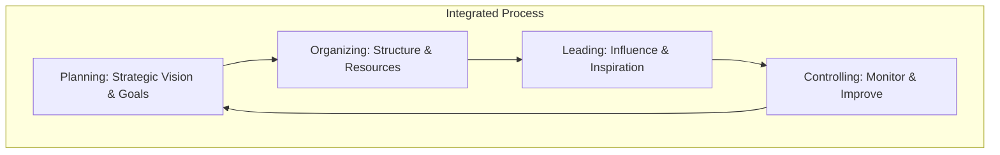

# AKW103 Introduction to Management

## Chapter 1: Managing in Today's World

> [!abstract] Overview
> Modern management is defined by navigating a complex business landscape shaped by rapid change, digital transformation, and evolving workforce expectations. Managers today are **strategic enablers**, **change agents**, and **people developers**.

---

### 1. The Evolving Role of the Manager
The shift from traditional to modern management marks a transition from authority to empowerment.

| Traditional Approach | Modern Approach |
| --- | --- |
| Command & Control | **Strategic Enabler** |
| Top-Down Decisions | **Change Agent** |
| Task Supervision | **People Developer** |
| Information Gatekeeping | **Collaborative Leader** |

> [!quote] Key Insight
> Today's managers navigate complexity through empowerment, not authority.

---

### 2. Adapting to Rapid Change

#### Managerial Agility
- **Responsive:** Adapting to technological, economic, and social shifts.
- **Confident Leadership:** Leading through uncertainty.
- **Adaptive Decision-Making:** Quick pivoting when necessary.

#### Continuous Learning
- Foster a **growth mindset** across teams.
- Stay current with industry trends and tools.
- Encourage experimentation and knowledge sharing.

#### Culture of Resilience
- Build **psychological safety** for innovation.
- Transform challenges into opportunities.
- Strengthen team adaptability and cohesion.

---

### 3. Interpersonal Skills and Emotional Intelligence (EQ)
> [!info] 80/20 Rule in Management
> Modern managers spend **80%** of their time in interpersonal interactions, making EQ as important as IQ for leadership success.

**Key Competencies:**
- **Active Listening:** Deep engagement with team perspectives.
- **Conflict Resolution:** Finding win-win solutions.
- **Trust Building:** Reliability, consistency, and transparency.
- **Psychological Safety:** Creating environments where people feel safe to take risks.
- **Cultural Sensitivity:** Adapting communication styles to diverse backgrounds.

---

### 4. Decision-Making Under Uncertainty
Effective managers combine **analytical rigor** with **intuitive wisdom**.
- **Data-Driven Insights:** Leveraging real-time analytics and BI tools.
- **Human Intuition:** Experience and EQ complement analytical data.
- **Filtering Noise:** Distinguishing relevant signals from data overload.
- **Rapid Response:** Quality decisions even with incomplete information.

---

### 5. The P-O-L-C Framework
Foundational management functions integrated as adaptive, continuous processes.

#### Transitioning Functions
- **Planning:** From static annual plans to **dynamic rolling forecasts** and scenario modeling.
- **Organizing:** From rigid hierarchies to **agile networked teams** enabled by digital collaboration (e.g., Teams, Asana).
- **Leading:** From authority to **influence**, acting as a **coach** to guide success.
- **Controlling:** From reactive annual audits to **real-time control** via live dashboards and AI-powered insights.

---

### 6. Modern Leadership Styles

- **Servant Leadership:** Prioritizes team well-being, acts as facilitator, and removes barriers.
- **Transformational Leadership:** Inspires through vision, motivates innovation, and drives organizational change.

---

### 7. Core Components of Emotional Intelligence (EI)
1. **Self-Awareness:** Understanding your emotions and triggers.
2. **Self-Regulation:** Managing impulses and staying composed under pressure.
3. **Empathy:** Understanding others' perspectives and emotional cues.
4. **Social Skills:** Building relationships and resolving conflicts constructively.

---

### 8. Diversity, Equity, and Inclusion (DEI)
Inclusive leaders cultivate diversity as a **strategic advantage** for innovation.
- **Challenging Unconscious Bias:** Active awareness in decision-making.
- **Creating Psychological Safety:** Valuing all team members.
- **Equitable Processes:** Fair systems for hiring and development.

---

### 9. Innovation and Entrepreneurship

#### Entrepreneurship vs. Intrapreneurship
- **Entrepreneurship:** External innovation, starting new ventures.
- **Intrapreneurship:** Internal innovation, driving change from within an existing organization.

#### Cultivating Innovation
- **Psychological Safety:** Risk-taking without fear of punishment.
- **Structured Innovation Time:**
    - **Google's 20% Time:** One day a week for passion projects.
    - **3M's 15% Rule:** For experimental work.

---

### 10. Human-Centered Design Thinking
A problem-solving framework for modern managers:
1. **Empathize:** Understand user needs.
2. **Define:** Clarify the core problem.
3. **Ideate:** Generate creative solutions.
4. **Prototype:** Build testable solutions quickly.
5. **Test:** Validate with real users.

---

### 11. Global Management and Cultural Intelligence (CQ)
**CQ** is the ability to understand, adapt to, and interact effectively with people from different cultural backgrounds.
- **Global Integration:** Standardized processes and shared resources.
- **Local Responsiveness:** Market adaptation (e.g., McDonald's McRice in Taiwan).

---

### 12. Strategic Tools

#### SWOT Analysis
- **S**trengths & **W**eaknesses (Internal)
- **O**pportunities & **T**hreats (External)

#### PESTLE Framework
- **P**olitical, **E**conomic, **S**ocial, **T**echnological, **L**egal, **E**nvironmental.

---

### 13. Performance and Accountability
- **KPIs & OKRs:** Aligning individual efforts with organizational objectives.
- **360-Degree Feedback:** Multi-perspective evaluation from peers and supervisors.
- **Continuous Development:** Replacing annual reviews with ongoing coaching.

> [!success] Conclusion
> The future manager is **agile, adaptable, emotionally intelligent, globally aware, and purpose-driven**. Leadership is not about being in charge; it's about **taking care of those in your charge**.
