# Chapter 1: An Overview of System Analysis and Design

## 1.1 Introduction
> [!info] Objective
> By the end of this topic, you should be able to:
> 1. Explain the role played in Information Systems (IS) development by the systems analyst.
> 2. Describe the purpose of systems analysis and design when developing information systems.
> 3. Describe the fundamental systems development life cycle (SDLC) and its four phases.

## 1.2 Part I: Software Development and System Analysis and Design

> [!info] Definition: Systems Development Life Cycle (SDLC)
> SDLC is the process of **planning**, **designing**, **building**, and **delivering** an information system to support business needs.

Developing an **effective information system** is complex and much harder than creating small software applications. Many IT projects fail because successful system development requires many factors to be handled correctly. Common causes of IT failures include:
- Poor planning
- Organizational issues
- Hard-to-use software
- Poorly designed systems
- Dispute with the unionized users
- CFO does not care about the user perspectives
- Outdated legacy application
- Complicated technical infrastructure
- Users did not want the system
- Lack of collaboration between system developers and business users

> [!important] Main Goal
> The main goal of system development is to **create organizational value**, not just to build a technically impressive system.

### 1.2.1 The Systems Analyst
The **systems analyst** plays a key role by:
- Understanding business problems
- Identifying improvements
- Designing solutions

The systems analyst works closely with project team members to ensure the right system is developed effectively. They must understand how technology can be used to solve business problems and act as a change agent by encouraging users to adopt the system.

> [!tip] Extra Notes: Change Agent
> A change agent is an individual who promotes and enables change to happen within any group or organization. In the context of IT, they help bridge the gap between technical teams and end-users, easing resistance to new systems.

#### Systems Analyst Skills
Leading organizational change requires analysts to understand what to change, how to change it, and how to gain support from others. Six key skill categories are required:
1. **Technical skills**
2. **Business skills**
3. **Analytical skills**
4. **Interpersonal skills**
5. **Management skills**
6. **Ethical skills**

Analysts must communicate and work effectively with multiple stakeholders: end users, managers, programmers, and external vendors. They must also act with fairness, honesty, and ethics, especially when handling confidential information.

> [!tip] Extra Notes: Breaking Down the Six Key Skills
> - **Technical Skills:** Proficiency in database management systems (DBMS), programming languages, network topologies, and system security frameworks.
> - **Business Skills:** Understanding how organizational departments (finance, marketing, HR) function and how the system aligns with business strategies.
> - **Analytical Skills:** Problem-solving abilities to dissect complex organizational situations, perform root-cause analysis, and design logical solutions.
> - **Interpersonal Skills:** Active listening, negotiation, clear oral/written communication, and empathy to manage user expectations and build trust.
> - **Management Skills:** Ability to coordinate human resources, manage project schedules (WBS), track project budgets, and assess risks.
> - **Ethical Skills:** Maintaining data privacy, managing proprietary corporate assets responsibly, and presenting honest project estimations.

#### Systems Analyst Roles
In large organizations, systems development projects involve several analysts with different but complementary roles. In smaller organizations, one person may perform multiple analyst roles.
- **Systems Analyst:** Focuses on information system issues, including system design and IT-supported business improvement.
- **Business Analyst:** Focuses on business value, business process improvement, and policy design.
- **Requirements Analyst:** Focuses on gathering complete and accurate requirements from stakeholders using strong business understanding, communication skills, and requirements elicitation techniques.
- **Infrastructure Analyst:** Focuses on technical infrastructure issues, ensures the new system aligns with organizational standards, and identifies the hardware, software, network, and database support needed.

#### Career Paths for System Developers
Systems analysts and developers have multiple entry points and potential long-term career advancement opportunities.

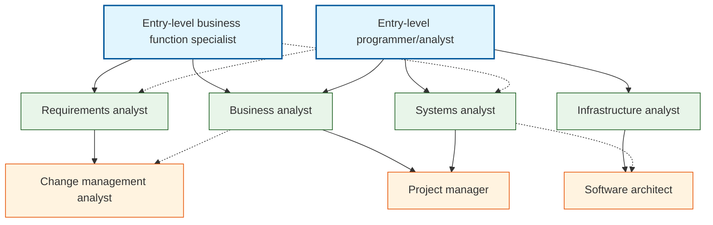

### 1.2.2 Software Development Concepts

> [!info] Definition: Systems Analysis
> Those activities that enable a person to **understand** and **specify** *what* an information system should accomplish. (What is required for the new system to solve the problem).

> [!info] Definition: Systems Design
> Those activities that enable a person to **define** and **describe in detail** the system that solves the need. (*How* the system will operate to solve the problem).

> [!info] Definition: Computer Application (App)
> A computer software program that executes on a computing device to carry out a specific set of functions.

> [!info] Definition: Information System
> A set of interrelated components that collect, process, store, and provide as output the information needed to complete business tasks.

#### Software Development Stages
The software development process progresses through seven logical stages to deliver successful systems:

| Stage | Action | Theme | Description |
| :--- | :--- | :--- | :--- |
| **1. Discover** | Understand the need | **Clear Purpose** | Investigates the business problem and identifies system goals. |
| **2. Imagine** | Capture the vision | **Clear Purpose** | Defines the core capabilities and value the system will deliver. |
| **3. Design** | Define the solution | **Collaborative** | Specifications of user interface, data structure, and system logic. |
| **4. Align** | Communicate the vision | **Collaborative** | Ensures all developers and stakeholders share a common vision. |
| **5. Create** | Build the solution | **Delivers Value** | Programming, database creation, and software integration. |
| **6. Validate** | Confirm it meets needs | **Delivers Value** | System-level, unit, and user acceptance testing. |
| **7. Launch** | Deploy the system | **Delivers Value** | Installing the software, migrating data, and training users. |

#### What Analysis and Design Provides
> [!note] Developer's Toolkit
> Systems Analysis and Design provides the tools and techniques needed as an information system developer to:
> 1. **Understand** the business need.
> 2. **Capture** the vision.
> 3. **Define** a solution.
> 4. **Communicate** the vision and solution.
> 5. **Build** the solution and **direct** others to help.
> 6. **Confirm** the solution meets the need.
> 7. **Launch** the solution as an information system application.

## 1.3 Part II: System Development Life Cycle (SDLC)

Building an information system is like building a house, where ideas are gradually refined before the final product is created. The SDLC consists of four main phases: **PADI**
1. **P**lanning
2. **A**nalysis
3. **D**esign
4. **I**mplementation

Each phase includes a series of steps, techniques, and deliverables that guide system development. The SDLC is a process of gradual refinement, where each phase builds on and adds detail to the previous one. Projects may follow it consecutively, incrementally, or iteratively.

### 1.3.1 Planning
The planning phase is the fundamental process of understanding *why* an IS should be built and determining *how* the project team will go about building it.
- **Step 1: Project Initiation.** The system's business value to the organization is identified (how it contributes to future success). Most ideas come from outside the IS area and are recorded on a **system request**.
- **Step 2: IS Approval Committee.** Reviews the system request and feasibility analysis to decide whether the project should proceed. Once approved, it moves into project management (planning, staffing, controlling).
- **Main Deliverable:** **Project plan**.

> [!info] Definition: System Request
> A summary of a business need that explains how a system addressing the need will create business value.
> Elements include: Project Sponsor, Business Need, Business Requirements, Business Value, and Special Issues or Constraints.

> [!important] Feasibility Analysis
> The feasibility analysis examines key aspects:
> 1. **Technical feasibility:** Can we build it? (Familiarity with technology, project size, compatibility).
> 2. **Economic feasibility:** Will it provide business value? (Cost-benefit analysis, cash flows, return on investment).
> 3. **Organizational feasibility:** If we build it, will it be used? (Alignment with strategy, user acceptance, political feasibility).

#### Elements of the System Request Form
| Element | Description | Examples |
| :--- | :--- | :--- |
| **Project Sponsor** | The person who initiates the project and who serves as the primary point of contact for the project on the business side. | - Several members of the finance department<br>- Vice president of marketing<br>- CIO<br>- CEO |
| **Business Need** | The business-related reason(s) for initiating the system. | - Reach a new market segment<br>- Offer a capability to keep up with competitors<br>- Improve access to information<br>- Decrease product defects<br>- Streamline supply acquisition processes |
| **Business Requirements** | The new or enhanced business capabilities that the system will provide. | - Provide online access to information<br>- Capture customer demographic information<br>- Include product search capabilities<br>- Produce performance reports<br>- Enhance online user support |
| **Business Value** | The benefits that the system will create for the organization. | - 3% increase in sales<br>- 1% increase in market share<br>- Reduction in headcount by 5 FTEs (Full-Time Equivalents)<br>- $200,000 cost savings from decreased supply costs<br>- $150,000 savings from removal of outdated technology |
| **Special Issues or Constraints** | Issues that pertain to the approval committee's decision. | - Government-mandated deadline for May 30<br>- System needed in time for the Christmas holiday season<br>- Top-level security clearance needed by project team to work with data |

### 1.3.2 Analysis
The analysis phase answers the questions of **who** will use the system, **what** the system will do, and **where and when** it will be used.
- **Step 1: Analysis Strategy.** Developed to guide the team by examining the current system (as-is system) and its problems, while identifying ideas for the new system (to-be system).
- **Step 2: Requirements Gathering.** The project team gathers and analyzes requirements to develop a **system concept**, supported by requirement statements and business analysis models.
- **Step 3: System Proposal.** Compile analyses, system concept, requirements, and models into a system proposal presented to the project sponsor and decision makers.
- **Main Deliverable:** **System proposal**.

### 1.3.3 Design
The design phase determines how the system will **operate**, including the hardware, software, network infrastructure, user interface, forms, reports, programs, databases, and files required.
- **Step 1: Design Strategy.** Determine strategy for developing, outsourcing, or purchasing the system.
- **Step 2: Architecture Design.** Develop architecture design for hardware, software, and network.
- **Step 3: Interface Design.** Design user interface (navigation, forms, reports).
- **Step 4: Database & File Specification.** Specify database, file structure, and program design.
- **Main Deliverable:** **System Specification**.

### 1.3.4 Implementation
The final phase where the **system is actually built** (or purchased and installed). It usually gets the most attention, being the longest and most expensive single part.
- **Step 1: System Construction.** The system is built and tested. Testing is crucial because fixing errors later can be costly.
- **Step 2: System Installation.** The new system is installed, replacing the old one, and users are trained.
- **Step 3: Support Plan.** A support plan is prepared, including post-implementation review and future system improvements.
- **Main Deliverable:** **Installed/operational system**.

### 1.3.5 Project Identification and Initiation
A **project** is a planned undertaking that has a beginning and an end and produces some definite result.
- Begins with **business needs** that require system support (new strategies, expansion, organizational change, or business problems like poor service/defects).
- May also come from innovative uses of IT (emerging technologies).
- Requires knowledge of systems analysis and systems design tools and techniques.

## 1.4 Part III: Iterative Development

System development process (methodology) is the actual approach used to develop a particular information system:
- Unified process (UP)
- Extreme Programming (XP)
- Scrum

Most processes/methodologies now use **Agile and Iterative development**.

> [!info] Agile Development
> An information system development process that emphasizes **flexibility** to anticipate new requirements during development. Fast on feet; responsive to change.

> [!info] Iterative Development
> An approach to system development in which the system is **"grown" piece by piece** through multiple iterations. It completes a small part of the system (mini-project), refines, and adds more repeatedly until done.

> [!tip] Extra Notes: Agile vs. Waterfall
> In traditional Waterfall methodology, development is sequential: Planning -> Analysis -> Design -> Implementation occur in order with no backtracking. While structured, Waterfall struggles with changing requirements and delays user feedback. Agile and Iterative development mitigates this by delivering usable software chunks frequently, allowing requirements to evolve dynamically based on real-world testing.

### 1.4.1 The Six Core Processes of SDLC
In iterative systems development, the SDLC is organized into six core processes that repeat across iterations:
1. **Identify** the problem or need and obtain approval.
2. **Plan** and monitor the project.
3. **Discover** and understand the details of the problem or need.
4. **Design** the system components that solve the problem.
5. **Build, test, and integrate** system components.
6. **Complete** system tests and then deploy the solution.

Across a project, these core processes are distributed dynamically. For example, early iterations focus on identification and planning, whereas middle iterations focus heavily on discovery, design, and building, and final iterations focus on system testing and deployment.

## 1.5 Case Study: Ridgeline Mountain Outfitters (RMO)

> [!example] Case Study: RMO Tradeshow System
> **RMO** is a large retail company for outdoor and sporting clothing/accessories (skiing, mountain biking, water sports, hiking, camping, mountain climbing) operating in Western States.
> - **Business Problem:** Purchasing agents attend trade shows globally to order new products, but lack a systematic way to capture supplier and product details on-site.
> - **System Need:** An information system (app) running on portable devices to collect and track supplier and product details at trade shows.
> - **Proposed Subsystems:**
>   1. **Supplier information subsystem** (Subsystem #1)
>   2. **Product information subsystem** (Subsystem #2)
> - **Iteration walkthrough:** Implementing one iteration of the **Supplier Information Subsystem** over a **6-day period**.

### 1.5.1 System Vision Document
A document created during pre-project activities to define the scope and justification.
- **Problem Description:** Trade shows are vital for finding new products, fashions, and fabrics. RMO must capture information about smaller and larger suppliers while trade shows are in progress, along with specific merchandise. High-quality product photos facilitate online catalog creation. Purchasing agents need portable equipment to communicate rapidly with the home office.
- **System Capabilities:**
  - Collect and store supplier information (manufacturer/wholesaler).
  - Collect and store sales representatives and key personnel contact info.
  - Collect product information.
  - Take product pictures and upload stock images.
  - Function standalone (without active connection).
  - Connect via Wi-Fi (Internet) or telephone to transmit data.
- **Business Benefits:**
  - Increase communication speed between attendees and home office to improve purchase order decision quality/speed.
  - Maintain correct/current supplier & contact info for rapid communication.
  - Maintain correct/rapid product info and images to expedite catalog and web page development.
  - Expedite purchase order placement, catching trends and speeding up product availability.

### 1.5.2 Iteration Walkthrough: Day-by-Day Activities

#### Day 0: Initial Activities (Pre-project)
*Focuses on Core Process 1: Identify the problem or need and obtain approval.*
- Identify the business problem and document the objective.
- Perform preliminary investigation and draft the **System Vision Document**.
- Meet with key stakeholders, including executive management, to obtain approval and budget to commence the project.

#### Day 1: Planning the Project
*Focuses on Core Process 2: Plan and monitor the project.*
- Determine major components (Supplier & Product subsystems).
- Define iterations (Decide to do the Supplier subsystem first in Iteration 1).
- Identify team members and assign responsibilities.
- Create the **Work Breakdown Structure (WBS)** and **Work Sequence Draft** for the iteration.

##### Work Breakdown Structure (WBS)
| WBS Phase | Task Description | Estimated Duration |
| :--- | :--- | :--- |
| **I. Discover & Understand** | 1. Meet with the Purchasing Department manager.<br>2. Meet with several purchasing agents.<br>3. Identify and define use cases.<br>4. Identify and define information requirements.<br>5. Develop workflows and descriptions for use cases. | ~ 3 hours<br>~ 4 hours<br>~ 3 hours<br>~ 2 hours<br>~ 6 hours |
| **II. Design Components** | 1. Design (lay out) input screens, output screens, and reports.<br>2. Design and build database (attributes, keys, indexes).<br>3. Design overall architecture.<br>4. Design program details. | ~ 8 hours<br>~ 4 hours<br>~ 4 hours<br>~ 6 hours |
| **III. Build Components** | 1. Code and unit test GUI layer programs.<br>2. Code and unit test Logic layer programs. | ~ 14 hours<br>~ 8 hours |
| **IV. Perform Tests & Deploy** | 1. Perform system functionality tests.<br>2. Perform user acceptance tests. | ~ 5 hours<br>~ 8 hours |

##### Work Sequence Draft
| Day | Scheduled Activities | Estimated Effort |
| :--- | :--- | :--- |
| **Day 1: Plan** | - Develop project plan<br>- Meet with purchasing manager & agents | 10 hours |
| **Day 2: Discover** | - Define use cases and information requirements<br>- Develop workflows (activity diagrams) | 11 hours |
| **Day 3: Design UI** | - Design (lay out) input screens, output screens, and reports | 8 hours (plus prep) |
| **Day 4: Design DB & Arch** | - Design and build database schema<br>- Design overall architecture and program details | 14 hours |
| **Day 5: Build & Test** | - Code and unit test GUI layer programs<br>- Code and unit test Logic layer programs | 22 hours |
| **Day 6: Test & Deploy** | - Perform system functionality tests<br>- Conduct user acceptance tests (UAT) | 13 hours |

#### Day 2: Discovering and Understanding Details
*Focuses on Core Process 3: Discover and understand details.*
- Perform fact-finding to understand requirements.
- Identify use cases and develop a use case diagram.
- Identify object classes and develop a preliminary class diagram.

##### RMO Tradeshow System Use Cases (Both Subsystems)
| Use Case | Description | Subsystem |
| :--- | :--- | :--- |
| **Look up supplier** | Using supplier name, find supplier information and contacts. | Supplier Subsystem |
| **Enter/update supplier information** | Enter (new) or update (existing) supplier information. | Supplier Subsystem |
| **Look up contact** | Using contact name, find contact information. | Supplier Subsystem |
| **Enter/update contact information** | Enter (new) or update (existing) contact information. | Supplier Subsystem |
| **Look up product information** | Using description or supplier name, look up product information. | Product Subsystem |
| **Enter/update product information** | Enter (new) or update (existing) product information. | Product Subsystem |
| **Upload product image** | Upload images of the merchandise product. | Product Subsystem |

##### Preliminary Class Diagram (Both Subsystems)
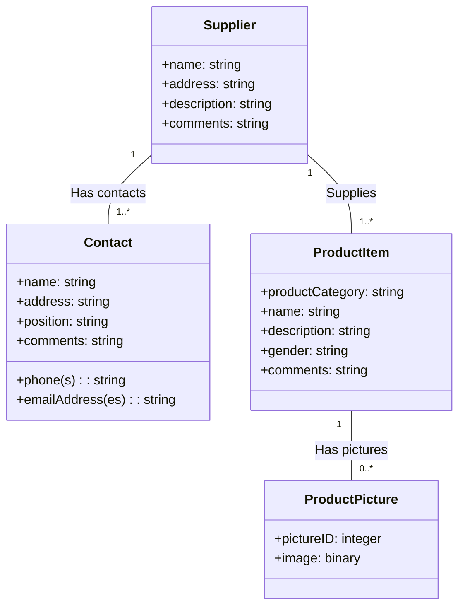

#### Day 3: In-Depth Fact-Finding and Designing User Experience
*Focuses on Core Process 3 (Discover) and Core Process 4 (Design).*
- Perform in-depth fact-finding to map detailed workflows.
- Create a **Use Case Diagram** representing user interactions with the subsystem.
- Model the workflow of a use case using an **Activity Diagram**.
- Design UI screens using a **Draft Screen Layout**.

##### Use Case Diagram: Supplier Information Subsystem
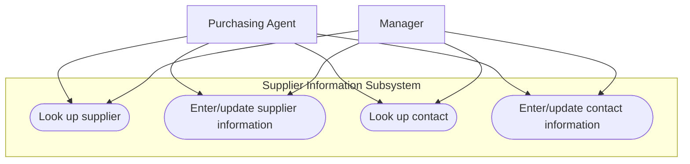

##### Activity Diagram: Look up supplier workflow
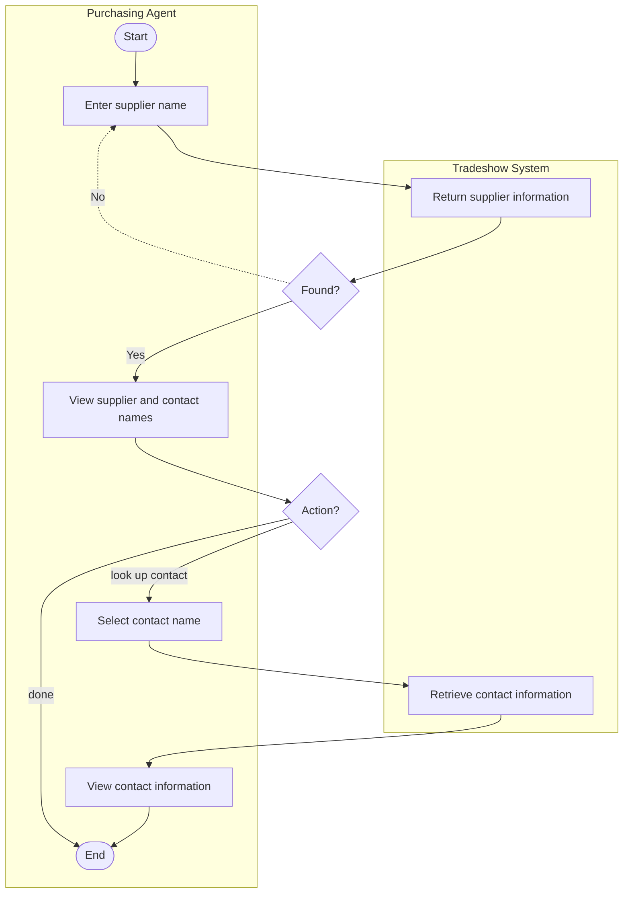

> [!tip] Extra Notes: Swimlanes in Activity Diagrams
> Activity diagrams partition tasks into vertical or horizontal zones called **Swimlanes** (in this case: *Purchasing Agent* and *Tradeshow System*). Swimlanes clarify division of labor, indicating exactly which activities are executed by human actors and which are performed automatically by the information system.

##### Draft Screen Layout
- **Header:** Company Logo (left) and Web Search box (right).
- **RMO Database Search Criteria Panel:** Input fields for *Supplier Name*, *Product Category*, *Product*, *Country*, and *Contact Name* (with a "GO" button).
- **Search Results Table:** Displaying *Supplier Name*, *Contact Name*, and *Contact Position*.

#### Day 4: Designing Database and High-Level Architecture
*Focuses on Core Process 4: Design system components.*
- Design database schema (tables, attributes, keys, indexes).
- Develop **Architectural Configuration Diagram** representing hardware/software connections.
- Design class structures in a **Design Class Diagram (DCD)**.
- Draft **Subsystem Architectural Design Diagram** showing layer structures.

##### Database Schema
- **Supplier Table:** `SupplierID` (PK), `Name` (Indexed), `Address1`, `Address2`, `City`, `State-province`, `Postal-code`, `Country`, `SupplierWebURL`, `Comments`.
- **Contact Table:** `ContactID` (PK), `SupplierID` (FK to Supplier), `Name` (Indexed), `Title`, `WorkAddress1`, `WorkAddress2`, `WorkCity`, `WorkState`, `WorkPostal-code`, `WorkCountry`, `WorkPhone`, `MobilePhone`, `EmailAddress1`, `EmailAddress2`, `Comments`.

##### Architectural Configuration Diagram
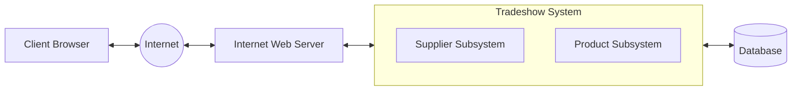

##### Preliminary Design Class Diagram (DCD)
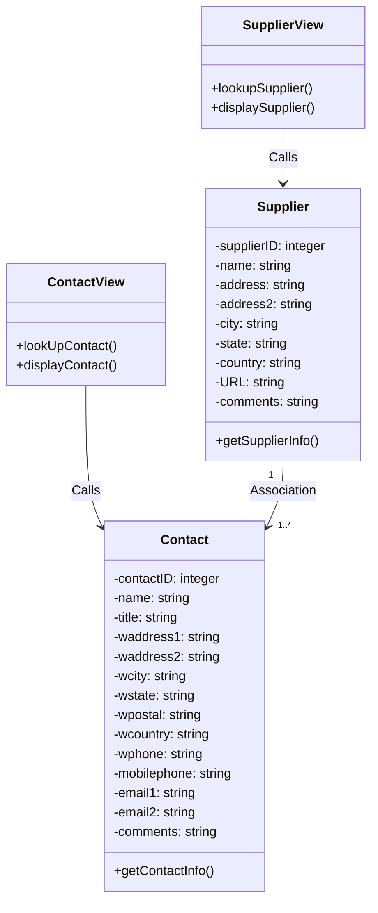

##### Subsystem Architectural Design Diagram
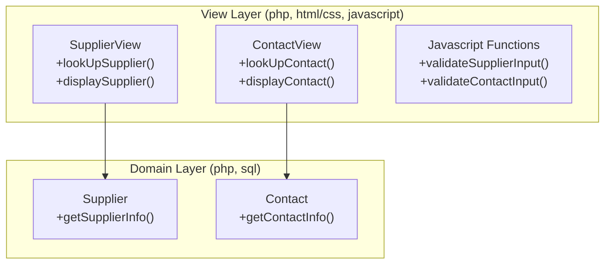

> [!tip] Extra Notes: Separation of Concerns (Presentation vs. Domain)
> Professional systems split logic into distinct layers (such as **View Layer** and **Domain Layer**). The View Layer manages user interaction, UI rendering, and basic input validation. The Domain Layer processes business rules, database queries, and data manipulation. This modularity ensures changes in UI styling do not break core business calculations.

##### Notes on Managing the Project
- **Diagrams in System Design:** Designing is a complex activity with multiple levels. One diagram builds on and complements another. However, not everything needs to be diagrammed, especially for smaller projects. Analysts must pick and choose diagrams that add the most value.
- **Concurrent Development:** Programming is done concurrently with design. Rather than designing the entire system and then coding it, developers perform some design, write some code, and repeat iteratively.

#### Day 5: Concurrent Design and Programming
*Focuses on Core Process 4 (Design) and Core Process 5 (Build, Test, Integrate).*
- Continue design details use case by use case.
- Program database tables, interface components, and business logic concurrently.
- Perform unit and integration testing.

##### Code Example: SupplierView Class implementation (PHP)
```php
<?php
class SupplierView
{
    private Supplier $theSupplier;

    function __construct()
    {
        $this->theSupplier = new Supplier();
    }

    function lookupSupplier()
    {
        include('lookupSupplier.inc.html');
    }

    function displaySupplier()
    {
        include('displaySupplierTop.inc.html');
        extract($_REQUEST); // extract Form request parameters
        
        // Call Supplier domain class to retrieve matching data
        $results = $this->theSupplier->getSupplierInfo(
            $supplier, $category, $product, $country, $contact
        );
        
        foreach ($results as $resultItem) {
            ?>
            <tr>
                <td style="border:1px solid black">
                    <?php echo htmlspecialchars($resultItem->supplierName) ?>
                </td>
                <td style="border:1px solid black">
                    <?php echo htmlspecialchars($resultItem->contactName) ?>
                </td>
                <td style="border:1px solid black">
                    <?php echo htmlspecialchars($resultItem->contactPosition) ?>
                </td>
            </tr>
            <?php
        }
        include('displaySupplierFoot.inc.html');
    }
}
?>
```

#### Day 6: System Testing and Deployment
*Focuses on Core Process 6: Complete system tests and deploy the solution.*
- Perform system functional testing and user acceptance testing (UAT).
- Address any bugs discovered and verify fixes.
- Deploy the subsystem.

##### Testing Task Workflow
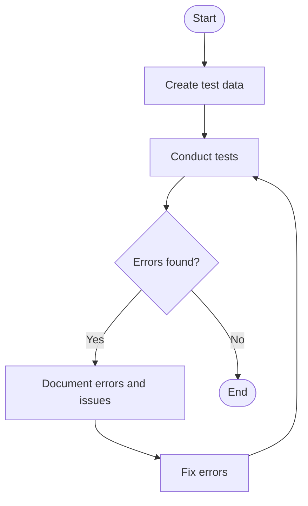

### 1.5.3 First Iteration Recap
- **Iteration Scope:** The case study demonstrates a rapid 6-day iteration of a small project. In professional settings, iterations are typically **2 to 4 weeks** long.
- **Project Scope:** The entire Tradeshow System might require 2 iterations to complete both subsystems. Larger enterprise systems require many more iterations.
- **User Involvement:** End users must remain actively involved in the process, particularly on Days 1, 2, 3, and 6.
- **Design-Code Concurrency:** Days 4 and 5 highlight how design and programming occur concurrently, rather than as separate sequential phases.

---

# Chapter 2: Investigating System Requirements

## 2.1 Introduction
> [!info] Objective
> By the end of this topic, you should be able to:
> 1. Describe the activities of systems analysis.
> 2. Classify requirements correctly as business, user, functional, or nonfunctional requirements.
> 3. Identify and understand different kinds of stakeholders and their contributions to requirements definition.
> 4. Employ the requirement elicitation techniques of interviews, JAD sessions, questionnaires, document analysis, and observation.
> 5. Develop UML activity diagrams to model workflows.

## 2.2 Part I: Systems Analysis Activities

By completing these activities, the analyst defines in detail *what* the information system needs to accomplish to provide the organization with the desired benefits. These activities are focused on **discovery and understanding** (Core Process 3: Discover and understand details).

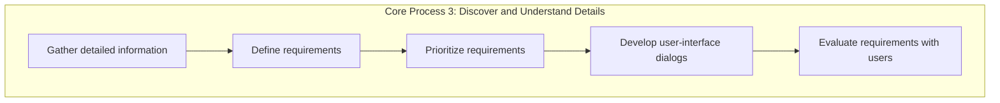

### 2.2.1 Gather Detailed Information
Systems analysts must gather information from multiple sources to understand the requirements fully:
- **Direct Interaction:** Gather information from users directly through interviews and observation of their daily work.
- **Stakeholder Engagement:** Engage with all relevant stakeholders, including current users, future users, and those familiar with similar systems.
- **Document Review:** Review existing materials such as planning documents, policy statements, and current system documentation.
- **Solution Study:** Study similar solutions used by other organizations or vendors facing comparable business needs.
- **Environment Analysis:** Understand the full work environment, including user activities, work locations, and system interfaces inside and outside the organization.
- **Business Knowledge:** Develop strong business knowledge, as successful systems analysts must become experts in the business area they support.

### 2.2.2 Define Requirements
- Define system requirements based on information collected from users and existing documents.
- Identify **functional requirements**, which describe what the system must do.
- Identify **nonfunctional requirements**, such as usability, reliability, performance, and security.
- Use **models** to represent requirements, rather than only listing facts and details.
- Review and refine requirements models continuously with users and stakeholders as new information emerges.

### 2.2.3 Prioritize Requirements
- Prioritize system requirements once they are clearly understood.
- Differentiate essential functions from those that are desirable but not critical.
- Use business and user context to judge which requirements matter most.
- Manage limited resources by focusing on what is absolutely necessary.
- Prevent scope creep by controlling unnecessary expansion of requirements.
- Guide project iterations by implementing high-priority requirements earlier for refinement.

### 2.2.4 Develop User-Interface Dialogs
- Users may be confident or uncertain about requirements, depending on whether the system replaces an existing one or introduces new functions.
- Abstract requirements models (like use cases and activity diagrams) can be difficult for users to understand and validate.
- User-interface validation is easier and more effective because users can directly see and experience the system.
- Analysts use interface designs, storyboards, and prototypes to elicit and document requirements more clearly.
- Early prototypes can evolve into working system components through later project iterations.

### 2.2.5 Evaluate Requirements with Users
- Requirements development is iterative, involving repeated interaction between analysts and users.
- Analysts gather user input, refine models, and return for validation as requirements become clearer.
- Users often have limited time, so analysts usually complete much of the refinement work independently.
- Prototypes are useful when paper models are insufficient or when new technologies need to be tested and visualized.
- The cycle continues until requirements models and prototypes are complete, accurate, and validated by users.

## 2.3 Part II: What Are Requirements?

> [!info] Definition: System Requirements
> All the activities the new system must perform or support and the constraints that the new system must meet (both functional and non-functional).

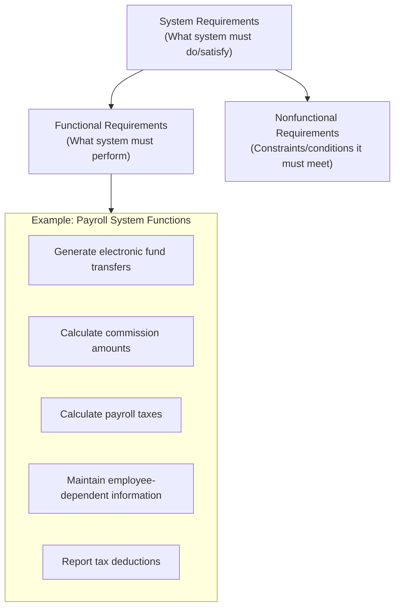

> [!note] Key Point
> Identifying system requirements takes time because business functions can be complex and highly interconnected.

- **Functional Requirements:** The activities the system must perform to support the users' work (i.e., the business uses to which the system will be applied).
- **Nonfunctional Requirements:** Required system characteristics other than the activities it must perform or support.

### 2.3.1 The FURPS+ Framework
The FURPS+ framework is a standard system for classifying functional and nonfunctional requirements.

> [!info] Definition: FURPS
> An acronym that stands for **F**unctional, **U**sability, **R**eliability, **P**erformance, and **S**ecurity.

| Category | Description | Real-World Application Example |
| :--- | :--- | :--- |
| **F**unctional | The activities that the system must perform (the business uses of the system). | Users can upload photos, like posts, comment, and follow other users. |
| **U**sability | Requirements for operational characteristics related to users, such as the user interface, related work procedures, online help, and documentation. | The app should have a simple and attractive interface so users can easily find the home page, profile, reels, and messages. |
| **R**eliability | The dependability of a system—how often a system exhibits service outages/incorrect processing, and how it detects and recovers from those problems. | The app should not crash when many users are scrolling or uploading stories at the same time. |
| **P**erformance | Operational characteristics related to measures of workload, such as throughput and response time. | Photos, videos, and reels should load within 2 seconds. |
| **S**ecurity | How access to the application will be controlled and how data will be protected during storage and transmission. | Only the account owner should be able to access their private messages, and passwords must be encrypted. |

> [!info] Definition: FURPS+
> An extension of the FURPS acronym that adds additional categories, including design constraints, implementation, system interface, physical, and supportability requirements.

1. **Design constraints:** Restrictions to which the hardware and software must adhere (e.g., must run on existing Linux servers).
2. **Implementation requirements:** Constraints such as required programming languages and tools, documentation methods and level of detail, and specific communication protocols for distributed components.
3. **Interface requirements:** Constraints describing interactions and data exchanges among systems.
4. **Physical requirements:** Characteristics of hardware such as size, weight, power consumption, and operating conditions.
5. **Supportability requirements:** How a system is installed, configured, monitored, and updated.

> [!tip] Extra Notes: FURPS+ Gray Areas and Overlaps
> There are often gray areas and overlaps among these categories:
> - Is a requirement that a battlefield communications device survive immersion in water and operate across $-20^\circ\text{C}$ to $50^\circ\text{C}$ a performance or a physical requirement?
> - Is a restriction to use no more than 100 megabytes of memory a performance or a design requirement?
> - Is a requirement to secure workstation-server communication with 1024-bit encryption a performance, design, or implementation requirement?
> 
> *The key takeaway is that all requirements must be identified and precisely stated early, resolving inconsistencies or trade-offs rather than worrying about strict categorization.*

### 2.3.2 Stakeholders
> [!info] Definition: Stakeholders
> All the people who have an interest in the successful implementation of the system. They are the **primary source of information** for system requirements.

Stakeholders are classified along two dimensions: **Internal vs. External** and **Operational vs. Executive**.

| | Operational (regularly interact with the system) | Executive (don't directly interact but use info or have financial interest) |
| :--- | :--- | :--- |
| **Internal** | - Bookkeepers<br>- Accountants<br>- Internal auditors<br>- Operational managers | - Senior managers<br>- Board of directors |
| **External** | - Customers<br>- Partner organizations | - Investors<br>- Regulators<br>- External auditors |

> [!important] The Client
> The client is the person or group that **provides the funding** for the project (often senior management, board of directors, or steering committee). The project team must provide periodic status reviews to the client, as they approve project stages and release funds.

## 2.4 Part III: Information Gathering Techniques

There are five primary techniques for gathering system requirements from stakeholders:
1. **Interviewing** users and other stakeholders.
2. **Joint Application Development (JAD)** sessions.
3. Distributing and collecting **questionnaires**.
4. **Document Analysis**.
5. **Observation**.

### 2.4.1 Interviewing
Interviewing is highly effective for understanding business functions and rules, but it is the most time-consuming and resource-expensive option.

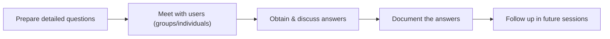

#### Designing Interview Questions
- **Closed-Ended Questions:** Require a specific, narrow answer.
  - *Example:* "How many telephone orders are received per day?", "How do customers place orders?"
- **Open-Ended Questions:** Seek a wide-ranging, subjective response.
  - *Example:* "What do you think about the way invoices are currently processed?", "What are some of the problems you face on a daily basis?"
- **Probing Questions:** Follow up on what was just discussed to gain details.
  - *Example:* "Why?", "Can you give me an example?", "Can you explain that in a bit more detail?"

#### Interviewing Themes and Questions
| Theme | Questions to Users |
| :--- | :--- |
| **What are the business operations and processes?** | - What do you do? |
| **How should those operations be performed?** | - How do you do it?<br>- What steps do you follow?<br>- How could they be done differently? |
| **What information is needed to perform those operations?** | - What information do you use?<br>- What inputs do you use?<br>- What outputs do you produce? |

#### Top-Down vs. Bottom-Up Questioning Strategy
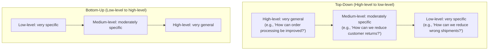

#### Preparing and Executing Interviews
- **Before the Interview:**
  - Establish the objective.
  - Determine correct users to involve and project team members to participate.
  - Build a list of questions and issues to be discussed.
  - Review related documents and materials.
  - Set the time and location, and inform all participants.
- **During the Interview:**
  - Arrive on time.
  - Look for exception and error conditions.
  - Probe for details.
  - Take thorough notes.
  - Identify and document unanswered items or open questions.
- **After the Interview (Post-Interview Report):**
  - Summarize notes in a useful format.
  - Write the report **within 48 hours** (to prevent forgetting details).
  - Send the report to the interviewee to read with a request for corrections/updates.
  - Never distribute someone's information without prior approval.

##### Example: Discussion and Interview Agenda (RMO Sales Commission)
> [!example] Agenda Example
> - **Setting:**
>   - *Objective:* Determine processing rules for sales commission rates.
>   - *Date, Time, Location:* April 21, 2016, 9:00 a.m. in William McDougal's office.
>   - *User Participants:* William McDougal (VP Marketing) and staff.
>   - *Project Team:* Mary Ellen Green and Jim Williams.
> - **Interview Discussion Points:**
>   1. Who is eligible for sales commissions?
>   2. What is the basis for commissions? What rates are paid?
>   3. How is commission for returns handled?
>   4. Are there special incentives? Contests? Programs based on time?
>   5. Is there a variable scale for commissions? Are there quotas?
>   6. What are the exceptions?
> - **Follow-Up:**
>   - *Answers/Decisions:* See attached write-up on commission policies.
>   - *Open Items:* Open items list numbers 2 and 3.
>   - *Next Meeting:* April 28, 2016, at 9:00 a.m.

##### Example: Post-Interview Report Layout (Linda Estey)
> [!example] Report Example
> - **Person Interviewed:** Linda Estey (Director, HR)
> - **Interviewer:** Barbara Wixom
> - **Purpose:** Understand reports produced for HR; determine future requirements.
> - **Summary of Interview:**
>   - Sample reports of current HR systems attached.
>   - *Two biggest problems identified:*
>     1. *Data are too old:* HR needs reports within 2 days of month end; currently delayed by 3 weeks.
>     2. *Data are of poor quality:* Reconciliations required with departmental database.
>   - *Common errors:* Incorrect job-level info, missing salary info.
> - **Open Items:**
>   - Get employee roster report from Mary Skudrna (ext. 4355).
>   - Verify calculations used for vacation time.
>   - Schedule interview with Jim Wack (ext. 2337) regarding quality problems.

#### Interpersonal Skills Checklist
- **Don't worry, be happy:** Smile to radiate confidence.
- **Pay attention:** Keep your mind on the conversation, not external distractions.
- **Summarize key points:** Repeat key points back (e.g., *"Let me make sure I understand..."*).
- **Be succinct:** Limit your speaking time to give the interviewee time to talk.
- **Be honest:** If you do not know the answer to a question, say so.
- **Watch body language:** Leaning forward and eye contact show interest; leaning away or crossing arms indicates defensiveness or disinterest. Hands raised with fingertips touching ("steepling") indicates a feeling of superiority.

### 2.4.2 Joint Application Development (JAD)
Joint Application Development (JAD) is a structured, collaborative technique developed by IBM in the late 1970s to gather system requirements.

- **Benefits:** Reduces scope creep, prevents requirements from being too vague or too detailed, and supports smoother progress in later SDLC stages.
- **Key Roles & Setup:**
  - **10 to 20 users** participate in a structured discussion.
  - A **neutral, skilled facilitator** manages the process without expressing personal opinions.
  - **Scribes** record notes using computers or CASE tools.
  - Conducted in a dedicated room away from distractions, usually with a **U-shaped seating arrangement** to maximize collaboration.
- **Limitations:** Group challenges such as dominant participants, limited participation from quieter members, and reluctance to challenge stronger voices can reduce efficiency.

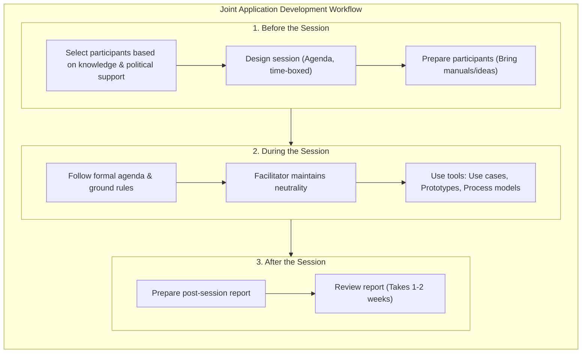

> [!tip] Extra Notes: Modern JAD Adaptations
> While JAD was traditionally structured as multi-day workshops in specialized rooms, modern software development adapts JAD principles through Agile Sprint planning workshops, user story mapping sessions, and cross-functional collaborative tools (like Miro or Figma) in remote or hybrid setups.

### 2.4.3 Questionnaires
Questionnaires are written questions used to gather information from a large group of people in different locations. They are typically distributed via email or web forms.

- **Typical Response Rates:**
  - **Paper/Email questionnaires:** $30\% - 50\%$ response rate.
  - **Web-based questionnaires:** $5\% - 30\%$ response rate.
- **Designing Effective Questions:** Keep questions clear, simple, and unambiguous. Closed-ended questions are easier to answer and analyze. Distinguish clearly between **opinion questions** (thoughts and feelings) and **factual questions** (specific, measurable data).
- **Good Practices:**
  - Begin with nonthreatening and interesting questions.
  - Group items into logically coherent sections.
  - Do not put important items at the very end.
  - Do not crowd a page with too many items.
  - Avoid abbreviations and biased or suggestive terms.
  - Pretest the questionnaire with a small group to identify confusing items.
  - Provide anonymity to increase honesty.

### 2.4.4 Document Analysis
Document analysis helps project teams understand the current (as-is) system by reviewing existing system-related documents, such as reports, policy manuals, training manuals, forms, and user problem reports.

- **Formal vs. Informal System:** Documents mainly describe the **formal system**, but they may not reflect how work is done in practice (the **informal system**).
- **Identifying Needs:** Differences between formal and informal systems reveal improvement areas (e.g., fields filled in incorrectly). Strong evidence for system change appears when users modify existing forms or create custom spreadsheets to get their work done.

> [!example] Document Analysis Example: Patient Information Card
> An analyst reviews an existing "Patient Information Card" at a veterinary clinic:
> - **Observation 1:** Customer crossed out name "Buffy" and wrote "Pat Smith".
>   - *Implication:* The form should label this field **Owner's Name** instead of "Name" to prevent confusion.
> - **Observation 2:** Staff handwritten "Collie 7/6/17" and "Male" next to pet's name.
>   - *Implication:* The new system form must include dedicated fields for **Pet Type/Breed**, **Date of Birth**, and **Gender**.
> - **Observation 3:** Customer did not write the area code for the phone number.
>   - *Implication:* The new system UI should enforce area code validation.
> - **Observation 4:** Insurance details (Pet's Mutual, KA-5493243) written in margins.
>   - *Implication:* The new form must include fields for **Insurance Company** and **Policy Number**.

### 2.4.5 Observation
Observation involves directly watching how work is actually performed to understand the real situation, bypassing what people say in interviews or questionnaires.

- **Observation Styles:**
  - **Participant Observation:** The analyst actively participates in the work processes alongside the users to experience the tasks firsthand.
  - **Non-participant Observation:** The analyst acts as a passive observer, watching and recording users performing their tasks without direct involvement.
- **Practices:** Observe with a **low profile** to avoid interrupting work or influencing behavior.
- **Limitations:** People often behave more carefully when watched (**Hawthorne Effect**), meaning the observed routine may not represent the normal workflow.
- **Signaling Closer Analysis:** If observed tasks mismatch what users described during interviews, it indicates a need for closer investigation.

### 2.4.6 Comparison of Elicitation Techniques
| Feature / Characteristic | Interviews | JAD Sessions | Questionnaires | Document Analysis | Observation |
| :--- | :--- | :--- | :--- | :--- | :--- |
| **Type of information** | As-is, improvements, to-be | As-is, improvements, to-be | As-is, improvements | As-is only | As-is only |
| **Depth of information** | High | High | Medium | Low | Low |
| **Breadth of information** | Low | Medium | High | High | Low |
| **Integration of info** | Low (challenging to merge) | High (resolved in session) | Low | Low | Low |
| **User involvement** | Medium | High | Low | Low | Low |
| **Cost** | Medium | Low-Medium | Low | Low | Low-Medium |

## 2.5 Part IV: Models and Modeling

After collecting information, systems analysts create models to represent the requirements.

> [!info] Definition: Model
> A representation of some aspect of the system being built.

- **Types of Models:**
  1. **Textual model:** Written descriptions, notes, lists.
  2. **Graphical model:** Diagrams, schematics, flows.
  3. **Mathematical model:** Formulas, statistics, algorithms.

> [!info] Unified Modeling Language (UML)
> Standard graphical modeling symbols and terminology used for information systems.

#### Some Analysis and Design Models
| Model Type | Examples |
| :--- | :--- |
| **Analysis Models** | Event list, Use case diagram, Use case description, Location diagram, Activity diagram. |
| **Design Models** | Class diagram, Sequence diagram, Communication diagram, State machine diagram. |

#### Reasons for Modeling
1. Learning from the modeling process.
2. Reducing complexity by abstraction.
3. Remembering all the details.
4. Communicating with other development team members.
5. Communicating with users and stakeholders.
6. Documenting what was done for future maintenance/enhancement.

### 2.5.1 Documenting Workflows with Activity Diagrams
> [!info] Definition: Workflow
> A sequence of work steps that complete one business transaction or customer request. Workflows can be simple or highly complex, spanning departments.

> [!info] Activity Diagram
> A UML diagram that describes user (or system) activities, the person who does each activity, and the sequential flow of these activities.

#### Activity Diagram Symbols
- **Starting activity (Pseudo):** Solid black circle indicating where the workflow begins.
- **Ending activity (Pseudo):** Solid black circle with an outer border (bullseye) indicating completion.
- **Activity:** Oval rectangle containing a verb phrase describing the task (e.g., `Review financials`).
- **Transition arrow:** Solid arrows indicating flow control.
- **Swimlane heading:** Vertical columns representing different roles, departments, or subsystems.
- **Decision activity:** Diamond shape with conditions (e.g., `[yes]`, `[no]`).
- **Synchronization bar (Split/Join):** Heavy horizontal or vertical line representing concurrent execution paths:
  - **Split (Fork):** One path splits into multiple parallel paths.
  - **Join:** Multiple parallel paths merge back into a single path.

#### Example: RMO Order Fulfillment Activity Diagram
This diagram represents the cross-functional order fulfillment workflow for Ridgeline Mountain Outfitters.

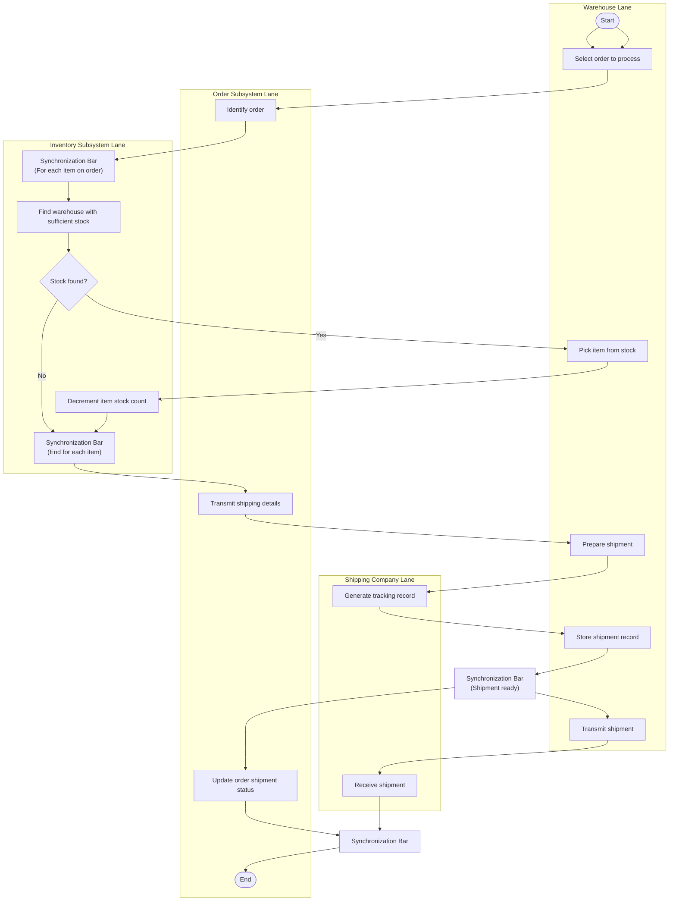

#### Example: Activity Diagram with Concurrent Paths
This diagram represents concurrent work paths between different departments in an engineering and production workflow.

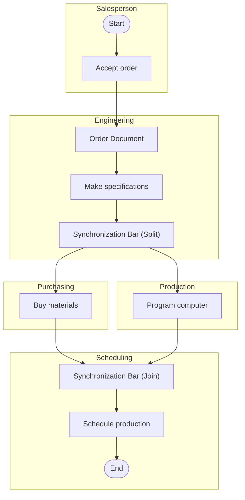

---

# Chapter 3: Use Cases

## 3.1 Introduction
> [!info] Objective
> By the end of this topic, you should be able to:
> 1. Explain the purpose of use cases in the analysis phase of the SDLC.
> 2. Describe the various parts of a use case and the purpose of each part.
> 3. Describe how use cases contribute to the functional requirements.
> 4. Explain why identifying user stories and use cases is the key to defining functional requirements.
> 5. Describe the two techniques for identifying use cases.
> 6. Apply the event decomposition technique to identify use cases.
> 7. Describe the notation and purpose for the use case diagram.
> 8. Draw use case diagrams by actor and by subsystem.

## 3.2 Part I: Use Cases and User Goals
A key part of defining a new system is understanding **user requirements**, which are the tasks users need to accomplish with the system.
- **Use cases** are used to express and describe these user requirements clearly. They help analysts understand how users will interact with the system and what the system must do for them.
- **Process models** (such as activity diagrams and flowcharts) are used to further clarify requirements by showing processes, activities, and how data move between them.
- Both use cases and process models are important tools in the analysis phase, especially during interviews and workshops, to identify and illustrate user and functional requirements.

> [!info] Definition: Use Case
> An activity that the system performs, usually in response to a request by a user. Use cases define **functional requirements**. Analysts decompose the system into a set of use cases (functional decomposition).
> Name each use case using **Verb-Noun** format (e.g., *Search Student*, *Enter grade*, *Print Classlist*).

### 3.2.1 User Stories in Agile Development
In Agile methodologies, functional requirements are often captured using **User Stories**.
- **Definition:** A user story is a short, simple description of a feature told from the perspective of the person who desires the new capability, usually a user or customer of the system.
- They emphasize simplicity, user value, and collaboration over comprehensive documentation.
- Users and stakeholders are responsible for identifying and defining the user stories, while analysts facilitate the session.

> [!tip] Extra Notes: The "3 Cs" of User Stories
> In Agile development, a user story is composed of three components:
> 1. **Card:** A physical index card or digital card containing the brief text describing the user story.
> 2. **Conversation:** Discussions between developers, analysts, and users to flesh out details (since the card itself is not a complete specification).
> 3. **Confirmation:** The acceptance criteria used to verify that the story has been implemented correctly and satisfies the user.

**User Story Template:**
```
"As a <role played>, I want to <goal or desire> so that <reason or benefit>."
```

#### Acceptance Criteria
The final part of a user story is the **acceptance criteria**, which list the conditions that the software must satisfy to be accepted by a user. They focus on **functionality and business rules**, not on features or user interface design.

| User Story | Acceptance Criteria |
| :--- | :--- |
| **Bank Teller Making a Deposit:**<br>*"As a teller, I want to make a deposit to quickly serve more customers."* | 1. Customer lookup must be by name or by account number.<br>2. Optionally display the photo and signature of the customer for verification.<br>3. System must indicate check hold requirements based on customer status.<br>4. Current balance and new balance must be displayed after deposit. |
| **Bank Customer Using an ATM:**<br>*"As a customer, I want to withdraw cash so that I have physical currency."* | 1. Limit maximum daily withdrawal to $500.<br>2. Account balance must be verified prior to dispensing cash.<br>3. Print receipt showing transaction details, remaining balance, and ATM ID.<br>4. Notify host system immediately of debit. |

---

## 3.3 Part II: Techniques for Identifying Use Cases

There are two primary industry techniques for identifying use cases: **User Goal Technique** and **Event Decomposition Technique**.

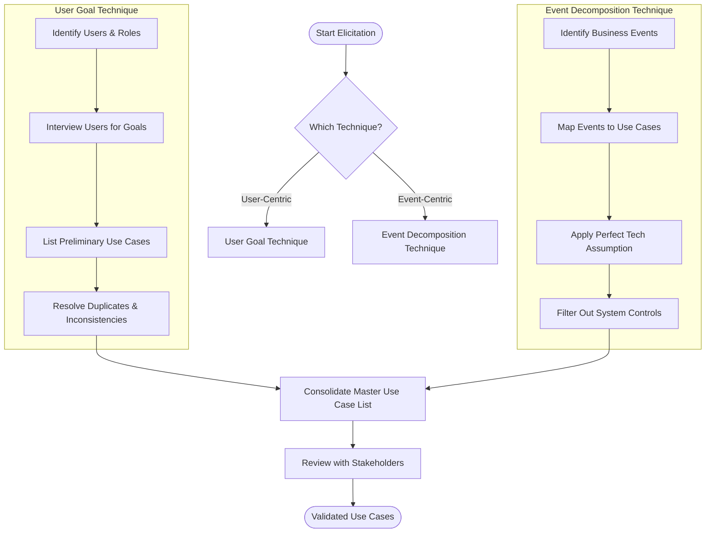

### 3.3.1 The User Goal Technique
The User Goal Technique identifies use cases by determining what specific goals or objectives must be completed by the system for the user. It is the most common technique in the industry.

#### Step-by-Step Process:
1. **Identify all potential users** of the system.
2. **Classify users by functional role** (e.g., shipping clerk, sales agent, marketing manager).
3. **Classify users by organizational level** (operational, management, executive).
4. **Interview and survey** each user group to find the specific goals they have when using the system.
5. **Compile a list of preliminary use cases** organized by user role.
6. **Identify duplicate or overlapping** use cases and resolve inconsistencies.
7. **Find shared use cases** where different types of users perform the same activity.
8. **Review and validate** the list with the users and stakeholders.

---

### 3.3.2 The Event Decomposition Technique
The Event Decomposition Technique is the most comprehensive way to identify use cases. It views the system as a "black box" and identifies use cases by looking at the business events that require a response from the system.

> [!important] Key Concept: Event vs. Use Case
> An **Event** is something that occurs at a specific time and place, can be described, and should be remembered by the system.
> A **Use Case** is the system's response to that event. One business event usually maps to exactly one use case.

#### Types of Events:
1. **External Event:** Initiated by an external agent or actor outside the system boundary.
   - *Example:* Customer places a new order; Vendor updates product price.
   - *Checklist:*
     - Does an actor want a transaction? (Customer buys a product)
     - Does an actor want information? (Customer queries product availability)
     - Has external data changed? (Customer updates billing address)
     - Does management need an update? (Manager requests sales figures)
2. **Temporal Event:** Initiated automatically when a specific point in time is reached.
   - *Example:* Generating monthly billing statements; Sending late payment reminders at 12:00 AM on the due date.
   - *Checklist:*
     - Is an internal report needed at a certain time? (Weekly transaction report)
     - Is an external output needed? (Monthly billing statement, daily shipping summary)
3. **State Event:** Initiated when something happens inside the system (an internal state change) that triggers a process.
   - *Example:* Inventory level falls below the reorder point; Temperature sensor in a server room exceeds 30°C.

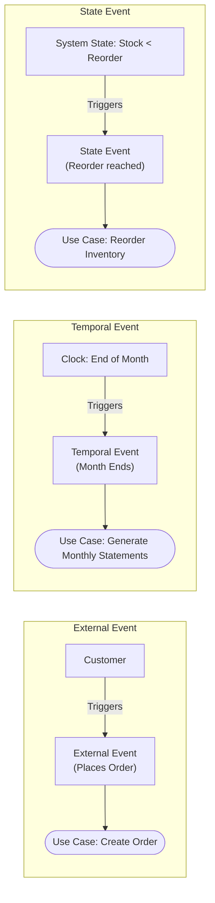

#### The Perfect Technology Assumption
When identifying use cases, analysts apply the **Perfect Technology Assumption**: assume that the hardware, software, and networks operate perfectly without any failures, and security controls are not needed at this stage.

* **Rationale:** Helps the analyst focus on the core business requirements first without being distracted by technical design details.
* **Impact:** Defer all system controls (logins, logouts, changing passwords, database backup/restore, encryption) to the design phase. Do *not* include them as functional use cases.

> [!warning] Exception to the Perfect Technology Rule
> If a system control *is* the core business of the application (e.g., building a dedicated identity provider like Okta or a backup utility tool), then login/backup functions are functional requirements and must be included.

---

## 3.4 Part III: Use Cases and the CRUD Technique

The **CRUD technique** (Create, Read, Update, Delete) is a validation and refinement tool used to ensure the completeness of use cases. It maps the dynamic model (use cases) to the static model (domain classes).

| Operation | Description | RMO Example |
| :--- | :--- | :--- |
| **C**reate | Elicit use cases that create new instances of a domain class. | `Create customer account`, `Create order` |
| **R**ead / Report | Elicit use cases that retrieve or view information. | `Search product catalog`, `View order status` |
| **U**pdate | Elicit use cases that modify existing data records. | `Update customer profile`, `Modify order items` |
| **D**elete / Archive | Elicit use cases that remove or archive obsolete data. | `Archive past orders`, `Deactivate account` |

### 3.4.1 RMO CSS CRUD Matrix
Analysts construct a CRUD matrix where columns represent **Domain Classes** and rows represent **Use Cases**. This matrix helps identify gaps where data is created but never read, or updated but never created.

| Use Case | Customer | Order | OrderLine | Product | Inventory |
| :--- | :---: | :---: | :---: | :---: | :---: |
| `Create customer account` | **C** | | | | |
| `Search product catalog` | | | | **R** | **R** |
| `Create order` | **R** | **C** | **C** | **R** | **U** |
| `Update customer profile` | **U** | | | | |
| `Modify order items` | | **U** | **C/U/D** | | **U** |
| `Track order status` | | **R** | **R** | | |
| `Archive old orders` | | **D** | **D** | | |

> [!tip] Extra Notes: CRUD Validation vs. CRUD Elicitation
> Do not blindly create four use cases for every class. A single use case like `Maintain Customer Accounts` can handle the Create, Update, and Delete operations for the `Customer` class. The matrix validates that at least one use case handles each letter for every class.

---

## 3.5 Part IV: Use Case Diagrams

A **Use Case Diagram** is a UML model used to graphically represent the use cases and their relationships to the actors who initiate them.

### 3.5.1 Notation and Symbols
* **Actor:** A person or external system that interacts with the system to achieve a goal. Represented by a stick figure.
* **Automation Boundary:** The boundary between the computerized portion of the application and the users. Represented by a rectangle box enclosing the use cases.
* **Use Case:** An oval shape inside the boundary containing the verb-noun name of the use case.
* **Association Line:** A solid line connecting an actor to a use case, representing communication.

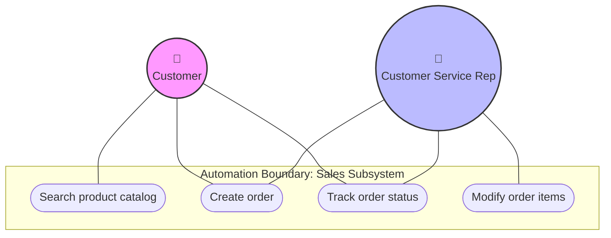

---

### 3.5.2 Use Case Relationships
UML defines four behavioral relationships for use case diagrams:

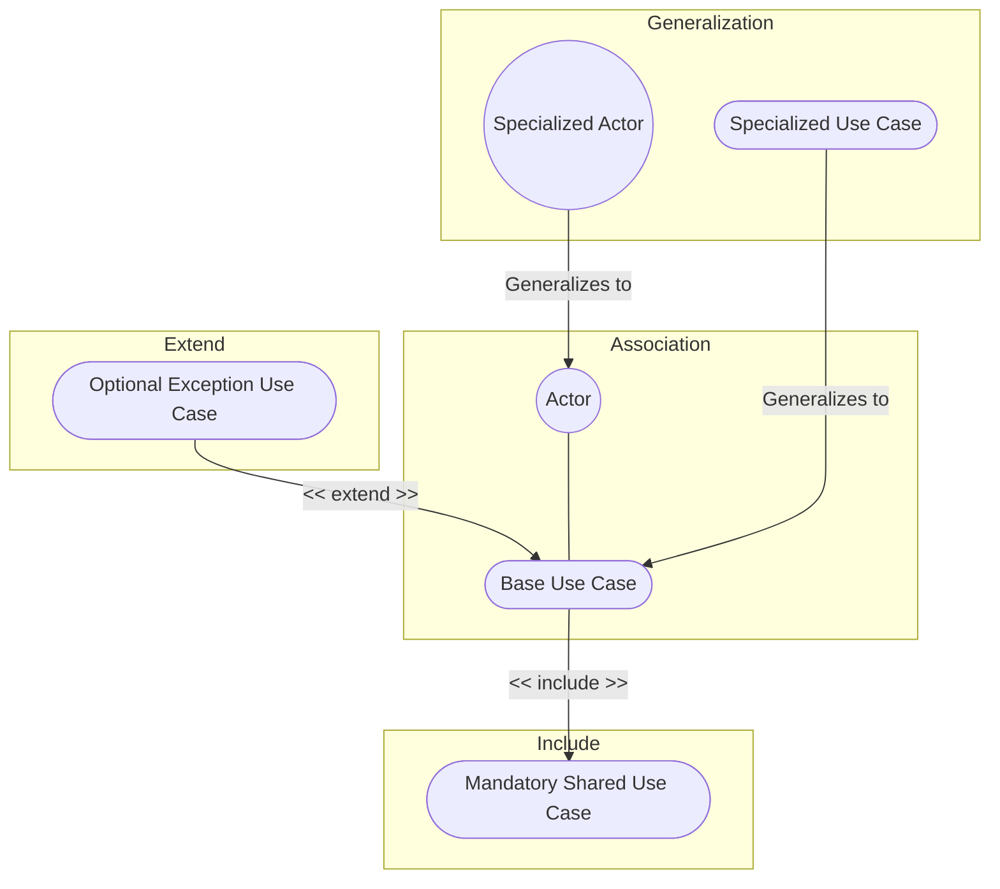

#### 3.5.2.1 Communicates (Association)
* Connects an actor to a use case.
* Represented by a solid line with no arrowhead.

#### 3.5.2.2 Includes (Uses)
* Describes the situation where a base use case contains behavior that is common and mandatory for multiple other use cases.
* **Direction:** Dotted arrow points **from the base use case to the included (common) use case** with the stereotype `<< include >>`.
* *Example:* Both `Enroll in Course` and `Arrange Housing` must include `Pay Student Fees`.

#### 3.5.2.3 Extends
* Describes the situation where one use case handles an optional variation or exception to a base use case.
* **Direction:** Dotted arrow points **from the extended (optional) use case to the base use case** with the stereotype `<< extend >>`.
* *Example:* `Student Health Insurance` is an optional addition that extends the `Pay Student Fees` process.

#### 3.5.2.4 Generalizes (Inheritance)
* Implies that one actor or use case is a specialized version of a more general one.
* **Direction:** Solid line with a hollow triangular arrowhead pointing **to the general actor/use case**.
* *Example:* `Professor` generalizes to `Employee`; `Online Payment` generalizes to `Pay Bill`.

#### Comparison Table: Includes vs. Extends
| Characteristic | Includes (`<< include >>`) | Extends (`<< extend >>`) |
| :--- | :--- | :--- |
| **Execution** | Mandatory (always runs when base runs) | Optional (only runs under certain conditions) |
| **Arrow Direction** | Points from Base to Common | Points from Optional to Base |
| **Purpose** | Code/modeling reuse of shared steps | Handing exceptions or optional features |

---

# Chapter 4: Domain Modeling

## 4.1 Introduction
> [!info] Objective
> By the end of this topic, you should be able to:
> 1. Explain how the concept of "things" in the problem domain also defines requirements.
> 2. Identify and analyze data entities and domain classes needed in the system.
> 3. Read, interpret, and create an entity-relationship diagram.
> 4. Read, interpret, and create a domain model class diagram.
> 5. Understand the domain model class diagram.
> 6. Read, interpret, and create a state machine diagram that models object behavior.

## 4.2 Part I: "Things" in the Problem Domain
- **Problem domain:** The specific area of the users' business need that is within the scope of the new system.
- **"Things" (Domain Classes / Data Entities):** Items that users work with when accomplishing tasks that need to be remembered by the system (e.g., products, orders, customers, payments).
- Model terminology varies:
  - **Domain Classes:** UML term used in Object-Oriented Analysis & Design.
  - **Data Entities:** Database design terminology used in Entity-Relationship modeling.

### 4.2.1 Two Techniques for Identifying Things

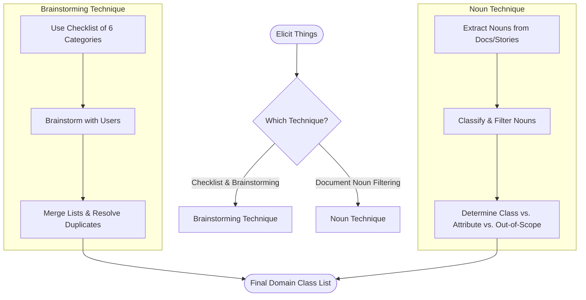

#### 4.2.1.1 The Brainstorming Technique
This technique uses a checklist of common categories of things to systematically identify what needs to be recorded.
* **Brainstorming Checklist (The 6 Categories of Things):**
  1. **Tangible Things:** Physical items (e.g., *Product*, *Equipment*, *Book*).
  2. **Roles Played:** Actors or parties who interact with the system (e.g., *Customer*, *Employee*, *Vendor*).
  3. **Organizational Units:** Departments or divisions (e.g., *SalesDept*, *Warehouse*, *Branch*).
  4. **Sites/Locations:** Physical or virtual locations (e.g., *Store*, *ShippingAddress*, *IPAddress*).
  5. **Incidents / Events:** Transactions or occurrences that happen at a specific time and must be recorded (e.g., *Order*, *Sale*, *FlightReservation*, *Payment*).
  6. **Devices:** Hardware components that the system interacts with (e.g., *Printer*, *Sensor*, *RFIDReader*).

#### 4.2.1.2 The Noun Technique
A systematic technique that analyzes all documentation (user stories, use case descriptions, forms, reports) to identify all nouns, which are then filtered and refined into classes or attributes.
* **Ideal for:** Initial modeling when users are unavailable for brainstorming.
* **Process:**
  1. Read all requirements documentation and compile a list of every noun.
  2. Refine the list using these classifications:
     * **Domain Class:** A "thing" the system needs to remember that has its own attributes (e.g., *Customer*).
     * **Attribute:** A property that describes a domain class (e.g., *CustomerName*, *BillingAddress*).
     * **Out of Scope:** Nouns that are irrelevant to the system (e.g., the *company's CEO* who has no interaction with the system).
     * **Synonyms:** Different nouns that refer to the same thing (e.g., *Client* and *Customer*). Choose one standard name.
     * **Input/Output:** Nouns that represent temporary screens or reports (e.g., *InvoicePrintout*). The system remembers the underlying data, not the layout.

---

### 4.2.2 Details About Domain Classes
* **Attribute:** A piece of information about each instance of a class. Attribute names use **camelback notation** (e.g., `firstName`, `billingAddress`).
* **Identifier (Key):** An attribute that uniquely identifies an instance of a class. Required for data entities, optional for domain classes (e.g., `customerId` for a `Customer` class).
* **Compound Attribute:** A single attribute that is composed of multiple sub-elements (e.g., `address` containing `street`, `city`, `state`, `zip`).
* **Class vs. Object:** A **Class** is the template or definition of a thing, while an **Object** is a specific instance of that class with concrete values (e.g., Class: `Customer`, Object: `Customer #1023 (John Doe)`).

---

## 4.3 Part II: The Entity-Relationship Diagram (ERD)

An **Entity-Relationship Diagram (ERD)** is a data-modeling tool used primarily for database design.
* **Data Entities:** The ERD equivalent of a domain class.
* **Key Difference from UML:** ERDs are *not* UML models. They do not model object behavior, whole-part relationships, or inheritance hierarchies.

### 4.3.1 ERD Multiplicity (Cardinality)
ERD models use **"crows feet"** notation to represent the minimum and maximum cardinality of relationships:

```
Optional One (Zero or One):    --o|--
Mandatory One (Exactly One):   --||--
Optional Many (Zero or Many):  --o<--
Mandatory Many (One or Many):   --|<--
```

#### Types of Associations:
1. **Binary Association:** A relationship between exactly two different classes (e.g., `Member` joins `Club`).
2. **Unary Association (Recursive):** A relationship between two instances of the same class (e.g., `Person` is married to `Person`; `Employee` reports to `Employee` (Manager)).
3. **Ternary / N-ary Association:** A relationship connecting three or more classes.

---

### 4.3.2 Relational Database Design & Normalization
A relational database organizes data into 2D tables containing rows (records/tuples) and columns (attributes/fields).

#### Creating Tables from Domain Classes:
1. **Create a table** for every domain class.
2. **Select a Primary Key (PK):** If no naturally unique field exists, generate a surrogate key (e.g., `StudentID`).
3. **Represent Associations using Foreign Keys (FK):**
   * **One-to-Many (1:M):** Place the primary key of the "One" side as a foreign key in the "Many" side table.
     * *Example:* Add `customerAccountNumber` (FK) to the `Sale` table to associate it with a `Customer`.
   * **Many-to-Many (M:M):** Create an associative table (often called a junction or bridge table). Its primary key is the combination (concatenation) of the primary keys of the two endpoint tables.
     * *Example:* `PromoOffering` table with primary key `(PromotionID, ProductItemID)`.

> [!important] The Association Class Rule
> In database design, if you need to store attributes about the relationship itself (e.g., a student's `grade` in a course), you must use an **Association Class**.
> The primary key of the association class *must* be the concatenation of the keys of the attached classes (e.g., `CourseNumber + SectionNumber + StudentID`). If you need additional fields to make it unique, your model is incorrect.

#### Representing Classification Hierarchies (Generalization/Specialization):
To map inheritance hierarchies to tables, database analysts use two main methods:
* **Method 1 (Single Table / Table Per Hierarchy):** Combine the superclass and all subclasses into a single table. It contains a superset of all attributes plus a discriminator column to identify the type.
  * *Pros:* Fast queries (no joins).
  * *Cons:* Many null values for subclass-specific columns.
* **Method 2 (Separate Tables / Table Per Type):** Create one table for the superclass and separate tables for each subclass. The subclass tables share the same primary key as the superclass.
  * *Pros:* Clean design, no null fields.
  * *Cons:* Requires complex SQL JOINs to retrieve subclass data.

#### Database Normalization
Normalization is a systematic process of organizing database columns to minimize redundancy and prevent anomalies (insertion, deletion, and update anomalies).

| Normal Form | Rule | Example & Resolution |
| :--- | :--- | :--- |
| **1NF** (First Normal Form) | All attribute values must be atomic (no multivalued attributes or repeating groups). | **Problem:** `Employee` table has `SSN`, `Name`, and a repeating column `Dependent` (e.g., "John, Sarah").<br>**Resolution:** Split into `Employee` (`SSN`, `Name`) and `Dependent` (`SSN`, `DependentName`). |
| **2NF** (Second Normal Form) | Must be in 1NF, and all non-key attributes must be fully functionally dependent on the *entire* primary key (no partial dependency). | **Problem:** PK is `(StudentID, CourseCode)`. Attributes are `StudentName` (depends only on `StudentID`) and `CourseName` (depends only on `CourseCode`).<br>**Resolution:** Split into `Student` (`StudentID`, `StudentName`), `Course` (`CourseCode`, `CourseName`), and `Grade` (`StudentID`, `CourseCode`, `Grade`). |
| **3NF** (Third Normal Form) | Must be in 2NF, and no non-key attribute can be dependent on any other non-key attribute (no transitive dependency). | **Problem:** PK is `StudentID`. Attributes are `CourseCode` and `CourseName` (which depends on `CourseCode`, not `StudentID`).<br>**Resolution:** Split into `StudentEnrollment` (`StudentID`, `CourseCode`) and `Course` (`CourseCode`, `CourseName`). |

---

## 4.4 Part III: The Domain Model Class Diagram

A **Domain Model Class Diagram** is a UML diagram that represents the classes of the problem domain. Unlike design class diagrams, it does *not* contain software classes (e.g., user interfaces or database controllers) and has **no methods** (only class names and attributes).

### 4.4.1 UML Multiplicity Notation
* `1` : Exactly one instance (mandatory).
* `0..1` : Zero or one instance (optional).
* `*` (or `0..*`) : Zero or more instances (optional many).
* `1..*` : One or more instances (mandatory many).

```mermaid
classDiagram
    class Customer {
        +customerId: int
        +name: string
        +billingAddress: string
    }
    class Order {
        +orderId: int
        +orderDate: date
        +totalAmount: decimal
    }
    class OrderItem {
        +quantity: int
        +unitPrice: decimal
    }
    class Product {
        +productId: int
        +description: string
        +unitPrice: decimal
    }
    
    Customer "1" --> "0..*" Order : places
    Order "1" *-- "1..*" OrderItem : consists of
    Product "1" -- "0..*" OrderItem : matches
```

### 4.4.2 UML Class Relationships
1. **Association:** A standard relationship between two classes.
2. **Generalization/Specialization (Inheritance):**
   * **Superclass:** General class (e.g., *Account*). Written in italics if it is an **Abstract Class** (cannot be instantiated directly).
   * **Subclass:** Specialized class (e.g., *SavingsAccount*, *CheckingAccount*). Inherits all attributes and associations from the superclass.
3. **Whole-Part Relationships:**
   * **Aggregation:** A relationship where the parts can exist independently of the whole. Represented by a hollow diamond. (e.g., *Computer* and *Mouse*).
   * **Composition:** A strong whole-part relationship where parts cannot exist without the parent. Represented by a filled diamond. (e.g., *Order* and *OrderItem*).

---

## 4.5 Part IV: The State Machine Diagram (Object Behavior)

Objects have a life cycle where they transition through different status conditions (states) in response to events. A **State Machine Diagram** models this behavior for a single class.

> [!important] The "Golden Rule" of State Machines
> Only create a State Machine Diagram for classes whose objects behave differently in response to the same event depending on their current state.
> * **Bad Candidate:** `Customer` class (updating name or address behaves the same way regardless of customer status). Skip the state machine.
> * **Good Candidate:** `Order` class (triggering `Cancel` works if the state is `Placed`, but fails if the state is `Shipped`). Create the state machine.

### 4.5.1 Notation and Syntax
* **State:** A condition during an object's life. State names should be **adjectives or gerunds** (e.g., *Placed*, *Checking*, *In Transit*), **never nouns**.
* **Transition:** The movement from an origin state to a destination state.
* **Transition Label Syntax:** `Trigger-event [Guard-condition] / Action-expression`
  * *Trigger-event:* The event that stimulates the transition.
  * *Guard-condition:* A boolean expression that must be true for the transition to fire.
  * *Action-expression:* A procedural expression executed during the transition.
* **Pseudostate:** The start node (solid black circle).
* **Final State:** The end node (bullseye).

```mermaid
stateDiagram-v2
    [*] --> Open : Create Order
    
    state Open {
        [*] --> Empty
        Empty --> HasItems : Add Item
        HasItems --> HasItems : Add Item
    }
    
    Open --> Placed : Checkout / Calculate Total
    Placed --> Paid : Pay [Credit Valid] / Record Payment
    Placed --> Open : Cancel [Before Paid]
    Paid --> Shipped : DeliverShip / Ship Order
    Shipped --> [*] : Delivery Confirmed
```

### 4.5.2 Concurrency in State Machine Diagrams
An object can be in multiple states simultaneously. This is modeled using **concurrent paths** separated by synchronization bars (heavy horizontal or vertical lines) or composite state regions.

* **Split:** A transition that forks into multiple parallel paths (an "AND" condition).
* **Join:** Parallel paths that merge back into a single state (all paths must complete before joining).

```mermaid
stateDiagram-v2
    [*] --> On
    
    state On {
        [*] --> Idle
        Idle --> Printing : Print Job Received
        Printing --> Idle : Job Completed
        --
        [*] --> MonitoringToner
        MonitoringToner --> TonerLow : Level < 10%
        TonerLow --> MonitoringToner : Toner Replaced
    }
    
    On --> Off : Power Cut
```

> [!tip] Extra Notes: Naming Conventions for States
> State names should describe a condition of existence. Use adjectives (*Empty*, *Full*), past participles (*Placed*, *Shipped*, *Cancelled*), or gerunds (*Printing*, *Processing*). Avoid nouns (e.g., do not name a state *Customer* or *Order*, as those are class names).

---

# Chapter 5: Extending the Requirements Models

## 5.1 Introduction
> [!info] Objective
> By the end of this topic, you should be able to:
> 1. Write fully developed use case descriptions.
> 2. Develop activity diagrams to model the flow of activities.
> 3. Develop system sequence diagrams.
> 4. Use the CRUD technique to validate use cases.
> 5. Explain how use case descriptions and UML diagrams work together to define functional requirements.

---

## 5.2 Part I: Use Case Description

### 5.2.1 Recap: What is a Use Case?
* A use case depicts a set of activities performed to produce some output result.
* It describes how an event triggers actions performed by the system and the user.
* **Event-Driven Modeling:** The system is viewed as a reactive system that lies at rest until an event triggers it, executes the actions defined in the use case, and then returns to the waiting state.

---

### 5.2.2 Brief vs. Fully Developed Use Case Descriptions
* **Brief Description:** A simple, one-sentence description showing the main steps. Sufficient for small, well-understood applications and simple use cases (e.g., *Add product comment*, *Send message*).
* **Fully Developed Description:** The most formal and comprehensive method for documenting a use case. Highly recommended for complex use cases (e.g., *Fill shopping cart*, *Create customer account*) to prevent misunderstandings and reduce rework.

> [!tip] Extra Notes: The 11 Compartments of a Fully Developed Use Case Description
> A standard template consists of the following compartments:
> 1. **Use Case Name:** Verb-noun phrase.
> 2. **Scenario:** A specific path or variation of steps within the use case (e.g., *Create new online account* vs. *Create guest account*).
> 3. **Triggering Event:** The business event that initiates the use case (from event decomposition).
> 4. **Brief Description:** High-level summary of the process.
> 5. **Actors:** Users or external systems interacting with the automated boundary.
> 6. **Related Use Cases:** Inclusions (`<<includes>>`) or extensions (`<<extends>>`).
> 7. **Stakeholders:** Parties with an interest in the results but who do not invoke the use case directly (e.g., *Sales Manager*).
> 8. **Preconditions:** The required state of the system before the use case can start (e.g., what objects must exist).
> 9. **Postconditions:** What must be true when the use case completes (e.g., what objects were created/updated). Critical for test case expected results.
> 10. **Flow of Activities:** Sequentially numbered steps dividing actor actions and system responses.
> 11. **Exception Conditions:** Alternative paths or what happens when things go wrong (tied directly to flow numbers).

---

### 5.2.3 Fully Developed Examples

#### Example 1: Create Customer Account
| Compartment | Details |
| :--- | :--- |
| **Use Case Name** | `Create customer account` |
| **Scenario** | Create new online customer account |
| **Triggering Event** | Customer clicks "Sign Up" on the website |
| **Brief Description** | User enters new customer account data, and the system validates the email, assigns a unique customer ID, and creates a customer record. |
| **Actors** | Customer |
| **Related Use Cases** | None |
| **Stakeholders** | Sales Manager, Marketing Manager |
| **Preconditions** | Customer must have a valid, unregistered email address. |
| **Postconditions** | A new `Customer` record is created, status set to "Pending Verification", and verification email sent. |
| **Flow of Activities** | **Actor Action**<br>1. Clicks "Sign Up".<br><br>3. Enters details (Name, Email, Password, Billing Address) and clicks "Submit".<br><br><br><br>5. Receives verification email and clicks verification link.<br><br> | **System Response**<br>2. Displays the registration form.<br><br>4. Validates inputs, checks for duplicate email, generates unique CustomerID, creates record, and sends verification email.<br><br>6. Activates account status and displays welcome message. |
| **Exception Conditions** | 4a. Invalid email format: Displays warning and prompts to re-enter.<br>4b. Email already exists: Displays "Email already registered" error and redirects to Login page. |

#### Example 2: Customize Drink (Class Activity)
| Compartment | Details |
| :--- | :--- |
| **Use Case Name** | `Customize drink` |
| **Scenario** | Customer customizes a custom coffee drink order |
| **Triggering Event** | Customer selects "Customize" on a menu item |
| **Brief Description** | Customer selects coffee bean, temperature, toppings, and size. System updates the order item details and displays the new price. |
| **Actors** | Customer |
| **Related Use Cases** | `<<includes>>` Choose bean, Choose temperature;<br>`<<extends>>` Add tumbler option, Select topping. |
| **Stakeholders** | Barista (requires clear instructions), Store Manager (inventory tracking) |
| **Preconditions** | Customer is logged in and is in the menu screen. |
| **Postconditions** | Customized drink item is added to the active shopping cart with detailed selections. |
| **Flow of Activities** | **Actor Action**<br>1. Selects drink and clicks "Customize".<br><br>3. [Includes] Selects bean type and temperature.<br>4. [Optional - Extends] Selects topping (e.g., whipped cream).<br>5. Confirms customization and adds to cart. | **System Response**<br>2. Displays customization options screen.<br><br><br>6. Calculates price adjustments, saves customized item in cart, and returns to menu. |
| **Exception Conditions** | 3a. Selected bean out of stock: System displays warning and prompts to choose another bean. |

---

## 5.3 Part II: Activity Diagram for Use Cases

UML Activity Diagrams provide a graphical view of a use case's flow of activities. They are useful for documenting complex workflows, loops, and conditional logic.

### 5.3.1 Activity Diagram: Create Customer Account
This diagram uses subgraphs to represent **swimlanes**, separating responsibilities between the Customer and the System.

```mermaid
graph TD
    subgraph Customer [Swimlane: Customer]
        Start([Start]) --> ClickSignUp[Click 'Sign Up']
        FillForm[Fill registration details]
        CheckEmail[Check email & click verify]
    end
    
    subgraph System [Swimlane: System]
        ClickSignUp --> ShowForm[Display registration form]
        ShowForm --> FillForm
        FillForm --> Validate[Validate details & check email uniqueness]
        Validate -->|Valid & Unique| CreateRecord[Create Customer Record & set status to Pending]
        Validate -->|Invalid| ShowError[Display error message] --> ShowForm
        CreateRecord --> SendVerif[Send verification email]
        SendVerif --> CheckEmail
        CheckEmail --> SetActive[Set account status to Active] --> End([End])
    end
    
    style Start fill:#222,stroke:#fff,stroke-width:2px;
    style End fill:#222,stroke:#333,stroke-width:2px;
```

---

### 5.3.2 Activity Diagram: Fill Shopping Cart (With Inclusions & Loops)
Activity diagrams can represent repeating loops (e.g., for each `SaleItem`) and invoke other use cases (shown as shaded ovals representing `<<includes>>`).

```mermaid
graph TD
    Start([Start]) --> OpenCart[Open Shopping Cart]
    
    subgraph LoopForEachItem ["Loop: For Each Item"]
        OpenCart --> AddItem[Add Item to Cart]
        AddItem --> ChooseDetails{{"<< includes >> <br> Customize drink"}}
        ChooseDetails --> CheckOutDecision{Finished Shopping?}
    end
    
    CheckOutDecision -->|No| AddItem
    CheckOutDecision -->|Yes| End([End])
    
    style ChooseDetails fill:#d3ffd3,stroke:#2e7d32;
```

---

## 5.4 Part III: The System Sequence Diagram (SSD)

A **System Sequence Diagram (SSD)** describes the flow of information (inputs and outputs) into and out of the automated portion of the system.
* It is a special type of UML sequence diagram that helps in the initial design of the user interface.
* **The Black Box Concept:** The automated system is treated as a black box (labeled `:System`). We only model interactions at the boundary; internal classes and database schemas are ignored.

```mermaid
sequenceDiagram
    actor Actor as Actor (User)
    participant System as :System
    
    Actor->>System: inputMessage(arguments)
    Note over System: System processes data (Black Box)
    System-->>Actor: returnData (output)
```

---

### 5.4.1 SSD Message Notation
```
*[true/false condition] return-value := message-name (parameter-list)
```
* **Asterisk (`*`):** Indicates that the message repeats (looping).
* **Brackets (`[ ]`):** A boolean condition that must be true for the message to be sent.
* **Return-value (`:=`):** Describes the data returned from the system.
* **Parameter-list:** The arguments passed to the system.

---

### 5.4.2 SSD Control Frames
SSDs use frames to show loops and conditionals:
1. **Loop Frame:** Repeating messages (e.g., entering multiple order items).
2. **Opt Frame:** Optional steps that only execute if a condition is true.
3. **Alt Frame:** Conditional choice between two or more alternative paths (if–else logic).

---

### 5.4.3 SSD Examples

#### Example 1: Withdraw Cash (ATM)
```mermaid
sequenceDiagram
    actor Customer
    participant ATM as :System
    
    Customer->>ATM: insertCard()
    ATM-->>Customer: requestPIN()
    Customer->>ATM: enterPIN(1234)
    ATM-->>ATM: validatePIN()
    ATM-->>Customer: requestAmount()
    Customer->>ATM: enterAmount(200)
    
    alt Balance >= 200
        ATM-->>ATM: debitAccount(200)
        ATM-->>Customer: dispenseCash(200) & printReceipt()
    else Balance < 200
        ATM-->>Customer: displayInsufficientFunds()
    end
```

#### Example 2: Fill Shopping Cart (Loop & Option)
```mermaid
sequenceDiagram
    actor Customer
    participant WebSystem as :System
    
    Customer->>WebSystem: startOrder()
    WebSystem-->>Customer: displayMenu()
    
    loop For each item to add
        Customer->>WebSystem: addItemToCart(itemID, quantity)
        WebSystem-->>Customer: updateCartDisplay(subtotal)
    end
    
    opt Customer has coupon
        Customer->>WebSystem: applyDiscountCode(code)
        WebSystem-->>Customer: displayNewTotal(discountedTotal)
    end
    
    Customer->>WebSystem: proceedToCheckout()
    WebSystem-->>Customer: displayPaymentScreen()
```

---

## 5.5 Part IV: Use Cases and CRUD Validation

The **CRUD technique** is a validation and cross-check tool used to ensure that all required use cases have been identified to support the lifecycle of domain classes.

> [!important] The CRUD Validation Goal
> For every class in the domain model, there must be corresponding use cases to **C**reate, **R**ead, **U**pdate, and **D**elete/Archive its instances.

### 5.5.1 Identifying Gaps
During requirements definition, users naturally focus on primary workflows (e.g., *Create Order*) while forgetting administrative or housekeeping functions (e.g., *Update customer account*, *Archive old orders*). CRUD validation forces analysts to identify these gaps:
* **Example (Gaps):** If you identify a domain class `Adjustment` but have no use case that creates or updates adjustments, you must add use cases like `Create adjustment` and `Modify adjustment`.
* **Consolidation Tip:** A single use case can cover multiple CRUD letters (e.g., `Maintain Customer Accounts` handles C, U, and D).

---

## 5.6 Summary: Integrating Requirements Models

Requirements models are highly integrated and must remain consistent:

```mermaid
graph TD
    subgraph Behavior Models (Use Cases)
        UCD[Use Case Diagram] --> UCD_Desc[Use Case Description]
        UCD_Desc --> AD[Activity Diagram]
        AD --> SSD[System Sequence Diagram]
    end
    
    subgraph Data Models (Domain Classes)
        DMCD[Domain Class Diagram] --> SMD[State Machine Diagram]
    end
    
    SSD -.->|Validates inputs/outputs| DMCD
    UCD_Desc -.->|CRUD validation| DMCD
    SMD -.->|Tracks state transitions| SSD
```

* **Fully developed descriptions** define the actor-system dialog.
* **Activity diagrams** illustrate complex flows within those descriptions.
* **System sequence diagrams** represent the inputs and outputs of those flows.
* **CRUD analysis** checks that the data classes support and are supported by these use cases.
* **State machine diagrams** track the lifecycle of the data classes triggered by SSD inputs.
* *Note: Detailed modeling is only done when complexity warrants it; unnecessary detail should be avoided.*

---

# Chapter 6: Approaches to System Development

## 6.1 Introduction
> [!info] Objective
> By the end of this topic, you should be able to:
> 1. Compare the underlying assumptions and uses of a predictive and an adaptive system development life cycle (SDLC).
> 2. Explain what makes up a system development methodology—the SDLC as well as models, tools, and techniques.
> 3. Describe the key features of Agile development.
> 4. Understand and describe the key features of the Unified Process, Extreme Programming, and Scrum Agile system development methodologies.

---

## 6.2 The System Development Life Cycle (SDLC)
The **System Development Life Cycle (SDLC)** is the basic framework used to develop an information system. Modern software development approaches lie on a continuum from highly predictive to highly adaptive.

```mermaid
graph LR
    A[Predictive SDLC] <-->|Continuum| B[Adaptive SDLC]
    style A fill:#ffebee,stroke:#c62828,stroke-width:1px;
    style B fill:#e8f5e9,stroke:#2e7d32,stroke-width:1px;
```

### 6.2.1 Predictive vs. Adaptive Characteristics
* **Predictive Approach (Waterfall Model):** Assumes the project can be planned completely in advance and the system built according to the plan. Best suited when requirements are well understood and technical risk is low.
* **Adaptive Approach (Iterative Model):** Assumes requirements are uncertain, the project environment is dynamic, or technical risk is high. Adjusts plans and models dynamically as the project progresses.

---

### 6.2.2 Traditional Predictive SDLC Phases
In predictive approaches, development activities are grouped into six sequential **phases**:
1. **Project Initiation:** Identify the business problem/opportunity and secure approval to start.
2. **Project Planning:** Organize, schedule, and map out the project's overall structure.
3. **Analysis:** Discover and understand what the system must do to support business processes.
4. **Design:** Configure and structure the system components (program structure, database, UI).
5. **Implementation:** Write the program code and perform testing.
6. **Deployment:** Install the software and put the system into active operation.

---

### 6.2.3 Predictive Methodology Variants

#### 6.2.3.1 The Waterfall Model
The classic predictive model where work flows sequentially from one phase to the next without overlapping. Once a phase ends and is approved, the next begins (like water flowing down).

* **Advantages:**
  * Requirements are identified and locked down long before coding begins.
  * Limits requirement changes mid-project.
* **Disadvantages:**
  * Rigid and extremely expensive to go backward.
  * Testing is treated as an afterthought in the final phases.
  * Deliverables (voluminous documents) are poor communication tools, leading to overlooked requirements.
  * Users may forget the original purpose of the system due to the long duration before actual software delivery.

```mermaid
graph TD
    PI[Project Initiation] --> PP[Project Planning]
    PP --> Anal[Analysis]
    Anal --> Des[Design]
    Des --> Imp[Implementation]
    Imp --> Dep[Deployment]
```

#### 6.2.3.2 Parallel Development
Divides the project into separate design and implementation subprojects that are developed in parallel to reduce overall project duration.

* **Advantages:**
  * Delivers the system faster, reducing the risk of business environment changes.
* **Disadvantages:**
  * Still produces voluminous documentation deliverables.
  * Integrating subprojects at the end can be extremely challenging if the subprojects are not completely independent.

```mermaid
graph TD
    Planning[Planning] --> Analysis[Analysis]
    Analysis --> Sub1[Design Subproject 1] --> Imp1[Implementation Subproject 1]
    Analysis --> Sub2[Design Subproject 2] --> Imp2[Implementation Subproject 2]
    Imp1 --> Integration[Integration & Deployment]
    Imp2 --> Integration
```

#### 6.2.3.3 The V-Model
A waterfall variant that places an explicit focus on quality assurance by planning tests during the analysis and design stages (down the left slope) and executing them during implementation (up the right slope).

* **Advantages:**
  * Early focus on test plan development improves software quality.
  * Quality assurance personnel contribute early.
* **Disadvantages:**
  * Remains rigid and unsuitable for dynamic business environments.

```mermaid
graph TD
    subgraph DefiningRequirementsAndDesign ["Defining Requirements & Design"]
        Anal[Analysis] --> Des[Design]
        Des --> Code[Coding / Implementation]
    end
    
    subgraph TestingAndVerification ["Testing & Verification"]
        Acc[Acceptance Testing]
        Sys[System / Integration Testing]
        Unit[Unit Testing]
    end
    
    Anal -.->|Acceptance Test Plan| Acc
    Des -.->|System Test Plan| Sys
    Code --> Unit
    Unit --> Sys --> Acc
```

---

### 6.2.4 Newer Adaptive Approaches to the SDLC
* **Iterative Development:** Divides the project into a series of mini-projects (iterations). During a single iteration, a small part of the system is analyzed, designed, built, and tested. Results feed into the next iteration.
* **Incremental Development:** The system is "grown" organically. Completed increments are integrated and put into user hands early, allowing the business to realize benefits sooner.
* **Walking Skeleton:** A development technique that implements a bare-bones, front-to-back version of the system in the first few iterations to prove the architecture, then fleshes it out with features in subsequent iterations.

---

## 6.3 Methodologies, Models, Tools, and Techniques

A **Methodology** is a complete, structured set of guidelines that specifies the SDLC, models to build, and tools/techniques to use throughout a project.

```mermaid
graph TD
    Methodology[Methodology] --> SDLC[SDLC Phases & Iterations]
    Methodology --> Models[Models / Representations]
    Methodology --> Tools[Tools / Software Support]
    Methodology --> Techniques[Techniques / Guidelines]
```

* **Model:** A representation of an important part of the real world (e.g., UML Class Diagrams, Gantt charts, NPV financial models). Usually graphical.
* **Tool:** Software support used to build models or components (e.g., Integrated Development Environments (IDEs), Visual Modeling Tools for UML, Microsoft Project).
* **Technique:** A collection of guidelines and instructions that help an analyst complete an activity or task (e.g., Noun Technique, relational database design techniques).

---

## 6.4 The Unified Process, Extreme Programming, and Scrum

The three most popular iterative, object-oriented, and Agile methodologies:

```mermaid
graph TD
    Agile[Agile Methodologies] --> UP[Unified Process <br> Object-Oriented & Formal]
    Agile --> XP[Extreme Programming <br> Practice-Focused]
    Agile --> Scrum[Scrum <br> Team-Focused Sprinting]
```

---

### 6.4.1 The Unified Process (UP)
The Unified Process (UP) is an object-oriented system development methodology originally created by Rational Software (now part of IBM) that uses UML models.

#### The Four UP Phases
1. **Inception (Approx. 1 iteration):** Develop the system vision, make the business case, define scope, and establish rough cost/schedule estimates.
2. **Elaboration (Multiple iterations):** Do fact-finding to identify all requirements, design and code the core system architecture, and generate realistic estimates.
3. **Construction (Multiple iterations):** Design and implement the remaining routine/predictable functions (UI details, validation, routine maintenance).
4. **Transition (1+ iterations):** Conduct beta tests, secure user acceptance, and deploy the system into operation.

#### The Six Core UP Development Disciplines
For every iteration, the team performs activities across six disciplines in varying proportions:
1. **Business Modeling:** Understand the business context.
2. **Requirements:** Define what the system increment must do.
3. **Design:** Create a software solution that satisfies the requirements.
4. **Implementation:** Write and compile the code.
5. **Testing:** Verify the code functions correctly.
6. **Deployment:** Put the working increment into use.

---

### 6.4.2 Extreme Programming (XP)
Extreme Programming (XP) is an Agile methodology that takes proven industry best practices and pushes them "to the extreme."

#### Four Core Values of XP:
* **Communication:** Open, daily contact between developers and users.
* **Simplicity:** Build the simplest system that works.
* **Feedback:** Continuous, immediate testing and user feedback.
* **Courage:** Willingness to throw away bad code and make hard decisions.

#### The 12 XP Practices:
| XP Practice | Description |
| :--- | :--- |
| **Planning** | Make simple plans based on user stories; refine them dynamically. |
| **Testing** | Write test code first (**Test-First Development**) before writing the system code. |
| **Pair Programming** | Two developers work together at a single workstation to write better code. |
| **Simple Design** | Implement only what is needed for the current iteration. |
| **Refactoring** | Continuously clean up and improve code structure without changing behavior. |
| **Collective Code Ownership** | Anyone on the team can edit and improve any part of the codebase. |
| **Continuous Integration** | Integrate and test small pieces of code multiple times a day. |
| **On-Site Customer** | A user representative sits with the team full-time to clarify requirements. |
| **System Metaphor** | Use a shared simple analogy to explain how the system works. |
| **Small Releases** | Deliver working software in small, incremental versions. |
| **Forty-Hour Week** | Maintain sustainable work hours; tired developers make mistakes. |
| **Coding Standards** | Use uniform naming and coding style conventions. |

#### XP Project Activities Rings
XP organizes project activities into three concentric rings:

```mermaid
graph TD
    subgraph OuterRingSystem ["Outer Ring: System"]
        US[Write User Stories] --> AT[Define Acceptance Tests]
        subgraph MiddleRingRelease ["Middle Ring: Release"]
            RP[Release Planning] --> CT[Conduct Release Tests]
            subgraph InnerRingIteration ["Inner Ring: Iteration"]
                IP[Iteration Planning] --> Code[Write Code] --> TFD[Test-First Development] --> Unit[Unit/Integration Testing]
            end
        end
    end
```

---

### 6.4.3 Scrum
Scrum is an iterative Agile methodology focused primarily on the **team level**, using social engineering to build software in a highly prioritized, time-boxed environment.

* **Rugby Metaphor:** The team operates as a single unit, passing the ball back and forth, beginning quickly, and cooperating intensely to score.

#### The Three Core Scrum Roles:
1. **Product Owner:** Represents stakeholders, manages requirements, and prioritizes the Product Backlog.
2. **Scrum Master:** Facilitates the project, removes obstacles/impediments, and protects the team from external distractions.
3. **Scrum Team:** A small (typically 5-9 people), self-organizing group of cross-functional developers who choose how to do the work.

#### Scrum Practices & Sprint Cycle:
* **Product Backlog:** A continually prioritized master list of system features, use cases, and technical requirements.
* **Sprint:** A fixed work period (time box, usually 30 days) to deliver a working software increment.
  * **Sprint Planning:** The team chooses the sprint goal and selects tasks from the top of the Product Backlog to form the **Sprint Backlog**.
  * **Daily Scrum:** A 15-minute daily meeting where each team member answers:
    1. *What did I do yesterday?*
    2. *What will I do today?*
    3. *What obstacles are in my way?*
  * **Scope Freeze:** Once a sprint begins, the scope is frozen. No new requirements can be added directly. New requests go to the Product Backlog for the next sprint.
  * **Sprint Review:** At the sprint's end, the team demonstrates the working product increment to stakeholders and conducts a retrospective.

```mermaid
graph LR
    PB[Product Backlog] -->|Sprint Planning| SB[Sprint Backlog]
    SB -->|30-Day Sprint| Execution[Sprint Execution]
    Execution -->|15-Min Daily Scrum| Execution
    Execution -->|Deliver| PI[Product Increment]
    PI -->|Sprint Review & Retro| PB
```

---

## 6.5 Agile Modeling (AM) and Agile Values

### 6.5.1 The 4 Core Agile Values
1. **Responding to change** over following a plan.
2. **Individuals and interactions** over processes and tools.
3. **Working software** over comprehensive documentation.
4. **Customer collaboration** over contract negotiation.

> [!note] Chaordic Projects
> A term used to describe Agile projects, representing a creative balance of **chaos** (the unpredictability of user needs) and **order** (team structure, sprints, and alignment).

### 6.5.2 Practical Principles of Agile Modeling
Agile modeling is not about doing *no* modeling, but about doing the right kind of modeling at the right level of detail for the right purposes.
1. **Develop Software as the Main Goal:** Models are tools, not the final product.
2. **Support the Next Step:** Models should only be created to help move from analysis to design, design to coding, etc.
3. **Keep Modeling Small and Simple:** Only draw what is absolutely necessary.
4. **Accept Change Gradually:** Do not try to lock down models early.
5. **Model with a Purpose:** Know exactly why you are drawing a diagram.
6. **Use Multiple Models:** One model cannot show data, interactions, and states.
7. **Build Good Models & Get Fast Feedback:** Iterate models with users.
8. **Focus on Meaning, Not Beauty:** Whiteboard sketches are superior to neat, computerized drawings during design.
9. **Learn Together Through Open Communication:** Share diagrams on walls and ask for feedback.
10. **Know Your Models:** Understand the UML or ERD syntax.
11. **Adapt to the Project:** Customise modeling rigor based on system scale.
12. **Focus on Stakeholder Value:** Always ensure the model serves the user's business value.

---

# Chapter 7: Project Planning and Project Management

## 7.1 Introduction
> [!info] Objective
> By the end of this topic, you should be able to:
> 1. Describe the factors that cause a software development project to succeed or fail.
> 2. Describe the responsibilities of a project manager.
> 3. Describe the knowledge areas in the project management body of knowledge (PMBOK).
> 4. Describe the Agile approach to the project management knowledge areas.
> 5. Explain the activities required to get a project approved.
> 6. Explain the activities required to plan and monitor a project.

---

## 7.2 Part I: Principles of Project Management

### 7.2.1 The Need for Project Management
Project management is organizing and directing other people to achieve a planned result within a predetermined schedule and budget.

#### Categories of Project Success:
* **Successful Projects:** Completed on time, within budget, and on scope.
* **Challenged Projects:** Failed in one or more areas (e.g., late, over budget, or missing features).
* **Failed Projects:** Cancelled before completion or not used at all.

#### Project Success Rates by Development Paradigm:
Statistics show that iterative, agile, and lean paradigms yield significantly higher success rates than traditional paradigms:

| Development Paradigm | Successful | Challenged | Failed |
| :--- | :---: | :---: | :---: |
| **Lean** | 72% | 21% | 7% |
| **Iterative** | 65% | 28% | 7% |
| **Agile** | 64% | 30% | 6% |
| **Ad hoc** | 50% | 35% | 15% |
| **Traditional (Waterfall)** | 49% | 32% | 18% |

#### Common Reasons for Project Failure:
1. Undefined project management practices.
2. Poor IT management and procedures.
3. Inadequate executive support.
4. Inexperienced project managers.
5. Unclear business needs and project objectives.
6. Inadequate user involvement.

---

### 7.2.2 The Role of the Project Manager
The project manager is responsible for planning, monitoring, and controlling the project.

#### Project Manager Responsibilities:
* **Internal Responsibilities:**
  * Developing the project schedule.
  * Recruiting and training team members.
  * Assigning work to teams and team members.
  * Assessing project risks.
  * Monitoring and controlling project deliverables and milestones.
* **External Responsibilities:**
  * Reporting project status and progress to stakeholders.
  * Working directly with the client (project sponsor) and key managers.
  * Identifying resource needs and obtaining resources.

#### Key Project Stakeholders:
* **Client:** The person or group that funds the project.
* **Oversight Committee:** Clients and key managers who review progress and direct the project.
* **Users:** The people who will use the new system.

```mermaid
graph TD
    OC[Oversight Committee / Client] <--> PM[Project Manager]
    PM --> TL1[Team Leader] --> M1[Member]
    PM --> TL2[Team Leader] --> M2[Member]
    PM --> Tech[Technical Staff]
    User[Users] <--> PM
```

---

### 7.2.3 Project Management and Ceremony
**Ceremony** refers to the level of formality of a project—the rigor of holding meetings and producing documentation:
* **High Ceremony:** Meetings are held on a predefined schedule with specific participants, agendas, minutes, and follow-through. Specifications and models are formally documented with abundant diagrams and verified through formal review meetings.
* **Low Ceremony:** Meetings occur informally (e.g., hallway or water cooler). Written documentation and formal specifications are kept to a minimum; developers and users work closely together on a daily basis.

---

### 7.2.4 PMBOK Knowledge Areas and Agile Adaptation
The Project Management Body of Knowledge (PMBOK) is a widely accepted guide and standard of fundamental project management principles. It covers **10 key knowledge areas**:

1. **Project Integration Management:** Combines all parts of the project so everything works together smoothly.
2. **Project Scope Management:** Defines what work should be done and what is not included.
   * *Agile Adaptation:* Scope is not well understood initially but is controlled by ranking work by value/urgency, delivering in iterations, and adapting to change.
3. **Project Time Management:** Creates the schedule and makes sure tasks are finished on time.
   * *Agile Adaptation:* Schedule must be flexible due to changes; sprints are time-boxed.
4. **Project Cost Management:** Estimates the budget and controls project spending.
   * *Agile Adaptation:* Costs are more difficult to estimate upfront and are adjusted iteration-by-iteration.
5. **Project Quality Management:** Ensures the project work and results meet the required standards.
   * *Agile Adaptation:* Quality is assessed and verified after each iteration.
6. **Project Human Resource Management:** Builds, manages, and motivates the project team.
7. **Project Communications Management:** Makes sure the right information reaches the right people at the right time.
8. **Project Risk Management:** Identifies possible problems and prepares ways to reduce them.
   * *Agile Adaptation:* Higher-risk aspects of the project are completed first.
9. **Project Procurement Management:** Handles buying products or services from outside suppliers.
10. **Project Stakeholder Management:** Identifies people affected by the project and keeps them involved and informed.

---

## 7.3 Part II: Identify the Problem and Obtain Approval

### 7.3.1 Identifying and Defining the Problem
Defining the problem and objectives is the foundation of determining what the system must accomplish.

#### Signs of System Problems:
* **Performance Output Criteria:** Too many errors, work completed slowly, work done incorrectly, work done incompletely, work not done at all.
* **Employee Behavior:** High absenteeism, high job dissatisfaction, high job turnover.
* **External Feedback:** Complaints from vendors/customers/suppliers, loss of sales, lower sales.

#### Problem Definition Components:
1. **Problem Statement:** A short summary of the business problem (usually 1-2 paragraphs).
2. **Issues:** The current problems or major pieces of the situation (what is going wrong now).
3. **Objectives:** The desired results or goals that address each issue (what we want to achieve). Objectives must match issues point-by-point.

---

### 7.3.2 The System Vision Document
A key deliverable used to clearly define the problem and obtain project approval. It contains three main components:
1. **Problem Description:** Studies where the project idea came from (e.g., strategic plan, user problem) and explains the business need.
2. **System Capabilities:** High-level list of what the new system should be able to do.
3. **Business Benefits:** The value the organization expects to gain, focusing on financial benefits (e.g., reducing costs, increasing revenue).

> [!example] Example: RMO's CSMS (Consolidated Sales and Marketing System)
> * **Problem Description:** Web-based sales and marketing CSS is outdated. Customers require catalog and sales systems with one-click ordering, deferred-purchase tracking, and social media integration. RMO must launch CSMS to respond to mobile computing and CSS limitations.
> * **System Capabilities:** Provide a shopping cart, automate customer sales, recommend related products, allow customer ratings, include a "friend" network, support split-order shipping, handle back-ordering, integrate with social media, and support mobile devices.
> * **Business Benefits:** Increase sales by connecting with customers, increase size and frequency of customer purchases, attract new customers, build loyalty, increase speed of product availability, and eliminate shipping delays.

---

### 7.3.3 Determining Feasibility and Risk
A feasibility study is used to gather broad data for management to enable them to make an approval decision. Feasibility studies must be highly time-compressed because many projects are requested but only a few should be executed.

#### The Three Key Elements of Feasibility:
1. **Technical Feasibility:** Checks whether the system can be built with current technology.
   * *Risks/Questions:* Do we have the hardware, software, and tools? Do we have skilled staff?
2. **Economic Feasibility:** Checks whether the project is worth the cost by comparing short-term costs with long-term benefits.
   * *Tangible Benefits:* Faster processing, quicker access to information, less employee time.
   * *Intangible Benefits:* Better decision-making, higher accuracy, improved customer service.
   * *Tangible Costs:* Equipment, software, systems analyst and programmer time.
   * *Intangible Costs:* Losing competitive edge, declining company image, customer dissatisfaction.
   * *Financial Analysis Models:* Net Present Value (NPV), Payback Period (Break-Even Analysis), and Return on Investment (ROI).
3. **Operational Feasibility:** Checks whether the system will work well and be accepted in the organization.
   * **Organizational/Cultural Risks:** Computer phobia, perceived loss of control by staff/management, shifting of political power, fear of change in job responsibilities, fear of job loss due to automation.
   * **Solutions:** Early risk identification, active user support, and additional training sessions.

---

## 7.4 Part III: Plan and Monitor the Project

### 7.4.1 Establish the Project Environment
Tailoring and operationalizing the methodology involves:
1. **Record & Communicate:** Clarify "who, what, when, and how."
2. **Build the Work Environment:** Set up workstations, software development tools (IDEs), servers, repositories, office/meeting space, and support staff.
3. **Define Process & Procedures:** Set up rules for reporting, programming style (single vs. pair), testing, deliverables, and version control.

```
Sample Dashboard: Conference Registration System
-----------------------------------------------------------------------------
| Project Overview           | Issues & Risks      | Tasks                 |
|----------------------------|---------------------|-----------------------|
| Planned finish: Dec 2015   | Urgent issues: 3    | Tasks this iter: 45   |
| Planned cost: $1,680,000   | Open issues: 22     | Tasks this week: 15   |
| Time expended: 18%         | Assigned: 15        | Open: 35              |
| Deliverables completed: 4/35| Unassigned: 7      | Unassigned: 22        |
| Current iteration: 4/15    | Closed issues: 137  | Assigned: 13          |
| Active tasks: 5            | Identified risks: 4 | Slipped - urgent: 3   |
|                            |                     | Slipped - routine: 7  |
|                            |                     | Completed tasks: 10   |
-----------------------------------------------------------------------------
```

---

### 7.4.2 Schedule the Work
Project schedules are managed at two levels:
* **Project Iteration Schedule:** A high-level list of iterations and the use cases/user stories assigned to each. Sprints are kept constant in duration (typically 4 weeks).
* **Detailed Work Schedule:** A schedule within a single iteration listing tasks, effort estimates, and dependencies.

#### Three-Step Process for Developing a Detailed Work Schedule:
1. **Develop a Work Breakdown Structure (WBS):** A list or hierarchy of activities and tasks used to estimate the work.
   * *WBS Task Rules:* There should be a clear completion criterion, and each task should take between **1 to 5 working days** of effort.
2. **Estimate Effort and Identify Dependencies:**
   * Identify task times and predecessors (tasks that must start/finish before another starts/finishes).
   * Identify the **critical path**—the sequence of tasks that cannot be delayed without delaying the entire project.
3. **Create a Schedule using a Gantt Chart:** Graphically displays dates, predecessors, tasks, and the critical path.

#### Predecessor Dependency Types:
* **Finish-to-Start (FS):** Task B cannot start until Task A finishes (most common).
* **Start-to-Start (SS):** Task B cannot start until Task A starts.
* **Finish-to-Finish (FF):** Task B cannot finish until Task A finishes.
* **Start-to-Finish (SF):** Task B cannot finish until Task A starts.

#### WBS Tree Diagram Example (Construction of a House):
```
Level 1: Construction of a House
   ├── Level 2: 1. Internal
   │      ├── Level 3: 1.1 Electricity
   │      │      ├── Level 4: 1.1.1 Rough-in Electrical
   │      │      ├── Level 4: 1.1.2 Install and Terminate
   │      │      └── Level 4: 1.1.3 HVAC Equipment
   │      └── Level 3: 1.2 Plumbing
   ├── Level 2: 2. Foundation
   │      ├── Level 3: 2.1 Excavation
   │      └── Level 3: 2.2 Steel Erection
   │             ├── Level 4: 2.2.1 Columns
   │             ├── Level 4: 2.2.2 Beams
   │             └── Level 4: 2.2.3 Joists
   └── Level 2: 3. External
          ├── Level 3: 3.1 Masonry Work
          └── Level 3: 3.2 Building Finishes
```

#### WBS Detail Template (Task List):
| Task No. | Task Description | Owner | Dependency | Resources | Status | Cost | Start | Est. Comp. |
| :--- | :--- | :---: | :---: | :--- | :---: | :---: | :---: | :---: |
| **1** | **Initiation Phase** | | | Hardware, tools | Complete | $1,000 | 7/23 | 1 day |
| **1.1** | Set up Hardware | Victor C. | Purchase | Hardware, tools | Complete | $1,000 | 7/23 | 1 day |
| **1.1.1** | Install software | Erin N. | Installation Manual | Dev tools | In progress | $1,000 | 8/1 | 1 day |
| **1.1.2** | Format software | Peter C. | Network Computer | PM tools | Assigned | N/A | 8/3 | 1 day |
| **1.1.3** | Test software | Peggy C. | Prior Task | Dev Team | Late | N/A | 8/5 | 1 day |

---

### 7.4.3 Staff and Allocate Resources
Staffing consists of 5 tasks:
1. Developing a resource plan.
2. Identifying and requesting specific technical staff.
3. Identifying and requesting specific user staff.
4. Organizing the project team into work groups.
5. Conducting preliminary training and team-building exercises.

---

### 7.4.4 Evaluate Work Processes (Retrospective)
At the end of iterations, the team evaluates the work processes:
* Are our communication procedures adequate? How can they be improved?
* Are our working relationships with the user effective?
* Did we hit our deadlines? Why or why not?
* Did we miss any major issues? How can we avoid this in the future?
* What things went especially well? How can we ensure it continues?
* What were the bottlenecks or problem areas? How can we eliminate them?

---

### 7.4.5 Monitor Progress and Make Corrections
The project manager monitors project execution and takes corrective actions using a structured loop:

```mermaid
graph TD
    A[Assign work to person/team] --> B[Collect status]
    B --> C{Is task complete?}
    C -->|yes| A
    C -->|no| D{Is task on target?}
    D -->|yes| B
    D -->|no| E[Analyze variance]
    E --> F{Is variance significant?}
    F -->|yes| G[Take corrective action] --> A
    F -->|no| B
```

* **Issues-Tracking Log:** A tool used to log open, assigned, in-progress, late, or complete tasks, detailing issue IDs, dates, descriptions, priority, impact, owners, target dates, and resolution status.

---

# Chapter 8: Essentials of Design and Design Activities

## 8.1 Introduction
> [!info] Objective
> By the end of this topic, you should be able to:
> 1. Describe the difference between systems analysis and systems design.
> 2. Explain each major design activity.
> 3. Describe the major hardware and network environment options.
> 4. Describe the various hosting services available.

## 8.2 Part I: Systems Analysis vs. Systems Design

Systems design bridges the gap between requirements and actual software construction. It connects the conceptual understanding of a problem with a functional reality.

> [!info] Definition: Systems Analysis
> Analysis defines **what** the system needs to do. It focuses on gathering requirements and understanding the business domain. It remains largely technology-independent.

> [!info] Definition: Systems Design
> Design defines **how** the system will be configured and constructed. It focuses on configuring the technology, organizing components, and blueprinting the construction. It is deeply tied to specific hardware, networks, and code.

### 8.2.1 Analysis vs. Design Objectives

| Feature / Aspect | Analysis (The "What") | Design (The "How") |
| :--- | :--- | :--- |
| **Primary Goal** | Understand the business need and define requirements. | Define how the system will be built, configured, and constructed. |
| **Focus** | Gathering requirements and understanding the business domain. | Configuring technology, organizing components, and blueprinting construction. |
| **Technology** | Remains largely technology-independent. | Deeply tied to specific hardware, networks, databases, and code. |
| **Key Output** | Logical models of business processes (Use Cases, Domain Models). | Physical blueprints/specifications for software construction (DCDs, Database Schema, Mockups). |

### 8.2.2 Analysis vs. Design Models

As a project transitions from the analysis phase to the design phase, the models evolve from logical concepts to physical blueprints:

```mermaid
graph TD
    subgraph AnalysisModels ["Analysis Models (Logical Concept)"]
        A1["Use Case Diagrams"]
        A2["Use Case Descriptions"]
        A3["Activity Diagrams"]
        A4["System Sequence Diagrams (SSD)"]
        A5["Domain Model Class Diagrams"]
        A6["State Machine Diagrams"]
    end

    subgraph TranslationEngine ["Translation & Design Process"]
        direction TB
        T1["Choose Architecture & Environment"]
        T2["Design Schema & Database Structure"]
        T3["Define Security & Controls"]
    end

    subgraph DesignModels ["Design Models (Physical Blueprint)"]
        D1["Package Diagrams"]
        D2["Nodes & Locations Diagrams"]
        D3["Design Class Diagrams (DCD)"]
        D4["Sequence Diagrams (Detailed)"]
        D5["Database Schema"]
        D6["UI Screens & Reports"]
        D7["System Security & Controls"]
        D8["Communication Diagrams"]
    end

    AnalysisModels --> TranslationEngine
    TranslationEngine --> DesignModels

```

### 8.2.3 Two Levels of Design
System design operates at two distinct depths:
1. **Architectural Design (or General/Conceptual Design):** The broad design of the overall system structure, physical networks, and major software subsystems.
2. **Detailed Design:** Low-level configuration detailing specific program logic, concrete database schemas, and distinct user interfaces. It serves as the definitive technical guide for the construction phase and includes:
   - Design of each use case (designing DCDs, sequence diagrams, and state machines)
   - Design of the database (tables, columns, types, foreign key references)
   - Design of user interfaces (navigation, layouts) and system interfaces (REST/JSON APIs)
   - Design of security controls (encryption, user permissions, firewalls)

---

## 8.3 Part II: The Six Core Pillars of System Design (Design Activities)

When moving from analysis to design, analysts perform six major design activities, each representing a core pillar of system design:

### 8.3.1 Design the Environment (Technology Architecture)
- Represents the hardware and network linking all components.
- The environment encompasses all the physical and logical technology (servers, desktop computers, mobile devices, operating systems like Windows/Linux/iOS, communication protocols, LANs, routing) required to support the software application.
- Dictates exactly how software must be written and deployed.

### 8.3.2 Design the Application Architecture and Software
- Involves defining the programs running the core logic.
- Includes partitioning the system into subsystems and defining the software architecture (e.g., three-layer or model-view-controller).
- Includes the detailed design of each use case (designing class diagrams, sequence diagrams, and state machine diagrams).

> [!info] Three-Layer Architecture
> A common software architecture pattern that partitions logic into:
> 1. **View Layer:** Contains the user interface and handles human interaction. It accepts user input, formats, and displays processing results.
> 2. **Business Logic / Domain Layer:** Implements the core business rules, processes, and calculations.
> 3. **Data Layer:** Interacts directly with backend storage to save and retrieve information.

### 8.3.3 Design the User Interfaces
- Dialog design begins with requirements models (use case flow of activities, system sequence diagrams).
- Design adds screen layout, look and feel, navigation, and user experience (UX).
- Modern systems require interface designs optimized for a diversity of client devices, including smartphones, tablets, iPads, and notebooks, handling varying screen sizes, resolutions, and touch vs. click inputs.

### 8.3.4 Design the System Interfaces
- Modern information systems are rarely isolated; they must interact with many other systems, both internal and external.
- System interfaces connect platforms in different ways: saving data another system uses, reading data another system saved, or handling real-time requests for information and software services.
- Data is packaged in highly structured, machine-readable formats like XML and JSON/REST APIs to ensure seamless integration.

### 8.3.5 Design the Database
- Begins with the domain model class diagram (or ERD).
- Designers choose the database structure (usually a relational database, though ODBMS frameworks are possible), design the database schema (tables, columns, and data types), and design referential integrity constraints (foreign key references).
- Translates a conceptual domain model into a concrete schema (e.g., table definitions in MySQL via phpMyAdmin).

> [!example] Conceptual to Concrete Translation Example
> 
> ```
> Analysis (Conceptual Domain Class)
> +----------------------------------+
> |           InventoryItem          |
> +----------------------------------+
> | size                             |
> | color                            |
> | options                          |
> +----------------------------------+
>                  |
>                  | [Translation Engine]
>                  | - Choose relational structure
>                  | - Design schema (types, nullability)
>                  | - Define referential integrity (PK/FK)
>                  v
> Design (Concrete Database Schema)
> +-----------------+-----------------+------+
> | Field           | Type            | Null |
> +-----------------+-----------------+------+
> | productItem     | varchar(15)     | No   |  <-- Primary Key
> | inventoryItem   | mediumint(9)    | No   |
> | size            | varchar(8)      | No   |
> | color           | varchar(10)     | No   |
> | options         | varchar(12)     | No   |
> | quantityOnHand  | mediumint(9)    | No   |
> | averageCost     | decimal(8,2)    | No   |
> +-----------------+-----------------+------+
> ```

### 8.3.6 Design the Security and Controls
- Protects the organization's assets and data. It is crucial for internet and wireless applications.
- **Network Controls:** Protecting against global intrusion via the open internet using firewalls and HTTPS/TLS (encrypted tunnels).
- **User Interface Controls:** Ensuring only authorized users can log in and access specific application screens.
- **Application Controls:** Ensuring core business logic cannot be exploited, bypassed, or manipulated.
- **Database Controls:** Encrypting raw data at rest and strictly restricting direct server access.

> [!example] Synthesis: The Six Pillars in Action (E-Commerce Checkout Scenario)
> To see how these six pillars of systems design function together in a real-world system, consider what happens when a user clicks "Checkout" on an e-commerce website:
> 
> 1. **User Action (UI & Environment):** The user taps "Checkout" on their mobile responsive screen (Pillar 3: User Interface & Pillar 1: Environment).
> 2. **Transmission (Security):** The checkout request travels securely over the internet via an encrypted HTTPS/TLS tunnel (Pillar 6: Security & Controls).
> 3. **Processing (App Architecture):** The request hits a load balancer and is routed to the application server running business logic (Pillar 2: Application Architecture).
> 4. **Verification (System Interfaces):** The application server makes a real-time JSON API call to a third-party payment gateway to authorize payment (Pillar 4: System Interfaces).
> 5. **Storage (Database):** Once payment is authorized, the system updates the database to reduce inventory levels and uses foreign key constraints to finalize the order (Pillar 5: Database).

---

## 8.4 Part III: Designing the Environment

### 8.4.1 Internal Deployment (LAN-Based)
Internal deployment features a client-server architecture securely confined to a single physical location or private network.
- **Setup:** Client-server architecture securely confined to a single physical location or private network (LAN).
- **Pros:** High security, tightly controlled environment, highly predictable performance.
- **Key Terminology:**
  - **Local Area Network (LAN):** A computer network in which the cabling and hardware are confined to a single location.
  - **Client-Server Architecture:** A computer network configuration with users' computers and central computers that provide common services.
  - **Client Computers:** The computers at which the users work to perform their computational tasks.
  - **Server Computer:** The central computer that provides services (such as database access) to the client computers over a network.
- Two kinds of systems can be deployed in a client-server architecture:
  1. **Desktop application systems:** Stand-alone software running on one device or internal networks.
  2. **Browser-based application systems:** Web applications running locally within an organization's intranet.

> [!info] Software Distribution in Internal Deployment (Three-Layer)
> - **View Layer:** Handles screen/report formatting on client or application server.
> - **Domain Layer:** Implements business rules on the application server.
> - **Data Layer:** Formulates database queries on the database server.

### 8.4.2 External Deployment (Internet-Based)
External deployment involves distributed access over the web backbone routing through a protective firewall.
- **Setup:** Distributed access over the web backbone routing through a protective firewall.
- **Pros:** Massive accessibility for remote staff and customers, low-cost communication.
- **Risks/Problems:** High security vulnerabilities, unpredictable throughput peaks, rapidly changing standards.
- **Communication Security:** Improved via **HTTPS** (encrypted transfer combining HTTP and TLS) and **TLS** (Transport Layer Security, an advanced version of SSL).

#### 8.4.2.1 Advantages and Potential Problems of Internet Deployment

| Advantages | Potential Problems (Risks) |
| :--- | :--- |
| **Accessibility:** Web-based applications are accessible to a huge pool of users (including customers, suppliers, and off-site employees). | **Security:** Web servers are well-defined targets; open standards make them accessible to hackers worldwide. |
| **Low-Cost Communication:** Traffic on the Internet backbone travels free of extra charges; ISP connections are cheap. | **Throughput:** High loads can cause latency; systems must be designed for peak-load capacity, not just averages. |
| **Widely Implemented Standards:** Technologies like HTML, CSS, and JS are mature, and developers are readily available. | **Changing Standards:** Web standards evolve rapidly. Client updates are frequent, forcing developers to balance compatibility vs. features. |

#### 8.4.2.2 Hosting Alternatives for Internet Deployment
Hosting refers to running and maintaining a computer system on someone's behalf where the application software and database reside.

1. **Colocation:** A hosting service with a secure location, but the physical computers are usually owned by the client business. The client manages the OS, software, and configuration. Scalability is achieved by buying and installing additional hardware. Client provides maintenance and backups.
2. **Managed Services:** The client owns the software but purchases additional services, such as installing and managing the operating system, internet servers, database servers, and load balancing software. The host handles updates, monitoring, and ongoing maintenance.
3. **Virtual Servers:** The client company leases a virtual server configured with a specific amount of CPU capacity, internal memory, hard drive storage, and bandwidth. The host maintains the physical servers and virtualization platform.
4. **Cloud Computing:** An extension of virtual servers where computing resources appear to have unlimited availability and can be purchased like a utility. The client manages the application and data, while the host manages the underlying infrastructure. It provides maximum flexibility, allowing clients to add small increments of computing power on-demand.
5. **Service Level Agreement (SLA):** Part of the contract between a business and a hosting company that guarantees a specific level of system availability.

#### 8.4.2.3 Detailed Hosting Options Comparison

| Feature / Aspect | Colocation | Managed Services | Virtual Servers | Cloud Computing |
| :--- | :--- | :--- | :--- | :--- |
| **1. Facility & Infrastructure** | **Yes:** Host provides space, power, cooling, network. | **Yes:** Host provides space, power, cooling, network. | **Yes:** Host provides space, power, cooling, network. | **Yes:** Host provides entire infrastructure on-demand. |
| **2. Client Owns Hardware?** | **Yes:** Client owns physical servers. | **Perhaps:** Client or host may own hardware. | **No:** Client leases virtual space on host's hardware. | **No:** Host owns all hardware infrastructure. |
| **3. Client Manages OS/Config?** | **Yes:** Client manages OS, software, and setup. | **No:** Host manages OS configuration and updates. | **Possible:** Client manages OS/apps; host manages hypervisor. | **No:** Host manages OS/infra; client manages apps/data. |
| **4. Scalability** | **Low:** Client must buy and install new hardware. | **Medium:** Scale by purchasing/adding more hardware. | **High:** Scale by allocating more vCPU/RAM/disk. | **Very High:** Scale up/down dynamically in utility increments. |
| **5. Maintenance & Support** | **Client:** Client is responsible for hardware repairs. | **Host:** Host handles updates, monitoring, maintenance. | **Host:** Host maintains hardware and virtualization layer. | **Host:** Host handles infrastructure, updates, and uptime. |
| **6. Backup & Recovery** | **Client:** Client must implement backup/DR plans. | **Host:** Host offers backup and disaster recovery. | **Client Managed:** Host provides tools; client configures them. | **Available:** Built-in automated backups and DR options. |

---

## 8.5 Part IV: Designing the Architecture

### 8.5.1 The Tier Escalation Model: Distributing Logic
- **Two-Tier Architecture:** Splits logic between a client (presentation + application) and a server (data access + storage). Creates **"thick"** client (client does processing) or **"thin"** client (server does processing) environments.
- **Three-Tier Architecture:** Separates business rules from data management by placing client presentation on tier 1, application server business logic on tier 2, and database server data management on tier 3.
- **N-Tier Architecture:** Highly scalable standard for e-commerce (e.g., Client <-> Web Server <-> Application Server <-> Database Server). It generates more network traffic but scales extremely well because each tier can be optimized and load-balanced separately.

```mermaid
graph LR
    subgraph TwoTier ["Two-Tier"]
        C2["Client (Presentation + App)"] <--> S2["Server (Data + Storage)"]
    end

    subgraph ThreeTier ["Three-Tier"]
        C3["Client (Presentation)"] <--> AS3["App Server (Logic)"] <--> DB3["DB Server (Data)"]
    end

    subgraph NTier ["N-Tier"]
        C4["Client"] <--> WS4["Web Server"] <--> AS4["App Server"] <--> DB4["DB Server"]
    end
```

### 8.5.2 Mobile Development Approaches
Mobile apps can be built using one of three primary approaches, balancing device-centric versus web-centric priorities:

| Approach | Technology | User Experience (UX) | Cost & Effort | Pros / Cons |
| :--- | :--- | :--- | :--- | :--- |
| **Native Applications** | Objective-C/Swift (iOS), Java/Kotlin (Android) | **Richest:** Full access to device hardware (camera, GPS), smooth UI. | **High:** Requires OS-specific dev skills and rebuilding per OS update. | **Pros:** Best performance.<br>**Cons:** Highest cost, zero code reuse. |
| **Cross-Platform Frameworks** | HTML/JavaScript wrapped in framework container | **Good:** Feels close to native, but may require device tweaking. | **Medium:** Write once, adapt to many operating systems. | **Pros:** High code reuse, fast time-to-market.<br>**Cons:** Slightly slower than native. |
| **Mobile Web Apps** | HTML5, CSS3, JavaScript | **Generic:** Cannot access local device hardware directly. | **Low:** Runs in any mobile browser, responsive design. | **Pros:** Easiest/cheapest to build.<br>**Cons:** Requires constant connection, poorer UX. |

### 8.5.3 Remote and Distributed Access
- Can use two interfaces to the same Web app for internal versus external access (though external is not as secure).
- **Virtual Private Network (VPN):** A closed network with security and closed access built on top of a public network (the internet) using an encrypted tunnel. Allows remote devices to interact with the system securely as if they were physically plugged into the internal LAN.

### 8.5.4 Refining Architectural Choices
Nonfunctional requirements act as the "building codes" that guide design decisions:
- **Operational:** The technical environments in which the system must perform and evolve.
- **Performance:** Response time, throughput, capacity, and system reliability.
- **Security:** Protection from data loss, disruption, and unauthorized access.
- **Cultural & Political:** Global norms, language needs, and legal mandates.

---

## 8.6 Part V: Hardware and Software Specification Process

The specification process consists of:
1. **Define Software:** Detail operating systems, applications (e.g., Oracle), and hidden costs like training and licensing.
2. **Inventory Hardware:** List all servers, peripherals, and required quantities.
3. **Set Requirements:** Establish minimum processing and storage needs for each component.

### 8.6.1 The 7 Selection Factors for Hardware & Software

When selecting hardware and software, analysts must evaluate seven key factors:

1. **Functions and Features:** Does it actually do what the system requires (e.g., screen size/resolution for client monitors, database feature support)?
2. **Performance:** Is it fast enough to handle the expected workload (e.g., CPU cores, processor speed, read/write IOPS)?
3. **Legacy Integration:** How well does it "talk" to existing hardware, software, and networking components?
4. **Migration Strategy (Hardware & OS Strategy):** How difficult is it to move existing data and applications into this new system/configuration?
5. **Total Cost of Ownership (TCO):** Includes the initial purchase price, plus long-term training, licensing, maintenance, energy, and support costs.
6. **Political Factors (Political Preferences):** Are there organizational preferences, existing partnerships, resistance to change, or "standard" vendors that the organization must use?
7. **Vendor Reputation (Vendor Performance):** Is the company stable? Do they have a solid track record and provide prompt, reliable technical support?

### 8.6.2 Sample Hardware & Software Specification

| Component | Hardware Specification | Software Specification | OS / Middleware |
| :--- | :--- | :--- | :--- |
| **Standard Client** | Intel Core i7, 16GB RAM, 512GB SSD, 27-inch 4K Monitor | Productivity Suite (e.g., MS Office), Secure Web Browser, Collaboration Tools | Windows 10 Enterprise |
| **Web Server** | Dual Xeon Processors, 64GB ECC RAM, 2x 1TB SSD RAID 1, High-Speed NIC | Web Server Software (e.g., Apache/Nginx), SSL Certificate Management, Load Balancer | Linux (e.g., Red Hat/Ubuntu) |
| **Application Server** | Quad Xeon Processors, 256GB ECC RAM, 4x 2TB SSD RAID 10, High-Performance NIC | Application Server (e.g., JBoss/Tomcat), Java Runtime Environment, Messaging Queue | Linux (e.g., Red Hat/Ubuntu) |
| **Database Server** | Octal Xeon Processors, 512GB ECC RAM, 8x 4TB SSD RAID 5, High-Throughput NIC | RDBMS (e.g., Oracle/PostgreSQL/MySQL), Backup & Recovery Tools | Linux (e.g., Red Hat/Ubuntu) |

---

# Chapter 9: Designing the User and System Interfaces

## 9.1 Introduction
> [!info] Objective
> By the end of this topic, you should be able to:
> 1. Describe the difference between user interfaces and system interfaces.
> 2. Describe the historical development of the field of human-computer interaction (HCI).
> 3. Discuss how visibility and affordance affect usability.
> 4. Describe user-interface guidelines that apply to all types of user-interface types and additional guidelines specific to Web pages and mobile applications.
> 5. Create storyboards to show the sequence of forms used in a dialog.
> 6. Discuss examples of system interfaces found in information systems.
> 7. Define system inputs and outputs based on the requirements of the application program.
> 8. Design printed and on-screen reports appropriate for recipients.

## 9.2 Part I: User Interfaces vs. System Interfaces

Information systems do not operate in isolation; they interact with both human users and other computerized systems. Designing the interaction boundary requires distinguishing between these two types of interfaces, as they involve different design paradigms, primary risks, and formats.

> [!important] The Core Goal of Interface Design
> Interface design acts as the "bridge" between human intent and machine execution. 
> - **Inputs and Outputs:** Both user and system interfaces involve managing inputs (capturing data) and outputs (presenting or sending data).
> - **Usability vs. Efficiency:** A poorly designed user interface can make the entire system unusable for humans. Conversely, a poorly designed system interface is a major source of system errors, data corruption, and operational inefficiency.
> - **Stakeholder Involvement:** Interface design is highly collaborative and must involve a large number of stakeholders (users, business analysts, system designers, developers, database administrators, and external integration partners).

### 9.2.1 User Interfaces
> [!info] Definition: User Interface (UI)
> Inputs and outputs that directly involve a human user or actor. It focuses on the interactive dialog going back and forth between a person and the computer.

* **Primary Actor:** Human user (e.g., customer, clerk, administrator).
* **Interaction Style:** Interactive dialog going back and forth between the actor and the system.
* **Primary Risk:** Cognitive overload, user fatigue, usability friction, and manual data-entry errors.
* **Formats:** Web forms, mobile apps, desktop forms, interactive dashboards, voice commands, and search bars.

### 9.2.2 System Interfaces
> [!info] Definition: System Interface
> Inputs and outputs that require minimal or no human intervention. They connect one computerized system, database, or hardware device directly to another.

* **Primary Actor:** Other systems, databases, or automated devices (no direct human operator in the real-time flow).
* **Interaction Style:** Automated inputs, network messages, and direct data outputs.
* **Primary Risk:** Data format mismatches (schema differences), network transmission latency, protocol incompatibility, integration breakdowns, and processing inefficiency.
* **Formats:** XML/JSON text streams, REST/SOAP APIs, database replication links, and hardware sensor feeds (e.g., RFID, bar code scanners).

### 9.2.3 Designing for Humans vs. Machines: Comparison Table

| Dimension | User Interfaces (Designing for Humans) | System Interfaces (Designing for Machines) |
| :--- | :--- | :--- |
| **Primary Actor** | Human user | Other systems / minimal human intervention |
| **Interaction Style** | Dialog going back and forth | Automated inputs, network messages, direct outputs |
| **Primary Risk** | Cognitive overload & usability errors | Data mismatch & integration inefficiency |
| **Format Example** | Web forms, applications, dashboards | XML/JSON streams, APIs, automated scanners |
| **Feedback Mechanism** | UI status messages, progress bars, confirmations | Response status codes (e.g., HTTP 200/400/500), API logs |
| **Design Priority** | Cognitive ease, affordance, error prevention | Data integrity, throughput, protocol compatibility |

---

## 9.3 Part II: Human-Computer Interaction (HCI), User-Centered Design, and Usability Heuristics

### 9.3.1 Human-Computer Interaction (HCI)
> [!info] Definition: Human-Computer Interaction (HCI)
> A multidisciplinary field of study concerned with the **efficiency** and **effectiveness** of user interaction with computer systems, human-oriented input and output technology, and the psychological and cognitive aspects of user interfaces.

### 9.3.2 User-Centered Design (UCD)
UCD is an engineering and design philosophy embodying the core axiom: **"To the user, the interface IS the system."** Modern systems analysis and design fully integrates UCD principles to ensure that system workflows adapt to human habits, rather than forcing humans to adapt to rigid system requirements.

> [!note] Historical Context of UCD
> UCD concepts date back to the **1980s**, championed during the pioneering development of the **Apple Macintosh**. Today, UCD is recognized as a fundamental cornerstone of contemporary **Agile & Iterative Analysis and Design (A&D)** methods.

UCD relies on three core iterative principles:
1. **Focus Early on Users:** Directly observe users in their actual work environments, study their daily tasks, and analyze their cognitive workflows rather than just asking for their requirements.
2. **Evaluate Usability:** Conduct structured usability testing and user testing throughout development to ensure cognitive friction and system friction remain low.
3. **Iterate Frequently:** Continuously refine user interface mockups and prototypes based on user feedback, repeating the cycle of design, testing, and feedback.

### 9.3.3 Core Usability Heuristics: Visibility and Affordance
For a user interface to be usable, controls must incorporate the dual concepts of visibility and affordance.

> [!info] Definition: Visibility
> A control or status indicator must be clearly visible and distinguishable to the user against the interface background, ensuring they are instantly aware of its existence and current state.
> - **Visual Examples:**
>   - A progress bar showing `Loading... 50%` so the user knows the system is working and when it will finish.
>   - Media player status indicators, such as a highlighted mute button or a sound wave icon, that clearly show the audio state.
>   - Media player volume sliders showing the current level.

> [!info] Definition: Affordance
> The physical appearance of a control should suggest its functionality and how it is operated (e.g., clicking, sliding, dragging, or typing).
> - **Visual Examples:**
>   - A screen button designed with shading, borders, and depth (a drop shadow) so it looks like a physical button that can be clicked or pushed.
>   - A slider track with a handle (like a volume slider or scroll bar) that visually suggests it can be dragged left/right or up/down.
>   - Text input boxes with clear empty fields and cursor indicators that suggest typing.

---

## 9.4 Part III: User Interface Design Concepts (Metaphors & Guidelines)

### 9.4.1 Translating the Physical World: The Four HCI Metaphors
HCI design translates physical-world objects, structures, and workflows into digital representations using four primary metaphors:

| Metaphor | Description | Example from Lecture |
| :--- | :--- | :--- |
| **Direct Manipulation** | Manipulating objects on a screen display that look like physical objects (pictures/icons) or represent them directly. | Dragging a document file icon with the cursor and dropping it into a Recycle Bin or Trash Can icon to delete it. |
| **Desktop** | Organizing the visual display into distinct regions, featuring a large work area in the center and tool/settings panels around the perimeter, resembling a physical desk surface. | Starting up a computer and seeing a background "desktop" populated with utility icons (e.g., clock, calendar, calculator, notepad, and sticky notes/Post-its). |
| **Document** | Visually representing data entry and display as if they were printed paper pages, forms, or books. | Filling out input fields on a digital invoice or product registration form; reading a user manual package as a PDF file with a clickable table of contents. |
| **Dialog** | User and computer accomplish tasks by engaging in a conversational query-response flow using text, voice, or labeled action buttons. | Clicking a button labeled "Troubleshoot" for a broken printer; the system displays yes/no diagnostic questions, and the user selects answers from a list. |

### 9.4.2 The Seven Core User Interface Design Guidelines
These seven guidelines apply universally to all user interface designs to maximize usability and reduce user frustration.

```mermaid
graph TD
    A["7 UI Design Guidelines"] --> B["Navigation & Flow"]
    A --> C["System Status"]
    A --> D["Error & Memory"]
    
    B --> B1["1: Design for Consistency"]
    B --> B2["2: Provide Shortcuts"]
    
    C --> C1["3: Provide Feedback"]
    C --> C2["4: Dialogs Should Yield Closure"]
    
    D --> D1["5: Error Handling / Guidance"]
    D --> D2["6: Easy Reversal of Actions"]
    D --> D3["7: Reduce Short-Term Memory Load"]
```

#### 9.4.2.1 Design for Consistency
Maintain predictable layout placement, color schemes, font hierarchies, and control behaviors across all windows, forms, and pages.
* *Example:* Always placing the navigation bar at the top, utility menus on the left, and confirming buttons (like "OK" or "Submit") in the bottom-right corner.

#### 9.4.2.2 Provide Shortcuts
Enable experienced users to bypass standard menu navigation and perform frequent tasks rapidly.
* *Example:* Keyboard shortcuts (e.g., `CTRL + S` or `CMD + S` for Save, `CTRL + P` or `CMD + P` for Print) and mouse shortcuts (e.g., double-clicking a file to open it).

#### 9.4.2.3 Provide Feedback
Provide immediate visual, auditory, or textual confirmation for every action the user takes, so they know the system has received and is processing their request.
* *Example:* Showing a progress bar showing `Loading... 50%` during long operations, or displaying a temporary badge showing "Success! Data Saved" upon form submission.

#### 9.4.2.4 Dialogs Should Yield Closure
Organize sequences of activities with a distinct beginning, middle, and end, letting users know exactly when a multi-step transaction is officially completed.
* *Example:* A checkout process that finishes with a final summary page stating "Thank you for your order! Your confirmation number is #6773823."

#### 9.4.2.5 Error Handling that Provides Guidance
Never display cryptic system codes or blame the user when something goes wrong. Design error messages that explain the issue in plain language and suggest clear steps to correct it.
* *Example:* Instead of showing "Error 0x892", show a dialog box stating "The email address you entered is missing an '@' symbol. Please correct it to proceed."

#### 9.4.2.6 Easy Reversal of Actions
Always provide a way to undo actions, back out of choices, or cancel processes. This reduces user anxiety, encouraging exploration.
* *Example:* Providing an "Undo" button (curved back arrow), a "Cancel" button on wizards, or a confirmation prompt before deleting files.

#### 9.4.2.7 Reduce Short-Term Memory Load
Never force users to remember information from one screen to another (e.g., product IDs, prices, or shipping addresses). Keep all necessary context visible or pre-populated.
* *Example:* Displaying the items and order subtotal on the payment screen rather than expecting the user to remember them from the previous shopping cart page.

---

## 9.5 Part IV: The Transition from Analysis to UI Design

The transition from abstract analysis models to concrete user interfaces is a structured, step-by-step process that bridges use case requirements with physical screens:

```mermaid
graph LR
    A["1: The Use Case"] --> B["2: Menu Hierarchy"]
    B --> C["3: Dialog Design"]
    C --> D["4: Storyboarding"]
```

1. **The Use Case:** Identify the natural flow of activities (documented in use case descriptions and System Sequence Diagrams) to see what interactions occur.
2. **Menu Hierarchy:** Group related use cases together to organize access to functionality. Different types of users will require different menus. Establish the overall hierarchy first, then build subsets for specific roles.
3. **Dialog Design:** Draft the natural, text-based conversation flow between the user and the system.
4. **Storyboard:** Create a sequence of screen sketches (wireframes) to visualize the dialog flow and review it with users before writing code.

---

### 9.5.1 Use Cases and Menu Hierarchies

Menus organize access to use case functionality. In systems design, developers first map out how use cases are routed. 

> [!important] Menu Hierarchy Rules
> - **Actor-Based Menus:** Different types of users require different menus (e.g., a customer sees catalog/cart menus, while an administrator sees product and inventory management menus).
> - **Establish Hierarchy First:** Define the overall routing structure, then implement subsets for specific user roles.
> - **Non-Activity Options:** Menus usually include options that are not activities or use cases from the event list (e.g., "Help", "Settings", "About", or "Exit").
> - **Styles:** Once the hierarchy is established, menus can be implemented in a variety of styles: drop-down lists, sidebars, hamburger menus, tabs, or ribbons.

#### RMO Case Study: Grouping Use Cases by Subsystem and Actor
To build a menu hierarchy, systems analysts group the system's use cases by actor and subsystem:

| Subsystem | Use Case | Users/Actors |
| :--- | :--- | :--- |
| **Sales** | Search for item | Customer, Customer Service Rep, Store Sales Rep |
| **Sales** | View product comments and ratings | Customer, Customer Service Rep, Store Sales Rep |
| **Sales** | View accessory combinations | Customer, Customer Service Rep, Store Sales Rep |
| **Sales** | Fill shopping cart | Customer |
| **Sales** | Empty shopping cart | Customer |
| **Sales** | Check out shopping cart | Customer |
| **Sales** | Fill reserve cart | Customer |
| **Sales** | Empty reserve cart | Customer |
| **Sales** | Convert reserve cart | Customer |
| **Sales** | Create phone sale | Customer Service Rep |
| **Sales** | Create store sale | Store Sales Rep |
| **Order Fulfillment** | Ship items | Shipping Clerk |
| **Order Fulfillment** | Manage shippers | Shipping Clerk |
| **Order Fulfillment** | Create backorder | Shipping Clerk |
| **Order Fulfillment** | Create item return | Shipping Clerk, Customer |
| **Order Fulfillment** | Look up order status | Shipping Clerk, Customer, Management |
| **Order Fulfillment** | Track shipment | Shipping Clerk, Customer, Marketing |
| **Order Fulfillment** | Rate and comment on product | Customer |
| **Order Fulfillment** | Provide suggestion | Customer |

#### RMO First-Cut Menu Hierarchy
By grouping the use cases above, the team designs a first-cut menu hierarchy to distribute functionality:

```mermaid
graph TD
    A["RMO Information System"] --> B["Customer Menu"]
    A --> C["Customer Service / Sales Menu"]
    A --> D["Shipping / Order Fulfillment Menu"]
    
    B --> B1["Shopping Cart Functions"]
    B --> B2["Customer Order Control"]
    
    B1 --> B1a["Search for Item"]
    B1 --> B1b["View Comments/Ratings"]
    B1 --> B1c["View Accessories"]
    B1 --> B1d["Switch Carts (Primary/Reserve)"]
    B1 --> B1e["Fill Shopping Cart"]
    B1 --> B1f["Empty Shopping Cart"]
    B1 --> B1g["Checkout"]
    
    B2 --> B2a["Look up Order Status"]
    B2 --> B2b["Track Shipment"]
    B2 --> B2c["Create Item Return"]
    B2 --> B2d["Rate/Comment on Product"]
    B2 --> B2e["Provide Suggestion"]
    
    C --> C1["Search for Item"]
    C --> C2["View Comments/Ratings"]
    C --> C3["View Accessories"]
    C --> C4["Create Sale"]
    
    D --> D1["Ship Items"]
    D --> D2["Manage Shippers"]
    D --> D3["Create Backorder"]
    D --> D4["Create Item Return"]
    D --> D5["Look up Order Status"]
    D --> D6["Track Shipment"]
```

---

### 9.5.2 Dialog Design
A dialog represents a conversational flow between the user and the system. For each menu option, analysts write a natural-language dialog script.

> [!important] Dialog Design Principles
> - **Natural Flow:** Analysts think of the natural flow of conversation between user and computer.
> - **Foundation:** Based directly on the flow of activities in the Use Case Description and/or the System Sequence Diagram (SSD).
> - **User Feedback:** Use natural language to emphasize prompt and response logic, ensuring the system provides clear feedback at each step.
> - **Storyboarding & Reviews:** The dialog script is subsequently translated into storyboards to review the natural flow with users before writing code.

#### Detailed Dialog Transcript: RMO Shopping Cart Checkout
The following is the complete, two-part dialog script designed for RMO's checkout use case:

> [!example] RMO Checkout Dialog (Part 1)
> * **SYSTEM:** What would you like to do?
> * **USER:** I'd like to check out.
> * **SYSTEM:** Okay. What is your e-mail address or account number?
> * **USER:** My e-mail address is nwells22@gmail.com.
> * **SYSTEM:** Fine. You are Nancy Wells at 1122 Silicon Avenue. Correct?
> * **USER:** Yes.
> * **SYSTEM:** All items in your cart are in stock and can be shipped today. Because your order subtotal is over $100, you qualify for free UPS ground shipping (3-5 days). Other shipping options include next day ($35.00), two day ($20.00), and USPS parcel post ($11.70, 5-7 days). How would you like your items to be shipped?
> * **USER:** Free UPS ground shipping.

> [!example] RMO Checkout Dialog (Part 2)
> * **SYSTEM:** We have a shipping address on file for you (1122 Silicon Avenue). Do you want your order shipped to that address?
> * **USER:** No.
> * **SYSTEM:** To what address would you like the order shipped?
> * **USER:** John Wells, 1612 Jefferson Street NE, Albuquerque, NM 87123.
> * **SYSTEM:** Okay, the total charge is $125.56 ($117.90 item subtotal plus $7.66 sales tax). Shall I charge that amount to your credit card on file (a Visa with an account number ending in 0899)?
> * **USER:** Yes.
> * **SYSTEM:** Your payment has been approved, and your order is being prepared for shipment. A confirmation e-mail has been sent to you, and another will be sent with a shipment tracking number when the order is shipped later today. Can I help you with anything else?
> * **USER:** No.

---

### 9.5.3 Storyboarding
Storyboarding translates the dialog script into a sequence of screen sketches (wireframes) to show the user's journey. Analysts review these mockups with users before developers write any code.

```mermaid
graph LR
    S1["1: Cart Summary"] --> S2["2: Login Prompt"]
    S2 --> S3["3: Confirm Account"]
    S3 --> S4["4: Shipping Options"]
    S4 --> S5["5: Confirm Address"]
    S5 --> S6["6: Enter New Address"]
    S6 --> S7["7: Payment Details"]
    S7 --> S8["8: Success Page"]
```

#### Detailed Wireframe Descriptions: RMO Shopping Cart Checkout
The following screen-by-screen flow represents RMO's storyboard mockups:

1. **Screen 1: Cart Summary**
   - *Layout:* Ridgeline Mountain Outfitters top navigation banner with options: `Browse`, `Share`, `Cart` (dropdown), `Orders`, `Account`.
   - *Interaction:* The user hovers over `Cart` and clicks `Check out` from the dropdown list.
2. **Screen 2: Login Prompt**
   - *Layout:* A modal popup box in the center of the screen.
   - *Content:* Text prompt stating "You need to log in. Please enter your e-mail address or account number."
   - *Input:* A single text field containing `nwells22@gmail.com` with a cursor.
3. **Screen 3: Confirm Account**
   - *Layout:* A modal dialog box in the center of the screen.
   - *Content:* Text prompt: "Please confirm account information." Lists details retrieved from database: `Nancy Wells`, `1122 Silicon Avenue`, `Alamagordo, NM 87989`.
   - *Actions:* Buttons for `That's me` (clicked by user) and `That's not me`.
4. **Screen 4: Shipping Method Selection**
   - *Layout:* Order summary table displaying selected items:
     - Qty: 1 | SKU: 10967335 | Description: Toddler parka red | Price: $44.95 | Status: in-stock
     - Qty: 1 | SKU: 94462 | Description: Ladies parka blue | Price: $72.95 | Status: in-stock
   - *Content:* Prompt: "All items will ship today. Please choose ship. method:"
   - *Inputs:* Radio buttons showing shipping options:
     - `(•) Free - UPS ground (3-5 days)` (selected by default)
     - `( ) $35.00 - UPS next day`
     - `( ) $20.00 - UPS two days`
     - `( ) $11.70 - USPS parcel post (5-7 days)`
5. **Screen 5: Confirm Shipping Address**
   - *Layout:* A modal dialog box in the center.
   - *Content:* Prompt: "Please confirm shipping address." Lists default address: `Nancy Wells`, `1122 Silicon Avenue`, `Alamagordo, NM 87989`.
   - *Actions:* Buttons for `OK` and `Use another address` (clicked by user).
6. **Screen 6: Enter New Shipping Address**
   - *Layout:* A form modal containing input fields.
   - *Fields:* Name (`John Wells`), Apt# (empty), Street (`1612 Jefferson Street NE`), City (`Albuquerque`), State (`New Mexico`), Zip Code (`87123`).
   - *Actions:* Buttons for `OK` (clicked by user) and `Cancel`.
7. **Screen 7: Payment Details**
   - *Layout:* Order summary totals:
     - Subtotal: $117.90
     - Shipping: $0.00
     - Sales Tax: $7.66
     - **Total: $125.50** (Note: There is a minor $0.06 subtotal mismatch between the slide text total of $125.56 and the visual storyboard UI mockup displaying $125.50).
   - *Content:* Prompt: "Please confirm payment." Details: `Nancy Wells`, `Visa xxxx-xxxx-xxxx-0899`, `Exp. 02/17`.
   - *Actions:* Buttons for `OK` (clicked by user) and `Another method`.
8. **Screen 8: Success / Order Confirmation**
   - *Layout:* Order success panel.
   - *Content:* Text: "Your payment has been approved. Your Visa credit card (xxxx-xxxx-xxxx-0899) has been charged for $125.56. Your order number is 6773823. The order will be shipped today for delivery in 3-5 days. Thank you shopping with RMO!"

---

## 9.6 Part V: Platform-Specific Interface Guidelines

Different deployment environments present distinct layout, navigation, and usability challenges. System designers must design interfaces to fit specific platforms:

### 9.6.1 Windows/Desktop Forms
* **Primary Focus:** Complex screen layouts, strict consistency, and high-volume data-entry efficiency.
* **Layout and Formatting Guidelines (The 4 Pillars):**
  - **Consistency:** Predictable placement of elements (e.g., action buttons, menu options) across all screens.
  - **Labels & Headings:** Use clear, natural-language text for labels and section headers for immediate comprehension.
  - **Distribution & Order:** Arrange information in a logical spatial flow (e.g., top-to-bottom, left-to-right) matching the user's natural scanning habits.
  - **Fonts & Colors:** Strategic use of clean typography and high contrast to guide the eye to important fields and statuses, avoiding excessive decoration.
* **Desktop Controls Anatomy:**
  - **Data Entry Controls:**
    - *Text Box:* For entering unstructured alphanumeric strings.
    - *List Box:* Displays a static scrollable list of choices; users select one or more.
    - *Combo Box:* Combines a text box with a drop-down list of choices, allowing selection or manual entry.
    - *Radio Buttons (Option Buttons):* Used for mutually exclusive choices where only one option in the group can be selected.
    - *Check Boxes:* Used for independent, non-mutually exclusive options (the user can check zero, one, or multiple boxes).
  - **Navigation & Support Controls:**
    - *Window Controls:* Minimize, Maximize, and Close buttons located in the window's title bar.
    - *Scroll Bars:* Vertical or horizontal bars allowing users to navigate content extending beyond the window boundaries.
    - *Resize Handles:* Corners or edges that permit dragging to scale the window dimensions.

#### 9.6.1.1 Case Study Layout: RMO Product Detail Desktop Window
Below is an ASCII layout representation illustrating how these guidelines are applied to a high-volume desktop screen (the RMO Customer Support System):

```
+-----------------------------------------------------------------------------------+
| RMO Customer Support System - Product Detail                              - [] X  |
+-----------------------------------------------------------------------------------+
|  [Logo] RIDGELINE        Product Information                                      |
|         MOUNTAIN         Product ID: [ 10967335        ]                          |
|         OUTFITTERS       Size:       [ 6             |v]                          |
|                          Color:      [ Red           |v]                          |
|                                                                                   |
|  Product Description                                        Product Picture       |
|  +-------------------------------------------------------+  +------------------+  |
|  | Toddlers medium-weight parka. Fleece lined. Hood with |  |                  |  |
|  | velcro closure. Elastic sleeve openings.             |  |   [Image of Red  |  |
|  +-------------------------------------------------------+  |      Parka]      |  |
|                                                             |                  |  |
|  Regular Price: [ $49.95 ]  Search Criteria                 +------------------+  |
|  Sale Price:    [ $44.95 ]  Key Words:     Catalog:         | < | > | Next/Prev|  |
|                             +------------+ [ Toddler |v]    +------------------+  |
|  Inventory                  | parka      |                                        |
|  ID:       [ COT77488     ] | velcro     | Gender:                                |
|  In Stock: [ 41           ] |            | [ Toddler   |v]  Price:                |
|  On Order: [ 0            ] +------------+                  Min: [           |v]  |
|  Due Date: [ 00/00/0000 |#] Product Type:                   Max: [           |v]  |
|                             [ Clothing - Outerwear   |v]                          |
|                             +------------+                                        |
|                             | (Q) Search | Matches: [ 3 ]   +---------------+     |
|                             +------------+                  | [Add to Order]|     |
|                                          Next/Previous:     +---------------+     |
|                                          | <- | -> |        |  [Exit View]  |     |
|                                                             +---------------+     |
+-----------------------------------------------------------------------------------+
```

### 9.6.2 Web Browser Interfaces
* **Primary Focus:** Adapting to varying screen resolutions, hardware configurations, and connection speeds.
* **CSS-Enforced Consistency:** Unlike fixed-size desktop forms, web pages must be highly flexible. Designers separate raw HTML structure (which defines content) from Cascading Style Sheets (CSS), which encode consistent visual styles regardless of the user's browser, screen width, or task.

> [!example] HTML vs. CSS Separation
> Standard layout structure is specified in HTML, whereas consistent style rules are encoded in CSS:
> - **Raw HTML Structure:**
>   ```html
>   <ul>
>       <li>Option 1</li>
>       <li>Option 2</li>
>       <li>Option 3</li>
>   </ul>
>   <a href="#">Submit</a>
>   ```
> - **CSS Rule (Encoded Consistency):**
>   ```css
>   a {
>       background-color: #007bff;
>       color: white;
>       padding: 10px 20px;
>       border-radius: 5px;
>       text-decoration: none;
>   }
>   ```

* **Key Design Considerations:**
  - **Performance Considerations:** Web interfaces are highly sensitive to network connection speeds. Designers must optimize page size, limit script weights, and balance the amount/type of information transmitted to prevent slow page load times.
  - **Media Integration:** Pictures, video, and sound offer rich, powerful user engagement. However, they must be balanced carefully against page load weights and potential browser compatibility issues.
  - **Accessibility (Users with Disabilities):** Web interfaces must integrate seamlessly with Assistive Technologies (e.g., screen readers, text-to-speech utilities, and voice-recognition software) to ensure usability for users with visual, auditory, or motor impairments.

### 9.6.3 Platform Realities: Desktop vs. Web vs. Mobile

The table below contrasts the focus, design priorities, and constraints of the three primary interface environments:

| Platform | Core Design Focus | Primary Constraints | Key Technologies |
| :--- | :--- | :--- | :--- |
| **Desktop / Windows** | Complex layouts, strict consistency, and high-volume data-entry efficiency. | Fixed window environments, local installation requirements. | Windows Forms, WPF, native controls. |
| **Web Browsers** | Cross-platform compatibility, adaptive layout, and dynamic content delivery. | Highly sensitive to connection speeds, browser compatibility. | HTML5, CSS3 (for style encoding), JS. |
| **Handheld / Mobile** | Mobile UX, single-task focus, and touch screen interactions. | Small screen sizes, touch precision limit, network capacity. | iOS Human Interface Guidelines, Android Material Design. |

### 9.6.4 Assistive Technologies
> [!info] Definition: Assistive Technologies
> Specialized software or hardware (e.g., text-to-speech screen readers, screen magnifiers, voice-recognition software, and alternative input devices) that adapts standard user interfaces to meet the needs of persons with physical, sensory, or cognitive disabilities.
> - **Design Constraint:** Ensuring semantic HTML (using tags like `<alt>` for images) and standardized UI controls is crucial in both web and desktop environments to allow assistive tools to parse screen contents accurately.

---

## 9.7 Part VI: Identifying System Interfaces

System interfaces manage inputs and outputs crossing the system boundary with minimal or no human intervention.

### 9.7.1 System Interface Taxonomy Diagram
The diagram below maps all input/output vectors crossing the system boundary, showcasing both system-facing and user-facing channels:

```mermaid
graph TD
    OurSystem["Our System"]
    
    subgraph SystemInterfaces ["System Interfaces (Machine-Facing)"]
        ExtDBIn["Inputs from External Database"] --> OurSystem
        OurSystem --> ExtDBOut["Outputs to External Database"]
        OurSystem --> MinHCIOut["Outputs with Minimal HCI"]
        OurSystem --> MsgOut["Messages to External Systems"]
        MsgIn["Messages from External Systems"] --> OurSystem
        AutoIn["Highly Automated Inputs"] --> OurSystem
    end
    
    subgraph UserInterfaces ["User Interfaces (Human-Facing)"]
        HCIIn["Interactive Data Entry (HCI)"] --> OurSystem
        OurSystem --> HCIOut["Interactive Queries & Reports (HCI)"]
    end
    
```

### 9.7.2 System Interface Classifications
1. **Inputs and Outputs with Other Systems (System Interoperability):** Direct machine-to-machine interfaces where data is formatted as standardized network messages (e.g., JSON, XML, or binary data streams) sent over protocols like HTTP, MQTT, or TCP/IP.
2. **Highly Automated Inputs:** Data captured directly by hardware devices without human typing or translation, removing data-entry errors.
3. **Inputs and Outputs to External Databases:** Direct connections where our system supplies input data directly to or accepts output data from external databases managed by third parties.

### 9.7.3 XML for System Interfaces
> [!info] Definition: Extensible Markup Language (XML)
> A markup language standard that embeds self-defining data structures within textual messages. It is critical for system interfaces, allowing disparate systems to send structured data over network messages that can be easily parsed and displayed in a user interface.

* **XML Tags:** Character sequences (such as `<name>` and `</name>`) that define the beginning, end, and meaning of the text that appears between them.
* **XML-UI Mapping:** The tags act as a metadata translation engine, allowing the system to parse data strings and map them directly into matching UI display fields.

```
XML Message String                  UI Form Mockup
+------------------------------+     +------------------------+
| <customer>                   |     |                        |
|   <name>William Jones</name> | --> | Customer Name          |
| </customer>                  |     | [ William Jones      ] |
+------------------------------+     +------------------------+
```

> [!example] XML Message Example (From Lecture)
> ```xml
> <?xml version="1.0" encoding="UTF-8"?>
> <customer>
>     <type>Recorder</type>
>     <id>Than-Proc</id>
>     <name>William Jones</name>
>     <title>51338.28</title>
>     <record>$31.06</record>
> </customer>
> ```
> *Note: In the lecture slides, the XML sample features slight typographical anomalies (e.g., `conding="uTF-?"` and `<ider>`), but standard XML follows the clean structure above.*

---

## 9.8 Part VII: Designing System Inputs

System input design governs how data enters the information system.

### 9.8.1 The Primary Objective: Error-Free Input
The main goal of input design is to achieve **Error-Free Input**. Every time a human enters data manually, the risk of error increases. Therefore, designers follow the **Four Rules of Automation**:

> [!important] The Four Rules of Automation
> 1. **Use electronic devices and automatic data-capture devices** wherever possible (e.g., scanners, sensors, card readers).
> 2. **Avoid human involvement** in data entry as much as possible.
> 3. **If information is already in electronic form, reuse it;** do not re-enter it (e.g., retrieve customer details from their account number rather than re-typing their address).
> 4. **Validate and correct information at the time and location it is entered** (e.g., instant field validation on a web form).

### 9.8.2 Automated Input Devices
* **Magnetic Card Readers:** Captures account details from magnetic strips (e.g., credit/debit card swiping).
* **Bar Code Scanners:** Scans printed barcodes to identify merchandise instantly.
* **RFID Tags (Radio Frequency Identification):** Captures tracking data wirelessly using radio waves, enabling bulk inventory scanning.
* **Optical Character Recognition (OCR):** Software that converts printed text or typed characters into digital text.
* **Digitizers:** Captures physical coordinate inputs, such as signature capture pads.
* **Speech Recognition:** Translates voice commands or spoken text into digital data inputs.
* **Touch Screens & Electronic Pens:** Allow direct graphical inputs.

### 9.8.3 Input Design Process
1. **Identify Inputs crossing the System Boundary:** Analysts examine **System Sequence Diagrams (SSDs)** to find all incoming messages.
2. **Define Data Content and Structures:** Analysts examine **Design Class Diagrams** to identify the specific attributes, data types, and parameters associated with each message.
3. **Establish Input Controls:** Determine validation rules (e.g., range checks, format checks, required fields).

#### Case Study: Inputs Crossing the Boundary
In the lecture sequence diagram example (a payroll/employee system), three inputs cross the system boundary to update `:System`:
* `updateEmployee (empID, empInformation)` - sent by the *Manager* actor.
* `updateTaxRate (taxTableID, rateID, rateInformation)` - sent by the *TaxBureauSystem* external system.
* `inputTimeCard (empID, date, hours)` - sent by the *TimeCardSystem* external system.
* *(Note: The TimeCardSystem itself gathers inputs from the Employee actor using `signIn(time)` and `signOut(time)` messages before sending the consolidated timecard details to the main system).*

---

## 9.9 Part VIII: Designing System Outputs

System output design governs how information is formatted, presented, and distributed to its recipients.

### 9.9.1 Report Types and Audiences
Information systems generate different types of reports based on the organizational role and data needs of the recipient:

| Report Type | Definition / Data Granularity | Primary Audience |
| :--- | :--- | :--- |
| **Detailed Reports** | Contain specific, row-by-row information on individual business transactions (no summarization). | Clerks, Frontline Staff, and Operators |
| **Summary Reports** | Summarize detail data or recap periodic activities (e.g., monthly sales totals by category). | Mid-level Managers |
| **Exception Reports** | Show details or summaries of transactions that fall outside a predefined, normal range. | Operations Managers |
| **Executive Reports** | High-level metrics, KPIs, and dashboards used to assess overall organizational health. | C-Suite and Executive Managers |

### 9.9.2 Output Classifications by Destination
System outputs are styled differently depending on where they are sent:

* **Internal Outputs:** Reports produced exclusively for use within the organization. These are formatted for quick reading, functionality, and data density.
* **External Outputs:** Reports and documents produced for people outside the organization (e.g., statements, purchase receipts, stockholder reports). These require high visual quality, professional colors, and styling to reflect the organization's public image.
* **Turnaround Documents:** External outputs printed with a specific section intended to be torn off and returned by the customer (e.g., utility bills, invoice stubs).
  - *Process Flow:* The system prints the turnaround document (a bill) -> sends it to the customer -> customer tears off the stub and returns it with a payment -> the system scans the barcode on the returned stub to process the payment automatically without manual typing.

#### 9.9.2.1 Case Study: RMO External Shopping Cart Order Statement
Below is a formatted mockup illustrating a high-quality external output statement generated for customers (Slide 53):

```
+---------------------------------------------------------------------------------+
| [Logo] RIDGELINE        RMO SHOPPING CART ORDER STATEMENT                       |
|        MOUNTAIN                                                                 |
|        OUTFITTERS       Order Number: 4673064       Date: May 18, 2013          |
+---------------------------------------------------------------------------------+
| Customer Details:                                                               |
|   Customer Name:   Fred Westing           Customer Number: 6747222              |
|                                                                                 |
| Shipping Address:                         Billing Address:                      |
|   936 N Swivel Street                       936 N Swivel Street                 |
|   Hillville, Ohio 59222                     Hillville, Ohio 59222               |
+---------------------------------------------------------------------------------+
| Qty | Product ID | Description                   | Size | Color | Price | Ext   |
+-----+------------+-------------------------------+------+-------+-------+-------+
|  1  | 458238WL   | Jordan Men's Jumpman Team J   |  12  | Wt/Bl | 119.99| 119.99|
|  1  | 347827OP   | Woolrich Men's Backpacker     |  XL  | Plaid |  41.99|  41.99|
|  2  | 8759425SH  | Nike D.R.I. - Fit Shirt       |  M   | Black |  30.00|  60.00|
|  1  | 5858642OR  | Puma Hiking Shorts            |  L   | Tan   |  15.00|  15.00|
+-----+------------+-------------------------------+------+-------+-------+-------+
| Shipping Information:         Payment Information:      Subtotal:       $236.98 |
|   Method:   Normal 7-10 day     Card Type:  [X] Discover  Shipping:       $8.50 |
|   Carrier:  UPS                 Account:    xxxx-xxxx-    Sales Tax:     $11.25 |
|   Tracking: Sent via email                  xxxx-5784     Total Charge: $256.73 |
|   Email:    FredW253@aol.com    Exp Date:   05/15                               |
+---------------------------------------------------------------------------------+
| Thank you for your order! It is a pleasure to serve you.                        |
+---------------------------------------------------------------------------------+
```

### 9.9.3 Electronic Output Enhancements
Modern electronic outputs are dynamic, providing interactive features that printed reports cannot:

* **Drill-Down Dynamics:** Interactive online reports that allow users to click a summary figure to instantly expand and view the underlying detailed transactions.
  - *Example:* Clicking the "Footwear - Web Sales: $289,323" summary figure in a "Monthly Sales Summary" report to instantly open a "Monthly Sales Detail" report showing the specific orders (e.g., Product ID RMO12987 Winter Parka sales).

```
[Summary Report]
-------------------------------------------------------------------------
Year: 2013 | Month: January | Monthly Sales Summary
-------------------------------------------------------------------------
Category         Web Sales        Telephone Sales  Mail Sales   Total
-------------------------------------------------------------------------
Footwear         $ 289,323        $ 1,347,878      $ 540,883    $ 2,178,084
Men's Clothing   $1,768,454 <click> $2,879,243      $ 437,874    $ 4,691,484
-------------------------------------------------------------------------
                     |
                     | [User clicks "Men's Clothing - Web Sales"]
                     v
[Detailed Drill-Down Report]
-------------------------------------------------------------------------
Monthly Sales Detail - Men's Clothing - Web Sales (January 2013)
-------------------------------------------------------------------------
Product ID       Description               Web Sales      Total Sales
-------------------------------------------------------------------------
RMO12987         Winter Parka              $1,490,245     $ 5,054,833
RMO13788         Fur-Lined Gloves          $  149,022     $   505,482
RMO23788         Wool Sweater              $  596,097     $ 2,021,930
-------------------------------------------------------------------------
```

* **Control Break Reports:** Reports that group data and insert subtotals at logical break points (e.g., grouping jackets by size and color, showing a subtotal of 1,500 jackets).
* **Graphical Tools:** Using visual graphs (e.g., pie charts for category distribution, bar charts for seasonal sales comparisons, line graphs for trends) to make data patterns and anomalies immediately recognizable for strategic decision-making.

---

## 9.10 Chapter Summary and Study Map

To synthesize the design of user and system interfaces, review this study map comparing the human and machine dimensions of interface design:

```mermaid
graph TD
    A["Interface Design Study Map"] --> B["The Human Interface (User-Facing)"]
    A --> C["The Machine Interface (System-Facing)"]
    
    B --> B1["UCD Principles: Iterative design, Early focus on users"]
    B --> B2["HCI Metaphors: Direct manipulation, Desktop, Document, Dialog"]
    B --> B3["UI Heuristics: Affordance, Visibility, Consistency"]
    B --> B4["Design Process: Dialog Design & Storyboarding (Wireframing)"]
    
    C --> C1["System Inputs: Automated devices, Error-free data capture"]
    C --> C2["System Interfaces: XML/JSON mapping, B2B network messages"]
    C --> C3["System Outputs: Detailed, Summary, Exception, and Executive reports"]
    C --> C4["Output Destinations: Internal, External, and Turnaround documents"]
```

---

---

# Chapter 10: Object-Oriented Design: Principles (Part 1)

## 10.1 Introduction
> [!info] Objective
> By the end of this topic, you should be able to:
> 1. Explain the purpose and objectives of object-oriented design.
> 2. Develop UML component diagrams.
> 3. Develop design class diagrams.
> 4. Explain the difference between UML requirements models and design models.
> 5. Describe design class symbols, stereotypes, and notations in UML.

---

## 10.2 Part I: The Object-Oriented Paradigm Shift

Object-Oriented Design (OOD) is the translation engine that bridges requirements analysis with code implementation:

```mermaid
graph LR
    A["Discovery & Understanding (Analysis)"] --> B["Blueprint for Programming (Design)"]
    B --> C["Actual Code (Implementation)"]
```

* **Analysis:** Focuses on discovery and understanding. It defines *what* the system must do (requirements models).
* **Design:** Focuses on creating the blueprint for programming. It specifies *how* the system will be configured and constructed (design models).
* **The Analogy:** Just as a builder cannot construct a house without detailed architectural blueprints, developers should not write enterprise code without system design models.

> [!tip] Extra Notes: Reversing SAD Activities for Better Context
> To relate systems analysis and design (SAD) to programming experience, consider the reverse sequence:
> 1. **Implementation Program:** Writing code (e.g., HTML, CSS, JavaScript, PHP, SQL).
> 2. **Design:** Structuring and organizing components into layers, classes, and APIs.
> 3. **Analysis:** Modeling the business workflows, use cases, and requirements.

### 10.2.1 Case Study: Code to Design Layering
Consider the following PHP implementation of a user interface class:

```php
<?php
// C:\Users\User\Desktop\Obsidian-notes\Y1S2\CCA103\SupplierView.php
class SupplierView
{
    private Supplier $theSupplier;

    function __construct()
    {
        // Instantiates the model class
        $this->theSupplier = new Supplier();
    }

    function lookupSupplier()
    {
        include('lookupSupplier.inc.html');
    }

    function displaysSupplier()
    {
        include('displaysSupplierTop.inc.html');
        extract($_REQUEST); // Retrieves incoming Form data
        
        // Calls the Supplier model class to retrieve the data
        $results = $this->theSupplier->getSupplierInfo($supplier, $category, $product, $country, $contact);
        
        // Dynamically renders the results into an HTML table
        foreach ($results as $resultItem) {
            ?>
            <tr>
                <td style="border:1px solid black"><?php echo $resultItem->supplierName?></td>
                <td style="border:1px solid black"><?php echo $resultItem->contactName?></td>
                <td style="border:1px solid black"><?php echo $resultItem->contactPosition?></td>
            </tr>
            <?php
        }
        include('displaysSupplierFoot.inc.html');
    }
}
?>
```

The code above is organized into two logical layers in a **Package Diagram**:

```mermaid
graph TD
    subgraph SupplierSubsystem ["Supplier Subsystem"]
        subgraph ViewLayer ["View Layer - PHP, HTML/CSS, JS"]
            SV["SupplierView\n+lookUpSupplier()\n+displaysSupplier()"]
            CV["ContactView\n+lookUpContact()\n+displayContact()"]
            JS["Javascript Functions\n+validateSupplierInput()\n+validateContactInput()"]
        end
        subgraph ModelLayer ["Model Layer - PHP, SQL"]
            S["Supplier\n+getSupplierInfo()"]
            C["Contact\n+getContactInfo()"]
        end
    end
    ViewLayer -.-> ModelLayer
```

This design realizes the following **Use Case Diagram**:
* **Actors:** Purchasing Agent, Manager.
* **Use Cases:** `Look up supplier`, `Enter/update supplier information`, `Look up contact`, `Enter/update contact information`.

### 10.2.2 Traditional Procedural vs. Object-Oriented Paradigms

| Paradigm | Data and Code Relationship | Maintenance & Adaptation |
| :--- | :--- | :--- |
| **Traditional Procedural** | Separates data fields from the program code that operates on them. | Changing data formats requires modifying code in multiple places, making maintenance and adaptation **cumbersome**. |
| **Object-Oriented (OO)** | Encapsulates both attributes (data) and methods (actions) inside a single, self-contained structure. | Highly maintainable. A change inside one object has minimal or no impact on other objects. |

> [!important] Key Benefits of the OO Paradigm
> 1. **Encapsulation:** Packaging data and actions together. This mirrors physical-world objects (e.g., a box of cake mix packages ingredients/attributes with baking instructions/methods; a sweater packages the fabric/attributes with the wash instructions/methods).
> 2. **Reusability:** Program components can be recycled easily in other systems, significantly reducing development costs (especially vital for GUI toolkits and database layers).
> 3. **Maintainability:** Self-contained classes isolate changes, preventing error propagation.

---

## 10.3 Part II: OO Program Flow and Design Levels

### 10.3.1 Object-Oriented Program Flow
In a standard three-layer OO architecture, multiple objects collaborate to carry out a single use case:
1. **View/Window Object:** Displays a user interface form, collects inputs (e.g. studentID), and sends a message to the domain layer.
2. **Domain Object:** Created in memory to represent the entity (e.g. Student), goes to the database object to load values, and manages business logic.
3. **Database Access Object:** Dedicated retriever. Connects to the database, pulls raw table fields, populates the domain object, and saves updates.

### 10.3.2 Two Levels of Design
* **Level 1: Architectural Design (High-Level Design):** Focuses on the macro-environment. Defines the overall system structure, hardware networks, server configurations, logical deployment packages, and how large components communicate (the "Where" and "What").
* **Level 2: Detailed Design (Low-Level Design):** Focuses on the micro-environment. Specifies the individual object classes, their attributes, methods, visibility, and exact message-passing interactions (the "How").

---

## 10.4 Part III: UML Requirements vs. Design Models

OO design is model-driven and use-case-driven. Analysts directly map requirements models (analysis models) to design models:

| Requirements / Analysis Model (What the system needs to do) | Design Model (How the system will be constructed) |
| --- | --- |
| **Domain Model Class Diagram** | Design Class Diagrams (DCDs) & Package Diagrams |
| **Use Case Diagrams** | Component Diagrams, Deployment Diagrams, & Interaction (Sequence) Diagrams |
| **Activity Diagrams & Use Case Descriptions** | Interaction (Sequence) Diagrams |
| **System Sequence Diagrams (SSDs)** | Interaction (Sequence) Diagrams |
| **Requirements State Machine Diagrams** | Design State Machine Diagrams |
| **Use Case Diagrams / Domain Model** | Package Diagrams (grouping by layer/subsystem) |

---

## 10.5 Part IV: Software System Types and Architectures

Software systems are classified into two deployment types:
1. **Single-User Systems:** Run on a single desktop or server without shared resources (e.g., a spreadsheet program or simple standalone accounting application).
2. **Enterprise-Level Systems:** Share resources (e.g., databases) among multiple users or business units. They almost always utilize client-server architectures partitioned into multiple layers.

### 10.5.1 Client-Server Network vs. Internet-Based Architectures

| Design Dimension | Client-Server Network-Based System | Internet-Based System (Web-Based) |
| :--- | :--- | :--- |
| **State Management** | **Stateful:** The connection between view client and server is persistent and long-term. State is naturally maintained in memory. | **Stateless:** Connection is temporary (request-response). Has no inherent memory. Requires **cookies** or **session variables** to track user state. |
| **Connection Type** | **Direct:** View layer classes on the client machine interact directly with Domain layer classes. | **Indirect:** View layer (browser) is decoupled. Requires web servers, CGI scripts, or applets to bridge the gap to the domain/data classes. |
| **Client Configuration** | Screens/forms are compiled and displayed directly. The domain layer is hosted on the client or split across machines. | Screens/forms are rendered in a browser. Must conform to browser tech (HTML, CSS, JS, applets, ActiveX). |
| **Server Configuration** | Application/data servers connect directly to the client tier. | Client connects indirectly to application servers through intermediate Web servers. |

```mermaid
graph TD
    subgraph ClientServerNetworkArchetype ["Client-Server Network (Stateful)"]
        V1[View Layer] --> D1[Domain Layer] --> DA1[Data Layer]
    end
    subgraph InternetBasedArchetype ["Internet-Based Web System (Stateless)"]
        Browser[Browser View] --> Cookies[Cookies]
        Cookies --> WebServer[Internet Server]
        WebServer --> CGI["CGI C/C++ / App Server Session Mgr"]
        CGI --> SessionVar[Session Variables]
        SessionVar --> DomainClass[Domain / Database]
    end
```

---

## 10.6 Part V: The Component Diagram

A **component diagram** is a type of design diagram that shows the overall system architecture and the logical components within it for how the system will be implemented. It identifies the logical, reusable, and transportable system components that define the system architecture.

> [!info] Component Notation & Symbols
> - **Component:** A physical, moveable, executable, and pluggable software module (e.g. an assembly, DLL, source code file, or database). Symbolized as a box with two small rectangles protruding from its left side.
> - **Application Program Interface (API):** The set of public methods made available to the outside world that defines the interface of the component.
> - **Port:** A small square on the component boundary representing an interaction point.
> - **Lollipop / Provided Interface (Ball):** A solid circle representing a service/interface that the component implements, exposes, and makes available to other components.
> - **Socket / Required Interface:** A semi-circle socket representing a service that the component requires from another component to operate.
> - **Assembly Connector:** Joining a lollipop (ball) and a socket together shows a direct connection where one component uses another's API.
> - **Dashed Arrow:** Indicates a dependency showing that one component accesses the same interface or depends on another component's methods.

### 10.6.1 Case Study: Inventory Database System Component Diagram
The diagram below illustrates component, port, socket, lollipop, and connector notations:

```mermaid
graph LR
    IUS["«component»<br>InventoryUpdateSubsystem"]
    IQS["«component»<br>InventoryQuerySubsystem"]
    IDS["«component»<br>InventoryDatabaseSystem"]
    
    IUS_Socket["Required Interface<br>(Update Socket)"]
    IQS_Socket["Required Interface<br>(Query Socket)"]
    
    IDS_UpdateAPI["Update API Lollipop"]
    IDS_QueryAPI["Query API Lollipop"]
    
    IUS --- IUS_Socket
    IQS --- IQS_Socket
    
    IUS_Socket -.->|"delegates to"| IDS_UpdateAPI
    IQS_Socket -.->|"accesses same interface"| IDS_QueryAPI
    
    IDS_UpdateAPI --- IDS
    IDS_QueryAPI --- IDS
```

### 10.6.2 Two-Layer Internet Logical Architecture Component Diagram
This component diagram shows how software elements are distributed across UI and Domain layers in a logical design. (Note that ports and sockets are omitted for clarity, but directional arrows represent port/socket pairs):

```mermaid
graph TD
    subgraph UserInterfaceLayer ["User Interface Layer"]
        Browser["«component»<br>Browser (with cookies)"]
        HTMLPage["«component»<br>HTML Page / JavaScript<br>(active code formatting)"]
        Browser -->|"displays"| HTMLPage
    end

    subgraph DomainLayer ["Domain Layer (Business Logic)"]
        InternetServer["«component»<br>Internet Server<br>(retrieves pages & invokes components)"]
        CGI["«component»<br>Common Gateway Interface<br>(CGI directory compiled C/C++)"]
        AppServer["«component»<br>Application Server<br>(session manager / db connector)"]
        ResponsePage["«component»<br>Response Page<br>(PHP, ASP, JSP, servlets)"]
        
        InternetServer --> CGI
        InternetServer --> AppServer
        AppServer --> ResponsePage
    end
    
    HTMLPage -->|"request/input data"| InternetServer
    InternetServer -->|"reply"| Browser
```

---

## 10.7 Part VI: Design Class Symbols and Notation in UML

In detailed design, design classes represent concrete classes of software.

### 10.7.1 UML Design Class Stereotypes
UML categorizes design classes using **stereotypes** (indicated by guillemots `« »`):

1. **Entity Class (`«entity»`):** A problem domain class whose objects must persist in storage (data remembered) after the system shuts down. Symbol: A circle placed on top of a flat horizontal line.
2. **Boundary/View Class (`«boundary»`):** Lives on the system's automation boundary (e.g. input windows, forms, Web pages). Symbol: A circle with a vertical line on the left.
3. **Control Class (`«control»`):** Acts as a mediator or switchboard routing and managing messages between boundary classes and entity classes. Symbol: A circle with a circular arrow on top.
4. **Data Access Class (`«dataAccess»`):** Isolates database access and query logic (SQL) from domain classes. Symbol: A circle placed between two parallel flat lines.

### 10.7.2 Design Class Notation Syntax
A design class is represented as a box with three distinct compartments:

```
+-------------------------------------------------------------+
|                        «Stereotype»                         |
|                  ClassName::ParentClass                     |
+-------------------------------------------------------------+
| - attributeName: type-expression = initial-value {property} |
+-------------------------------------------------------------+
| + methodName(parameter-list): return-type                   |
| + classLevelMethod() // static method (underlined)          |
+-------------------------------------------------------------+
```

1. **Top Compartment (Name Compartment):** Contains the class name, stereotype markers, and parent class (if inheriting).
2. **Middle Compartment (Attributes List):** Expands on domain model attributes.
   - **Visibility:** `-` (Private - hidden from other classes, standard for attributes) or `+` (Public - accessible).
   - **Name:** camelCase notation.
   - **Type Expression:** class type, `string`, `integer`, `double`, `date`, `float`, etc.
   - **Initial Value:** Default value if applicable (e.g., `= 01`).
   - **Property:** Meta-properties (e.g., `{key}`).
3. **Bottom Compartment (Methods List):** Shows method signatures.
   - **Method Name:** camelCase notation (usually verb-noun, e.g. `setName`).
   - **Parameters:** Variables passed into the method.
   - **Return Type:** Type of data returned (e.g., `: void`, `: string`).
   - **Class-Level Attributes/Methods:** Represent **static** fields/methods that apply to the class as a whole rather than specific instances. In UML, these are **underlined** (e.g., `+findStudentsAboveHours(hours)`).
   - **Abstract Class:** Cannot be instantiated; used only for inheritance. In UML, its name is written in **Italics** (e.g., *`Sale`*).
   - **Concrete Class:** Can be instantiated into runtime objects. Name written in normal text (e.g., `StoreSale`).

### 10.7.3 Elaborating Attributes and Methods: Domain vs. Design Class

```mermaid
classDiagram
    class Domain_Student {
        studentID
        name
        address
        major
    }
    class Design_Student {
        -studentID: integer
        -name: string
        -address: string
        -major: string
        +createStudent(name, address, major) Student
        +changeName(name) void
        +getName() string
        +updateCreditHours() void
        +findStudentsAboveHours(hours) Array
    }
    <<entity>> Design_Student
```
*Note: `findStudentsAboveHours` is static (class-level), so its method name is underlined in DCDs. The class name `Student` maps directly to code class structure.*

#### 10.7.3.1 Case Study: Code Implementation of the Student Design Class
Below is the Java code structure illustrating how the `Student` Design Class Diagram (DCD) translates directly into real-world code (Slide 38):

```java
public class Student {
    // 1. Attributes (Private visibility denoted by '-' in DCD)
    private int studentID;
    private String firstName;
    private String lastName;
    private String street;
    private String city;
    private String state;
    private String zipCode;
    private Date dateAdmitted;
    private float numberCredits;
    private String lastActiveSemester;
    private float lastActiveSemesterGPA;
    private float gradePointAverage;
    private String major;

    // 2. Constructors (Public initialization methods)
    public Student(String inFirstName, String inLastName, String inStreet, 
                   String inCity, String inState, String inZip, Date inDate) {
        this.firstName = inFirstName;
        this.lastName = inLastName;
        this.dateAdmitted = inDate;
        // ... (initialize other fields)
    }

    public Student(int inStudentID) {
        // Read database to retrieve values and initialize student object
    }

    // 3. Get and Set Methods (Provide encapsulation access)
    public String getFullName() {
        return this.firstName + " " + this.lastName;
    }

    public void setFirstName(String inFirstName) {
        this.firstName = inFirstName;
    }

    public float getGPA() {
        return this.gradePointAverage;
    }

    // 4. Processing Methods (Business logic)
    public void updateGPA() {
        // Access course records and update lastActiveSemester,
        // to-date credits, and GPA
    }
}
```

#### 10.7.3.2 Detailed Design: Sequence Diagram Example
In OO detailed design, sequence diagrams illustrate how methods in design classes are invoked. For example, in the `Update student name` use case (Slide 36), the interaction flow is mapped as follows:

```mermaid
sequenceDiagram
    actor User as Actor
    participant Ctrl as :StudentUpdController
    participant Student as :Student
    
    User->>Ctrl: changeName(studentID, name)
    Ctrl->>Student: changeName(name)
    Ctrl-->>User: nameUpdate
```
*Note: The incoming message `changeName(name)` in the sequence diagram directly matches the public method signature `+changeName(name): void` defined inside the `Student` design class.*

---

## 10.8 Part VII: The 5 Steps of OO Detailed Design

UML detailed design is model-driven and use-case-driven, progressing iteratively:

| Step | Detailed Design Step | Chapter |
| :--- | :--- | :--- |
| **Step 1** | Develop the first-cut design class diagram (DCD) showing navigation visibility. | Chapter 10 |
| **Step 2** | Determine class responsibilities and collaborations using Class-Responsibility-Collaboration (CRC) cards. | Chapter 10 |
| **Step 3** | Develop detailed sequence diagrams for each use case (First-cut sequence diagrams, then Multilayer sequence diagrams). | Chapter 11 |
| **Step 4** | Update the DCD with method signatures and navigation information using CRC cards and/or sequence diagrams. | Chapter 11 |
| **Step 5** | Partition the solution into logical packages as appropriate. | Chapter 11 |

### 10.8.1 The Iterative Lifecycle
UML design executes these steps in a loop:
1. Identify system boundaries, actors, and use cases (Behavioral view).
2. Create use case scenarios.
3. Hold CRC Card sessions ("Object Think") to discover core classes.
4. Develop a list of Things/candidate classes.
5. Create Sequence Diagrams based on scenarios to map interactions.
6. Complete the Class Diagram (Structural view) using CRUD matrices.

### 10.8.2 Case Study: RMO Tradeshow System Subsystems
The RMO Tradeshow System is divided into 4 core subsystems:
1. **Supplier Information Subsystem (SIS)**
2. **Product Information Subsystem (PIS)**
3. **Customer Account Subsystem (CAS)**
4. **Sales Subsystem (SS)**

# Chapter 11: Object-Oriented Design: Principles (Part 2)

## 11.1 Introduction
> [!info] Objective
> By the end of this topic, you should be able to:
> 1. Detail the steps in creating a first-cut Design Class Diagram (DCD).
> 2. Apply navigation visibility guidelines (superior/subordinate, independent/dependent).
> 3. Use Class-Responsibility-Collaboration (CRC) cards for object-oriented detailed design.
> 4. Evaluate quality metrics of software design using coupling and cohesion.
> 5. Partition classes into packages according to coupling and cohesion principles.

## 11.2 Part I: Step-by-Step Creation of a First-Cut Design Class Diagram (DCD)

Developing a Design Class Diagram (DCD) is a structured process executed use case by use case. 

### 11.2.1 The 5 Steps of OO Detailed Design (Contextual Mapping)
As a refresher, detailed design is model-driven and use-case-driven, following these five sequential steps iteratively:
1. **Develop first-cut DCD** showing navigation visibility (Chapter 10/11).
2. **Determine class responsibilities and collaborations** using CRC cards (Chapter 10/11).
3. **Develop detailed sequence diagrams** (first-cut, then multilayer) (Chapter 11).
4. **Update the DCD** with method signatures and navigation information using CRC cards and sequence diagrams (Chapter 11).
5. **Partition the solution** into logical packages (Chapter 11).

### 11.2.2 DCD Step 1: Proceed Use Case by Use Case
1. **Proceed Use Case by Use Case:** Select a specific business process (e.g. `Create phone sale` in the RMO Sales Subsystem).
2. **Pick Domain Classes Involved:** Look at the domain model class diagram and check the use case preconditions and postconditions to see which classes are affected.
3. **Add a Controller Class:** Introduce a controller class (e.g., `SaleHandler`) to act as the entry point and coordinate the transaction.
4. **Elaborate Attributes:** Specify the visibility (`-` for private, `+` for public), data types, default initial values, and properties (like `{key}`).
5. **Determine Navigation Visibility:** Establish code-level reference paths.

---

## 11.3 Part II: Inheritance and DCD Generalization Notation

When domain classes share attributes and behaviors, OOD refines them into **inheritance hierarchies** (Generalization/Specialization).

> [!important] DCD Inheritance Rules
> - **Abstract Class:** A superclass that cannot be instantiated. Its sole purpose is to allow subclasses to inherit characteristics. In DCDs, the name of an abstract class is written in **Italics** (e.g., *`Sale`*).
> - **Concrete Class:** A subclass that can be instantiated into objects. Written in standard text (e.g., `PhoneSale`).
> - **Attribute/Method Distribution:** Subclasses inherit all attributes and methods of the superclass. They only list their specific, unique attributes and methods.

### 11.3.1 Case Study: RMO Sale Generalization Hierarchy
The following design classes represent RMO's sales classification:

```mermaid
classDiagram
    class Sale {
        -saleID: int
        -saleDate: date
        -priorityCode: string
        -shippingAndHandling: float
        -tax: float
        -grandTotal: float
        +addItem() void
        +cancelSale() void
        +makePayment() void
    }
    class PhoneSale {
        -clerkID: string
        -callingPhone: string
        -processTime: int
        -noOfPhoneSales: int
    }
    class InternetSale {
        -URLaddress: string
        -timeOfDay: string
        -timeToOrder: int
        -noOfWebSales: int
        +confirmEmail() void
    }
    class StoreSale {
        -storeID: string
        -noOfStoreSales: int
        +cancelSale() void
    }
    <<abstract>> Sale
    Sale <|-- PhoneSale
    Sale <|-- InternetSale
    Sale <|-- StoreSale
```
*Note: Static variables like `noOfPhoneSales`, `noOfWebSales`, and `noOfStoreSales` are underlined in the class compartments to denote they are class-level (static) attributes.*

---

## 11.4 Part III: Navigation Visibility and Design Rules

> [!info] Definition: Navigation Visibility
> The ability of one object to view and interact with another object by invoking its methods. In programming, it is implemented by embedding an object reference variable inside the caller class.
> - **UML Representation:** Shown as a solid arrowhead on the association line pointing from the viewing class (caller) to the viewed class (callee).
> - **Code Realization (The One-Way Mirror):** If `Customer` has navigation visibility to `Sale`, `Customer` gains the attribute `-mySale: Sale`. The customer can find and message the sale, but `Sale` is unaware of and cannot directly message `Customer`.

### 11.4.1 Navigation Visibility Guidelines
1. **Superior to Subordinate:** In one-to-many relationships (whole-to-part), navigation should flow from the superior (whole) to the subordinate (part).
   - *Example:* `Sale` (1) -> `SaleItem` (many)
2. **Mandatory Associations (Independent to Dependent):** When a dependent object cannot exist without an independent object, navigate from the independent to the dependent.
   - *Example:* `Customer` -> `Sale` (a sale requires a customer to exist)
3. **Hierarchy Navigation Chains:** Build navigation along natural hierarchical links.
   - *Example:* `Promotion` -> `ProductItem` -> `InventoryItem`
4. **Information Dependency:** If an object needs data from another, draw an arrow pointing either to that object or its parent in a hierarchy.
5. **Bidirectional Navigation:** Arrows can point both ways if mutual reference variables are necessary.

### 11.4.2 Case Study: DCD Navigation for 'Create phone sale'
The first-cut DCD navigation paths are determined iteratively using the guidelines above (Slides 28 & 29):
* **SaleHandler (Controller) -> Customer:** The controller acts as the entry point and must find the customer.
* **Customer -> Sale:** A sale requires a customer to exist (independent to dependent).
* **Sale -> SaleItem:** One-to-many relationship (navigate from the superior whole to the subordinate parts).
* **SaleItem -> ProductItem:** A sale item requires product descriptions to display.
* **SaleItem -> InventoryItem:** A sale item requires stock level verification to process.
* **SaleItem -> PromoOffering:** A sale item requires checks for specific active discounts or promotional prices.

Below is the Mermaid class diagram illustrating the first-cut DCD navigation visibility:

```mermaid
classDiagram
    <<controller>> SaleHandler
    class SaleHandler {
    }
    class Customer {
        -accountNo: string
        -name: string
        -billingAddress: string
        -shippingAddress: string
        -dayPhone: string
        -nightPhone: string
        -mySale: Sale
    }
    class Sale {
        -saleID: int
        -saleDate: date
        -priorityCode: string
        -shippingAndHandling: float
        -tax: float
        -grandTotal: float
    }
    class SaleItem {
        -saleItemID: int
        -quantity: int
        -price: float
        -backorderStatus: string
    }
    class PromoOffering {
        -price: float
        -specialPrice: float
    }
    class ProductItem {
        -productID: string
        -vendor: string
        -gender: string
        -description: string
    }
    class InventoryItem {
        -inventoryID: string
        -size: string
        -color: string
        -options: string
        -quantityOnHand: int
        -averageCost: float
        -reorderQuantity: int
    }
    SaleHandler --> Customer
    Customer --> Sale
    Sale --> SaleItem
    SaleItem --> PromoOffering
    SaleItem --> ProductItem
    SaleItem --> InventoryItem
```

---

## 11.5 Part IV: Detailed Design with CRC Cards

> [!info] Definition: Class-Responsibility-Collaboration (CRC) Cards
> A manual brainstorming technique using physical index cards (typically 3x5) to design how classes collaborate to complete a use case.
> - **Classes (C):** The software components participating in the use case.
> - **Responsibilities (R):** What the class knows (attributes/state) and what it does (methods/logic). Think of these as method requests.
> - **Collaborations (C):** Other classes whose help is required to fulfill a responsibility.

### 11.5.1 CRC Card Anatomy
* **Front Side:** Contains Class Name (top), Responsibilities (left column), and Collaborating Classes (right column).
* **Back Side:** Lists Attributes needed by the class to track its state.
* **Design Mantra:** Identify Nouns to discover Classes; identify Verbs to discover Responsibilities.

### 11.5.2 RMO case study: CRC Results for `Create phone sale`
During the brainstorming session, the following index cards are drafted:

````carousel
```
=====================================================
FRONT: SaleHandler
-----------------------------------------------------
Responsibilities:           | Collaborators:
- handle new sale           | Customer, Sale, SaleItem
=====================================================
BACK: (Attributes)
(none)
=====================================================
```
<!-- slide -->
```
=====================================================
FRONT: Customer
-----------------------------------------------------
Responsibilities:           | Collaborators:
- update name               | Sale
- update address            | Transaction
- process sale              | 
- request history           | 
=====================================================
BACK: (Attributes)
- customerNo, customerName, customerAddress, 
  shippingAddress, dayPhone, nightPhone
=====================================================
```
<!-- slide -->
```
=====================================================
FRONT: Sale
-----------------------------------------------------
Responsibilities:           | Collaborators:
- update information        | SaleItem
- request shipping          | Transaction
- update status             | 
- cancel sale               | 
- add items to sale         | 
- take payment              | 
=====================================================
BACK: (Attributes)
- saleID, saleDate, priorityCode, 
  shipping&Handling, tax, grandTotal
=====================================================
```
<!-- slide -->
```
=====================================================
FRONT: SaleItem
-----------------------------------------------------
Responsibilities:           | Collaborators:
- update information        | PromoOffering
- cancel item               | ProductItem
- request backorder         | InventoryItem
=====================================================
BACK: (Attributes)
- saleItemID, quantity, price, backorderStatus
=====================================================
```
<!-- slide -->
```
=====================================================
FRONT: SaleTransaction
-----------------------------------------------------
Responsibilities:           | Collaborators:
- process payment           | Customer, Sale
=====================================================
BACK: (Attributes)
- transactionID, saleDate, transactionType, amount
=====================================================
```
<!-- slide -->
```
=====================================================
FRONT: PromoOffering
-----------------------------------------------------
Responsibilities:           | Collaborators:
- provide price             | (none)
=====================================================
BACK: (Attributes)
- price, specialPrice
=====================================================
```
<!-- slide -->
```
=====================================================
FRONT: ProductItem
-----------------------------------------------------
Responsibilities:           | Collaborators:
- provide description       | (none)
=====================================================
BACK: (Attributes)
- productID, vendor, gender, description
=====================================================
```
<!-- slide -->
```
=====================================================
FRONT: InventoryItem
-----------------------------------------------------
Responsibilities:           | Collaborators:
- provide quantity          | (none)
- update quantity           | 
- order new supply          | 
=====================================================
BACK: (Attributes)
- inventoryID, size, color, options, 
  quantityOnHand, averageCost, reorderQuantity
=====================================================
```
````

#### Adding In User Interface (Boundary) Layer
To complete the design, user interface boundary cards are added to define human-computer interaction:

```
=====================================================
FRONT: NewsSaleWindow (UI Class)
-----------------------------------------------------
Responsibilities:           | Collaborators:
- accept input              | SaleHandler
- display results           | 
=====================================================
```
```
=====================================================
FRONT: InquireOnItemWindow (UI Class)
-----------------------------------------------------
Responsibilities:           | Collaborators:
- accept item data          | SaleHandler
- display items             | 
=====================================================
```

### 11.5.3 Updating DCD: Responsibilities Become Methods
Once the CRC session is complete, responsibilities are mapped directly into class methods in the Design Class Diagram (DCD). 

Below is the Mermaid class diagram illustrating the updated DCD with method signatures (Slide 43):

```mermaid
classDiagram
    <<controller>> SaleHandler
    class SaleHandler {
        +processNewSale() void
        +addItemsToSale() void
        +makePayment() void
    }
    class Customer {
        -accountNo: string
        -name: string
        -billingAddress: string
        -shippingAddress: string
        -dayPhone: string
        -nightPhone: string
        -mySale: Sale
        +updateName() void
        +updateAddress() void
        +processSale() void
        +requestHistory() void
    }
    class Sale {
        -saleID: int
        -saleDate: date
        -priorityCode: string
        -shippingAndHandling: float
        -tax: float
        -grandTotal: float
        +additem() void
        +updateInformation() void
        +requestShipping() void
        +updateStatus() void
        +cancelSale() void
        +makePayment() void
    }
    class SaleItem {
        -saleItemID: int
        -quantity: int
        -price: float
        -backorderStatus: string
        +updateInformation() void
        +cancelItem() void
        +requestBackorder() void
    }
    class SaleTransaction {
        -transactionID: int
        -saleDate: date
        -transactionType: string
        -amount: float
        -paymentMethod: string
        +processPayment() void
    }
    class PromoOffering {
        -catalogID: string
        -productID: string
        -price: float
        -specialPrice: float
        +getPrice() float
    }
    class ProductItem {
        -productID: string
        -vendor: string
        -gender: string
        -description: string
        +getDescription() string
    }
    class InventoryItem {
        -inventoryID: string
        -size: string
        -color: string
        -options: string
        -quantityOnHand: int
        -averageCost: float
        -reorderQuantity: int
        +updateQOH() void
    }
    SaleHandler --> Customer
    SaleHandler --> Sale
    SaleHandler --> SaleTransaction
    Customer --> Sale
    Sale --> SaleItem
    Sale --> SaleTransaction
    SaleItem --> PromoOffering
    SaleItem --> ProductItem
    SaleItem --> InventoryItem
```

---

## 11.6 Part V: Software Quality Metrics: Coupling and Cohesion

High-quality software architecture is guided by two fundamental metrics: **Coupling** and **Cohesion**.

### 11.6.1 Coupling
> [!info] Definition: Coupling
> A measure of how closely different classes/components are linked or dependent on each other.
> - **Goal:** **Low Coupling** (minimized interdependencies).
> - **Risk of High Coupling (The Entangled Web):** Creates a ripple effect where changing code in one class breaks unrelated parts of the system, making maintenance complex and bug-prone.

### 11.6.2 Cohesion
> [!info] Definition: Cohesion
> A measure of the focus and unity of purpose within a single class or module.
> - **Goal:** **High Cohesion** (highly related responsibilities).
> - **Risk of Low Cohesion (The God Class):** Creates overly complex, hard-to-maintain, and impossible-to-reuse classes that try to do everything.

### 11.6.3 Packaging Classes for High Quality
To enforce low coupling and high cohesion, classes are grouped into logical packages (`<<package>>`) based on shared functionality:

```mermaid
graph TD
    subgraph ClientPackage ["<<package>> Client"]
        Customer
        Membership
    end
    subgraph TransactionPackage ["<<package>> Transaction"]
        Rental
        Payment
    end
    subgraph VehiclePackage ["<<package>> Vehicle"]
        Car
        Maintenance
    end
    ClientPackage -.-> TransactionPackage
    TransactionPackage -.-> VehiclePackage
```

* **Cohesion** is maximized by keeping tightly related classes (e.g., `Customer` and `Membership`) in the same package.
* **Coupling** is minimized by establishing clean, one-way dependencies between packages (e.g., `Client` package depends on `Transaction` package, which in turn depends on `Vehicle` package).

---

# Chapter 12: Object-Oriented Design: Use Case Realization

## 12.1 Introduction
> [!info] Objective
> By the end of this topic, you should be able to:
> 1. Define Use Case Realization and explain how OOD translates requirements into detailed design.
> 2. Differentiate between sequence diagrams and communication diagrams.
> 3. Construct detailed sequence diagrams representing View, Domain, and Data Access layers.
> 4. Structure software classes into package diagrams representing a three-layer architecture.
> 5. Recognize and apply common system design patterns (Controller, Adapter, Factory, Singleton).

## 12.2 Part I: Use Case Realization Concepts
> [!info] Definition: Use Case Realization
> The process of elaborating a detailed design by determining exactly which software objects collaborate—and what messages they send to each other—to satisfy the business logic and requirements of a particular use case.

- Detailed design proceeds **use case by use case** and **layer by layer** (from the View layer to the Domain layer and down to the Data Access layer).
- Any utility or supporting classes (such as database helpers or security tokens) are identified during this realization phase.
- Design is modeled using UML interaction diagrams: **Sequence Diagrams** and **Communication Diagrams**.

### 12.2.1 Sequence Diagrams vs. Communication Diagrams
UML defines two types of interaction diagrams to represent use case realization:

1. **Sequence Diagrams (The Timeline):**
   - Focuses on the timeline and chronological order of messages.
   - Uses vertical lifelines and activation rectangles.
   - **Advantage:** Highly readable for mapping complex logic flows over time.
2. **Communication Diagrams (The Network):**
   - Focuses on object coupling and structural architecture.
   - Uses numbered link lines (e.g., `1`, `1.1`, `1.2.1`) to show sequential message flow without lifelines.
   - **Advantage:** Best suited for quick whiteboard sketching and diagnosing object relationships at a single glance.

---

## 12.3 Part II: Detailed Design with Sequence Diagrams

Detailed design proceeds iteratively use case by use case. In the RMO Customer Account Subsystem, for instance, the analysis phase first establishes how the customer creation process flows:

### 12.3.1 Case Study: UML Activity Diagram for `Create customer account`
This activity diagram represents the workflow steps analyzed before starting detailed sequence modeling:

```mermaid
stateDiagram-v2
    [*] --> RequestAccount : "Customer Requests"
    RequestAccount --> CreateCustomer : "System Creates"
    CreateCustomer --> EnterAddresses : "Customer Enters Address"
    EnterAddresses --> CreateAddresses : "System Stores Address"
    CreateAddresses --> EnterCreditInfo : "Customer Enters Card Details"
    EnterCreditInfo --> CreateAccount : "System Generates Account"
    CreateAccount --> VerifyCreditInfo : "System Authorizes Card"
    VerifyCreditInfo --> ReturnAccountDetails : "System Returns Credentials"
    ReturnAccountDetails --> [*]
```

### 12.3.2 First-Cut Sequence Diagrams
A first-cut sequence diagram replaces the single `:System` box from the analysis phase's System Sequence Diagram (SSD) with actual internal domain classes and a use case controller. 

> [!important] The Conversational Flow
> Think of a first-cut sequence diagram as a group chat where objects request services from one another. An **activation lifeline** represents the exact time an object's method is awake and executing.
> - **Object instantiation:** When a create message (e.g., `create()`) is sent to a new object, the message arrow points directly to the **object box**, not to its vertical lifeline.
> - **Object reference:** A newly instantiated object is saved and referenced via a variable (e.g., `aC:Customer`).

#### 12.3.2.1 Case Study: First-Cut Sequence Diagram for `Create customer account`
This diagram represents the domain-layer sequence design for creating a customer account, expanding the original SSD:

```mermaid
sequenceDiagram
    actor Clerk as "Clerk"
    participant CustomerHandler as ":CustomerHandler"
    participant Customer as "aC:Customer"
    participant Address as "aAdd:Address"
    participant Account as "aAcc:Account"
    
    Clerk->>CustomerHandler: createNewCustomer(name, phones, email)
    activate CustomerHandler
    CustomerHandler->>Customer: create(name, phones, email)
    activate Customer
    deactivate Customer
    CustomerHandler-->>Clerk: (custID, name, phones, email)
    deactivate CustomerHandler
    
    Clerk->>CustomerHandler: enterAddress(address)
    activate CustomerHandler
    CustomerHandler->>Customer: enterAddress(address)
    activate Customer
    Customer->>Address: create(address)
    activate Address
    deactivate Address
    deactivate Customer
    CustomerHandler-->>Clerk: (updated address)
    deactivate CustomerHandler
    
    Clerk->>CustomerHandler: enterCreditCard(cc-info)
    activate CustomerHandler
    CustomerHandler->>Customer: enterCreditCard(cc-info)
    activate Customer
    Customer->>Account: create(cc-info)
    activate Account
    deactivate Account
    deactivate Customer
    CustomerHandler-->>Clerk: (updated cc-info)
    deactivate CustomerHandler
```

#### 12.3.2.2 Case Study: First-Cut Sequence Diagram for `Fill shopping cart`
The diagram below illustrates the first-cut sequence design for the `Fill shopping cart` use case (Slide 30), focusing purely on the domain layer and assuming perfect memory:

```mermaid
sequenceDiagram
    actor Customer as Customer
    participant CartHandler as ":CartHandler"
    participant aC as "aC:Customer"
    participant aCrt as "aCrt:OnlineCart"
    participant aCl as "aCl:CartItem"
    participant PromoOffering as ":PromoOffering"
    participant ProductItem as ":ProductItem"
    participant InventoryItem as ":InventoryItem"
    
    Customer->>CartHandler: addItemToCart(promoNo, prodID, size, color, qty)
    activate CartHandler
    Note over CartHandler: If first item, create cart
    CartHandler->>aC: createCart()
    activate aC
    aC->>aCrt: createCart()
    activate aCrt
    deactivate aCrt
    aC-->>CartHandler: (aCrt:OnlineCart)
    deactivate aC
    
    CartHandler->>aCrt: addItemToCart(promoNo, prodID, size, color, qty)
    activate aCrt
    aCrt->>aCl: create(promoNo, prodID, size, color, qty)
    activate aCl
    aCl->>PromoOffering: price := getPrice()
    activate PromoOffering
    deactivate PromoOffering
    aCl->>ProductItem: description := getDesc()
    activate ProductItem
    deactivate ProductItem
    aCl->>InventoryItem: status := updateQty(qty)
    activate InventoryItem
    deactivate InventoryItem
    deactivate aCl
    deactivate aCrt
    deactivate CartHandler
```

---

## 12.4 Part III: Multilayer Design (Three-Layer Architecture)
In a fully realized detailed design, the **"perfect memory" assumption** is dropped. Systems do not possess perfect memory—to execute a use case, data must be actively retrieved from and saved to a database. 

A robust design enforces the **Separation of Responsibilities** by isolating all UI logic, business logic, and SQL executions into dedicated, decoupled layers:
- **View Layer:** Displays electronic forms and reports, captures input events (clicks, key entries), and forwards validated inputs to the controller.
- **Domain Layer:** The core of the application that processes business rules and instantiates domain objects.
- **Data Access Layer (Data Persistence):** Establishes database connections, contains SQL statements, and populates domain objects from database result sets.

### 12.4.1 Case Study: Detailed Multilayer Sequence Diagram for `Fill shopping cart`
The diagram below illustrates how messages flow vertically through the three layers. View classes do not communicate directly with Data Access (DA) classes, and instead route all requests through the business controller (Slides 41 & 42):

```mermaid
sequenceDiagram
    participant UI as ":SearchItemWindow"
    participant Ctrl as ":CartHandler"
    participant CustDA as ":CustomerDA"
    participant Customer as "aC:Customer"
    participant CartDA as ":OnlineCartDA"
    participant Cart as "aCrt:OnlineCart"
    participant ItemDA as ":CartItemDA"
    participant Item as "aCl:CartItem"
    participant PromoDA as ":PromoOfferingDA"
    participant ProdDA as ":ProductItemDA"
    participant InvDA as ":InventoryItemDA"
    
    UI->>Ctrl: addItemToCart(promoNo, prodID, size, color, qty)
    activate Ctrl
    
    Ctrl->>CustDA: aC := findCustomer(acctNo)
    activate CustDA
    CustDA->>Customer: aC := readCust(acctNo)
    activate Customer
    Note over Customer: Executes SQL SELECT...
    deactivate Customer
    CustDA-->>Ctrl: (aC:Customer)
    deactivate CustDA
    
    Note over Ctrl: If firstTime, create cart
    Ctrl->>Customer: aCrt := createCart()
    activate Customer
    Customer->>CartDA: aCrt := createCart()
    activate CartDA
    CartDA->>Cart: createCart()
    activate Cart
    deactivate Cart
    deactivate CartDA
    Customer-->>Ctrl: (aCrt:OnlineCart)
    deactivate Customer
    
    Ctrl->>Cart: addItemToCart(promoNo, prodID, size, color, qty)
    activate Cart
    Cart->>ItemDA: aCl := createCartItem(...)
    activate ItemDA
    ItemDA->>Item: createCartItem(...)
    activate Item
    deactivate Item
    deactivate ItemDA
    
    Cart->>Item: findPromo(promoID, prodID)
    activate Item
    Item->>PromoDA: readPO()
    activate PromoDA
    deactivate PromoDA
    Item-->>Cart: price := getPrice()
    deactivate Item
    
    Cart->>Item: findProdItem(prodID)
    activate Item
    Item->>ProdDA: readProd()
    activate ProdDA
    deactivate ProdDA
    Item-->>Cart: description := getDesc()
    deactivate Item
    
    Cart->>Item: findInvItem(prodID, size, color)
    activate Item
    Item->>InvDA: readInv()
    activate InvDA
    deactivate InvDA
    Item-->>Cart: status := updateQty(qty)
    deactivate Item
    
    Cart->>CartDA: saveCartItem(aCl)
    activate CartDA
    deactivate CartDA
    Cart->>CartDA: saveCart(aCrt)
    activate CartDA
    deactivate CartDA
    
    Cart-->>Ctrl: (description, price, extendedPrice)
    deactivate Cart
    Ctrl-->>UI: (description, price, extendedPrice)
    deactivate Ctrl
```

#### 12.4.1.1 Data Access Layer Notes
- **Customer Retrieval:** The `findCustomer(acctNo)` message calls `CustomerDA` to run a database query. A new instance of `Customer` is created in memory and populated with retrieved attributes.
- **Related Class Retrieval:** When a domain object is needed, a similar data access retrieval pattern is executed (e.g. `PromoOfferingDA`, `ProductItemDA`, and `InventoryItemDA` query database tables to instantiate corresponding domain entities).
- **Object Storage:** When changes occur (e.g. adding items or checking out), the `OnlineCart` and `CartItem` objects call their respective DA classes to execute SQL updates and write values back to the database.

---

## 12.5 Part IV: Combined Design Class Diagram for Domain Layer

Once detailed sequence flows are modeled, the First-Cut Design Class Diagram is updated. Below is the combined DCD for the Domain Layer of the Sales Subsystem, integrating both the `Create customer account` and `Fill shopping cart` use cases (Slide 51):

```mermaid
classDiagram
    <<controller>> CustHandler
    class CustHandler {
        +createNewCustomer() void
        +enterAddress() void
        +enterCreditCard() void
    }
    <<controller>> CartHandler
    class CartHandler {
        +addItemToCart() void
        +addAccessToCart() void
    }
    class Customer {
        -accountNo: string
        -name: string
        -mobilePhone: string
        -homePhone: string
        -emailAddress: string
        -status: string
        +createNewCustomer() void
        +enterAddress() void
        +enterCreditCard() void
        +createCart() void
    }
    class Account {
        -accountNo: string
        -typeOfAccount: string
        -cardNumber: string
        -expireDate: date
        -comment: string
        +createAccount() void
    }
    class Address {
        -accountNo: string
        -typeOfAddress: string
        -street1: string
        -street2: string
        -city: string
        -state: string
        -country: string
        -postalCode: string
        +createAddress() void
    }
    class OnlineCart {
        -saleID: int
        -saleDateTime: date
        -priorityCode: string
        -SH: float
        -tax: float
        -totalAmt: float
        +createCart() void
        +addItemToCart() void
    }
    class CartItem {
        -saleItemId: int
        -productItem: string
        -quantity: int
        -soldPrice: float
        -shipStatus: string
        -backOrderStatus: string
        +createCartItem() void
    }
    class ProductItem {
        -gender: string
        -description: string
        -supplier: string
        -manufacturer: string
        -pictureID: string
        +getDesc() string
    }
    class InventoryItem {
        -productItem: string
        -inventoryItem: int
        -size: string
        -color: string
        -options: string
        -quantityOnHand: int
        -averageCost: float
        -reorderQuantity: int
        -dateLastOrder: date
        -dateLastShipment: date
        +updateQty() void
    }
    class PromoOffering {
        -regularPrice: float
        -promoPrice: float
        +getPrice() float
    }

    CustHandler --> Customer
    Customer --> Account
    Customer --> Address
    CartHandler --> Customer
    CartHandler --> OnlineCart
    CartHandler --> CartItem
    OnlineCart --> CartItem
    Customer --> OnlineCart
    CartItem --> ProductItem
    CartItem --> InventoryItem
    CartItem --> PromoOffering
```

---

## 12.6 Part V: Structuring Components with UML Package Diagrams
To organize large applications, packages are used to group related classes by functional layer or subsystem.

### 12.6.1 Detailed Three-Layer Package Diagram
This diagram depicts the one-way dependencies between packages after implementing the two Sales use cases (Slide 54). Java packages or .NET namespaces realize these boundaries:

```mermaid
graph TD
    subgraph ViewPackage ["<<package>> View Layer"]
        SearchItemWindow
        AddItemWindow
        AddAccessWindow
        CustLoginWindow
        ViewAccessWindow
        DisplayItemAccessWindow["DisplayItem+AccessWindow"]
        DisplayItemWindow
    end
    subgraph DomainPackage ["<<package>> Domain Layer"]
        CartHandler
        CustomerHandler
        Customer
        Address
        Account
        OnlineCart
        CartItem
        PromoOffering
        ProductItem
        InventoryItem
    end
    subgraph DataAccessPackage ["<<package>> Data Access Layer"]
        CustomerDA
        OnlineCartDA
        CartItemDA
        PromoOfferingDA
        ProductItemDA
        InventoryItemDA
    end
    ViewPackage -.-> DomainPackage
    DomainPackage -.-> DataAccessPackage
```
*Note: A change in `ProductItem` (domain) triggers an immediate evaluation of `SearchItemWindow` (view) due to the dependency chain.*

### 12.6.2 Detailed Subsystem Package Diagram (RMO)
Large systems partition packages by subsystem. Subsystems collaborate via package dependencies. For example, the `Sales Subsystem` depends on the `Customer Account Subsystem` to verify customer information, while the `Marketing Subsystem` (which defines active promotions) depends on the `Sales Subsystem` to track sales volumes (Slide 55):

```mermaid
graph TD
    subgraph SalesSubsystem ["<<package>> Sales Subsystem"]
        ViewSales["View Layer"]
        DomainSales["Domain Layer"]
        DataSales["Data Access Layer"]
    end
    subgraph CustomerSubsystem ["<<package>> Customer Account Subsystem"]
        CustomerHandler
        FamilyLink
        Customer
        Message
        Address
        Suggestion
        Account
        CustPartnerCredit
    end
    subgraph OrderFulfillment ["<<package>> Order Fulfillment Subsystem"]
        Shipment
        Shipper
    end
    subgraph MarketingSubsystem ["<<package>> Marketing Subsystem"]
        PromoPartner
        ProductItem
        Promotion
        InventoryItem
        PromoOffering
    end
    subgraph ReportingSubsystem ["<<package>> Reporting Subsystem"]
        ReportClasses["Reporting Classes"]
    end
    
    SalesSubsystem -.-> CustomerSubsystem
    SalesSubsystem -.-> OrderFulfillment
    SalesSubsystem -.-> MarketingSubsystem
    SalesSubsystem -.-> ReportingSubsystem
    
    MarketingSubsystem -.-> SalesSubsystem
```

---

## 12.7 Part VI: Layer Responsibilities and Implementation Issues

### 12.7.1 The IDE "Shortcut Trap"
Ease of graphical user interface (GUI) builders tempts developers to embed SQL code and business logic directly into window click events. 
- **Risk:** Leads to "fat" view layers, extremely high maintenance debt, and a complete lack of scalability (requiring a full system rewrite to add a Web or Mobile front-end later).
- **Solution:** Adhere strictly to object responsibility and layer boundaries.

### 12.7.2 Summary of Layer Duties
- **View Layer:**
  - Display electronic forms and reports.
  - Capture input events (clicks, key entries).
  - Perform basic GUI validation (e.g. required field checks).
  - Forward validated inputs to the controller.
- **Domain Layer:**
  - Create problem domain (persistent) classes.
  - Process all business rules and calculation logic.
  - Prepare persistent classes for storage.
- **Data Access Layer:**
  - Establish and maintain database connections.
  - Contain and execute all SQL queries.
  - Process database result sets into appropriate domain objects.
  - Disconnect gracefully from the database.

---

## 12.8 Part VII: Common System Design Patterns
Design patterns are standardized design techniques and templates recognized as industry best practices for solving recurring design problems.

| Pattern Name | Design Problem | The Metaphor | Pattern Benefit |
| :--- | :--- | :--- | :--- |
| **Controller** | Which domain class receives UI inputs? | The Switchboard | Decouples View classes from Domain classes, reducing overall coupling. |
| **Adapter** | How to connect to an external/purchased system that might change? | The Universal Plug | Translates standard system calls into the external system's custom signatures, insulating the core from external changes. |
| **Factory** | Who creates complex utility or database objects? | The Assembly Line | Centralizes object creation, keeping domain classes highly cohesive and clean. |
| **Singleton** | How to ensure only ONE instance of a class exists (e.g., database connection)? | The Single Key | Prevents conflicting resource instances in memory, maximizing performance and efficiency. |

---

# Chapter 13: Making the System Operational

## 13.1 Introduction
> [!info] Objective
> By the end of this topic, you should be able to:
> 1. Detail the fifth (Build, Test, and Integrate) and sixth (Complete System Tests and Deploy) core processes of system development.
> 2. Explain the purpose, defect targets, and techniques for different types of software testing.
> 3. Compare three implementation/development orders (IPO, Top-Down, Bottom-Up).
> 4. Describe deployment logistics including data conversion, user training, and production environment setup.
> 5. Outline change control, release staging, and the shift from SCCS to DVCS (Git/GitHub).

## 13.2 Part I: Implementation and Deployment Activities
Making a system operational spans two primary phases: **Implementation** (Build & Test) and **Deployment** (Transition & Go-Live).

1. **Implementation Activities (5th Core Process):**
   - Program the software components.
   - Unit test individual methods and classes.
   - Identify and build test cases.
   - Integrate and test combinations of components.
2. **Deployment Activities (6th Core Process):**
   - Perform full system and stress tests.
   - Perform user acceptance tests (UAT).
   - Convert existing legacy data to the new database format.
   - Build training materials and conduct user training.
   - Configure and set up the production environment.
   - Deploy the final software solution.

---

## 13.3 Part II: Software Testing Concepts and Types
Testing is a rigorous, structured activity performed throughout implementation and deployment to locate and correct defects before a system goes live.

```mermaid
graph TD
    UnitTest["Unit Testing (Isolation)"] --> IntegrationTest["Integration Testing (Group Behavior)"]
    IntegrationTest --> SystemTest["System & Usability Testing (Full Performance/UI)"]
    SystemTest --> UAT["User Acceptance Testing (Business Verification)"]
```

### 13.3.1 Summary of Test Types

| Test Type | Testing Phase & Defect Target | Real-World Example |
|-----------|-------------------------------|--------------------|
| **Unit Testing** | **Phase:** Implementation.<br>**Target:** Fails in isolation (individual methods/classes). | Incorrect sales tax calculation code for specific postal zones. |
| **Integration Testing** | **Phase:** Implementation.<br>**Target:** Fails in combination (inter-object behavior). | Data conversion errors when passing an object from order entry to shipping modules. |
| **Usability Testing** | **Phase:** Implementation.<br>**Target:** Fails ease of use/UI requirements. | Needlessly complex UI navigation paths that frustrate users during a simple task. |
| **System & Stress Testing** | **Phase:** Deployment.<br>**Target:** Fails non-functional performance/load requirements. | Query execution takes 2 seconds with a single user but drops to 30 seconds under peak live load. |
| **User Acceptance Testing (UAT)** | **Phase:** Deployment.<br>**Target:** Fails business requirement fulfillment (final check). | End-users reject a system because the final version lacks a required "archive view" feature. |

### 13.3.2 Test Stubs and Drivers
During unit and integration testing, some parts of the system may not yet be programmed. Developers write temporary simulation modules to facilitate testing:

- **Driver (Simulated Caller):** A temporary method or class written to send input messages to a lower-level module that is ready for testing.
- **Stub (Simulated Target):** A temporary method or class that returns a hardcoded mock value when invoked, simulating a lower-level module that has not yet been written.

```mermaid
graph LR
    subgraph TopDown ["Top-Down Integration (uses Stubs)"]
        Login -->|Calls| CurrentBalanceStub["Current Balance (Stub)"]
    end
    subgraph BottomUp ["Bottom-Up Integration (uses Drivers)"]
        CurrentBalanceDriver["Current Balance (Driver)"] -->|Calls| Deposit
    end
```

#### 13.3.2.1 Case Study: Java Driver Implementation Example (Slide 12)
Below is the Java code for a test Driver designed to execute and unit test the `createCartItem` method inside the `CartItem` class:

```java
public class CartItemDriver {
    public static void main(String[] args) {
        // 1. Declare input parameters and values
        int promoID = 23;
        int prodID = 1244;
        String size = "large";
        String color = "red";
        int quantity = 1;

        // 2. Perform test
        CartItem cartItem = new CartItem();
        cartItem.createCartItem(promoID, prodID, size, color, quantity);

        // 3. Display results
        System.out.println("price = " + cartItem.getPrice());
        System.out.println("description = " + cartItem.getDescription());
        System.out.println("status = " + cartItem.getStatus());
    }
}
```

#### 13.3.2.2 Case Study: Java Stub Implementation Example (Slide 13)
Below is the Java code showing stub methods. When `CartItem` is executing, it invokes these stubs to return hardcoded values instead of making slow, unwritten database queries:

```java
// Stub method simulating CatalogProduct database call
public float getPrice() {
    // Return hardcoded mock value for testing
    return 24.95f; 
}

// Stub method simulating Product details query
public String getDescription() {
    return "mens khaki slacks";
}

// Stub method simulating InventoryItem inventory level decrement
public String updateQty(int decrement) {
    return "OK";
}
```

### 13.3.3 Build and Smoke Tests
A **build and smoke test** is an automated system integration test performed daily (or several times a week). The application is completely compiled and linked (the build), and a battery of automated tests is executed to see whether any critical feature malfunctions in an obvious way ("smokes"). This catches regressions and code conflicts early.

---

## 13.4 Part III: Implementation and Development Order
When building a multi-class, multi-layer application, teams must decide the order in which to program and test modules.

### 13.4.1 Comparison of Development Orders (Slide 51)
The matrix below details the trade-offs between the three main development strategies:

| Dimension | Input-Process-Output (IPO) | Top-Down Development | Bottom-Up Development |
| :--- | :--- | :--- | :--- |
| **Primary Driver** | Data Flow | Method Visibility | Method Visibility |
| **Testing Advantage** | Early UI evaluation | Continuous working build | Foundational unit tests |
| **Staff Utilization** | Gradual scaling | Severely bottlenecked early | Immediate mass deployment |
| **Required Workarounds** | DBMS query tools | Dummy Stubs | Temporary Drivers |

1. **Input-Process-Output (IPO):**
   - **Core Mechanic:** Based strictly on data flow through the system. Input modules (UI) are built first, process logic next, and output modules (reports) last.
   - **Advantage:** Simplifies testing because inputs feed test data directly to process modules.
   - **Disadvantage (The Waterfall Drawback):** Stakeholders cannot see a fully working end-to-end feature until the very end.
   - **Modern Equivalent:** **Vertical Slicing** (Agile development where a tiny slice of input, process, and output is built concurrently for a single feature).
2. **Top-Down Development:**
   - **Core Mechanic:** Follows hierarchical organization structure. Highest-level view and controller methods are implemented first, calling downward.
   - **Prerequisite Workaround:** Requires writing dummy stubs to simulate lower-level database and logic classes.
   - **Advantage:** Guarantees a working, testable prototype at all times.
   - **Disadvantage:** Creates early engineering bottlenecks when database classes are delayed.
3. **Bottom-Up Development:**
   - **Core Mechanic:** Low-level foundation classes (e.g. `InventoryItem`, database access helpers) are implemented first, building upward.
   - **Prerequisite Workaround:** Requires writing temporary drivers to execute and test foundational modules in the absence of a UI.
   - **Advantage:** Maximizes parallel programming; an army of developers can build foundational code immediately.
   - **Disadvantage:** Delays usability testing and use-case integration until late in the cycle.

#### 13.4.1.1 SAD to Modern Industry Standard Mapping (Slide 52)
To align traditional System Analysis and Design concepts with modern software engineering:

| Traditional SAD Term | Modern Industry Standard | Primary Use Case Today |
| :--- | :--- | :--- |
| **"Stub"** | Mock, Spy, Service Virtualization | Simulating external APIs and databases for frontend parallel development and testing. |
| **"Driver"** | Unit Test, Test Runner, Test Harness | Automated CI/CD pipelines, Test-Driven Development (TDD) validation. |
| **Input-Process-Output** | Vertical Slicing, ETL Pipelines | Agile feature delivery (Vertical) and Big Data / Machine Learning ingestion (ETL). |

---

## 13.5 Part IV: Deployment, Configuration, and Support Logistics

### 13.5.1 Data Conversion and Initialization
An operational system requires a fully populated database at startup. The data pipeline below illustrates the conversion paths from legacy databases, related subsystems, and manual records (Slide 31):

```mermaid
graph TD
    OldDB["Old Database"] -->|Copy and convert| NewDB["New Operational Database"]
    OldDB -->|DBMS Export/Import| NewDB
    
    Subsystems["Related Subsystems"] -->|DBMS Export/Import| TempStore["Temporary Data Store"]
    TempStore -->|Copy and convert| NewDB
    
    Paper["Paper Records"] -->|Manual Data Entry| NewDB
    Paper -->|OCR Scanning| TempStore2["Temporary Data Store"]
    TempStore2 -->|Copy and convert| NewDB
```

### 13.5.2 User Training
User training activities vary by role focus to ensure operational continuity (Slide 33):

- **End-User Activities:** Focuses on transaction logging.
  - Creating records/transactions, modifying database contents, generating reports, querying databases, and importing/exporting data.
- **System Operator Activities:** Focuses on platform maintenance.
  - Starting/stopping the system, querying system status, backing up data to archives, recovering data from archives, and installing/upgrading software.

### 13.5.3 Configuring the Production Environment
The infrastructure topology below represents typical support layers configured for an enterprise application (Slides 35 & 36):

```mermaid
graph TD
    subgraph ClientTier ["Client Tier (View Layer)"]
        Browser["Web Browser (UI)"]
        SmartDevices["Smartphones / Tablets"]
    end
    
    subgraph SecurityTier ["Router & Firewall (Edge Access)"]
        Gateway["Firewall & API Gateway (REST/gRPC/SOAP)"]
    end
    
    subgraph AppServerTier ["Web & Application Server Tier (Domain Layer)"]
        AppServer1["App Server 1 (.NET / Java EE)"]
        AppServer2["Redundant App Server (Cloud Host)"]
    end
    
    subgraph DBServerTier ["Database Server Tier (Data Access Layer)"]
        DatabaseServer["Primary Database Server (SQL/NoSQL)"]
        ActiveDirectory["Active Directory / DNS / DHCP Server"]
    end

    ClientTier --> Gateway
    Gateway --> AppServerTier
    AppServerTier --> DBServerTier
```

### 13.5.4 Deployment Strategies
When launching a system, organizations choose between three main strategies:
1. **Direct Deployment ("Cold Turkey"):** Installs the new system and immediately turns off the old one. **Higher risk, lower cost.**
2. **Parallel Deployment:** Operates the old and new systems concurrently for an extended period. **Lower risk, higher cost** (double data entry, double infrastructure cost).
3. **Phased Deployment:** Installs and launches the new system in a series of steps or phases (e.g., by module or department). **Moderate risk, moderate cost.**

```mermaid
gantt
    title Deployment Strategy Risk vs. Cost
    dateFormat  X
    axisFormat %d
    
    section Direct Deployment
    Old System Operational :active, 0, 10
    New System Operational :crit, 10, 20
    
    section Parallel Deployment
    Old System Operational :active, 0, 15
    New System Operational : 10, 20
    
    section Phased Deployment
    Old System Phase 1 :active, 0, 10
    New System Phase 1 : 10, 20
    Old System Phase 2 :active, 0, 15
    New System Phase 2 : 15, 20
```

---

## 13.6 Part V: Change and Version Control

### 13.6.1 Release Staging
To manage complexity across multiple software updates, releases are structured into distinct stages:

```mermaid
graph LR
    Alpha["Alpha Version (Internal testing)"] --> Beta["Beta Version (End-user testing)"]
    Beta --> Production["Production Release (Live environment)"]
    Production --> Maintenance["Maintenance Release (Bug fixes)"]
```

- **Alpha Version:** An incomplete test version ready only for internal integration and usability testing.
- **Beta Version:** A stable test version distributed to external end-users for testing over an extended period.
- **Production Release:** A fully validated system version formally distributed to users and made operational.
- **Maintenance Release:** A system update containing bug fixes and minor feature adjustments.

### 13.6.2 The Shift to Distributed Version Control Systems (DVCS)
Software configuration management has evolved to eliminate collaboration bottlenecks:
- **The Past: Source Code Control Systems (SCCS):** Relied on strict, pessimistic **file locking** where only one developer could check out a file in read/write mode at a time, halting progress.
- **The Present: Distributed Version Control (DVCS) like Git:** Every developer clones a full, independent local copy of the repository and its history. This enables optimistic control where multiple developers edit the same files simultaneously offline, merging conflicts seamlessly later.

#### Git vs. GitHub
- **Git (The Engine):** Local command-line software that tracks files, manages branches, and records commits locally.
- **GitHub (The Platform):** A cloud-based platform hosting Git repositories that facilitates team collaboration, Pull Requests (PR), code reviews, and project management.

#### Git Workflow
1. **Main Branch:** The central repository branch (`main` or `master`) holding the production-ready code.
2. **Feature Branches:** Developers branch out (`feature-cart`) to isolate their task changes.
3. **Pull Requests (PR):** Once a feature is complete, a PR is opened on GitHub to review and discuss the code.
4. **Safe Integration:** Upon approval, the feature is safely merged into the main branch.
