# Chapter 1: An Overview of System Analysis and Design

## 1.1 Introduction
> [!info] Objective
> By the end of this topic, you should be able to:
> 1. Explain the role played in Information Systems (IS) development by the systems analyst.
> 2. Describe the purpose of systems analysis and design when developing information systems.
> 3. Describe the fundamental systems development life cycle (SDLC) and its four phases.

## 1.2 Part I: Software Development and System Analysis and Design

> [!info] Definition: Systems Development Life Cycle (SDLC)
> SDLC is the process of **planning**, **designing**, **building**, and **delivering** an information system to support business needs.

Developing an **effective information system** is complex and much harder than creating small software applications. Many IT projects fail because successful system development requires many factors to be handled correctly. Common causes of IT failures include:
- Poor planning
- Organizational issues
- Hard-to-use software
- Poorly designed systems
- Dispute with unionized users
- Users did not want the system
- Outdated legacy application
- Complicated technical infrastructure
- Lack of collaboration between system developers and business users

> [!important] Main Goal
> The main goal of system development is to **create organizational value**, not just to build a technically impressive system.

### 1.2.1 The Systems Analyst
The **systems analyst** plays a key role by:
- Understanding business problems
- Identifying improvements
- Designing solutions

The systems analyst works closely with project team members to ensure the right system is developed effectively. They must understand how technology can be used to solve business problems and act as a change agent by encouraging users to adopt the system.

> [!tip] Extra Notes: Change Agent
> A change agent is an individual who promotes and enables change to happen within any group or organization. In the context of IT, they help bridge the gap between technical teams and end-users, easing resistance to new systems.

#### Systems Analyst Skills
Leading organizational change requires analysts to understand what to change, how to change it, and how to gain support from others. Six key skill categories are required:
1. **Technical skills**
2. **Business skills**
3. **Analytical skills**
4. **Interpersonal skills**
5. **Management skills**
6. **Ethical skills**

Analysts must communicate and work effectively with multiple stakeholders: end users, managers, programmers, and external vendors. They must also act with fairness, honesty, and ethics, especially when handling confidential information.

#### Systems Analyst Roles
In large organizations, systems development projects involve several analysts with different but complementary roles:
- **Systems Analyst:** Focuses on information system issues, including system design and IT-supported business improvement.
- **Business Analyst:** Focuses on business value, business process improvement, and policy design.
- **Requirements Analyst:** Focuses on gathering complete and accurate requirements from stakeholders using strong business understanding, communication skills, and requirements elicitation techniques.
- **Infrastructure Analyst:** Focuses on technical infrastructure issues, ensures the new system aligns with organizational standards, and identifies the hardware, software, network, and database support needed.

### 1.2.2 Software Development Concepts

> [!info] Definition: Systems Analysis
> Those activities that enable a person to **understand** and **specify** *what* an information system should accomplish. (What is required for the new system to solve the problem)

> [!info] Definition: Systems Design
> Those activities that enable a person to **define** and **describe in detail** the system that solves the need. (*How* the system will operate to solve the problem)

> [!info] Definition: Computer Application (App)
> A computer software program that executes on a computing device to carry out a specific set of functions.

> [!info] Definition: Information System
> A set of interrelated components that collect, process, store, and provide as output the information needed to complete business tasks.

> [!example] Software Development Stages
> 1. **Discover** (Understand the need)
> 2. **Imagine** (Capture the vision)
> 3. **Design** (Define the solution)
> 4. **Align** (Communicate the vision and solution)
> 5. **Create** (Build the solution)
> 6. **Validate** (Confirm the solution meets the need)
> 7. **Launch** (Launch the solution system)

## 1.3 Part II: System Development Life Cycle

Building an information system is like building a house, where ideas are gradually refined before the final product is created. The SDLC consists of four main phases: **PADI**
1. **P**lanning
2. **A**nalysis
3. **D**esign
4. **I**mplementation

Each phase includes a series of steps, techniques, and deliverables that guide system development. The SDLC is a process of gradual refinement, where each phase builds on and adds detail to the previous one. Projects may follow it consecutively, incrementally, or iteratively.

### 1.3.1 Planning
The planning phase is the fundamental process of understanding why an IS should be built and determining how the project team will go about building it.
- **Step 1: Project Initiation.** The system's business value to the organization is identified (how it contributes to future success). Most ideas come from outside the IS area and are recorded on a **system request**.
- **Step 2: IS Approval Committee.** Reviews the system request and feasibility analysis to decide whether the project should proceed. Once approved, it moves into project management (planning, staffing, controlling).
  - Main deliverable: **Project plan**.

> [!info] System Request
> A summary of a business need that explains how a system addressing the need will create business value.
> Elements include: Project Sponsor, Business Need, Business Requirements, Business Value, and Special Issues or Constraints.

> [!important] Feasibility Analysis
> The feasibility analysis examines key aspects:
> 1. **Technical feasibility:** Can we build it?
> 2. **Economic feasibility:** Will it provide business value?
> 3. **Organizational feasibility:** If we build it, will it be used?

### 1.3.2 Analysis
The analysis phase answers the questions of **who** will use the system, **what** the system will do, and **where and when** it will be used.
- **Step 1:** An **analysis strategy** is developed to guide the team by examining the current system (as-is system) and identifying ideas for the new system (to-be system).
- **Step 2:** The project team **gathers** and analyzes **requirements** to develop a **system concept**, supported by requirement statements and business analysis models.
- **Step 3:** The analyses, system concept, requirements, and models are compiled into a **system proposal**, presented to the project sponsor and decision makers.

### 1.3.3 Design
The design phase determines how the system will **operate**, including the hardware, software, network infrastructure, user interface, forms, reports, programs, databases, and files required.
- **Design Strategy:** Determine strategy for developing, outsourcing, or purchasing the system.
- **Architecture Design:** Develop architecture design for hardware, software, and network.
- **Interface Design:** Design user interface (navigation, forms, reports).
- **DB & File Specification:** Specify database, file structure, and program design.

### 1.3.4 Implementation
The final phase where the **system is actually built** (or purchased and installed). It usually gets the most attention, being the longest and most expensive single part.
- **System Construction:** The system is built and tested. Testing is crucial because fixing errors later can be costly.
- **System Installation:** The new system is installed, replacing the old one, and users are trained.
- **Support Plan:** A support plan is prepared, including review and future system improvements.

### 1.3.5 Project Identification and Initiation
A **project** is a planned undertaking that has a beginning and an end and produces some definite result.
- Begins with **business needs** that require system support (new strategies, expansion, organizational change, or business problems like poor service/defects).
- May also come from innovative uses of IT (emerging technologies).

## 1.4 Part III: Iterative Development

System development process (methodology) is the actual approach used to develop a particular information system:
- Unified process (UP)
- Extreme Programming (XP)
- Scrum
Most processes/methodologies now use **Agile and Iterative development**.

> [!info] Agile Development
> An information system development process that emphasizes **flexibility** to anticipate new requirements during development. Fast on feet; responsive to change.

> [!info] Iterative Development
> An approach to system development in which the system is **"grown" piece by piece** through multiple iterations. It completes a small part of the system (mini-project), refines, and adds more repeatedly until done.

## 1.5 Example: Ridgeline Mountain Outfitters (RMO) Tradeshow System

> [!example] Case Study: RMO
> RMO is a large retail company for outdoor/sporting clothing.
> **Problem:** Purchasing agents attend trade shows around the world to order new products.
> **Need:** An information system (app) to collect and track information about suppliers and new products while at tradeshows.
> **Tradeshow Project Subsystems:**
> 1. Supplier information subsystem
> 2. Product information subsystem

### Iteration Example: Supplier Information Subsystem
The plan for the chapter demonstrates completing one iteration in six days through all six core processes of SDLC.

#### D-0: Initial Activities (Pre-project) - Core Process 1
- Identify the problem and document the objective (Preliminary investigation, System Vision Document).
- Obtain approval to commence the project.

> [!info] System Vision Document
> Includes:
> - **Problem Description:** Capturing supplier and merchandise info at trade shows, deploying on portable equipment.
> - **System Capabilities:** Collecting supplier info, key personnel, product info, taking pictures, functioning standalone, transmitting via Wi-Fi/phone.
> - **Business Benefits:** Increase timely communication, maintain correct/current info, expedite purchase orders.

#### D-1: Activities - Core Process 2
- **Plan the project:** Determine major components (Supplier & Product subsystems).
- Define iterations (Decide to do Supplier subsystem first).
- Determine team members and responsibilities.
- **Work Breakdown Structure (WBS):** Describes the work and covers Core Processes 3, 4, 5, and 6. Elaborated into a **Work Sequence Draft**.

#### D-2: Activities - Core Process 3 (Discover)
- **Discover and Understand Details:** Preliminary fact-finding to understand requirements.
- Develop preliminary use cases and a use case diagram.
- Develop preliminary list of classes and a class diagram.

> [!example] Use Cases for Supplier Subsystem
> - Look up the supplier
> - Enter/update supplier information
> - Look up contact information
> - Enter/update contact information

> [!example] Object Classes
> - **Supplier:** Supplier name, address, description, comments
> - **Contact:** Name, address, phone, email, position
> - **Product:** Category, name, description, gender
> - **ProductPicture:** ID, image

#### D-3: Activities
- **Core Process 3 (Discover Details):** In-depth fact-finding. Document detailed workflow (e.g., Activity Diagram for 'Look up supplier').
- **Core Process 4 (Design System Components):** Define user experience with screen and report sketches (e.g., Draft Screen Layout).

#### D-4: Activities - Core Process 4 (Design)
- Design the database (schema).
  - **Supplier Table:** SupplierID (key), Name (index), Address1, Address2, City, State-province, Postal-code, Country, SupplierWebURL, Comments.
  - **Contact Table:** ContactID (key), SupplierID (foreign key), Name (index), Title, WorkAddress1, WorkAddress2, WorkCity, WorkState, WorkPostal-code, WorkCountry, WorkPhone, EmailAddress1, EmailAddress2, Comments.
- Design the system's high-level structure (Architectural configuration diagram: Browser <-> Internet <-> Internet server <-> Tradeshow System).
- Design class diagram and subsystem architectural design (e.g., SupplierView, ContactView, Supplier, Contact).

#### D-5: Activities - Core Process 4 & 5
- Continue with design details (use case by use case).
- **Core Process 5 (Build, Test, and Integrate):** Continue programming (build). Build use case by use case. Perform unit and integration tests.
- *Note:* Programming is done concurrently with design (design some, code some).

#### D-6: Activities - Core Process 6
- **Complete System Testing and Deploy:** Perform system functional testing, user acceptance testing, and possibly deploy part of the system.
- **Testing Workflow:** Start -> Create test data -> Conduct tests -> Document errors -> Fix errors.

> [!note] Iteration Recap
> The example iteration was 6 days, though most iterations are 2-4 weeks. End users need to be involved (e.g., days 1, 2, 3, and 6), and design/programming often occur concurrently.

---

# Chapter 2: Investigating System Requirements

## 2.1 Introduction
> [!info] Objective
> By the end of this topic, you should be able to:
> 1. Describe the activities of systems analysis.
> 2. Classify requirements correctly as business, user, functional, or nonfunctional requirements.
> 3. Identify and understand different kinds of stakeholders and their contributions to requirements definition.
> 4. Employ the requirement elicitation techniques of interviews, JAD sessions, questionnaires, document analysis, and observation.
> 5. Develop UML activity diagrams to model workflows.

## 2.2 Part I: Systems Analysis Activities
By completing these activities, the analyst defines in detail what the information system needs to accomplish to provide the organization with the desired benefits (focused on **discovery and understanding**).
1. Gather detailed information
2. Define requirements
3. Prioritize requirements
4. Develop user-interface dialogs
5. Evaluate requirements with users

### 2.2.1 Gather Detailed Information
- Gather information from users directly through interviews and observation of their daily work.
- Engage with all relevant stakeholders, including current users, future users, and those familiar with similar systems.
- Review existing materials such as planning documents, policy statements, and current system documentation.
- Study similar solutions used by other organizations or vendors facing comparable business needs.
- Understand the full work environment, including user activities, work locations, and system interfaces inside and outside the organization.
- Develop strong business knowledge, as successful systems analysts must become experts in the business area they support.

### 2.2.2 Define Requirements
- Define system requirements based on information collected from users and existing documents.
- Identify **functional requirements**, which describe what the system must do.
- Identify **nonfunctional requirements**, such as usability, reliability, performance, and security.
- Use **models** to represent requirements, rather than only listing facts and details.
- Review and refine requirements models continuously with users and stakeholders as new information emerges.

### 2.2.3 Prioritize Requirements
- Prioritize system requirements once they are clearly understood.
- Differentiate essential functions from those that are desirable but not critical.
- Use business and user context to judge which requirements matter most.
- Manage limited resources by focusing on what is absolutely necessary.
- Prevent scope creep by controlling unnecessary expansion of requirements.
- Guide project iterations by implementing high-priority requirements earlier for refinement.

### 2.2.4 Develop User-Interface Dialogs
- Users may be confident or uncertain about requirements, depending on whether the system replaces an existing one or introduces new functions.
- Abstract requirements models (like use cases and activity diagrams) can be difficult for users to understand and validate.
- User-interface validation is easier and more effective because users can directly see and experience the system.
- Analysts use interface designs, storyboards, and prototypes to elicit and document requirements more clearly.
- Early prototypes can evolve into working system components through later project iterations.

### 2.2.5 Evaluate Requirements with Users
- Requirements development is iterative, involving repeated interaction between analysts and users.
- Analysts gather user input, refine models, and return for validation as requirements become clearer.
- Users often have limited time, so analysts usually complete much of the refinement work independently.
- Prototypes are useful when paper models are insufficient or when new technologies need to be tested and visualized.
- The cycle continues until requirements models and prototypes are complete, accurate, and validated by users.

## 2.3 Part II: What Are Requirements?

> [!info] Definition: System Requirements
> All the activities the new system must perform or support and the constraints that the new system must meet (functional & non-functional).

- **Functional Requirements:** The activities the system must perform to support the users' work. (e.g., generate electronic fund transfers, calculate payroll taxes, report tax deductions).
- **Nonfunctional Requirements:** Required system characteristics other than the activities it must perform or support (constraints or conditions it must meet).

### 2.3.1 The FURPS+ Framework
> [!info] FURPS
> An acronym used for classifying requirements: **F**unctional, **U**sability, **R**eliability, **P**erformance, and **S**ecurity.

- **F (Functional):** The activities that the system must perform (the business uses to which the system will be applied). 
  - *Example:* Users can upload photos, like posts, comment, and follow others.
- **U (Usability):** Requirements for operational characteristics related to users (e.g., user interface, related work procedures, online help, and documentation).
  - *Example:* The app should have a simple and attractive interface.
- **R (Reliability):** The dependability of a system (how often it exhibits service outages/incorrect processing, and how it detects and recovers from those problems).
  - *Example:* The app should not crash when many users are scrolling.
- **P (Performance):** Operational characteristics related to measures of workload, such as throughput and response time.
  - *Example:* Photos and videos should load within 2 seconds.
- **S (Security):** How access to the application will be controlled and how data will be protected during storage and transmission.
  - *Example:* Only the account owner should access private messages, and passwords must be encrypted.

> [!info] FURPS+
> An extension of FURPS that adds additional categories.

- **+ Categories:**
  1. **Design constraints:** Restrictions to which the hardware and software must adhere.
  2. **Implementation:** Constraints such as required programming languages/tools, documentation methods, and specific communication protocols.
  3. **Interface:** Interactions among systems.
  4. **Physical:** Characteristics of hardware such as size, weight, power consumption, and operating conditions.
  5. **Supportability:** How a system is installed, configured, monitored, and updated.

> [!tip] Extra Notes: FURPS+ Gray Areas
> FURPS+ has some overlaps. For instance, if a battlefield device must survive immersion in water and operate at extreme temperatures, is it a performance or a physical requirement? It is important that all requirements be identified early and precisely stated, resolving inconsistencies or trade-offs, regardless of the strict category they fall into.

### 2.3.2 Stakeholders
> [!info] Definition: Stakeholders
> All the people who have an interest in the successful implementation of the system. They are the **primary source of information** for system requirements.

Types of Stakeholders:
- **Internal Stakeholders:** Persons who regularly interact with the system (e.g., Bookkeepers, Accountants, Internal Auditors).
- **External Stakeholders:** Persons who don't directly interact, but use the information or have a financial interest (e.g., Customers, Partner organizations).
- **Operational Stakeholders:** Those who operate the system.
- **Executive Stakeholders:** Senior managers, Board of directors, Investors.

> [!important] The Client
> The client is the person or group that **provides the funding** for the project. In many cases, the client is senior management, a board of directors, or an oversight committee. The project team must provide periodic status reviews to the client, as they usually approve stages of the project and release funds.

## 2.4 Part III: Information Gathering Techniques
There are five main techniques for gathering system requirements:
1. Interviewing users and other stakeholders
2. Joint Application Development (JAD)
3. Distributing and collecting questionnaires
4. Document Analysis
5. Observation

### 2.4.1 Interviewing
Interviewing is an effective way to understand business functions and rules. However, it is also the most time-consuming and resource-expensive option.
- **Process:** Prepare detailed questions -> Meet with individuals or groups -> Obtain and discuss answers -> Document the answers -> Follow up as needed.

#### Designing Interview Questions
- **Closed-ended questions:** Require a specific answer (e.g., "How many telephone orders are received per day?").
- **Open-ended questions:** Seek a more wide-ranging response from the interviewee (e.g., "What do you think about the way invoices are currently processed?").
- **Probing questions:** Follow up on what has just been discussed to learn more (e.g., "Can you give me an example?").

> [!tip] Questioning Strategies
> - **Top-down:** Start with high-level, very general questions and drill down to low-level, very specific questions.
> - **Bottom-up:** Start with low-level, specific questions and move up to high-level, general questions.

#### Post-Interview Report
- The report contains interview notes summarized in a useful format.
- Should be written **within 48 hours** of the interview (to prevent forgetting details).
- Often sent to the interviewee to read and inform the analyst of clarifications. Make sure they are convinced you genuinely want corrections.
- Never distribute someone's information without prior approval.

#### Interpersonal Skills for Interviewing
- Be succinct (learn, don't impress).
- Be honest.
- Watch body language (yours and theirs - e.g., leaning forward means interest, crossed arms indicates defensiveness).
- Pay attention.
- Summarize key points.
- Don't worry, be happy (happiness radiates confidence).

### 2.4.2 Joint Application Development (JAD)
> [!info] Definition: JAD
> A structured technique for gathering system requirements collaboratively, where the project team, users, and management collaborate to identify requirements.

- **Benefits:** Reduces scope creep, prevents vague/too detailed requirements, and supports smoother progress in later SDLC stages.
- **How it works:**
  - 10-20 users in a structured discussion.
  - A neutral, skilled facilitator manages the process without personal opinions.
  - Scribes record notes and document info.
  - Sessions may last hours, days, or weeks.
  - Conducted in a special room away from distractions (U-shaped seating).
- **Limitations:** Group challenges such as dominant participants, limited participation from others, and reluctance to challenge stronger voices. These can reduce the efficiency of information gathering.
- **Conducting JAD:**
  - *Before:* Select participants, design the session (structured agenda, time-boxed), prepare participants.
  - *During & After:* Follow formal agenda, facilitator stays neutral, ask clarifying questions. Produce post-JAD follow-up report (may take 1-2 weeks).

### 2.4.3 Questionnaires
- Written questions used to gather information from many people, useful for large groups in different locations. Often distributed by e-mail or web forms.
- **Designing Effective Questions:** Keep them clear, simple, and unambiguous. Closed-ended questions are easier to answer and analyze. Distinguish between opinion questions and factual questions.
- **Good Practices:** Plan how data will be analyzed, use consistent style, start with relevant questions to increase interest, and review/pretest with a small group before distribution.

### 2.4.4 Document Analysis
- Helps project teams understand the current (as-is) system by reviewing existing system-related documents.
- Includes reports, memos, policy manuals, training manuals, organization charts, forms, and user problem reports.
- Documents mainly describe the **formal system**, but they may not reflect how work is done in practice.
- Differences between the formal system and the informal real system can reveal areas that need improvement (e.g., unused forms). Strong evidence for change appears when users create their own custom forms or combine multiple reports to get what they need.

### 2.4.5 Observation
- A valuable technique for understanding the as-is system by directly watching how work is actually performed (**the real situation**).
- Useful for verifying information gathered from other sources (interviews, JAD).
- Analysts should observe with a **low profile** to not interrupt or influence behavior.
- **Limitation:** People often behave more carefully when being watched (Hawthorne effect), so observations may not fully reflect normal routines.
- Observation can reveal clues about roles, power, and system use. If what is seen doesn't match what people say, it signals the need for closer analysis.
- Types include participant observation and non-participant observation.

### 2.4.6 Comparing Information-Gathering Techniques
- **Interviews and JAD:** Provide high depth of information (rich detail and explain why).
- **Questionnaires and Document Analysis:** Provide high breadth of information (cover many sources easily).
- **Integration of Information:** JAD provides high integration (resolves differences directly), whereas combining info from many interview/questionnaire sources is challenging.
- **User Involvement:** High in JAD, Medium in Interviews, Low in others.
- **Cost:** Low for questionnaires and document analysis. Low-Medium for JAD and observation. Medium for Interviews.

## 2.5 Part IV: Models and Modeling
After collecting information, we create models to define requirements.

> [!info] Definition: Model
> A representation of some aspect of the system being built.

- **Types of Models:**
  1. **Textual model:** Something written down, described.
  2. **Graphical models:** Diagram, schematic.
  3. **Mathematical models:** Formulas, statistics, algorithms.

> [!info] Unified Modeling Language (UML)
> Standard graphical modeling symbols and terminology used for information systems.

- **Reasons for Modeling:**
  1. Learning from the modeling process.
  2. Reducing complexity by abstraction.
  3. Remembering all the details.
  4. Communicating with other development team members.
  5. Communicating with a variety of users and stakeholders.
  6. Documenting what was done for future maintenance/enhancement.

### 2.5.1 Documenting Workflows with Activity Diagrams
> [!info] Definition: Workflow
> A sequence of work steps that complete one business transaction or customer request. Workflows may be simple or complex (composed of hundreds of steps and participants from different departments).

> [!info] Activity Diagram
> A UML diagram that describes user (or system) activities, the person who does each activity, and the sequential flow of these activities. Useful for showing a graphical model of a workflow.

**Activity Diagram Symbols:**
- **Starting activity (Pseudo):** Solid black circle.
- **Ending activity (Pseudo):** Solid black circle with an outline (bullseye).
- **Activity:** Oval rectangle (e.g., "Review financials").
- **Transition arrow:** Solid arrows indicating the flow from one activity to another.
- **Swimlane heading:** Vertical columns representing different roles or departments (e.g., "Salesperson", "Engineering").
- **Decision activity:** Diamond shape with condition labels (e.g., [yes], [no]).
- **Synchronization bar (Split/Join):** Heavy horizontal or vertical line used to show concurrent paths of execution. A split creates concurrent paths, and a join merges them back together.

---

# Chapter 3: Use Cases

## 3.1 Introduction
> [!info] Objective
> By the end of this topic, you should be able to:
> 1. Explain the purpose of use cases in the analysis phase of the SDLC.
> 2. Describe the various parts of a use case and the purpose of each part.
> 3. Describe how use cases contribute to the functional requirements.
> 4. Explain why identifying user stories and use cases is the key to defining functional requirements.
> 5. Describe the two techniques for identifying use cases.
> 6. Apply the event decomposition technique to identify use cases.
> 7. Describe the notation and purpose for the use case diagram.
> 8. Draw use case diagrams by actor and by subsystem.

## 3.2 Part I: Use Cases and User Goals

A key part of defining a new system is understanding **user requirements**, which are the tasks users need to accomplish with the system.
- **Use cases** are used to express and describe these user requirements clearly. They help analysts understand how users will interact with the system and what the system must do for them (user).
- **Process models** are used to further clarify requirements by showing processes, activities, and how data move between them.
- Both use cases and process models are important tools in the analysis phase, especially during interviews and workshops, to identify and illustrate user and functional requirements.

> [!info] Definition: Use Case
> An activity that the system performs, usually in response to a request by a user. Use cases define **functional requirements**. Analysts decompose the system into a set of use cases (functional decomposition).
> Name each use case using **Verb-Noun** format (e.g., *Search Student*, *Enter grade*, *Print Classlist*).

### 3.2.1 User Stories
> [!info] Definition: User Story
> Usually a short sentence written in the everyday language of the end user. It explains what the user does as part of their work or the goal they want to achieve using the system.

- User stories are an important concept in **Agile development** because they emphasize simplicity and user value.
- They capture functional requirements quickly and less formally than traditional requirements models by focusing on **who**, **what**, and **why**.
- Users and stakeholders are responsible for identifying and defining the user stories.

**Writing User Stories:**
In meetings, analysts encourage participants to write out each user story on an index card or whiteboard app to articulate what they want to do.

> [!example] Standard Template for User Story
> `"As a <role played>, I want to <goal or desire> so that <reason or benefit>."`

*Example (Bank Teller):* "As a teller, I want to make a deposit to quickly serve more customers."
*Example (Shipping Clerk):* "As a shipping clerk, I want to ship an order as accurately as possible as soon as the order details are available."

#### Acceptance Criteria
A final part of a user story is the **acceptance criteria**, which indicate the features that must be present for the user to be satisfied with the resulting implementation. They focus on **functionality**, not on features or UI design.
*Example criteria for "bank teller making a deposit":*
1. Customer lookup must be by name or account number.
2. It would be nice to display the photo and signature of the customer.
3. Any check hold requirements must be indicated.
4. Current balance and new balance must be displayed.

## 3.3 Part II: Techniques for Identifying Use Cases

There are two main techniques for identifying use cases:
1. User goal technique
2. Event decomposition technique

### 3.3.1 User Goal Technique
A technique to identify use cases by determining what specific goals or objectives must be completed by the system for the user. It is simple, effective, and the most common in the industry.

**Specific Steps:**
1. **Identify** all the potential users for the new system.
2. **Classify** the potential users in terms of their functional **role** (e.g., shipping, marketing, sales).
3. Further classify potential users by **organizational level** (e.g., operational, management, executive).
4. For each type of user, **interview** them to find a list of specific **goals** they will have when using the new system.
5. Create a list of **preliminary use cases** organized by type of user.
6. Look for **duplicates** with similar use case names and resolve inconsistencies.
7. **Identify** where different types of users need the **same use cases**.
8. **Review** the completed list with each type of user and then with interested stakeholders.

### 3.3.2 Event Decomposition Technique
The most comprehensive way to identify use cases. It starts by identifying all the **business events** that the information system must respond to.
- Each business event usually leads to one use case.
- Helps analysts define use cases at the correct level of detail (not too narrow and not too broad).

#### Events and Use Cases
- Define system requirements by asking what **business events** happen that require the system to respond.
- Views the system as a **black box**, focusing only on inputs and outputs, not internal workings (overall scope).
- *Example:* Customers paying a bill, making a charge, changing an address. Time-based events: sending monthly statements or late notices.

> [!important] Finding the Actual Event
> You must trace a sequence of transactions to find the event that *directly* affects the system. For instance, a customer thinking about a shirt or driving to the mall doesn't affect the system. The event is when the **customer buys the shirt**.

#### Types of Events
1. **External Event:** An event that occurs outside the system, usually initiated by an external agent or actor.
   - *Checklist:* External agent wants something (transaction), wants some information, external data changed (update), management wants information.
2. **Temporal Event:** An event that occurs because of reaching a point in time.
   - *Checklist:* Internal outputs needed at points in time (management/operational reports, payroll), external outputs needed at points in time (statements, bills, reminders).
3. **State Event:** An event that occurs when something happens inside the system that triggers some process.
   - *Example:* Reorder point is reached for an inventory item.

#### Perfect Technology Assumption
Don't worry about functions built into the system due to technological and human limitations. **Wait until the design phase.**
- *Example:* Do not include events that involve system controls such as login, logout, changing passwords, backing up/restoring the database, or recovering from a crash. These are deferred until designing system controls.

**Specific Steps for Event Decomposition:**
1. Consider external events. -> Identify/name use case for each.
2. Consider temporal events. -> Identify/name use case and establish point in time.
3. Consider state events. -> Identify/name use case and define state change.
4. Check requirements using the perfect technology assumption.

## 3.4 Part III: Use Cases and Brief Use Case Descriptions
A brief use case description is often a **one-sentence description** showing the main steps in a use case.

*Example:*
- **Use case:** `Create customer account`
- **Brief description:** User/actor enters new customer account data, and the system assigns an account number, creates a customer record, and creates an account record.

## 3.5 Part IV: Use Case Diagrams
> [!info] Definition: Use Case Diagram
> A UML model used to graphically show use cases and their relationships to actors.

- **Actor:** The UML name for an end user. Represented by a stick figure (an actual person using the system).
- **Automation boundary:** The boundary between the computerized portion of the application and the users who operate the application. Represented by a rectangle box containing the use cases.
- **Connecting line:** Shows which actors participate in which use cases (line with no arrowheads).

**Drawing Use Case Diagrams:**
- Draw for **each subsystem** (e.g., Customer Account Subsystem, Sales Subsystem).
- Draw for a **single actor**, such as a customer (showing only the use cases they invoke).
- Draw for **internal actors** (e.g., service representative and store representative).

### 3.5.1 Use Case Relationships
Active relationships are referred to as behavioral relationships and use action verbs.

1. **Communicates:** Connects an actor to a use case (solid line, no arrowheads).
2. **Includes (or Uses):** One use case contains behavior that is common to more than one use case. The common use case is *included* in the other use cases.
   - Indicated by a dotted arrow pointing **toward the common use case** with `<< include >>`.
   - *Example:* `Enroll in Course` and `Arrange Housing` both include `Pay Student Fees`.
3. **Extends:** One use case possesses the behavior that allows the new use case to handle a variation or exception from the basic use case.
   - Indicated by a dotted arrow pointing **from the extended to the basic use case** with `<< extend >>`.
   - *Example:* `Student Health Insurance` extends `Pay Student Fees`.
4. **Generalizes:** Implies that one thing is more typical/general than another. Exists between two actors or two use cases.
   - Indicated by a solid line with a hollow arrow pointing **to the general thing**.
   - *Example:* `Part-time Student` generalizes to `Student`.

> [!tip] Includes vs. Extends
> - **Include** is used for mandatory, common steps (e.g., customizing a drink *includes* choosing a bean and choosing a temperature).
> - **Extend** is used for optional or exception steps (e.g., customizing a drink can be *extended* by adding a tumbler option or selecting a topping).

### 3.5.2 Steps for Creating Use Case Diagrams
1. Identify all the **stakeholders** and **users** who would benefit by seeing a use case diagram.
2. Determine what each stakeholder or user **needs** to review in a use case diagram (each subsystem, type of user, use cases of interest).
3. For each potential **communication** need, select the use cases and actors to show and **draw** the use case diagram.
4. Use software packages to draw the diagrams.
5. Carefully name each diagram and note how and when the diagram should be used to review use cases with stakeholders and users.

---

# Chapter 4: Domain Modeling

## 4.1 Introduction
> [!info] Objective
> By the end of this topic, you should be able to:
> 1. Explain how the concept of "things" in the problem domain also defines requirements.
> 2. Identify and analyze data entities and domain classes needed in the system.
> 3. Read, interpret, and create an entity-relationship diagram.
> 4. Read, interpret, and create a domain model class diagram.
> 5. Understand the domain model class diagram.
> 6. Read, interpret, and create a state machine diagram that models object behavior.

## 4.2 Part I: "Things" in the Problem Domain
- **Problem domain** is the specific area (or domain) of the users' business need that is within the scope of the new system.
- **"Things"** are those items users work with when accomplishing tasks that need to be remembered (e.g., products, sales, shippers, customers, invoices, payments).
- These "Things" are modeled as **domain classes** or **data entities** (in database terminology).

### 4.2.1 Two Techniques for Identifying Things

#### 4.2.1.1 Brainstorming Technique
Use a checklist of all the usual types of things typically found and brainstorm to identify domain classes of each type.
- **Categories of things to ask about:** Tangible things, Roles played, Organizational units, Devices, Sites/locations, Incidents/events/interactions that need to be recorded.
- **Steps:**
  1. Identify a user and set of use cases.
  2. Brainstorm with the user to identify things involved in their use case.
  3. Use types of things (categories) to ask specific questions.
  4. Continue to work with all users & stakeholders to expand brainstorming list.
  5. Merge the results, eliminate duplicates, compile an initial list.
  6. Continue to work with all users & stakeholders to expand the list.

#### 4.2.1.2 The Noun Technique
A systematic technique to identify problem domain classes (things) by finding, classifying, and refining a list of nouns that come up in discussions or documents. Good place to start when there are no users available to help brainstorm.
- *Drawback:* Ends up with long lists and many nouns that are not things needing to be stored. Difficulty identifying synonyms and things that are really attributes.
- **Steps:**
  1. Identify all nouns in the system using use cases, actors, and other information (inputs/outputs).
  2. Use other information from existing systems, procedures, reports, or forms to add items.
  3. Refine the list using strategic questions:
     - *Questions to refine it:* Is it a unique thing the system needs to know about? Inside the scope? Does the system need to remember more than one of these items?
     - *Questions to exclude it:* Is it a synonym? Just an output/input produced from other information?
     - *Questions to research:* Is it likely a specific piece of information (attribute) about some other thing?

### 4.2.2 Details About Domain Classes
- **Attribute:** Normally describes one piece of information about each instance of the class (e.g., Customer has first name, last name, phone number).
- **Identifier or key:** One attribute that uniquely identifies an instance of the class. Required for data entities, optional for domain classes (e.g., Customer ID).
- **Compound attribute:** Two or more attributes combined into one structure to simplify the model (e.g., an Address consisting of street, city, state, zip).
- **Class vs. Object:** Class is a *type* of thing. Object is a specific *instance* of the class. Each instance has its own values for an attribute.
- **Association:** A naturally occurring relationship between classes (UML term).

## 4.3 Part II: The Entity-Relationship Diagram (ERD)
- ERDs have been used for many years to develop data models for database development. They show the information created, stored, and used by a business system.
- The term for "things" in ERD models is **data entities**.
- ERD models are **NOT UML models**. They do not use standard UML notation and are not as expressive (e.g., they do not model generalization/specialization or whole/part relationships well).

### 4.3.1 ERD Notation
- ERD Models normally use **"crows feet"** notation to show cardinality.
- **Minimum and Maximum Multiplicity:**
  - Minimum is zero: the association is **optional**.
  - Minimum is at least one: the association is **mandatory**.
- **Types of Associations:**
  - **Binary Association:** Between exactly two different classes (e.g., Course Section includes Students).
  - **Unary Association (recursive):** Between two instances of the same class (e.g., Person married to person).
  - **Ternary (three) / N-ary (between n)**.

### 4.3.2 Relational Databases
A relational database management system (RDBMS) organizes stored data into 2D data structures of columns and rows called tables or relations.
- **Row** = tuple, record.
- **Column** = attribute, field.
- **Cell** = attribute value, field value, data element.

**Types of Keys:**
- **Primary Key:** The key chosen by a database designer as the main unique identifier. Each table must have a unique key.
- **Candidate Key:** Values that *could* serve as a unique identifier (e.g., Email, Phone Number).
- **Foreign Key:** Duplicates the primary key of a different table to represent an association.

#### Creating Tables from Domain Classes
1. Create a table for each class on the class diagram. Table and attribute names should match the class diagram (avoid abbreviations).
2. Choose a **primary key** for it. If no unique field exists, create a new one (e.g., ID, Code, Number).
3. Represent associations by adding **foreign keys**:
   - **One-to-Many Associations:** Add the primary key of the "one" class as a foreign key attribute in the "many" class table.
   - **Many-to-Many Associations:** Create an association class/table. The primary key becomes the combination (concatenation) of the primary keys of the associated tables. The old primary key is discarded.
4. Represent Classification Hierarchies (Generalization/Specialization):
   - *Method 1:* Combine all tables into a single table containing the superset of all classes.
   - *Method 2:* Use separate tables to represent child classes, and use the primary key of the parent class table as the primary key of the child class tables.

#### Database Normalization
A correct database should be normalized to improve accuracy, consistency, and performance. It allows flexibility, minimizes redundant data, and prevents insertion, deletion, and update anomalies.
- **First Normal Form (1NF):** Every field contains only one value. All attribute values must be atomic (no multivalued attributes). No repeating columns allowed. To correct, the table must be divided.
- **Second Normal Form (2NF):** Table is in 1NF, and each non-key attribute is fully dependent on the entire primary key.
- **Third Normal Form (3NF):** Table is in 2NF, and no non-key attribute is functionally dependent on any other non-key attribute.

## 4.4 Part III: The Domain Model Class Diagram
- **Class Diagram:** A UML diagram that shows classes with attributes and associations (plus methods if it models software classes).
- **Domain Model Class Diagram:** A class diagram that only includes classes from the problem domain, not software classes, so it has **no methods**.

### 4.4.1 Notation
- **Class name** is always capitalized.
- **Attribute names** use camelback notation (e.g., `billAddress`, `homePhone`).
- Multiplicity notation is used instead of crows feet (e.g., `0..1`, `1`, `1..*`, `0..*`).

### 4.4.2 Association Class
An association that is treated as a class in a many-to-many association because it has attributes that need to be remembered (e.g., a student's `grade` in a `CourseEnrollment` class between `CourseSection` and `Student`).
- The unique identifier (key) for the association class is the concatenation of the keys of the attached classes.

### 4.4.3 Generalization/Specialization Relationships
A hierarchical relationship where subordinate classes are special types of superior classes (Inheritance Hierarchy).
- **Superclass:** The superior or more general class.
- **Subclass:** The subordinate or more specialized class.
- **Inheritance:** The concept that subclasses inherit characteristics of the more general superclass.
- **Abstract class:** A class that only exists so subclasses can inherit from it (written in *Italics*). Never an actual object.
- **Concrete class:** A class that does have actual objects.

### 4.4.4 Whole-Part Relationships
Used to show an association between one class and other classes that are parts of that class.
- **Aggregation:** A type of whole-part relationship where the parts can exist separately.
- **Composition:** A stronger whole-part relationship where the parts, once associated, can no longer exist separately.

> [!important] Relationship Types Summary
> 1. **Association Relationships** (like ERD relationships).
> 2. **Whole Part Relationships** (components/parts).
> 3. **Generalization/Specialization Relationships** (Inheritance).
> *Try not to confuse a relationship with an association.*

## 4.5 Part IV: The State Machine Diagram (Object Behavior)
Each class has objects that may have status conditions or "states". Object behavior consists of the various states and the movement between these states.

> [!info] Definition: State
> A condition that occurs during an object's life when it satisfies some criterion, performs some action, or waits for an event. The name of a state **should not be a noun**; it should describe the condition (e.g., *On*, *In repair*, *Being shipped*).

> [!info] Definition: Transition
> The movement of an object from one state to another state. Transitions are short in duration and cannot be interrupted.

### 4.5.1 When to use State Machine Diagrams?
**The Golden Rule:** Does this object behave differently in different conditions? If yes, draw a state machine.
High-priority candidates:
1. Transaction Objects (Orders, Invoices)
2. Physical Objects with Sensors (Smart Bulbs, IoT)
3. User Accounts (Active, Suspended)
4. Complex Equipment (Printers: Ready, Jammed)

### 4.5.2 Diagram Anatomy
- **State Machine Diagram:** Shows the life of an object in states and transitions.
- **Origin state:** The original state before transitioning.
- **Destination state:** The state moved to after the transition.
- **Pseudostate:** The starting point (noted by a solid black circle). Final state is a black circle with an outline (bullseye).
- **Transition Label Syntax:** `Event [Guard Condition] / Action-expression`
  - *Event:* What triggers the transition.
  - *Guard-condition:* A true/false test to see whether a transition can fire (e.g., `[Credit Card Valid]`).
  - *Action-expression:* Some activity completed as part of the transition.

### 4.5.3 Concurrency in State Machine Diagrams
- **Concurrent states:** When an object is in one or more states at the same time.
- **Path:** A sequential set of connected states and transitions.
- **Concurrent paths:** When multiple paths are being followed concurrently. Often shown by **synchronization bars** (heavy black lines).
  - Multiple exits from a state is an "OR" condition.
  - Multiple exits from a synchronization bar is an "AND" condition.

### 4.5.4 Steps to Create a State Machine Diagram
1. Review the class diagram and select classes that might require it.
2. For each class, make a list of status conditions (states) you can identify.
3. Build diagram fragments by identifying transitions that cause an object to leave the identified state.
4. Sequence these states in the correct order and aggregate combinations into larger fragments. Review paths for concurrent paths.
5. Add other required transitions (test both directions).
6. Expand each transition with appropriate message event, guard condition, and action expression.
7. Review and test (follow the life cycle, cover exception conditions).

---

# Chapter 5: Extending the Requirements Models

## 5.1 Introduction
> [!info] Objective
> By the end of this topic, you should be able to:
> 1. Write fully developed use case descriptions.
> 2. Develop activity diagrams to model the flow of activities.
> 3. Develop system sequence diagrams.
> 4. Use the CRUD technique to validate use cases.
> 5. Explain how use case descriptions and UML diagrams work together to define functional requirements.

## 5.2 Part I: Use Case Description

### 5.2.1 Recap: What is a Use Case?
- A use case depicts a set of activities performed to produce some output result.
- Each use case describes how an event triggers actions performed by the system and the user.
- With this type of event-driven modeling, everything in the system can be thought of as a response to some trigger event.
- When there are no events, the system is at rest, patiently waiting for the next event to trigger it.
- When a trigger event occurs, the system (and the people using it) responds, performs the actions defined in the use case, and then returns to the waiting state.

### 5.2.2 Brief Use Case Descriptions
- A brief description gives enough detail for very simple use cases, especially when the system to be developed is a small, well-understood application.
- Examples of simple use cases are *Add product comment* or *Send message*.
- A use case, such as *Fill shopping cart* is complex enough that a fully developed description is also written after the initial brief use case description is finalized.

### 5.2.3 Fully Developed Use Case Descriptions
- The fully developed description is the most **formal method** for documenting a use case.
- One of the major difficulties for software developers is that they often struggle to obtain a deep understanding of the users' needs.
- If you create a fully developed use case description, you increase the probability that you thoroughly understand the business processes and the ways the system must support them.
- To create a comprehensive, robust system that truly meets users' needs, you must understand the detailed steps of each use case.

> [!example] Typical Use Case Description Templates Include:
> 1. **Use case name:** Verb-noun.
> 2. **Scenario (if needed):** Also known as a use case instance. It is a unique set of internal activities within a use case. A use case can have more than one scenario (special case or more specific path).
> 3. **Triggering event:** Identifies the event that triggers the use case (Based on the event decomposition technique).
> 4. **Brief description:** You may just duplicate the brief description constructed earlier here.
> 5. **Actors:** Implied in all use cases is a person who uses the system. An actor is always outside the automation boundary of the system but may be part of the manual portion of the system.
> 6. **Related use cases (`<<includes>>`):** Identifies other use cases and the way they are related to this use case. These cross-references help document all aspects of the users' requirements.
> 7. **Stakeholders:** Identifies stakeholders who are interested parties other than specific actors.
> 8. **Preconditions:** Identify what the state of the system must be for the use case to begin, including what objects must already exist, what information must be available, and even the condition of the actor prior to beginning the use case.
> 9. **Postconditions:** Identify what must be true upon completion of the use case. Most importantly, they indicate what new objects are created or updated by the use case and how objects need to be associated. Use for planning test case expected results.
> 10. **Flow of activities:** Identifying the steps performed by the actor and the responses required by the system. The item numbers help identify the sequence of the steps.
> 11. **Exception conditions:** Alternative activities and exception conditions. Where and what can go wrong.

### 5.2.4 Use Case Practical Tips
1. **Do not expect perfection on the first draft:** Use cases usually improve through repeated review and refinement.
2. **Be detailed and thorough:** Clear and complete descriptions help avoid misunderstandings and reduce rework later.
3. **Focus on the user’s goal:** Write the use case based on what the user wants to achieve with the system.
4. **Write for both users and developers:** The use case should be understandable to business users but still precise enough for system developers.
5. **Develop use cases as a team:** It is helpful to involve people with technical knowledge, business rule knowledge, and real user experience.
6. **Create use cases when they add value:** They are especially important when processes are being redesigned or when system changes affect how people work. Also, involve users so that no important or unusual steps are missed.

## 5.3 Part II: Activity Diagram for Use Cases

- Activity diagrams are also used to document the flow of activities for one use case.
- Sometimes, an activity diagram can take the place of the flow of activities section of a use case description, and sometimes, it is created to supplement the use case description.
- Activity diagrams are helpful when the flow of activities for a use case is complex.

### 5.3.1 Activity Diagrams Symbols
- **Starting activity (Pseudo):** Solid black circle.
- **Ending activity (Pseudo):** Solid black circle with an outline (bullseye).
- **Activity:** Oval rectangle.
- **Transition arrow:** Solid arrows indicating the flow from one activity to another.
- **Swimlane heading:** Vertical columns representing different roles or systems (e.g., "Customer", "System").
- **Decision activity:** Diamond shape with condition labels (e.g., `[no]`, `[yes]`).
- **Synchronization bar (Split/Join):** Heavy horizontal or vertical line used to show concurrent paths of execution. A split creates concurrent paths, and a join merges them back together. Can be used for parallel concurrent paths or for beginning and ending loops.

## 5.4 Part III: The System Sequence Diagram (SSD)

- A system sequence diagram (SSD) is used to describe the flow of information into and out of the automated portion of the system.
- Thus, an SSD documents the **inputs** and the **outputs** and identifies the interaction between actors and the system.
- It is an effective tool to **help in the initial design of the user interface** by identifying the specific information that flows from the user into the system and the information that flows out of the system back to the user.
- An SSD is a special type of UML sequence diagram.
- Note: In a use case diagram, the actor "uses" the system, but the emphasis in an SSD is on **how the actor "interacts" with the system** by entering **input data** and **receiving output data**.

### 5.4.1 The Black Box Concept
- We do not care how the system works inside (no classes, no databases).
- We only care about the interactions happening at the system's boundary.
- The system is treated as a black box (represented by `:System`).

### 5.4.2 SSD Message Examples with Loop Frame
- The **loop frame** notation on a sequence diagram showing **repeating messages**.
- For example, when an actor enters items on an order, the message to add an item to an order may be sent multiple times.
- **Alternate notation:** The asterisk (`*`) preceding the true/false condition indicates that the message repeats as long as the true/false condition evaluates to true. The square brackets `[ ]` and text inside them are called a true/false condition for the messages.

### 5.4.3 Message Notation for SSD
- Syntax: `*[true/false condition] return-value := message-name (parameter-list)`
- An **asterisk (`*`)** indicates repeating or **looping of the message**.
- **Brackets `[ ]`** indicate a **true/false condition**. This is a test for that message only. If it evaluates to true, the message is sent. If it evaluates to false, the message isn't sent.
- **Message-name** is the description of the requested service written as a verb-noun.
- **Parameter-list** (with parentheses on initiating messages and without parentheses on return messages) shows the data that is passed with the message.
- **Return-value** on the same line as the message (requires `:=`) is used to describe data being returned from the destination object to the source object in response to the message.

### 5.4.4 SSD Message Examples: Opt and Alt Frames
- **Opt Frame:** Notation on a sequence diagram showing optional messages. An opt frame is used when something may happen, but does not always happen. Opt means only do this step if the condition is true.
- **Alt Frame:** An alt frame is used when the system must choose between **two or more alternatives**. It works like **if–else** in programming. Alt means the system must choose one path only.

### 5.4.5 Steps for Developing SSD
1. **Identify input message:** See use case flow of activities or activity diagram.
2. **Describe the message from the external actor to the system** by using the message notation described earlier. Name it verb-noun (what the system is asked to do). Consider the parameters the system will need.
3. **Identify and add any special conditions on the input messages**, including iteration and true/false condition (Iteration/loop frame, Opt or Alt frame).
4. **Identify and add the output return messages:** On message itself (`aValue:= getValue(value I D)`) or as an explicit return on a separate dashed line.

## 5.5 Part IV: Use Cases and CRUD

- Another important technique used to validate use cases is the CRUD technique, which involves verifying that all the needed use cases have been identified to maintain the data represented by the domain model class diagram.
- **CRUD** is an acronym for **C**reate, **R**ead or **R**eport, **U**pdate, and **D**elete, and it is often introduced with respect to database management.
- The CRUD technique is most useful when used as a cross-check along with the user goal technique.
- Users will focus on their primary goals, and use cases that update or archive data will often be overlooked.
- The CRUD technique makes sure all possibilities are identified.

> [!example] Verifying use cases for Customer
> - `Create customer account` creates customer objects. A separate *Create customer* use case is not needed.
> - `Update customer account` is defined to archive a customer, so no separate *Archive customer* use case is required.

### 5.5.1 CRUD Technique for Validating and Refining Use Cases
1. Identify all the domain classes involved in the new system.
2. For each type of data (domain class), verify that a use case has been identified that creates a new instance, updates existing instances, reads or reports values of instances and deletes (or archives) an instance.
3. If a needed use case has been overlooked, add a new use case and then identify the stakeholders.
4. With integrated applications, make sure it is clear which application is responsible for adding and maintaining the data and which system merely uses the data.

## 5.6 Summary: Extending and Integrating Requirements Models

### Use Cases
- Use case diagram
- Use case description
- Activity diagram
- System sequence diagram (SSD)

### Domain Classes
- Domain model class diagram
- State machine diagram

> [!note] Important Integration Concepts
> - Fully developed use case descriptions provide information about each use case, including actors, stakeholders, preconditions, postconditions, the flow of activities, and exception conditions.
> - Activity diagrams can also be used to show the flow of activities for a use case.
> - System sequence diagrams (SSDs) show the inputs and outputs for each use case as messages.
> - CRUD analysis serves to verify that all domain classes are fully supported by the new system.
> - Not all use cases and domain classes are modelled at a detailed level. Only model when there is complexity and a need to communicate details.
> - All the models must be consistent and integrate to provide a complete picture of the requirements and specifications.

---

# Chapter 6: Approaches to System Development

## 6.1 The System Development Life Cycle (SDLC)
The System Development Life Cycle (SDLC) is the basic framework used to develop an information system. 

> [!important] Big Idea
> The SDLC gives structure to system development, and the best methodology depends on the project's needs, complexity, technology, and timeline. 

### 6.1.1 What Affects the Choice of Methodology?
Six key characteristics help project teams determine which SDLC methodology is most suitable:
1. **Clear User Requirements:** How well do users and analysts understand what the new system must do?
2. **Technology Familiarity:** How much experience does the team have with the technology being used?
3. **System Complexity:** Is the system large, feature-rich, or connected to many other systems?
4. **System Reliability:** Does the system need to be highly reliable, or is some downtime acceptable?
5. **Short Time Schedule:** Is the project deadline tight?
6. **Schedule Visibility:** Do users, sponsors, or managers want to see regular progress updates?

### 6.1.2 Predictive vs. Adaptive Approaches to the SDLC
The choice of SDLC varies along a continuum from highly predictive to highly adaptive:

*   **Predictive Approach (Waterfall Model):**
    *   Assumes the project can be planned in advance and that the information system can be developed according to the plan.
    *   Typically used when requirements are well understood and defined, and there is low technical risk.
*   **Adaptive Approach (Iterative Model):**
    *   Assumes the project must be more flexible and adapt to changing needs as the project progresses.
    *   Typically used when requirements and needs are uncertain, and/or there is high technical risk.

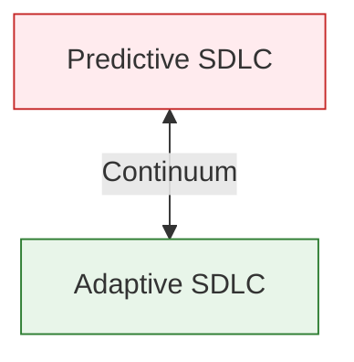

### 6.1.3 Traditional Predictive SDLC Phases
In predictive approaches, activities are organized into sequential groups called **phases**:
1.  **Project Initiation:** Identifies the business problem/opportunity and secures approval to develop a new system.
2.  **Project Planning:** Involves planning, organizing, and scheduling the project to map out its overall structure.
3.  **Analysis:** Focuses on discovering and understanding the details of the business problem or need.
4.  **Design:** Focuses on configuring and structuring the new system components (program structure, databases, and algorithms).
5.  **Implementation:** Includes programming and testing the system.
6.  **Deployment:** Involves installing and putting the system into operation.

### 6.1.4 The Waterfall Model
The waterfall model is a step-by-step, sequential predictive SDLC method where work moves forward phase by phase.

> [!warning] Key Characteristics
> 1. **Sequential Process:** The team moves from one phase to the next in order.
> 2. **Big Deliverables:** Each phase usually produces detailed documents and outputs.
> 3. **Approval Needed:** The work from each phase is reviewed and approved before moving on.
> 4. **One-Way Flow:** Once a phase ends, the next phase begins (like water flowing downward).
> 5. **Hard to Go Back:** Going backward is difficult, costly, and time-consuming.

#### Advantages
*   Requirements are identified long before programming begins.
*   Requirement changes are limited as the project progresses.

#### Disadvantages
*   The design must be completely specified before programming begins.
*   Significant time elapses between project proposal (analysis) and delivery, which may treat testing as an afterthought.
*   Deliverables are often a poor communication mechanism, leading to overlooked requirements.
*   Missed requirements lead to expensive post-implementation programming.
*   Users may forget the original purpose of the system because of the elapsed time.

### 6.1.5 Variants of Waterfall Development

#### Parallel Development
*   Evolved to address the lengthy timeframe of waterfall development by executing design and implementation of different subprojects in parallel.
*   Reduces the time required to deliver a system, making it less likely that changes in the business environment will cause rework.
*   *Disadvantages:* Still suffers from voluminous deliverables. If subprojects are not completely independent, design decisions in one can negatively affect another, making integration challenging.

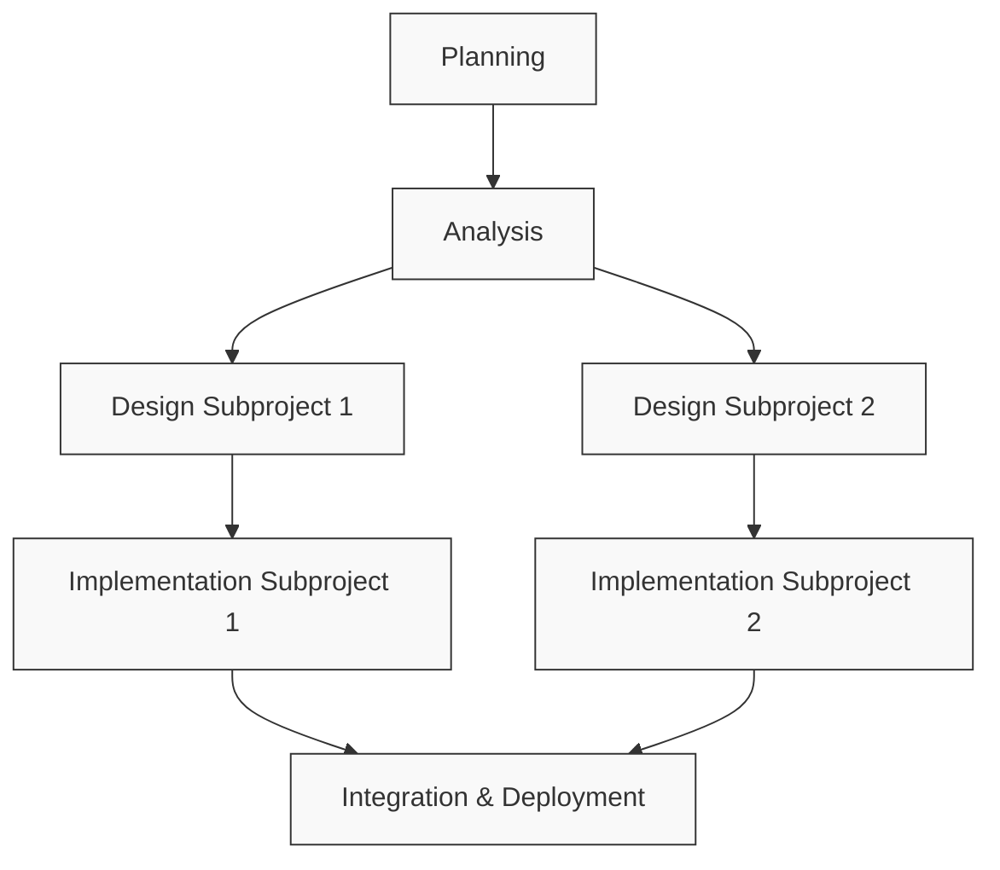

#### The V-Model
*   A variation of waterfall development that pays more explicit attention to testing.
*   The development process proceeds down the left-hand slope of the V (requirements and design) and matches them with corresponding testing phases up the right-hand slope (unit, integration, system, and acceptance testing).
*   *Advantages:* Emphasis on early development of test plans improves overall quality.
*   *Disadvantages:* Suffers from the same rigidity as waterfall and is not suited for dynamic environments.

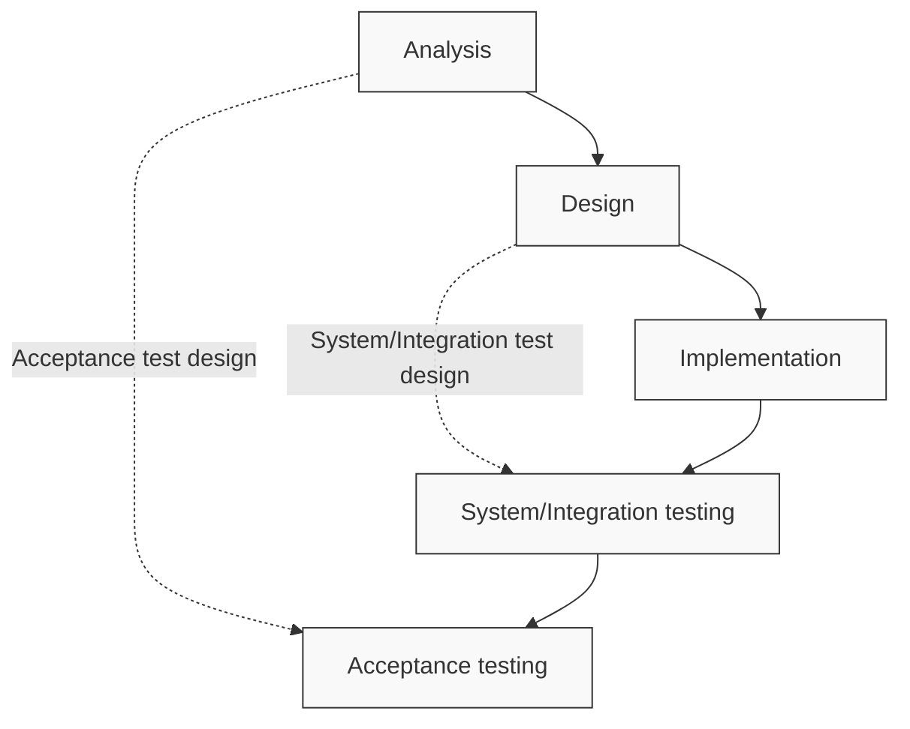

### 6.1.6 Newer Adaptive Approaches to the SDLC
*   **Iterative Development:** Project activities (including plans and models) are adjusted as the project progresses. Rather than sequential phases, iterations create a series of mini-projects. One small part is analyzed, designed, built, and tested during a single iteration, and the next iteration builds on the results.
*   **Incremental Development:** The system is built in small increments and "grown" in an organic fashion. This gets working software into users' hands sooner so the business can begin accruing benefits early.
*   **Walking Skeleton:** Provides a complete front-to-back implementation of the new system but with only the "bare bones" of functionality developed in a few early iterations. Later iterations then flesh out the skeleton with more functions.

---

## 6.2 Methodologies, Models, Tools, and Techniques

> [!info] Core Definitions
> *   **Methodology:** A collection of techniques used to complete activities and tasks within each phase or iteration of the SDLC.
> *   **Model:** A representation of an important part of the real world, used to record or communicate information (e.g. use case diagrams, entity-relationship diagrams, Gantt charts).
> *   **Tool:** Software support that helps create models or other components required in the project (e.g. IDEs, visual modeling tools, project management applications).
> *   **Technique:** A collection of guidelines that helps an analyst complete an activity or task (e.g. data-modeling techniques, user-interviewing techniques).

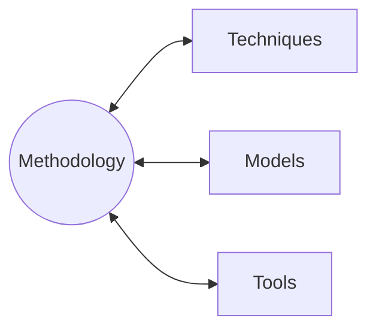

---

## 6.3 The Unified Process (UP), Extreme Programming (XP), and Scrum

### 6.3.1 The Unified Process (UP)
The Unified Process (UP) is an object-oriented system development methodology based on an iterative approach to development. 

#### Four UP Phases
1.  **Inception:** Develop an approximate vision of the system, make the business case, define the scope, and produce rough estimates. Usually completed in one iteration.
2.  **Elaboration:** Do necessary research and fact-finding to identify all requirements, finalize the scope, design and implement the core architecture, and produce realistic estimates. Spans several iterations.
3.  **Construction:** Iteratively implement the remaining lower-risk, predictable elements and prepare for deployment.
4.  **Transition:** Complete beta testing and deployment so users have a working system.

#### Six Main UP Development Disciplines
For each iteration, the project team performs activities across six core disciplines in varying amounts:
1.  **Business Modeling:** Understand the business environment.
2.  **Requirements:** Define the requirements the system portion must satisfy.
3.  **Design:** Design a solution that satisfies the requirements.
4.  **Implementation:** Write and integrate the code.
5.  **Testing:** Thoroughly test the completed portion.
6.  **Deployment:** Put the completed and tested part into operation.

### 6.3.2 Extreme Programming (XP)
Extreme Programming (XP) is an adaptive, Agile development methodology that takes proven industry best practices and focuses on them intensely in their most intense forms.

#### Four Core Values of XP
1.  **Communication:** Emphasizes clear and frequent communication among team members, users, and clients.
2.  **Simplicity:** Encourages developers to build the system in the simplest way that works.
3.  **Feedback:** Values continuous feedback throughout development from users, clients, and developers.
4.  **Courage:** Requires developers to have the courage to make better decisions, even when it is difficult.

#### 6.3.2.1 XP Practices
*   **Planning:** Make a simple plan based on user stories and improve it as the project progresses.
*   **Testing:** Test the software early and often (using **Test-First Development** where test code is written before system code).
*   **Pair Programming:** Two programmers work together on the same code to improve quality.
*   **Simple Design:** Create the system in the simplest way to solve the problem.
*   **Refactoring:** Improve and clean up code without changing its functionality.
*   **Collective Code Ownership:** All team members share responsibility for the code and can modify any part.
*   **Continuous Integration:** Combine and test small pieces of code regularly.
*   **On-Site Customer:** Keep the customer involved for quick feedback.
*   **System Metaphor:** Use a simple shared idea or comparison to explain how the system works.
*   **Small Releases:** Deliver software in small, incremental versions.
*   **Forty-Hour Week:** Maintain a healthy workload to prevent stress.
*   **Coding Standards:** Follow common coding rules for readability and maintainability.

#### XP Project Activities Rings
*   **Outer Ring (System):** Create user stories and define acceptance tests.
*   **Middle Ring (Release):** Conduct tests and perform overall planning.
*   **Inner Ring (Iteration):** Execute iterations of coding and testing.

### 6.3.3 Scrum
Scrum is an iterative, team-focused Agile philosophy responsive to highly changing, dynamic environments.

#### Core Roles in Scrum
*   **Product Owner:** Controls the requirements and approves what goes into the product backlog.
*   **Scrum Master:** Facilitates the process and removes obstacles.
*   **Scrum Team:** Small, self-organizing team that develops the software.

#### Scrum Practices
*   **Product Backlog:** A continually prioritized list of all the things the system should include (user functions/use cases, features/security, and technology/platforms).
*   **Sprint:** A short, fixed work period (time box, usually 30 days) with a frozen scope.
    *   *Sprint Planning:* The team selects tasks from the product backlog and sets a main goal.
    *   *Daily Scrum:* A short (15-minute) daily meeting where each member answers:
        1. What did I do yesterday?
        2. What will I do today?
        3. What problem is blocking me?
    *   *End of Sprint:* The team delivers the agreed increment, holds a review meeting to check progress, and discusses improvements for the next sprint.

---

## 6.4 Agile Development and Agile Modeling

### 6.4.1 Core Agile Values
Agile development is based on four core values:
1.  **Responding to change** over following a plan.
2.  **Individuals and interactions** over processes and tools.
3.  **Working software** over comprehensive documentation.
4.  **Customer collaboration** over contract negotiation.

> [!note] Chaordic
> A term used to describe Agile projects, meaning a creative balance of **chaos** (unpredictable change, unknowns) and **order** (structure, direction, alignment).

### 6.4.2 Agile Modeling (AM)
Agile modeling is about doing the right kind of modeling at the right level of detail for the right purposes. 

#### 6.4.2.1 Practical Principles of Agile Modeling
1.  **Develop Software as the Main Goal:** A model is not the final product; if it doesn't help build software, rethink it.
2.  **Support the Next Step:** Models should help the team move to the next stage (e.g. from requirements to design).
3.  **Keep Modeling Small and Simple:** Create only the models you really need.
4.  **Accept Change Gradually:** Be ready to adjust models as requirements evolve.
5.  **Model with a Purpose:** Every model should have a clear reason.
6.  **Use More Than One Model When Needed:** One model cannot show everything.
7.  **Build Good Models and Get Fast Feedback:** Sloppy models create mistakes; early feedback from users is essential.
8.  **Focus on Meaning, Not Beauty:** Whiteboard sketches are often enough; do not waste time making diagrams pretty.
9.  **Learn Together Through Open Communication:** Share ideas openly and avoid being defensive.
10. **Know Your Models:** Understand what each model is for and how to use it correctly.
11. **Adapt to the Project:** Choose the modeling style (simple or detailed) that fits the project.
12. **Focus on Stakeholder Value:** The system must deliver the best value to the stakeholders.

---

# Chapter 7: Project Planning and Project Management

## 7.1 Principles of Project Management

### 7.1.1 The Need for Project Management
Project management is organizing and directing other people to achieve a planned result within a predetermined schedule and budget.

#### Categories of Project Success
*   **Successful Projects:** Completed on time, within budget, and on scope.
*   **Challenged Projects:** Failed in one area (e.g. late, over budget, or missing features).
*   **Failed Projects:** Cancelled before completion or not used.

> [!important] Project Success by Development Paradigm
> Statistics show that iterative, agile, and lean paradigms yield significantly higher success rates than traditional paradigms:
> *   **Lean:** 72% Successful | 21% Challenged | 7% Failed
> *   **Iterative:** 65% Successful | 28% Challenged | 7% Failed
> *   **Agile:** 64% Successful | 30% Challenged | 6% Failed
> *   **Ad hoc:** 50% Successful | 35% Challenged | 15% Failed
> *   **Traditional:** 49% Successful | 32% Challenged | 18% Failed

#### Common Reasons for Project Failure
*   Undefined project management practices.
*   Poor IT management and poor IT procedures.
*   Inadequate executive support.
*   Inexperienced project managers.
*   Unclear business needs and project objectives.
*   Inadequate user involvement.

### 7.1.2 Project Manager Responsibilities

#### Internal Responsibilities
*   Developing the project schedule.
*   Recruiting and training team members.
*   Assigning work to teams and team members.
*   Assessing project risks.
*   Monitoring and controlling project deliverables and milestones.

#### External Responsibilities
*   Reporting the project’s status and progress.
*   Working directly with the client (project sponsor) and other stakeholders.
*   Identifying resource needs and obtaining resources.

#### Key Project Stakeholders
*   **Client:** The person or group that funds the project.
*   **Oversight Committee:** Clients and key managers who review progress and direct the project.
*   **Users:** The people who will use the new system.

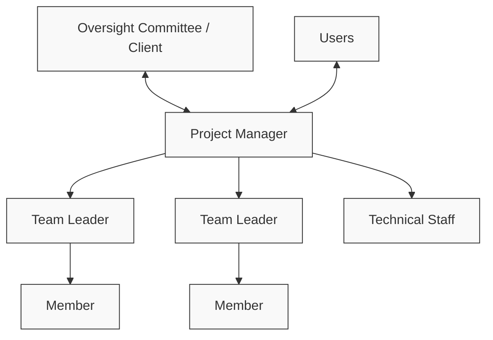

### 7.1.3 Project Management and Ceremony
Ceremony is the level of formality of a project—the rigor of holding meetings and producing documentation:
*   **High Ceremony:** Meetings are held on a predefined schedule with specific participants, agendas, minutes, and follow-through. Specifications and models are formally documented with abundant diagrams and verified through formal review meetings.
*   **Low Ceremony:** Meetings occur informally (e.g. hallway or water cooler). Written documentation and formal specifications are kept to a minimum; developers and users work closely together on a daily basis.

### 7.1.4 Project Management Body of Knowledge (PMBOK)
PMBOK defines **10 key knowledge areas** that project teams need to manage:
1.  **Project Integration Management:** Combines all parts of the project so everything works together smoothly.
2.  **Project Scope Management:** Defines what work should be done and what is not included.
3.  **Project Time Management:** Creates the schedule and makes sure tasks are finished on time.
4.  **Project Cost Management:** Estimates the budget and controls project spending.
5.  **Project Quality Management:** Ensures the project work and results meet the required standards.
6.  **Project Human Resource Management:** Builds, manages, and motivates the project team.
7.  **Project Communications Management:** Makes sure the right information reaches the right people at the right time.
8.  **Project Risk Management:** Identifies possible problems and prepares ways to reduce them.
9.  **Project Procurement Management:** Handles buying products or services from outside suppliers.
10. **Project Stakeholder Management:** Identifies people affected by the project and keeps them involved and informed.

### 7.1.5 Agile Project Management
Agile project management balances flexibility with control of schedule, budget, and deliverables:
*   **Agile Scope:** Scope is not well understood initially but is controlled by ranking work by value/urgency, delivering in iterations, and adapting to change.
*   **Agile Time:** Schedules must be flexible to accommodate changes.
*   **Agile Cost:** Costs are more difficult to estimate upfront.
*   **Agile Risk:** Higher-risk aspects of the project are completed first.
*   **Agile Quality:** Quality is assessed and verified after each iteration.

---

## 7.2 Identify the Problem and Obtain Approval

### 7.2.1 Identifying and Defining the Problem
Defining the problem and objectives is the foundation of determining what the system must accomplish.

#### Signs of System Problems
*   **Performance output criteria:** Too many errors, work completed slowly, work done incorrectly, work done incompletely, work not done at all.
*   **Employee behavior:** High absenteeism, high job dissatisfaction, high job turnover.
*   **External feedback:** Complaints from vendors/customers/suppliers, suggestions for improvement, loss of sales, lower sales.

#### Problem Definition Components
1.  **Problem Statement:** A short summary of the business problem (usually 1-2 paragraphs).
2.  **Issues:** The current problems or major pieces of the situation (what is going wrong now).
3.  **Objectives:** The desired results or goals that address each issue (what we want to achieve). Objectives must match issues point-by-point.

### 7.2.2 The System Vision Document
The System Vision Document is a key deliverable used to clearly define the problem and obtain project approval. It contains three main components:
1.  **Problem Description:** Studies where the project idea came from (e.g. strategic plan, user problem) and explains the business need.
2.  **System Capabilities:** High-level list of what the new system should be able to do, helping determine system size, complexity, and project scope.
3.  **Business Benefits:** The value the organization expects to gain, focusing on financial benefits (e.g. reducing costs, increasing revenue).

> [!example] Example: RMO's CSMS (Consolidated Sales and Marketing System)
> *   **Problem Description:** Web-based sales and marketing CSS is outdated. Customers require catalog and sales systems with one-click ordering, deferred-purchase tracking, and social media integration. RMO must launch CSMS to respond to mobile computing and CSS limitations.
> *   **System Capabilities:** Provide a shopping cart, automate customer sales, recommend related products, allow customer ratings, include a "friend" network, support split-order shipping, handle back-ordering, integrate with social media, and support mobile devices.
> *   **Business Benefits:** Increase sales by connecting with customers, increase size and frequency of customer purchases, attract new customers, build loyalty, increase speed of product availability, and eliminate shipping delays.

### 7.2.3 Determining Feasibility and Risk
Project risk and feasibility analysis verifies whether a project can be started and completed successfully. 

#### The Three Key Elements of Feasibility
1.  **Technical Feasibility:** Checks whether the system can be built with current technology.
    *   *Questions:* Do we have the hardware, software, and tools? Do we have skilled staff, or must we hire/outsource? Does existing software fit the need, or must it be customized?
2.  **Economic Feasibility:** Checks whether the project is worth the cost by comparing short-term costs with long-term benefits.
    *   *Tangible Benefits:* Faster processing, quicker access to information, less employee time.
    *   *Intangible Benefits:* Better decision-making, higher accuracy, improved customer service, better business image.
    *   *Tangible Costs:* Equipment, software, systems analyst and programmer time.
    *   *Intangible Costs:* Losing competitive edge, declining company image, customer dissatisfaction.
    *   *Financial Analysis Models:* **Break-Even Analysis** (where proposed and current system costs intersect), **Cash-Flow Analysis** (direction, size, and pattern of cash flow over time), and **Present Value Analysis** (calculating Net Present Value to assess the time value of money).
3.  **Operational Feasibility:** Checks whether the system will work well and be accepted in the organization.
    *   *Organizational/Cultural Risks:* Substantial computer phobia, perceived loss of control by staff/management, shifting of political power, fear of changes in job responsibilities, fear of job loss due to automation, reversal of long-standing work procedures.
    *   *Solutions:* Early risk identification, active user support, and additional training sessions.

---

## 7.3 Plan and Monitor the Project

### 7.3.1 Establish the Project Environment
Tailoring and operationalizing the methodology involves:
1.  **Record & Communicate:** Recording project parameters and clarifying "who, what, when, and how."
2.  **Build the Work Environment:** Setting up workstations, software development tools (IDEs), servers, repositories, office/meeting space, and support staff.
3.  **Define Process & Procedures:** Setting up rules for reporting, programming style (single vs. pair), testing, deliverables, and version control.

```
Sample Dashboard: Conference Registration System
-----------------------------------------------------------------------------
| Project Overview           | Issues & Risks      | Tasks                 |
|----------------------------|---------------------|-----------------------|
| Planned finish: Dec 2015   | Urgent issues: 3    | Tasks this iter: 45   |
| Planned cost: $1,680,000   | Open issues: 22     | Tasks this week: 15   |
| Time expended: 18%         | Assigned: 15        | Open: 35              |
| Deliverables completed: 4/35| Unassigned: 7      | Unassigned: 22        |
| Current iteration: 4/15    | Closed issues: 137  | Assigned: 13          |
| Active tasks: 5            | Identified risks: 4 | Slipped - urgent: 3   |
|                            |                     | Slipped - routine: 7  |
|                            |                     | Completed tasks: 10   |
-----------------------------------------------------------------------------
```

### 7.3.2 Schedule the Work
Project schedules are managed at two levels:
*   **Project Iteration Schedule:** A high-level list of iterations and the use cases or user stories assigned to each iteration. The length of each iteration is constant (usually 4 weeks).
*   **Detailed Work Schedule:** A schedule within a single iteration that lists, organizes, and describes the dependencies of the detailed work tasks.

#### Three-Step Process for Developing a Detailed Work Schedule
1.  **Develop a Work Breakdown Structure (WBS):** A list or hierarchy of activities and tasks used to estimate the work. In software projects, tasks should take between **one to five working days** to complete.
2.  **Estimate Effort and Identify Dependencies:**
    *   Identify task times and dependencies (tasks that must be completed before another begins).
    *   Identify the **critical path**—the sequence of tasks that cannot be delayed without delaying the entire project.
    *   *Dependency Types:* Finish-to-Start (F-S), Start-to-Start (S-S), Finish-to-Finish (F-F), Start-to-Finish (S-F).
3.  **Create a Schedule using a Gantt Chart:** A bar chart that portrays the schedule by the length of horizontal bars superimposed on a calendar, graphically showing dates, predecessors, tasks, and the critical path.

```
WBS Tree Diagram Example (Construction of a House):
Level 1: Construction of a House
   ├── Level 2: 1. Internal
   │      ├── Level 3: 1.1 Electricity
   │      │      └── Level 4: 1.1.1 Rough-in Electrical
   │      │      └── Level 4: 1.1.2 Install and Terminate
   │      │      └── Level 4: 1.1.3 HVAC Equipment
   │      └── Level 3: 1.2 Plumbing
   ├── Level 2: 2. Foundation
   │      ├── Level 3: 2.1 Excavation
   │      └── Level 3: 2.2 Steel Erection
   │             └── Level 4: 2.2.1 Columns
   │             └── Level 4: 2.2.2 Beams
   │             └── Level 4: 2.2.3 Joists
   └── Level 2: 3. External
          ├── Level 3: 3.1 Masonry Work
          └── Level 3: 3.2 Building Finishes
```

### 7.3.3 Staff and Allocate Resources
Staffing involves five key tasks:
1.  Developing a resource plan.
2.  Identifying and requesting specific technical staff.
3.  Identifying and requesting specific user staff.
4.  Organizing the project team into work groups.
5.  Conducting preliminary training and team-building exercises.

### 7.3.4 Evaluate Work Processes (Retrospective)
At the end of iterations, the team evaluates the work processes:
*   Are our communication procedures adequate? How can they be improved?
*   Are our working relationships with the user effective?
*   Did we hit our deadlines? Why or why not?
*   Did we miss any major issues? How can we avoid this in the future?
*   What things went especially well? How can we ensure it continues?
*   What were the bottlenecks or problem areas? How can we eliminate them?

### 7.3.5 Monitor Progress and Make Corrections
The project manager monitors project execution and takes corrective actions using a structured loop:

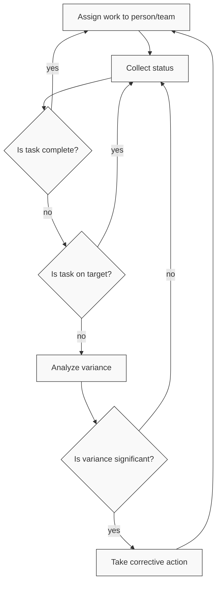

*   **Issues-Tracking Log:** Used to keep tabs on open, assigned, in-progress, late, or complete tasks, detailing issue IDs, dates, descriptions, priority, impact, owners, target dates, and resolution status.

---

# Chapter 8: Essentials of Design and Design Activities

## 8.1 Introduction
> [!info] Objective
> By the end of this topic, you should be able to:
> 1. Describe the difference between systems analysis and systems design.
> 2. Explain each major design activity.
> 3. Describe the major hardware and network environment options.
> 4. Describe the various hosting services available.

## 8.2 Part I: Systems Analysis vs. Systems Design

Systems design bridges the gap between requirements and actual software construction. It connects the conceptual understanding of a problem with a functional reality.

> [!info] Definition: Systems Analysis
> Analysis defines **what** the system needs to do. It focuses on gathering requirements and understanding the business domain. It remains largely technology-independent.

> [!info] Definition: Systems Design
> Design defines **how** the system will be configured and constructed. It focuses on configuring the technology, organizing components, and blueprinting the construction. It is deeply tied to specific hardware, networks, and code.

### 8.2.1 Two Levels of Design
System design operates at two distinct depths:
1. **Architectural Design (or General/Conceptual Design):** The broad design of the overall system structure, physical networks, and major software subsystems.
2. **Detailed Design:** Low-level configuration detailing specific program logic, concrete database schemas, and distinct user interfaces. It serves as the definitive technical guide for the construction phase.

---

## 8.3 Part II: The Six Core Pillars of System Design (Design Activities)

When moving from analysis to design, analysts perform six major design activities, each representing a core pillar of system design:

### 8.3.1 Design the Environment (Technology Architecture)
- Represents the hardware and network linking all components.
- The environment encompasses all the physical and logical technology (servers, desktop computers, mobile devices, operating systems like Windows/Linux/iOS, communication protocols, LANs, routing) required to support the software application.
- Dictates exactly how software must be written and deployed.

### 8.3.2 Design the Application Architecture and Software
- Involves defining the programs running the core logic.
- Includes partitioning the system into subsystems and defining the software architecture (e.g., three-layer or model-view-controller).
- Includes the detailed design of each use case (designing class diagrams, sequence diagrams, and state machine diagrams).

> [!info] Three-Layer Architecture
> A common software architecture pattern that partitions logic into:
> 1. **View Layer:** Contains the user interface and handles human interaction. It accepts user input, formats, and displays processing results.
> 2. **Business Logic / Domain Layer:** Implements the core business rules, processes, and calculations.
> 3. **Data Layer:** Interacts directly with backend storage to save and retrieve information.

### 8.3.3 Design the User Interfaces
- Dialog design begins with requirements models (use case flow of activities, system sequence diagrams).
- Design adds screen layout, look and feel, navigation, and user experience (UX).
- Modern systems require interface designs optimized for a diversity of client devices, including smartphones, tablets, iPads, and notebooks, handling varying screen sizes, resolutions, and touch vs. click inputs.

### 8.3.4 Design the System Interfaces
- Modern information systems are rarely isolated; they must interact with many other systems, both internal and external.
- System interfaces connect platforms in different ways: saving data another system uses, reading data another system saved, or handling real-time requests for information and software services.
- Data is packaged in highly structured, machine-readable formats like XML and JSON/REST APIs to ensure seamless integration.

### 8.3.5 Design the Database
- Begins with the domain model class diagram (or ERD).
- Designers choose the database structure (usually a relational database, though ODBMS frameworks are possible), design the database schema (tables, columns, and data types), and design referential integrity constraints (foreign key references).
- Translates a conceptual domain model into a concrete schema (e.g., table definitions in MySQL via phpMyAdmin).

### 8.3.6 Design the Security and Controls
- Protects the organization's assets and data. It is crucial for internet and wireless applications.
- **Network Controls:** Protecting against global intrusion via the open internet using firewalls and HTTPS/TLS (encrypted tunnels).
- **User Interface Controls:** Ensuring only authorized users can log in and access specific application screens.
- **Application Controls:** Ensuring core business logic cannot be exploited, bypassed, or manipulated.
- **Database Controls:** Encrypting raw data at rest and strictly restricting direct server access.

---

## 8.4 Part III: Designing the Environment

### 8.4.1 Internal Deployment (LAN-Based)
Internal deployment features a client-server architecture securely confined to a single physical location or private network.
- **Pros:** High security, tightly controlled environment, highly predictable performance.
- **Key Terminology:**
  - **Local Area Network (LAN):** A computer network in which the cabling and hardware are confined to a single location.
  - **Client-Server Architecture:** A computer network configuration with users' computers and central computers that provide common services.
  - **Client Computers:** The computers at which the users work to perform their computational tasks.
  - **Server Computer:** The central computer that provides services (such as database access) to the client computers over a network.
- Two kinds of systems can be deployed in a client-server architecture:
  1. **Desktop application systems**
  2. **Browser-based application systems**

> [!info] Software Distribution in Internal Deployment (Three-Layer)
> - **View Layer:** Handles screen/report formatting on client or application server.
> - **Domain Layer:** Implements business rules on the application server.
> - **Data Layer:** Formulates database queries on the database server.

### 8.4.2 External Deployment (Internet-Based)
External deployment involves distributed access over the web backbone routing through a protective firewall.
- **Pros:** Massive accessibility for remote staff and customers, low-cost communication.
- **Risks:** High security vulnerabilities, unpredictable throughput peaks, rapidly changing standards.
- **Communication Security:** Improved via **HTTPS** (encrypted transfer combining HTTP and TLS) and **TLS** (Transport Layer Security, an advanced version of SSL).

#### Hosting Alternatives for Internet Deployment
Hosting refers to running and maintaining a computer system on someone's behalf where the application software and database reside.

1. **Colocation:** A hosting service with a secure location, but the physical computers are usually owned by the client business. The client manages the OS, software, and configuration. Scalability is achieved by buying and installing additional hardware. Client provides maintenance and backups.
2. **Managed Services:** The client owns the software but purchases additional services, such as installing and managing the operating system, internet servers, database servers, and load balancing software. The host handles updates, monitoring, and ongoing maintenance.
3. **Virtual Servers:** The client company leases a virtual server configured with a specific amount of CPU capacity, internal memory, hard drive storage, and bandwidth. The host maintains the physical servers and virtualization platform.
4. **Cloud Computing:** An extension of virtual servers where computing resources appear to have unlimited availability and can be purchased like a utility. The client manages the application and data, while the host manages the underlying infrastructure. It provides maximum flexibility, allowing clients to add small increments of computing power on-demand.
5. **Service Level Agreement (SLA):** Part of the contract between a business and a hosting company that guarantees a specific level of system availability.

---

## 8.5 Part IV: Designing the Architecture

### 8.5.1 The Tier Escalation Model: Distributing Logic
- **Two-Tier Architecture:** Splits logic between a client (presentation + application) and a server (data access + storage). Creates "thick" or "thin" clients.
- **Three-Tier Architecture:** Separates business rules from data management by placing client presentation on one tier, application server business logic on a second tier, and database server data management on a third tier.
- **N-Tier Architecture:** Highly scalable standard for e-commerce (e.g., Client <-> Web Server <-> Application Server <-> Database Server). It generates more network traffic but scales well.

### 8.5.2 Mobile Development Approaches
Mobile apps can be built using one of three primary approaches, balancing device-centric versus web-centric priorities:
1. **Native Applications:** Rich user experience with full access to device hardware (camera, GPS). Built using device-specific languages (e.g., Objective-C/Swift for iOS, Java/Kotlin for Android). High cost and effort, requiring rebuilding per OS update.
2. **Cross-Platform Frameworks:** Write once, adapt many. Built using HTML/JavaScript wrapped in a framework. Good experience, but requires device-specific tweaking. Medium cost and effort. Best for informational apps.
3. **Mobile Web Apps:** Built with HTML5. Low cost and effort, running in any mobile browser, but provides a generic UI and cannot access local device hardware. Requires a constant internet connection.

### 8.5.3 Remote and Distributed Access
- Can use two interfaces to the same Web app for internal versus external access (though external is not as secure).
- **Virtual Private Network (VPN):** A closed network with security and closed access built on top of a public network (the internet) using an encrypted tunnel. Allows remote devices to interact with the system as if they were physically plugged into the internal LAN.

### 8.5.4 Refining Architectural Choices
Nonfunctional requirements act as the "building codes" that guide design decisions:
- **Operational:** The technical environments in which the system must perform and evolve.
- **Performance:** Response time, throughput, capacity, and system reliability.
- **Security:** Protection from data loss, disruption, and unauthorized access.
- **Cultural & Political:** Global norms, language needs, and legal mandates.

---

## 8.6 Part V: Hardware and Software Specification Process

The specification process consists of:
1. **Define Software:** Detail operating systems, applications (e.g., Oracle), and hidden costs like training and licensing.
2. **Inventory Hardware:** List all servers, peripherals, and required quantities.
3. **Set Requirements:** Establish minimum processing and storage needs for each component.

### 8.6.1 The 7 Selection Factors for Hardware & Software
1. **Functions and Features:** Does it actually do what the system requires (e.g., monitor size)?
2. **Performance:** Is it fast enough to handle the expected workload (e.g., processor speed)?
3. **Legacy Integration:** How well does it "talk" to existing systems?
4. **Migration Strategy (Hardware & OS Strategy):** How difficult is it to move data/plans into this new system?
5. **Total Cost of Ownership (TCO):** Includes purchase price, plus long-term maintenance and support.
6. **Political Factors (Political Preferences):** Are there organizational preferences or "standard" vendors we must use (resistance to change)?
7. **Vendor Reputation (Vendor Performance):** Is the company stable? Do they provide good technical support (reputation/prospects)?

### 8.6.2 Sample Hardware & Software Specification

| Component | Hardware Specification | Software Specification | OS / Middleware |
| :--- | :--- | :--- | :--- |
| **Standard Client** | Intel Core i7, 16GB RAM, 512GB SSD, 27-inch 4K Monitor | Productivity Suite (e.g., MS Office), Secure Web Browser, Collaboration Tools | Windows 10 Enterprise |
| **Web Server** | Dual Xeon Processors, 64GB ECC RAM, 2x 1TB SSD RAID 1, High-Speed NIC | Web Server Software (e.g., Apache/Nginx), SSL Certificate Management, Load Balancer | Linux (e.g., Red Hat/Ubuntu) |
| **Application Server** | Quad Xeon Processors, 256GB ECC RAM, 4x 2TB SSD RAID 10, High-Performance NIC | Application Server (e.g., JBoss/Tomcat), Java Runtime Environment, Messaging Queue | Linux (e.g., Red Hat/Ubuntu) |
| **Database Server** | Octal Xeon Processors, 512GB ECC RAM, 8x 4TB SSD RAID 5, High-Throughput NIC | RDBMS (e.g., Oracle/PostgreSQL/MySQL), Backup & Recovery Tools | Linux (e.g., Red Hat/Ubuntu) |

---

# Chapter 9: Designing the User and System Interfaces

## 9.1 Introduction
> [!info] Objective
> By the end of this topic, you should be able to:
> 1. Describe the difference between user interfaces and system interfaces.
> 2. Describe the historical development of the field of human-computer interaction (HCI).
> 3. Discuss how visibility and affordance affect usability.
> 4. Describe user-interface guidelines that apply to all types of user-interface types and additional guidelines specific to Web pages and mobile applications.
> 5. Create storyboards to show the sequence of forms used in a dialog.
> 6. Discuss examples of system interfaces found in information systems.
> 7. Define system inputs and outputs based on the requirements of the application program.
> 8. Design printed and on-screen reports appropriate for recipients.

## 9.2 Part I: User Interfaces vs. System Interfaces

Information systems do not operate in isolation; they interact with both human users and other computerized systems. Designing the interaction boundary requires distinguishing between these two types of interfaces, as they involve different design paradigms, primary risks, and formats.

> [!important] The Core Goal of Interface Design
> Interface design acts as the "bridge" between human intent and machine execution. 
> - **Inputs and Outputs:** Both user and system interfaces involve managing inputs (capturing data) and outputs (presenting or sending data).
> - **Usability vs. Efficiency:** A poorly designed user interface can make the entire system unusable for humans. Conversely, a poorly designed system interface is a major source of system errors, data corruption, and operational inefficiency.
> - **Stakeholder Involvement:** Interface design is highly collaborative and must involve a large number of stakeholders (users, business analysts, system designers, developers, database administrators, and external integration partners).

### 9.2.1 User Interfaces
> [!info] Definition: User Interface (UI)
> Inputs and outputs that directly involve a human user or actor. It focuses on the interactive dialog going back and forth between a person and the computer.

* **Primary Actor:** Human user (e.g., customer, clerk, administrator).
* **Interaction Style:** Interactive dialog going back and forth between the actor and the system.
* **Primary Risk:** Cognitive overload, user fatigue, usability friction, and manual data-entry errors.
* **Formats:** Web forms, mobile apps, desktop forms, interactive dashboards, voice commands, and search bars.

### 9.2.2 System Interfaces
> [!info] Definition: System Interface
> Inputs and outputs that require minimal or no human intervention. They connect one computerized system, database, or hardware device directly to another.

* **Primary Actor:** Other systems, databases, or automated devices (no direct human operator in the real-time flow).
* **Interaction Style:** Automated inputs, network messages, and direct data outputs.
* **Primary Risk:** Data format mismatches (schema differences), network transmission latency, protocol incompatibility, integration breakdowns, and processing inefficiency.
* **Formats:** XML/JSON text streams, REST/SOAP APIs, database replication links, and hardware sensor feeds (e.g., RFID, bar code scanners).

### 9.2.3 Designing for Humans vs. Machines: Comparison Table

| Dimension | User Interfaces (Designing for Humans) | System Interfaces (Designing for Machines) |
| --- | --- | --- |
| **Primary Actor** | Human user | Other systems / minimal human intervention |
| **Interaction Style** | Dialog going back and forth | Automated inputs, network messages, direct outputs |
| **Primary Risk** | Cognitive overload & usability errors | Data mismatch & integration inefficiency |
| **Format Example** | Web forms, applications, dashboards | XML/JSON streams, APIs, automated scanners |
| **Feedback Mechanism** | UI status messages, progress bars, confirmations | Response status codes (e.g., HTTP 200/400/500), API logs |
| **Design Priority** | Cognitive ease, affordance, error prevention | Data integrity, throughput, protocol compatibility |

---

## 9.3 Part II: Human-Computer Interaction (HCI), User-Centered Design, and Usability Heuristics

### 9.3.1 Human-Computer Interaction (HCI)
> [!info] Definition: Human-Computer Interaction (HCI)
> A multidisciplinary field of study concerned with the **efficiency** and **effectiveness** of user interaction with computer systems, human-oriented input and output technology, and the psychological and cognitive aspects of user interfaces.

### 9.3.2 User-Centered Design (UCD)
UCD is an engineering and design philosophy embodying the core axiom: **"To the user, the interface IS the system."** Modern systems analysis and design fully integrates UCD principles to ensure that system workflows adapt to human habits, rather than forcing humans to adapt to rigid system requirements.

> [!note] Historical Context of UCD
> UCD concepts date back to the **1980s**, championed during the pioneering development of the **Apple Macintosh**. Today, UCD is recognized as a fundamental cornerstone of contemporary **Agile & Iterative Analysis and Design (A&D)** methods.

UCD relies on three core iterative principles:
1. **Focus Early on Users:** Directly observe users in their actual work environments, study their daily tasks, and analyze their cognitive workflows rather than just asking for their requirements.
2. **Evaluate Usability:** Conduct structured usability testing and user testing throughout development to ensure cognitive friction and system friction remain low.
3. **Iterate Frequently:** Continuously refine user interface mockups and prototypes based on user feedback, repeating the cycle of design, testing, and feedback.

### 9.3.3 Core Usability Heuristics: Visibility and Affordance
For a user interface to be usable, controls must incorporate the dual concepts of visibility and affordance.

> [!info] Definition: Visibility
> A control or status indicator must be clearly visible and distinguishable to the user against the interface background, ensuring they are instantly aware of its existence and current state.
> - **Visual Examples:**
>   - A progress bar showing `Loading... 50%` so the user knows the system is working and when it will finish.
>   - Media player status indicators, such as a highlighted mute button or a sound wave icon, that clearly show the audio state.
>   - Media player volume sliders showing the current level.

> [!info] Definition: Affordance
> The physical appearance of a control should suggest its functionality and how it is operated (e.g., clicking, sliding, dragging, or typing).
> - **Visual Examples:**
>   - A screen button designed with shading, borders, and depth (a drop shadow) so it looks like a physical button that can be clicked or pushed.
>   - A slider track with a handle (like a volume slider or scroll bar) that visually suggests it can be dragged left/right or up/down.
>   - Text input boxes with clear empty fields and cursor indicators that suggest typing.

---

## 9.4 Part III: User Interface Design Concepts (Metaphors & Guidelines)

### 9.4.1 Translating the Physical World: The Four HCI Metaphors
HCI design translates physical-world objects, structures, and workflows into digital representations using four primary metaphors:

| Metaphor | Description | Example from Lecture |
| --- | --- | --- |
| **Direct Manipulation** | Manipulating objects on a screen display that look like physical objects (pictures/icons) or represent them directly. | Dragging a document file icon with the cursor and dropping it into a Recycle Bin or Trash Can icon to delete it. |
| **Desktop** | Organizing the visual display into distinct regions, featuring a large work area in the center and tool/settings panels around the perimeter, resembling a physical desk surface. | Starting up a computer and seeing a background "desktop" populated with utility icons (e.g., clock, calendar, calculator, notepad, and sticky notes/Post-its). |
| **Document** | Visually representing data entry and display as if they were printed paper pages, forms, or books. | Filling out input fields on a digital invoice or product registration form; reading a user manual package as a PDF file with a clickable table of contents. |
| **Dialog** | User and computer accomplish tasks by engaging in a conversational query-response flow using text, voice, or labeled action buttons. | Clicking a button labeled "Troubleshoot" for a broken printer; the system displays yes/no diagnostic questions, and the user selects answers from a list. |

### 9.4.2 The Seven Core User Interface Design Guidelines
These seven guidelines apply universally to all user interface designs to maximize usability and reduce user frustration.

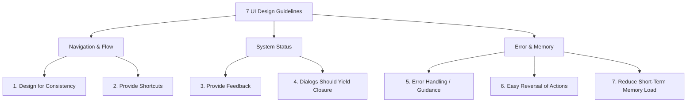

#### 9.4.2.1 Design for Consistency
Maintain predictable layout placement, color schemes, font hierarchies, and control behaviors across all windows, forms, and pages.
* *Example:* Always placing the navigation bar at the top, utility menus on the left, and confirming buttons (like "OK" or "Submit") in the bottom-right corner.

#### 9.4.2.2 Provide Shortcuts
Enable experienced users to bypass standard menu navigation and perform frequent tasks rapidly.
* *Example:* Keyboard shortcuts (e.g., `CTRL + S` or `CMD + S` for Save, `CTRL + P` or `CMD + P` for Print) and mouse shortcuts (e.g., double-clicking a file to open it).

#### 9.4.2.3 Provide Feedback
Provide immediate visual, auditory, or textual confirmation for every action the user takes, so they know the system has received and is processing their request.
* *Example:* Showing a progress bar showing `Loading... 50%` during long operations, or displaying a temporary badge showing "Success! Data Saved" upon form submission.

#### 9.4.2.4 Dialogs Should Yield Closure
Organize sequences of activities with a distinct beginning, middle, and end, letting users know exactly when a multi-step transaction is officially completed.
* *Example:* A checkout process that finishes with a final summary page stating "Thank you for your order! Your confirmation number is #6773823."

#### 9.4.2.5 Error Handling that Provides Guidance
Never display cryptic system codes or blame the user when something goes wrong. Design error messages that explain the issue in plain language and suggest clear steps to correct it.
* *Example:* Instead of showing "Error 0x892", show a dialog box stating "The email address you entered is missing an '@' symbol. Please correct it to proceed."

#### 9.4.2.6 Easy Reversal of Actions
Always provide a way to undo actions, back out of choices, or cancel processes. This reduces user anxiety, encouraging exploration.
* *Example:* Providing an "Undo" button (curved back arrow), a "Cancel" button on wizards, or a confirmation prompt before deleting files.

#### 9.4.2.7 Reduce Short-Term Memory Load
Never force users to remember information from one screen to another (e.g., product IDs, prices, or shipping addresses). Keep all necessary context visible or pre-populated.
* *Example:* Displaying the items and order subtotal on the payment screen rather than expecting the user to remember them from the previous shopping cart page.

---

## 9.5 Part IV: The Transition from Analysis to UI Design

The transition from abstract analysis models to concrete user interfaces is a structured, step-by-step process that bridges use case requirements with physical screens:

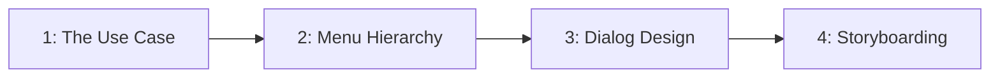

1. **The Use Case:** Identify the natural flow of activities (documented in use case descriptions and System Sequence Diagrams) to see what interactions occur.
2. **Menu Hierarchy:** Group related use cases together to organize access to functionality. Different types of users will require different menus. Establish the overall hierarchy first, then build subsets for specific roles.
3. **Dialog Design:** Draft the natural, text-based conversation flow between the user and the system.
4. **Storyboard:** Create a sequence of screen sketches (wireframes) to visualize the dialog flow and review it with users before writing code.

---

### 9.5.1 Use Cases and Menu Hierarchies

Menus organize access to use case functionality. In systems design, developers first map out how use cases are routed. 

> [!important] Menu Hierarchy Rules
> - **Actor-Based Menus:** Different types of users require different menus (e.g., a customer sees catalog/cart menus, while an administrator sees product and inventory management menus).
> - **Establish Hierarchy First:** Define the overall routing structure, then implement subsets for specific user roles.
> - **Non-Activity Options:** Menus usually include options that are not activities or use cases from the event list (e.g., "Help", "Settings", "About", or "Exit").
> - **Styles:** Once the hierarchy is established, menus can be implemented in a variety of styles: drop-down lists, sidebars, hamburger menus, tabs, or ribbons.

#### RMO Case Study: Grouping Use Cases by Subsystem and Actor
To build a menu hierarchy, systems analysts group the system's use cases by actor and subsystem:

| Subsystem | Use Case | Users/Actors |
| --- | --- | --- |
| **Sales** | Search for item | Customer, Customer Service Rep, Store Sales Rep |
| **Sales** | View product comments and ratings | Customer, Customer Service Rep, Store Sales Rep |
| **Sales** | View accessory combinations | Customer, Customer Service Rep, Store Sales Rep |
| **Sales** | Fill shopping cart | Customer |
| **Sales** | Empty shopping cart | Customer |
| **Sales** | Check out shopping cart | Customer |
| **Sales** | Fill reserve cart | Customer |
| **Sales** | Empty reserve cart | Customer |
| **Sales** | Convert reserve cart | Customer |
| **Sales** | Create phone sale | Customer Service Rep |
| **Sales** | Create store sale | Store Sales Rep |
| **Order Fulfillment** | Ship items | Shipping Clerk |
| **Order Fulfillment** | Manage shippers | Shipping Clerk |
| **Order Fulfillment** | Create backorder | Shipping Clerk |
| **Order Fulfillment** | Create item return | Shipping Clerk, Customer |
| **Order Fulfillment** | Look up order status | Shipping Clerk, Customer, Management |
| **Order Fulfillment** | Track shipment | Shipping Clerk, Customer, Marketing |
| **Order Fulfillment** | Rate and comment on product | Customer |
| **Order Fulfillment** | Provide suggestion | Customer |

#### RMO First-Cut Menu Hierarchy
By grouping the use cases above, the team designs a first-cut menu hierarchy to distribute functionality:

```mermaid
graph TD
    A["RMO Information System"] --> B["Customer Menu"]
    A --> C["Customer Service / Sales Menu"]
    A --> D["Shipping / Order Fulfillment Menu"]
    
    B --> B1["Shopping Cart Functions"]
    B --> B2["Customer Order Control"]
    
    B1 --> B1a["Search for Item"]
    B1 --> B1b["View Comments/Ratings"]
    B1 --> B1c["View Accessories"]
    B1 --> B1d["Switch Carts (Primary/Reserve)"]
    B1 --> B1e["Fill Shopping Cart"]
    B1 --> B1f["Empty Shopping Cart"]
    B1 --> B1g["Checkout"]
    
    B2 --> B2a["Look up Order Status"]
    B2 --> B2b["Track Shipment"]
    B2 --> B2c["Create Item Return"]
    B2 --> B2d["Rate/Comment on Product"]
    B2 --> B2e["Provide Suggestion"]
    
    C --> C1["Search for Item"]
    C --> C2["View Comments/Ratings"]
    C --> C3["View Accessories"]
    C --> C4["Create Sale"]
    
    D --> D1["Ship Items"]
    D --> D2["Manage Shippers"]
    D --> D3["Create Backorder"]
    D --> D4["Create Item Return"]
    D --> D5["Look up Order Status"]
    D --> D6["Track Shipment"]
```

---

### 9.5.2 Dialog Design
A dialog represents a conversational flow between the user and the system. For each menu option, analysts write a natural-language dialog script.
* **Source Material:** Dialogs are based directly on System Sequence Diagrams (SSDs) and the flow of activities in Use Case Descriptions.
* **Objective:** Use natural language to emphasize prompt and response logic, ensuring the system provides clear feedback at each step.

#### Detailed Dialog Transcript: RMO Shopping Cart Checkout
The following is the complete, two-part dialog script designed for RMO's checkout use case:

> [!example] RMO Checkout Dialog (Part 1)
> * **SYSTEM:** What would you like to do?
> * **USER:** I'd like to check out.
> * **SYSTEM:** Okay. What is your e-mail address or account number?
> * **USER:** My e-mail address is nwells22@gmail.com.
> * **SYSTEM:** Fine. You are Nancy Wells at 1122 Silicon Avenue. Correct?
> * **USER:** Yes.
> * **SYSTEM:** All items in your cart are in stock and can be shipped today. Because your order subtotal is over $100, you qualify for free UPS ground shipping (3-5 days). Other shipping options include next day ($35.00), two day ($20.00), and USPS parcel post ($11.70, 5-7 days). How would you like your items to be shipped?
> * **USER:** Free UPS ground shipping.

> [!example] RMO Checkout Dialog (Part 2)
> * **SYSTEM:** We have a shipping address on file for you (1122 Silicon Avenue). Do you want your order shipped to that address?
> * **USER:** No.
> * **SYSTEM:** To what address would you like the order shipped?
> * **USER:** John Wells, 1612 Jefferson Street NE, Albuquerque, NM 87123.
> * **SYSTEM:** Okay, the total charge is $125.56 ($117.90 item subtotal plus $7.66 sales tax). Shall I charge that amount to your credit card on file (a Visa with an account number ending in 0899)?
> * **USER:** Yes.
> * **SYSTEM:** Your payment has been approved, and your order is being prepared for shipment. A confirmation e-mail has been sent to you, and another will be sent with a shipment tracking number when the order is shipped later today. Can I help you with anything else?
> * **USER:** No.

---

### 9.5.3 Storyboarding
Storyboarding translates the dialog script into a sequence of screen sketches (wireframes) to show the user's journey. Analysts review these mockups with users before developers write any code.

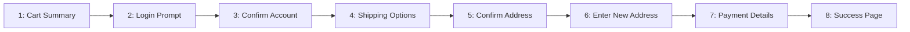

#### Detailed Wireframe Descriptions: RMO Shopping Cart Checkout
The following screen-by-screen flow represents RMO's storyboard mockups:

1. **Screen 1: Cart Summary**
   - *Layout:* Ridgeline Mountain Outfitters top navigation banner with options: `Browse`, `Share`, `Cart` (dropdown), `Orders`, `Account`.
   - *Interaction:* The user hovers over `Cart` and clicks `Check out` from the dropdown list.
2. **Screen 2: Login Prompt**
   - *Layout:* A modal popup box in the center of the screen.
   - *Content:* Text prompt stating "You need to log in. Please enter your e-mail address or account number."
   - *Input:* A single text field containing `nwells22@gmail.com` with a cursor.
3. **Screen 3: Confirm Account**
   - *Layout:* A modal dialog box in the center of the screen.
   - *Content:* Text prompt: "Please confirm account information." Lists details retrieved from database: `Nancy Wells`, `1122 Silicon Avenue`, `Alamagordo, NM 87989`.
   - *Actions:* Buttons for `That's me` (clicked by user) and `That's not me`.
4. **Screen 4: Shipping Method Selection**
   - *Layout:* Order summary table displaying selected items:
     - Qty: 1 | SKU: 10967335 | Description: Toddler parka red | Price: $44.95 | Status: in-stock
     - Qty: 1 | SKU: 94462 | Description: Ladies parka blue | Price: $72.95 | Status: in-stock
   - *Content:* Prompt: "All items will ship today. Please choose ship. method:"
   - *Inputs:* Radio buttons showing shipping options:
     - `(•) Free - UPS ground (3-5 days)` (selected by default)
     - `( ) $35.00 - UPS next day`
     - `( ) $20.00 - UPS two days`
     - `( ) $11.70 - USPS parcel post (5-7 days)`
5. **Screen 5: Confirm Shipping Address**
   - *Layout:* A modal dialog box in the center.
   - *Content:* Prompt: "Please confirm shipping address." Lists default address: `Nancy Wells`, `1122 Silicon Avenue`, `Alamagordo, NM 87989`.
   - *Actions:* Buttons for `OK` and `Use another address` (clicked by user).
6. **Screen 6: Enter New Shipping Address**
   - *Layout:* A form modal containing input fields.
   - *Fields:* Name (`John Wells`), Apt# (empty), Street (`1612 Jefferson Street NE`), City (`Albuquerque`), State (`New Mexico`), Zip Code (`87123`).
   - *Actions:* Buttons for `OK` (clicked by user) and `Cancel`.
7. **Screen 7: Payment Details**
   - *Layout:* Order summary totals:
     - Subtotal: $117.90
     - Shipping: $0.00
     - Sales Tax: $7.66
     - **Total: $125.50** (Wait, note that total charge is $125.56 in slide text, but the wireframe screen total says $125.50. We should list both or note this slight text mismatch as an inconsistency).
   - *Content:* Prompt: "Please confirm payment." Details: `Nancy Wells`, `Visa xxxx-xxxx-xxxx-0899`, `Exp. 02/17`.
   - *Actions:* Buttons for `OK` (clicked by user) and `Another method`.
8. **Screen 8: Success / Order Confirmation**
   - *Layout:* Order success panel.
   - *Content:* Text: "Your payment has been approved. Your Visa credit card (xxxx-xxxx-xxxx-0899) has been charged for $125.56. Your order number is 6773823. The order will be shipped today for delivery in 3-5 days. Thank you shopping with RMO!"

---

## 9.6 Part V: Platform-Specific Interface Guidelines

Different deployment environments present distinct layout, navigation, and usability challenges. System designers must design interfaces to fit specific platforms:

### 9.6.1 Windows/Desktop Forms
* **Primary Focus:** Complex screen layouts, strict consistency, and high-volume data-entry efficiency.
* **Layout and Formatting Guidelines:**
  - **Consistency:** Predictable placement of elements (e.g., action buttons, menu options) across all screens.
  - **Labels & Headings:** Use clear, natural-language text for labels and section headers for immediate comprehension.
  - **Distribution & Order:** Arrange information in a logical spatial flow (e.g., top-to-bottom, left-to-right) matching the user's natural scanning habits.
  - **Fonts & Colors:** Strategic use of clean typography and high contrast to guide the eye to important fields and statuses, avoiding excessive or distracting decoration.
* **Desktop Controls Anatomy:**
  - **Data Entry Controls:**
    - *Text Box:* For entering unstructured alphanumeric strings.
    - *List Box:* Displays a static scrollable list of choices; users select one or more.
    - *Combo Box:* Combines a text box with a drop-down list of choices, allowing selection or manual entry.
    - *Radio Buttons (Option Buttons):* Used for mutually exclusive choices where only one option in the group can be selected.
    - *Check Boxes:* Used for independent, non-mutably exclusive options (the user can check zero, one, or multiple boxes).
  - **Navigation & Support Controls:**
    - *Window Controls:* Minimize, Maximize, and Close buttons located in the window's title bar.
    - *Scroll Bars:* Vertical or horizontal bars allowing users to navigate content extending beyond the window boundaries.
    - *Resize Handles:* Corners or edges that permit dragging to scale the window dimensions.

### 9.6.2 Web Browser Interfaces
* **Primary Focus:** Adapting to varying screen resolutions, hardware configurations, and connection speeds.
* **CSS-Enforced Consistency:** Unlike fixed-size desktop forms, web pages must be highly flexible. Designers separate raw HTML structure (which defines content) from Cascading Style Sheets (CSS), which encode consistent visual styles regardless of the user's browser, screen width, or task.
* **Key Design Considerations:**
  - **Performance Considerations:** Web interfaces are highly sensitive to network connection speeds. Designers must optimize page size, limit script overhead, and balance the amount/type of information transmitted to prevent slow page load times.
  - **Media Integration:** Pictures, video, and sound offer rich, powerful user engagement. However, they must be balanced carefully against page load weights and potential browser compatibility issues.
  - **Accessibility (Users with Disabilities):** Web interfaces must integrate seamlessly with Assistive Technologies (e.g., screen readers, text-to-speech utilities, and voice-recognition software) to ensure usability for users with visual, auditory, or motor impairments.

### 9.6.3 Handheld/Mobile Interfaces
* **Primary Focus:** Designing for physical mobility, constrained screens, and finger-based touch inputs.
* **Key Design Considerations:**
  - **Small Screen Sizes:** Interfaces must be decluttered, displaying only the most critical information and using collapsible menus.
  - **Touch Screen Affordances:** Design buttons and tap targets large enough to accommodate finger sizes and prevent "fat-finger" selection errors.
  - **Limited Network Capacity:** Mobile devices frequently operate on cellular networks with varying signal quality and speeds. Data transfers must be minimized.
  - **Platform-Specific App Toolkits:** Interfaces must align with standard design guidelines and interactive elements provided by mobile OS platforms (e.g., Apple's iOS Human Interface Guidelines and Google's Android Material Design).

### 9.6.4 Assistive Technologies
> [!info] Definition: Assistive Technologies
> Specialized software or hardware (e.g., text-to-speech screen readers, screen magnifiers, voice-recognition software, and alternative input devices) that adapts standard user interfaces to meet the needs of persons with physical, sensory, or cognitive disabilities.
> - **Design Constraint:** Ensuring semantic HTML (using tags like `<alt>` for images) and standardized UI controls is crucial in both web and desktop environments to allow assistive tools to parse screen contents accurately.

---

## 9.7 Part VI: Identifying and Designing System Interfaces

System interfaces manage inputs and outputs with minimal human intervention.

### 9.7.1 Automated Inputs and System Interoperability
1. **Inputs and Outputs with other Systems:** Direct machine-to-machine interfaces formatted as network messages.
2. **Highly Automated Inputs:** Data captured directly by hardware devices:
   - *Magnetic Card Readers* (swiping cards)
   - *Bar Code Scanners* (scanning merchandise)
   - *RFID Tags* (tracking inventory wirelessly)
   - *Optical Character Recognition (OCR)* (reading printed text)
   - *Digitizers* (capturing digital signatures/drawings)
3. **Inputs/Outputs to External Databases:** Systems supplying input directly to or accepting output from external databases.
4. **XML for System Interfaces:** Extensible Markup Language (XML) embeds self-defining data structures within textual messages using tags (e.g., `<name>` and `</name>`) that label the meaning of data elements. Useful for sending messages across disparate hardware/software platforms.

### 9.7.2 Designing System Inputs
The primary objective of system input design is to achieve **Error-Free Input**.
- **Four Rules of Automation:**
  1. Use electronic data-capture devices wherever possible.
  2. Avoid human involvement in data entry as much as possible.
  3. If information is already electronic, reuse it; do not re-enter it.
  4. Validate and correct information at the time and location it is entered.
- **Design Process:** Examine incoming messages crossing the system boundary in System Sequence Diagrams (SSDs) and identify data types in design class diagrams.

### 9.7.3 Designing System Outputs
System outputs are structured around the requirements of the information recipient.

#### Report Types
- **Detailed Reports:** Contain specific, row-by-row information on individual business transactions. Primarily for *Clerks and Frontline Staff*.
- **Summary Reports:** Summarize detail data or recap periodic activities. Primarily for *Mid-level Managers*.
- **Exception Reports:** Show details or summaries of transactions that fall outside a predefined normal range. Primarily for *Operations Managers*.
- **Executive Reports:** High-level metrics and dashboards used to assess overall organizational health. Primarily for the *C-Suite and Executive Managers*.

#### Output Classifications by Destination
- **Internal Outputs:** Reports produced exclusively for use within the organization.
- **External Outputs:** Reports produced for people outside the organization (e.g., statements, notices, stockholder reports). Require high visual quality, color, and professional styling to reflect the organization's image.
- **Turnaround Documents:** External outputs printed with a section intended to be torn off and returned with new data or payment (e.g., utility bills, invoice slips).

#### Electronic Output Enhancements
- **Drill-Down Dynamics:** Interactive electronic reports that allow users to click summary figures to instantly expand and view the underlying transaction details.
- **Graphical Tools:** Using bar charts, pie charts, and line graphs to make trends and data deviations visually clear for strategic decision-making.

---

# Chapter 10: Object-Oriented Design: Principles (Part 1)

## 10.1 Introduction
> [!info] Objective
> By the end of this topic, you should be able to:
> 1. Explain the purpose and objectives of object-oriented design.
> 2. Develop UML component diagrams.
> 3. Develop design class diagrams.
> 4. Explain the difference between UML requirements models and design models.
> 5. Describe design class symbols, stereotypes, and notations in UML.

## 10.2 Part I: The Object-Oriented Paradigm Shift

Object-oriented design (OOD) acts as the translation layer between requirements analysis and code construction. It specifies exactly *how* developers will build the system.

| Paradigm | Data and Code Relationship | Maintenance & Adaptation |
| :--- | :--- | :--- |
| **Traditional Procedural** | Separates data from program code. | Cumbersome; changes require rewriting code in many places. |
| **Object-Oriented (OO)** | Encapsulates attributes (data) and methods (logic) in a self-contained structure. | Highly re-usable and maintainable; changes to one class have minimal side effects. |

> [!important] Key Benefits of OOD
> 1. **Encapsulation:** Packaging attributes and methods together, mirroring the physical world.
> 2. **Reusability:** Recycling program components reduces development costs (critical for GUIs and databases).
> 3. **Maintainability:** Since objects isolate data and behavior, adjustments in one class have minimal impact on others.

---

## 10.3 Part II: Object-Oriented Program Flow and Design Levels

### 10.3.1 OO Program Flow
In a three-layer OO system, multiple objects collaborate to execute a use case:
1. **Window/View Object:** Displays a form to capture user inputs (e.g., enter Student ID) and sends messages to the domain layer.
2. **Student/Domain Object:** Instantiated in memory to represent the business concept, communicates with database controllers to load/save data.
3. **Database Access Object:** Executes queries on the database, retrieves data, populates the domain object, and returns status updates.

### 10.3.2 Two Levels of Design
1. **Architectural Design (Level 1):** Focuses on the macro-environment. Defines the overall system structure, hardware/network configuration, and how large logical components communicate.
2. **Detailed Design (Level 2):** Focuses on the micro-environment. Defines the internal structure of individual use cases, specifying exact objects, attributes, methods, and their interactions.

---

## 10.4 Part III: UML Requirements vs. Design Models

UML design is model-driven and use-case-driven. Requirements models directly feed into and refine design models:

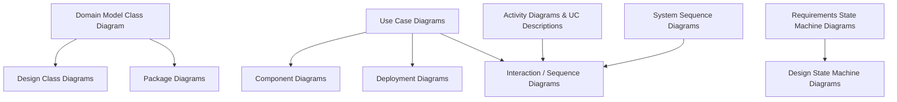

---

## 10.5 Part IV: Software System Types and Architectures

Software systems are generally divided into two types:
1. **Single-User Systems:** Desktop-based or execute from a server without shared resources (e.g., spreadsheet programs).
2. **Enterprise-Level Systems:** Shared resources among multiple people/groups across an organization. Almost always use client-server architectures with multiple layers.

### 10.5.1 Enterprise Architecture Archetypes: Network vs. Internet
How enterprise systems are deployed determines how the View layer interacts with the Domain and Data layers:

| Design Issue | Client-Server Network-Based System | Internet-Based System (Web) |
| :--- | :--- | :--- |
| **State Management** | **Stateful:** The client-server connection is long-term and persistent. State is naturally maintained in memory. | **Stateless:** Connection is short-term with no inherent memory. Requires additional components (cookies, session variables) to manage user session. |
| **Connection Type** | **Direct:** View layer classes interact directly with Domain layer classes. | **Indirect:** Requires scripts, language processors, or CGI scripts to bridge the gap between browser View classes and server Domain classes. |
| **Client Configuration** | Screens/forms are programmed and displayed directly. Domain layer is on the client or split between client and server. | Screens/forms are rendered through a browser. Must conform to browser tech (HTML, CSS, JS, applets). |
| **Client tier connects directly to client tier.** | Client tier connects indirectly to application server through a Web server. |

---

## 10.6 Part V: The Component Diagram

A **component diagram** is a type of design diagram that shows the overall system architecture and the logical, reusable, and transportable components within it.

> [!info] Key Component Concepts
> - **Component:** A moveable, executable software module (reusable and pluggable). Represented in UML as a rectangle with component symbols on the side.
> - **Application Program Interface (API):** The set of public methods that are available to the outside world to access the component's services.
> - **Port:** An interaction point on the boundary of a component, shown as a small square.
> - **Lollipop (Provided Interface / Ball):** A circle representing an interface that the component provides to define the methods other components can invoke.
> - **Socket (Required Interface):** A semi-circle representing services that the component requires from other components.

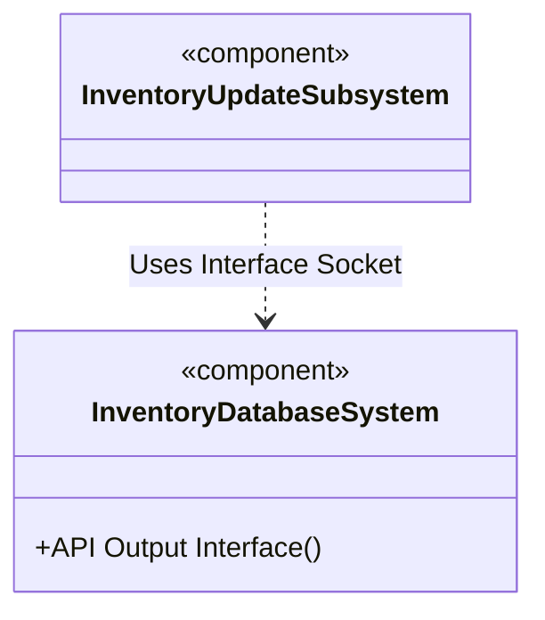

### 10.6.1 Two-Layer Internet Logical Design Component Diagram
- **User Interface Layer:** Browser with cookies (executes JavaScript/ActiveX to format and display) -> Communicates via Internet -> Internet Server (executable component that retrieves pages and invokes other components).
- **Domain Layer (Business Logic):** Internet Server communicates with:
  - **Common Gateway Interface (CGI):** Compiled C/C++ programs to receive input data from server.
  - **Application Server (Session Manager):** Invoked to process code (read/write database) and work with cookies to manage sessions (PHP, ASP, JSP, Servlets, ColdFusion).

---

## 10.7 Part VI: Design Class Symbols and Notation in UML

In detailed design, design classes represent concrete software classes (not just conceptual work items).

### 10.7.1 UML Design Class Stereotypes
UML uses **stereotypes** (indicated by guillemots `« »`) to categorize design classes:

1. **Entity Class (`«entity»`):** Represents problem domain classes whose data must be remembered (usually persistent). Symbol: A circle with a flat horizontal line underneath.
2. **Boundary/View Class (`«boundary»`):** Lives on the system's automation boundary, such as input forms, windows, or Web pages. Symbol: A circle with a vertical line on the left.
3. **Control Class (`«control»`):** Acts as a switchboard or mediator that routes messages between boundary classes and entity classes. Symbol: A circle with a circular arrow on top.
4. **Data Access Class (`«dataAccess»`):** Dedicated layer to execute SQL, retrieve/save database records, and isolate database logic from domain entities. Symbol: A circle with flat lines on top and bottom.

### 10.7.2 Design Class Notation
A UML design class is represented by a box with three compartments:

1. **Top Compartment (Class Name & Stereotype):** Displays the stereotype (e.g. `«entity»`), class name, and parent class (e.g. `ClassName::ParentClass`).
2. **Middle Compartment (Attributes):** Expands domain attributes with visibility, types, and properties.
   - *Format:* `visibility name: type-expression = initial-value {property}`
   - *Visibility:* `-` (private, standard for attributes) or `+` (public).
   - *Example:* `-studentID: integer {key}`
3. **Bottom Compartment (Methods):** Shows the method signatures required to invoke messages.
   - *Format:* `visibility name(parameter-list): return-type`
   - *Example:* `+updateGPA(credits: Float): void`

### 10.7.3 Elaborating attributes and methods (DCD Example)
- **Domain Attribute:** `studentID`, `name`, `address`
- **Design Class Elaboration:**
  - `-studentID: integer {key}`
  - `-name: string`
  - `-address: string`
- **Design Method signatures:**
  - `+createStudent(name, address, major): Student`
  - `+getName(): string`
  - `+updateCreditHours()`

## 10.8 Part VII: The 5 Steps of OO Detailed Design
We develop design models iteratively, use case by use case:
1. **Develop first-cut DCD** showing navigation visibility.
2. **Determine class responsibilities and collaborations** using Class-Responsibility-Collaboration (CRC) cards.
3. **Develop detailed sequence diagrams** (first-cut, then multilayer).4. **Update the DCD** with method signatures and navigation data based on CRC cards and sequence diagrams.
5. **Partition the solution** into logical packages.

---

# Chapter 11: Object-Oriented Design: Principles (Part 2)

## 11.1 Introduction
> [!info] Objective
> By the end of this topic, you should be able to:
> 1. Detail the steps in creating a first-cut Design Class Diagram (DCD).
> 2. Apply navigation visibility guidelines (superior/subordinate, independent/dependent).
> 3. Use Class-Responsibility-Collaboration (CRC) cards for object-oriented detailed design.
> 4. Evaluate quality metrics of software design using coupling and cohesion.
> 5. Partition classes into packages according to coupling and cohesion principles.

---

## 11.2 Part I: Step-by-Step Creation of a First-Cut Design Class Diagram (DCD)

Developing a Design Class Diagram (DCD) is a structured process executed use case by use case. 

### 11.2.1 Steps to Create a DCD
1. **Proceed Use Case by Use Case:** Evolve the diagram incrementally for each business process (e.g., `Create phone sale`).
2. **Identify Involved Domain Classes:** Examine the domain model class diagram and refer to use case preconditions/postconditions for ideas.
3. **Add a Controller Class:** Introduce a controller (mediary switchboard) to orchestrate the use case.
4. **Elaborate Attributes:** Specify visibility (public/private), data types, and properties for all attributes.
5. **Determine Navigation Visibility:** Establish code-level reference paths using standard guidelines.

---

## 11.3 Part II: Navigation Visibility and Design Rules

> [!info] Definition: Navigation Visibility
> The ability of one object to view and interact with another object by invoking its methods. In programming, it is implemented by embedding an object reference variable inside the caller class.
> - **UML Representation:** Shown as an arrow head on the association line pointing from the viewing class to the viewed class.
> - *Example:* A `Customer` class contains the attribute `-mySale: Sale`, allowing a customer to find and message a sale, while `Sale` remains unaware of the customer (one-way mirror).

### 11.3.1 Navigation Design Rules
- **Superior to Subordinate:** In a one-to-many relationship (whole-to-part), navigate from the superior class to the subordinate class.
  - *Example:* `Sale` -> `SaleItem`
- **Mandatory Associations (Independent to Dependent):** When a dependent object cannot exist without an independent object, navigate from the independent to the dependent.
  - *Example:* `Customer` -> `Sale` (a sale requires a customer to exist)
- **Hierarchy Navigation Chains:** Build navigation along natural hierarchical links.
  - *Example:* `Promotion` -> `ProductItem` -> `InventoryItem`
- **Information Dependency:** If an object needs data from another, draw an arrow pointing either to that object or its parent.
- **Directionality:** Navigation arrows can be unidirectional (standard) or bidirectional if mutual access is required.

### 11.3.2 Case Study: RMO DCD Navigation for `Create phone sale`
The first-cut DCD navigation assignments are:
- `SaleHandler` (Controller) -> `Customer`
- `SaleHandler` (Controller) -> `Sale`
- `SaleHandler` (Controller) -> `SaleItem`
- `Customer` -> `Sale` (independent to dependent)
- `Sale` -> `SaleItem` (superior to subordinate)
- `SaleItem` -> `ProductItem` (requires product details)
- `SaleItem` -> `InventoryItem` (requires stock levels)
- `SaleItem` -> `PromoOffering` (requires discount calculation)

---

## 11.4 Part III: Detailed Design with CRC Cards

> [!info] Definition: Class-Responsibility-Collaboration (CRC) Cards
> A manual brainstorming technique using physical index cards (typically 3x5) to design how classes collaborate to complete a use case.
> - **Classes (C):** The software components participating in the use case.
> - **Responsibilities (R):** What the class knows (attributes/state) and what it does (methods/logic). Think of these as method requests.
> - **Collaborations (C):** Other classes whose help is required to fulfill a responsibility.

### 11.4.1 Anatomy of a CRC Card
- **Front Side:**
  - Class Name (at the top).
  - Left Column: Responsibilities (verbs/activities, e.g., *process sale*).
  - Right Column: Collaborating Classes (who it needs help from, and the returned data).
- **Back Side:**
  - Attributes needed by the class (e.g., `customerName`, `shippingAddress`).

### 11.4.2 CRC Card Design Process
1. Select a specific use case (e.g., `Create phone sale`).
2. Identify the problem domain class that receives the first message from the controller (the primary entry point class, e.g., `Customer` receives the request to start a sale).
3. Brainstorm other classes that must collaborate with the primary class to complete the use case (e.g., `Sale` and `SaleItem`).
4. Eventually, add user interface (boundary) classes (e.g., `NewSaleWindow`) and data access classes to the cards.
5. Update the first-cut DCD based on the responsibilities (which become methods) and collaborations.

> [!example] CRC Results for RMO `Create phone sale`
> - **SaleHandler Card:**
>   - *Responsibility:* Handle new sale | *Collaborators:* Customer, Sale, SaleItem.
> - **Customer Card:**
>   - *Responsibility:* Update name, update address, process sale, request history | *Collaborator:* Sale, Transaction.
> - **Sale Card:**
>   - *Responsibility:* Update information, request shipping, update status, cancel sale, add items, take payment | *Collaborators:* SaleItem, Transaction.
> - **SaleItem Card:**
>   - *Responsibility:* Update information, cancel item, request backorder | *Collaborators:* PromoOffering, Product, InventoryItem.
> - **NewSaleWindow (UI Layer) Card:**
>   - *Responsibility:* Accept input, display results | *Collaborator:* SaleHandler.

---

## 11.5 Part IV: Software Quality Metrics: Coupling and Cohesion

High-quality software architecture is guided by two fundamental metrics: **Coupling** and **Cohesion**.

### 11.5.1 Coupling
> [!info] Definition: Coupling
> A measure of how closely different classes/components are linked or dependent on each other.
> - **Goal:** **Low Coupling** (minimized interdependencies).
> - **Risk of High Coupling (The Entangled Web):** Creates a ripple effect where changing code in one class breaks unrelated parts of the system.

### 11.5.2 Cohesion
> [!info] Definition: Cohesion
> A measure of the focus and unity of purpose within a single class or module.
> - **Goal:** **High Cohesion** (highly related responsibilities).
> - **Risk of Low Cohesion (The God Class):** Creates overly complex, hard-to-maintain, and impossible-to-reuse classes that try to do everything.

### 11.5.3 Class Packaging
To enforce low coupling and high cohesion, classes are grouped into logical packages (`<<package>>`) based on shared functionality:

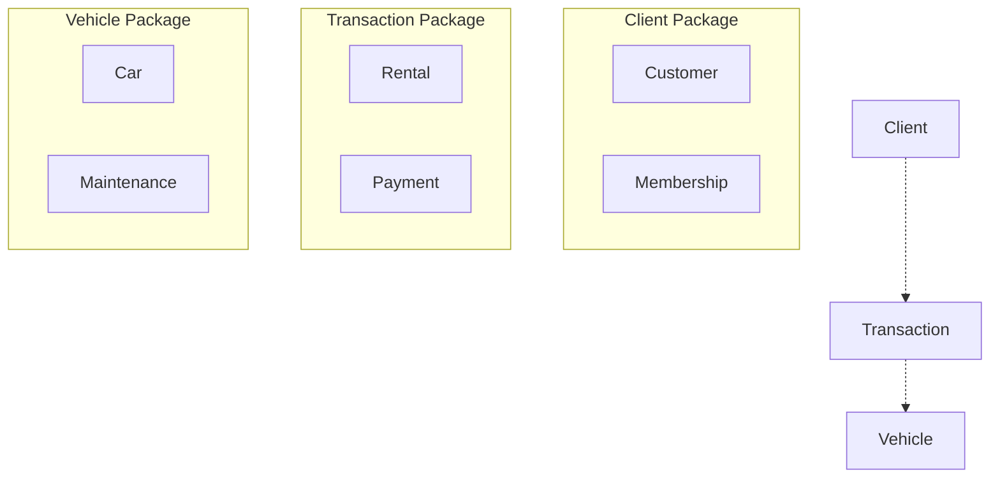

- **Cohesion** is maximized by keeping tightly related classes (e.g., `Customer` and `Membership`) in the same package.
- **Coupling** is minimized by establishing clean, one-way dependencies between packages (e.g., `Client` package depends on `Transaction` package, which in turn depends on `Vehicle` package).
