# Chapter 1: Introduction & Fundamentals of Requirements Engineering

## 1.1 Introduction to Requirements Engineering (RE)

### 1.1.1 The Importance of Requirements Engineering
Requirements Engineering is a critical success factor for software-intensive systems. 

> [!quote] Fred Brooks (1987)
> "The hardest single part of building a software system is deciding precisely what to build. No other part of the conceptual work is as difficult as establishing the detailed technical requirements, including all the interfaces to people, to machines, and to other software systems. No other part of the work so cripples the resulting system if done wrong. No other part is more difficult to rectify later."

#### CHAOS Report Statistics
Research by The Standish Group (CHAOS Report) highlights the impact of RE on project outcomes. Based on historical averages (1994-2012):
- **Project Outcomes:** On average, only **30%** of projects are successful, **23%** are cancelled (failed), and **47%** are challenged (completed with resource overspend and/or functional restrictions).
- **Reasons for Challenged Projects (Resource overspend & functional restrictions):** 
    - **48.1%** of reasons are related to poor RE:
        - Lack of user input: **12.8%**
        - Incomplete requirements & specifications: **12.3%**
        - Changing requirements & specifications: **11.8%**
        - Unrealistic expectations: **5.9%**
        - Unclear objectives: **5.3%**
    - **51.9%** other reasons:
        - Lack of executive support: **7.5%**
        - Technology incompetence: **7.0%**
        - Lack of resources: **6.4%**
        - Unrealistic time frames: **4.3%**
        - New technology: **3.7%**
        - Other: **23.0%**
- **Reasons for Failed Projects (Cancellations):** 
    - **44.1%** of reasons are related to poor RE:
        - Incomplete requirements: **13.1%**
        - Lack of user involvement: **12.4%**
        - Unrealistic expectations: **9.9%**
        - Changing requirements & specifications: **8.7%**
    - **55.9%** other reasons:
        - Lack of resources: **10.6%**
        - Lack of executive support: **9.3%**
        - Lack of planning: **8.1%**
        - Didn't need it any longer: **7.5%**
        - Lack of IT management: **6.2%**
        - Technology illiteracy: **4.3%**
        - Other: **9.9%**

#### Effort for Correcting Defects
The cost of fixing requirements defects increases significantly as the project progresses (based on Boehm and Basili 2001):
- **Small/Non-critical projects:** Defects found after delivery require **5x** more effort to correct. (Analysis 1x $\to$ Design 1.5-2.5x $\to$ Coding 2-5x $\to$ Testing 2.5-5x $\to$ Delivery 5x)
- **Large/Critical projects:** Defects found after delivery require **100x** more effort to correct. (Analysis 1x $\to$ Design 2.5-5x $\to$ Coding 5-10x $\to$ Testing 10-50x $\to$ Delivery 100x)

### 1.1.2 Core Definitions

> [!info] Definition: Requirement (IEEE 610.12-1990)
> A **requirement** is:
> 1. A **condition or capability** needed by a user to solve a problem or achieve an objective.
> 2. A **condition or capability** that must be met or possessed by a system, system component, product, or service to satisfy a contract, standard, specification, or other formally imposed documents.
> 3. A **documented representation** of a condition or capability as in (1) or (2).
> 
> *PMBOK Guide 5th Ed:* Requirements include the quantified and documented needs, wants, and expectations of the sponsor, customer, and other stakeholders.

> [!info] Definition: Requirement (IREB CPRE Glossary)
> 1. A **need** perceived by a stakeholder.
> 2. A **capability or property** that a system shall have.
> 3. A **documented representation** of a need, capability or property.

> [!info] Definition: Stakeholder
> A **stakeholder** of a system is a person, group of people, or an organisation who influences a system's requirements or who is impacted by that system. A stakeholder can influence not only the result but also the project life cycle (direct or indirect influence).

> [!example] Example: Stakeholders in a Public Transport Ticketing System
> For a web-based system for buying tickets for public transport, stakeholders might include:
> - **End customer:** The person who buys the ticket.
> - **Marketing manager:** The person who sells the ticket.
> - **IT administrator:** The person who runs the system.
> - **Legal expert:** Ensures data privacy and compliance.
> - **Financial manager:** Handles payment processing.

### 1.1.3 The Goal of Requirements Engineering
Requirements Engineering (RE) is a **cooperative, iterative, and incremental process** which aims at ensuring that:
1. All **relevant requirements** are explicitly known and understood at the required level of detail.
2. A **sufficient agreement** about the system requirements is achieved between the stakeholders involved.
3. All requirements are **documented and specified** in compliance with the relevant documentation/specification guidelines.

### 1.1.4 The Three Dimensions of RE
The goals of RE can be characterized by three orthogonal dimensions (based on Pohl and Ulfat-Bunyadi 2013):

1. **Content Dimension:** Deals with the understanding of the system requirements.
   - **Start:** Only a few requirements are known and their understanding is typically vague.
   - **Goal/End:** All requirements shall be explicitly known and each requirement shall be understood at the required level of detail (complete understanding).
2. **Documentation Dimension:** Deals with documenting and specifying the system requirements using different and appropriate documentation and specification formats.
   - **Start:** Information is typically documented non-compliant with documentation/specification guidelines (e.g., as a note, sketch, statement in a minute, hand drawing).
   - **Goal/End:** All requirements should be documented/specified in compliance with the relevant documentation/specification guidelines and formats.
   - **Formats:** Textual (natural language), model-based (diagrams), or hybrid formats.
3. **Agreement Dimension:** Deals with the level of agreement achieved between the relevant stakeholders about the known requirements.
   - **Start:** Stakeholders typically have different, conflicting views about the goals and requirements of the system.
   - **Goal/End:** The relevant stakeholders should have established a sufficient agreement about the system requirements. Conflicts must be detected and resolved as early as possible.

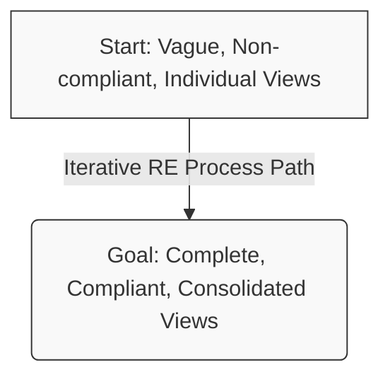

> [!tip] Extra Notes: Orthogonality of the Dimensions
> The dimensions are **orthogonal**, meaning progress in one does not guarantee progress in others:
> - **Content vs. Agreement:**
>   - A complete understanding of a requirement **does not imply** a sufficient agreement between the stakeholders about this requirement!
>   - An agreement between stakeholders about a requirement **does not imply** a complete understanding of this requirement!
>   - *Progress Side-Effects:* Progress in the agreement dimension (e.g., a creative solution for a conflict on requirements) can lead to **new requirements** which are not well understood (content dimension). Conversely, progress in the content dimension (e.g., eliciting new requirements) may lead to **new conflicts** between stakeholders, or may uncover existing conflicts (agreement dimension).
> - **Documentation vs. Content:**
>   - Compliance of a requirement to the documentation guidelines **does not imply** a complete understanding of the requirement!
>   - A complete understanding of a requirement **does not imply** compliance of the documentation of the requirement with the documentation guidelines!
>   - *Progress Side-Effects:* Progress in the documentation dimension (e.g., formalizing a requirement according to the guidelines) **can reveal some gaps** within the content dimension. Conversely, progress in the content dimension (e.g., a new elicited requirement) **can lead to a drawback** in the documentation dimension since the new requirement is likely not directly documented according to the guidelines.
> - **Agreement vs. Documentation:**
>   - An agreement between stakeholders about a requirement **does not imply** compliance of the documentation of the requirement to the documentation guidelines!
>   - Compliance of a requirement with the documentation guidelines **does not imply** a sufficient agreement of the stakeholders about this requirement!
>   - *Progress Side-Effects:* Progress in the documentation dimension (e.g., documenting a requirement according to the guidelines) **can surface a conflict** about the requirement due to better comprehension of the requirement by a stakeholder. Conversely, progress in the agreement dimension (e.g., stakeholders solving a conflict by agreeing on a new alternative requirement) **can lead to a drawback** in the documentation dimension if the new documented requirement is initially non-compliant.

### 1.1.5 The Three Types of Requirements
Requirements are classified into three types: functional requirements, quality requirements, and constraints.

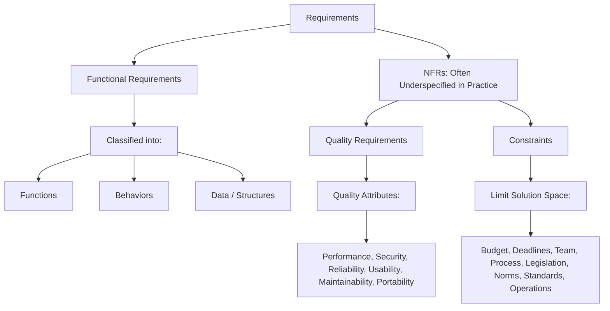

1. **Functional Requirements:** 
    - *IREB Definition:* A requirement concerning a result or behavior that shall be provided by a function of a system.
    - *Scope:* Further classified into: Functions (services/features), Behaviors (reactions to inputs/situations), and Data/Structures (representation and storage).
    - > [!quote] Ian Sommerville (2007)
      > "These [functional requirements] are statements of services the system should provide, how the system should react to particular inputs and how the system should behave in particular situations. In some cases, the functional requirements may also state what the system should not do. [...] When expressed as user requirements, the requirements are usually described in a fairly abstract way. However, functional system requirements describe the system function in detail, its inputs and outputs, exceptions and so on."
    - *Examples:*
        - **R-4:** The house information system shall generate monthly statements of allowed and denied accesses.
        - **R-6:** If a sensor detects damage to the window, the system shall inform the security company.
        - **R-9:** If a correct PIN is entered at the keyboard of the access system, the system shall remove the door lock and shall record the access date, time, and the PIN entered.
2. **Quality Requirements:** 
    - *IREB Definition:* A requirement that pertains to a quality concern that is not covered by functional requirements.
    - *Description:* Defines a quality property for the entire system, a system component, a service, or a function. These requirements have a big influence on the system architecture.
    - *Examples:*
        - **R-12:** The user interface shall be easy to use for the house owner. (Usability/Satisfaction)
        - **R-15:** The release of the locking mechanism shall take $0.8\text{ seconds}$ at most. (Performance Efficiency)
        - **R-17:** The user password stored in the system shall be protected against unauthorized access. (Security)
    - *Standards:* **ISO/IEC 25010:2011** defines quality models:
        - **Quality in Use (5 characteristics):**
            - *Effectiveness:* Accuracy and completeness with which users achieve specified goals.
            - *Efficiency:* Resources expended in relation to the accuracy and completeness with which users achieve goals.
            - *Satisfaction:* Degree to which user needs are satisfied when a product or system is used in a specified context of use.
            - *Freedom from Risk:* Degree to which a product or system mitigates the potential risk to economic status, human life, health, or the environment.
            - *Context Coverage:* Degree to which a product or system can be used with effectiveness, efficiency, freedom from risk, and satisfaction in both contexts of use and contexts beyond those initially explicitly identified.
        - **System/Software Product Quality (8 characteristics):**
            - *Functional Suitability:* Degree to which a product or system provides functions that meet stated and implied needs when used under specified conditions.
            - *Performance Efficiency:* Performance relative to the amount of resources (e.g., other software products, hardware configuration) used under stated conditions.
            - *Compatibility:* Degree to which a product, system, or component can exchange information with other products, systems, or components, and/or perform its required functions, while sharing the same hardware or software environment.
            - *Reliability:* Degree to which a system, product, or component performs specified functions under specified conditions for a specified period of time.
            - *Security:* Degree to which a product or system protects information and data so that persons or other products or systems have the degree of data access appropriate to their types and levels of authorization.
            - *Maintainability:* Degree to which a product or system can be modified by the intended maintainers.
            - *Portability:* Degree to which a system, product, or component can be transferred from one hardware, software, or other operational or usage environment to another.
            - *Usability:* (Noted in slide 44/standards as part of system quality)
3. **Constraints:** 
    - *IREB Definition:* A requirement that limits the solution space beyond what is necessary for meeting the given functional requirements and quality requirements. They are not implemented but limit the solution space.
    - *Types of Constraints:* Organisational/project (Budget, Deadlines, Team, Process), Technical, Physical, Legal (Legislation, Norms, Standards, Guidelines), Cultural, Operations.
    - *Examples:*
        - **C-9 (Cultural):** The user interface shall not contain symbols or graphics abusive for any culture.
        - **C-16 (Organisational/Project):** The effort for system development shall not exceed $480\text{ person months}$.
        - **C-36 (Physical):** The electronic control unit in the vehicle interior shall work at temperatures from $-10$ to $+50\text{ }^{\circ}\text{C}$.
        - **C-41 (Legal):** The system shall process personal data in compliance with the EU's Data Protection Directive 95/46/EC.

---

## 1.2 Fundamentals of Requirements Engineering

### 1.2.1 Influence of Constraints
Constraints restrict the **range of realization alternatives** for requirements. They can characterize the development process itself (e.g., C-16: budget, time, process constraints) or the resulting system (e.g., C-36: physical, operational constraints). Usually, constraints affect both the development process and the system itself.

> [!example] Example: Mobile Phone Client (R-3 vs. C-4)
> - **Functional Requirement (R-3):** "The output shall be presented on a mobile phone."
> - **Initial Solution Space:** iOS, Windows 10, BlackBerry OS, Android, Palm (5 possibilities).
> - **Constraint (C-4):** "Only iOS and Android shall be supported."
> - **Consequence:** The solution space is reduced from 5 to 2 alternatives. Only **40.0%** of the initial solution space remains.

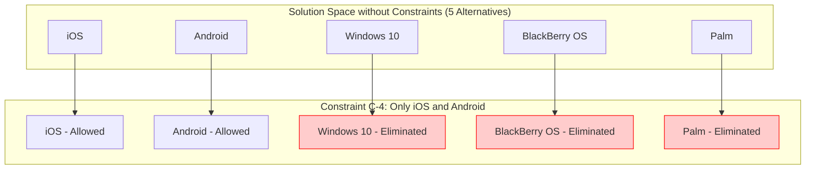

### 1.2.2 Non-functional Requirements (NFRs)

> [!warning] The Myth of "Non-functional Requirements"
> The term "non-functional requirement" is widely used in practice and literature. However, whenever a requirement is labeled as an NFR, it is typically **insufficiently understood**. 
> 
> **The RE Perspective:** There are only functional requirements and quality requirements (which are then constrained by project/technical constraints). **Non-functional requirements do not exist** as a separate category in rigorous RE. They must be decomposed into underspecified functional requirements and/or quality requirements.

> [!example] Example: Refining a Security NFR
> **Original "NFR":** "The system shall be secure." (NFR-12)
> 
> This is clearly an underspecified requirement. It must be refined into precise functional and quality requirements:
> - **R-12.1 (Functional):** Each user shall log in to the system with his user name and password prior to using the system.
> - **R-12.2 (Functional):** The system shall remind the user every four weeks to change the password.
> - **R-12.3 (Functional):** When the user changes his password, the system shall validate that the new password is at least eight characters long and contains alphanumeric characters.
> - **R-12.4 (Quality):** The user password stored in the system shall be protected against password theft.

### 1.2.3 RE and Organizational Processes
RE is embedded within, and interacts with, key organizational processes:
- **Marketing:** Provides market needs, trends, and price range to RE; RE provides new features to Marketing.
- **Product Management:** Provides product roadmap, product strategy, and key requirements; RE provides new and revised requirements.
- **Customer Relationship Management (CRM):** Provides customer wishes and reported problems; RE provides realized changes and enhancements.

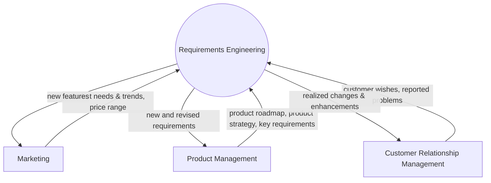

### 1.2.4 RE and Development Activities
RE provides the foundation for, and receives inputs from, other core development activities:
- **Project Management:** Provides project plans and approved goals; RE provides monitoring data and elicited goals.
- **Design:** Receives requirements and constraints from RE; RE receives solutions and new technologies from Design.
- **Quality Assurance:** Receives requirements artifacts from RE; RE receives requests for clarification and improvement from QA.
- **System Maintenance:** Receives change requests from RE; RE receives status of change requests from System Maintenance.

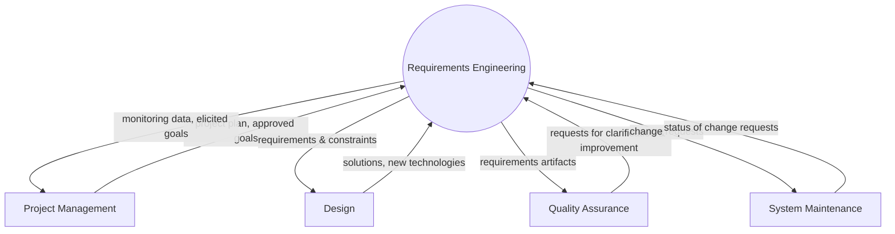

### 1.2.5 What vs. How (Problem vs. Solution)
- **What (Problem):** Refers to **Software Requirements** (what system should be developed).
- **How (Solution):** Refers to **Software Design** (how a system should be developed).
- In a software development process, we define several **what-how pairs** where each pair denotes a definition to a problem and its corresponding solution description at different levels of abstraction.

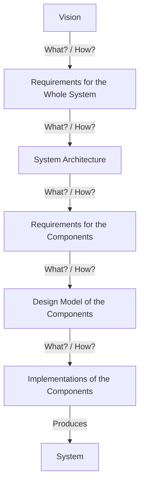

#### What vs. How Within a Single Development Phase
Differentiation between "what" and "how" also occurs **within the requirements engineering phase itself** as a process of requirement refinement.

> [!example] Example: Refining a Navigation Requirement
> - **What (R-12):** The navigation system shall allow the driver to enter the destination of the trip conveniently.
> - **How (Refined Requirements):**
>   - **R-12.1:** When the driver starts a new trip, the navigation system shall display a roadmap of the area centered on the current position.
>   - **R-12.2:** The navigation system shall allow the driver to scroll and zoom into the roadmap.
>   - **R-12.3:** After the driver has selected a destination on the roadmap, the system shall allow the driver to edit the destination details (city, street, and house number).

### 1.2.6 Evolution: Traditional vs. Continuous RE

#### Traditional System Analysis (80s - early 90s)
In traditional process models, requirements engineering was regarded as the **early (first) phase** of system development.
- **Goal:** Systems analysis aims at understanding and defining requirements of existing systems or processes in terms of function, data, and behaviour. Typically, the new system (partly) automates and replaces existing systems.
- **Key Approaches:** 
  - *Structured Analysis* by DeMarco (1978)
  - *Essential System Analysis* by McMenamin and Palmer (1984)
- **Typical Activities:**
  1. By analysing existing systems and processes, a requirements model of the current (existing) system is created (**current state model**).
  2. Based on the current state model, intended changes are defined resulting in the **desired state model** (requirements spec).
  3. Realization of the new system based on the desired state model.

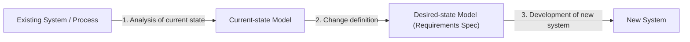

- **Shortcomings:** 
    - **No continuity:** RE is only performed for a particular time. Changes that occur later (e.g., during development) are not reflected, causing requirements to become out-of-date.
    - **Analysis of current state:** Time-consuming current-state analysis at the beginning of each project.
    - **No systematic requirements reuse:** Reuse across project and product boundaries is not systematically supported. Reuse happens, if at all, in an ad-hoc manner.
    - **Narrow focus:** Focus is restricted only to the system under development, and important opportunities for product innovation are lost.

#### Continuous Requirements Engineering
Continuous RE implements requirements engineering as a **continuous activity** across the entire lifecycle and across **project and product boundaries**.

- **RE as a Cross-Lifecycle Activity:** RE runs in parallel with development and maintenance, offering continuous feedback and adjustments.
- **RE as a Cross-Project and Cross-Product Activity:** 
  - The inputs come from various sources: Marketing, Market trends, CRM, Maintenance, Development, and Product Management.
  - **Requirements Base:** A central, persistent repository containing requirements under development, agreed requirements, and correctly specified requirements. It continuously creates, changes, and deletes requirements.
  - At a given point in time, a **set of requirements to be realized** in the next system or system release is selected from this requirements base.

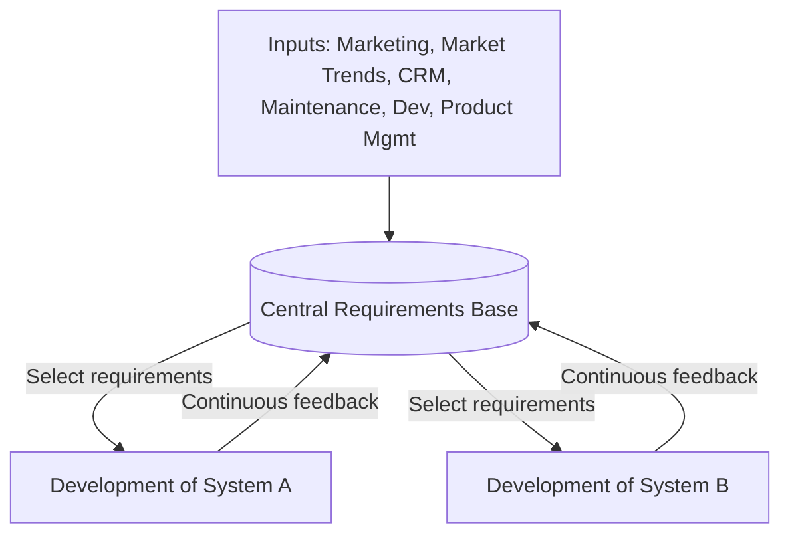

- **Advantages of Continuous RE:**
    - **Systematic learning process:** Institutionalized learning process in which the stakeholders involved continuously extend and improve their understanding. Sharing of requirements across projects is enabled.
    - **Requirements are always up to date:** Changes are integrated into the requirements base immediately.
    - **Shorter product development times:** Prevents time-consuming analysis of current state at the start of each project.
- **Reuse across projects and products:** Facilitates the reuse of requirements and related development artefacts.
    - **Clear responsibilities:** One or multiple people are explicitly responsible for the development and management of the requirements across projects and products.

---

# Chapter 2: The Requirements Engineering Framework

## 2.1 The Requirements Engineering Framework

### 2.1.1 Motivation and Goals of the Framework
The RE framework is designed to structure the requirements engineering process by defining a set of **core common concepts** and their **relationships**.
- **Reference Structure for Industry:** Supports training of managers, requirements engineers, and developers. Enables the systematic analysis of strengths and weaknesses of existing RE processes.
- **Reference Structure for Teaching:** Successfully introduced in numerous organizations, companies, and universities.

```mermaid
graph TD
    subgraph "Requirements Engineering Context"
        subgraph "System Context"
            SF[Subject Facet]
            UF[Usage Facet]
            IF[IT System Facet]
        end
        DC[Development Context]
    end

    subgraph "Core Activities"
        Elic[Elicitation] <--> Neg[Negotiation]
        Neg <--> Doc[Documentation]
        Doc <--> Elic
    end

    subgraph "Requirements Artefacts"
        G[Goals]
        S[Scenarios]
        SOR[Solution-Oriented Requirements]
    end

    Validation{Validation} <--> "System Context"
    Validation <--> "Core Activities"
    Validation <--> "Requirements Artefacts"

    Management{Management} <--> "System Context"
    Management <--> "Core Activities"
    Management <--> "Requirements Artefacts"
```

### 2.1.2 System Vision
A **vision** defines an intended (small or large) change to a current reality. It represents the start of the requirements engineering process.
- **Characteristics:** It is typically brief and precise, guides the definition of requirements, guides system development, states a goal (**"What?"**), not how to achieve it (**"How?"**), is the basis for making decisions, and justifies expenses.

> [!example] Example: JFK Moon Vision (1961)
> - **Vision:** "First, I believe that this nation should commit itself to achieving the goal, before this decade is out, of landing a man on the moon and returning him safely to the earth."
> - **Impact of Vision Change:** If we delete the last part *"and returning him safely to the earth"*, the vision is simplified, but it has a massive impact on the requirements (e.g., no heat shields, no complex landing gear, no ascent stage, no recovery force required). A tiny change in vision changes the entire scope of system requirements.

- **Vision as Focus:** The vision acts as a filter (funnel) that narrows down the infinite possible domains of reality to a specific target domain. For example, a vision for a "Car Configurator" filters out unrelated objects (like planes, weather, domestic animals) to focus only on car descriptions, configuration capabilities, target customers, and hardware platforms.
- **Establishing Vision in Context:** A requirement is always defined for a context. For instance, the vision: *"The system shall stop from a speed of 50 km/h within 10 meters"* differs largely in realization depending on the context:
  - **Car:** Feasible and common.
  - **Train:** Hard to realize due to high momentum and low friction of steel wheels on steel rails.
  - **Ship:** Infeasible (cannot stop in 10m from 50 km/h).

### 2.1.3 The RE Context
The requirements engineering context consists of:
1. **System Context:** The part of the context in which the system to be developed is operating or embedded.
   - *Subject Facet:* Information represented in the system or constraining the representation.
   - *Usage Facet:* People and systems interacting with the system or benefiting from it.
   - *IT System Facet:* Technical environment (sensors, actuators, other systems).
2. **Development Context:** The part of the context in which the system is being developed (e.g., tools, team, environment).
3. **Additional RE Context Objects:** Objects considered during RE but not part of system or development context.

> [!example] Example: Context Facets for an Automated Braking System
> - **Subject Facet:** The driver's actions, road/weather conditions, and the existing mechanical braking system.
> - **Usage Facet:** The driver (direct operator).
> - **IT System Facet:** Wheel speed sensors, radar/lidar sensors, hydraulic actuators, and the ECU firmware.

### 2.1.4 Core Activities of RE
The core activities operate iteratively to move the project along the three RE dimensions:

1. **Elicitation:** Goal is to identify relevant requirements sources, elicit existing requirements, and develop new/innovative requirements.
   - *Sources:* Stakeholders, existing documents, existing systems.
   - *Outcome:* Progress in the **Content Dimension** (vague $\to$ complete).
2. **Negotiation:** Goal is to identify conflicts, analyze their causes, resolve them via appropriate strategies, and document the resolution/rationale.
   - *Outcome:* Progress in the **Agreement Dimension** (individual views $\to$ consolidated views).
3. **Documentation:** Goal is to document info according to guidelines, specify requirements in appropriate formats (fitting stakeholder needs), and ensure consistency between different formats.
   - *Outcome:* Progress in the **Documentation Dimension** (non-compliant $\to$ compliant).

### 2.1.5 Requirements Artefacts
Requirements are documented using three types of complementary artefacts:

1. **Goals:** High-level objectives about properties of the system or development project.
   - *Characteristics:* Prescriptive nature, expresses stakeholders' intentions, refines the vision, and should be solution-free.
   - *Hierarchy Example:*
     ```mermaid
     graph TD
         G1["comfortable and fast navigation to destination"]
         G1 --> G1_1["circumnavigating traffic jams"]
         G1 --> G1_2["easy entry of destination"]
         G1 --> G1_3["automatic navigation"]
     ```
2. **Scenarios:** Concrete examples of satisfying or failing to satisfy a goal (or set of goals).
   - *Characteristics:* Documents a concrete example of system usage, defines a sequence of interaction steps, puts requirements into context, and increases comprehensibility of goals.
   - > [!example] Example: "Entry of destination" Scenario
     > 1. Driver selects the navigation to a desired destination.
     > 2. Navigation system asks for the address of the destination.
     > 3. Driver types in the address.
     > 4. Navigation system checks the inserted information.
3. **Solution-Oriented Requirements:** Specify requirements at a level of detail sufficient for supporting later activities (design and test). They are conceptual/logical, conflict-free, agreed upon by all stakeholders, and as complete as possible.
   - **Data Perspective:** Considers static data structures. Defines data types, attributes, and relationships.
   - **Functional Perspective:** Considers the manipulation of data by system functions. Defines the transformation of inputs to outputs.
   - **Behavioural Perspective:** Considers system behaviour. Defines the reactions to external stimuli in the form of permitted states, transitions, and outputs.

> [!example] Example: Multi-Perspective Modelling of a Requirement
> **Natural Language Requirement:** *"If a glass break detector attached to the entrance door detects that the entrance door has been damaged, the system shall enter the alarm state and inform the security company."*
> - **Data Model (ERD):** Represents entities `entrance door` and `glass break detector` and their association.
> - **Behavioural Model (Statechart):** Represents transitions into the `alarm state` triggered by the event `entrance door damaged`.
> - **Functional Model (DFD):** Represents the function `inform security company` processing inputs and sending outputs.

#### Two Categorisations of Requirements
We differentiate between two classification schemes in RE:
- **Types of Requirements:** Functional requirements, Quality requirements, and Constraints.
- **Requirements Artefacts:** Goals, Scenarios, and Solution-oriented requirements.

*Relationship:* Functional requirements, quality requirements, and constraints can all be defined and refined by goals, scenarios, and solution-oriented requirements. Developing goals and scenarios prior to or along with solution-oriented requirements leads to a significant improvement in requirements quality.

### 2.1.6 Cross-Sectional Activities

1. **Validation:**
   - **Validation of artefacts:** Aims at detecting defects. Checks the artefacts with regard to content, documentation, and agreement dimensions.
   - **Validation of activities:** Checks compliance of activities with process/activity specifications. (e.g., *Have all required steps been performed? Have the required stakeholders been involved?*)
   - **Validation of context consideration:** Checks whether the context has been considered adequately. (e.g., *Have all relevant requirements sources been considered? Have all parts of the RE context been sufficiently considered?*)
2. **Management:**
   - **Artefact Management:** Prioritization, persistent recording, configuration management, change management, and traceability throughout the system lifecycle.
   - **Activity Management:** Planning, controlling, and aligning execution of RE activities to the current project situation.
   - **Context Management:** Identifying changes in the context that are relevant to the system. Context changes typically require re-initiating or rescheduling RE activities.

---

# Chapter 3: Context

## 3.1 Context of a System
A (software-intensive) system is always embedded in a particular context. The context heavily influences the requirements the system has to fulfill. 

> [!note] Important
> A requirement is always defined for a particular context.

> [!example] Example: Accounting System Contexts
> Developing an accounting system requires considering its specific context:
> - **Germany:** Must consider relevant German laws and the business needs of the German manufacturing industry.
> - **USA:** Must consider US American laws and the business needs of financial companies.
> - **China:** Must consider Chinese laws and the business needs of shipping companies.

> [!example] Example: Wind Turbine Contexts
> If the goal is to develop a power supply based on renewable energies, a wind turbine is a possible solution. However, its appropriateness depends entirely on the context:
> - **Family home in a countryside:** A good solution (windy place).
> - **Submarine underwater:** An inappropriate solution.
> - **Satellite in space:** An inappropriate solution.

## 3.2 System Context and Context Objects

> [!info] Definition: Context Objects
> Context objects are material or immaterial objects belonging to the context.
> - **Material Objects (Can be touched):** People, hardware, documents (manuals, standards, laws), buildings, cars.
> - **Immaterial Objects (Cannot be touched):** Organizations, business processes, software components, data, communication services.

> [!info] Definition: System Context
> The **system context** is the part of the context in which the system to be developed is operating or embedded. Material or immaterial objects belonging to the system context are called **system context objects**.
> 
> System context objects are relevant for the system to be developed and thus **have to be considered during requirements engineering**.

> [!example] Example: System Context Objects of a University Library System
> - **Material Objects:** Books, bookshelf, a student (e.g., Marc Genaro), an employee (e.g., Jennifer Adrian), workstations, printers.
> - **Immaterial Objects:** Library database, meta-search engine accessing several library systems, user authorization service.

> [!info] Definition: System Context Boundary
> The **system context boundary** defines which material and immaterial objects belong to the system context. It thereby separates system context objects from other irrelevant context objects.
> 
> - **System Boundary:** Separates the system itself from the system context.
> - **Context Boundary:** Separates the system context from the irrelevant environment.

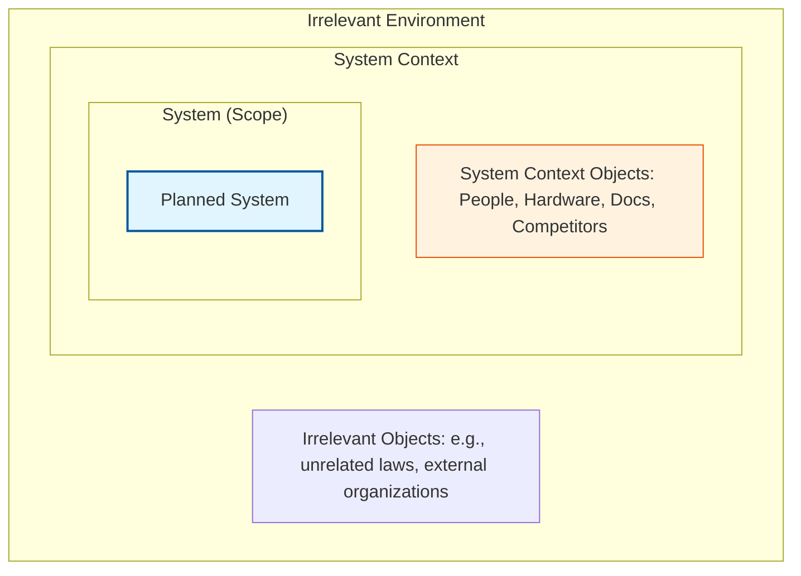

## 3.3 Change of System Context Scope
The scope of the system context can change during the elicitation process as more information becomes available.

> [!example] Example: Narrowing the Context (Transportation System)
> 1. **Initial Goal:** "Establish a fast and safe transportation!" (Potential solutions: airplanes, helicopters, buses, cars, ships, submarines, trains).
> 2. **New Context Information:** "Transportation should be between the mainland and an island. The island has about 35 inhabitants and is located 5 km from the mainland." (This narrows solutions to ships or small boats; planes, trains, and cars are eliminated).
> 3. **Conflict & Resolution:** One stakeholder suggests a marine diesel engine. Another suggests avoiding any kind of pollution due to natural reserves. The decision to use an electric engine resolves this conflict, further refining the context and solution (battery pack instead of diesel fuel tank).

## 3.4 Consideration of System Context Objects

> [!note] Important
> Each context object can potentially be involved in **any requirements engineering activities** (Elicitation, Documentation, Negotiation, Validation, and Management).
> 
> If a context object is not involved in a specific activity, it might still be relevant for that activity later, or it might be relevant for all other activities.

> [!example] Example: Stakeholder Consideration
> Assume there are 10 stakeholders in the system context (e.g., office workers) who potentially have relevant information. Due to time restrictions, only 6 out of 10 are interviewed. The remaining 4 stakeholders are still potentially relevant for later interviews or other RE activities.

## 3.5 The Three Facets of System Context

> [!tip] Generic Principles of any Software-System
> Information systems and embedded systems typically:
> 1. **Represent information** about the real world.
> 2. **Process this information** and provide functionality (e.g., search for car types).
> 3. **Provide an output** to the context (e.g., display the retrieved cars).
> 
> A system is only successful if the user can map the information displayed to the corresponding material or immaterial objects in reality.

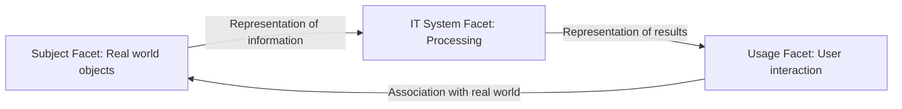

The system context is structured into three facets:

### 3.5.1 Subject Facet
> [!info] Definition: Subject Facet
> The subject facet comprises system context objects about which **information is represented in the system** or which influence or constrain the representation of information represented in the system.
> 
> This includes system context objects and events, their properties, and relationships, as well as the **quality of the representation** (e.g., accuracy and actuality).

- **Examples:** Lawyers and data privacy officers, reference models of the subject domain, textbooks, laws, consumer goods, and production or business processes automated by the system.
- **Library Example:** Students, books, magazines, e-books, bookshelves, and data privacy laws.

### 3.5.2 Usage Facet
> [!info] Definition: Usage Facet
> The usage facet comprises all system context objects (people and/or systems) which directly or indirectly **interact with the system** or which **influence or benefit from the usage** of the system.
> 
> This includes objects contributing to the definition of the **desired usage** and the **usage quality attributes** (e.g., expected usage load or average response times).

- **Examples:** Usage goals, tasks, workflows, business processes, user groups, interaction models, interfaces, and usage laws and standards.
- **Library Example:** Student user group, employee user group, meta-search engine, check-out process, and return process.

### 3.5.3 IT System Facet
> [!info] Definition: IT System Facet
> The IT system facet comprises all system context objects of the **technical and operational environment** in which the system is going to be deployed or which **influence or constrain** the deployment of the system and/or the use of technology by the system (e.g., sensors, actuators).
> 
> This includes objects which contribute to the definition of the **operational environment and/or the technology used**, or which influence/constrain relevant quality attributes (e.g., average availability time, security).

- **Examples:** Hard- and software platforms, communication networks, peripheral devices, hardware components, other software-based systems, IT policies, and strategies.
- **Library Example:** Printers, servers, library workstations, and university cloud infrastructure.

## 3.6 Properties of System Context Objects
Not only the system context objects within each facet need to be considered, but also their **properties** and **relationships** with other objects (both in the same facet and in other facets).

> [!example] Example: Properties of System Context Objects (Library System)
> - **Subject Facet Properties:** 
>   - Student: ID, Matriculation status, Date of birth.
>   - Book: Title, Authors, ISBN, ISSN.
>   - Data privacy law: Visibility of data for librarian.
> - **Usage Facet Properties:**
>   - Students (user group): Maximum number of users, Average usage load.
>   - Employees (user group): Required access control and usage rights.
>   - Meta-search engine: Required information for a particular usage.
> - **IT System Facet Properties:**
>   - University cloud-infrastructure: Maximum throughput of communication network.
>   - Server: Maximum persistent storage available, Maximum downtime in 24h.

## 3.7 Documentation of Context Information
Because a requirement is always defined for a particular context, understanding requirements requires context information. A change in the context typically requires adaptation of requirements.

> [!note] Important
> Documenting context information (objects, properties, and relationships) is a **prerequisite for supporting the analysis of the impact of a context change** on requirements!

#### Common Problems
- Context information is **often not documented at all** and is only implicitly known. This leads to stakeholders having different assumptions about the context.
- If documented, it is **often intermingled** with requirements (spread across requirements). This leads to:
  - Redundancies of context information.
  - Lack of a concise definition.
  - Contradictions between context information.

#### Guideline for Documenting Context Information
Define **project-specific guidelines** for documenting context information. These should include:
- Types of context objects which should be considered and documented.
- Representation formats and the structure to be used.
- Relationship types to interrelate context information and requirements.
- Roles and responsibilities for documenting the context information.

#### Common Approaches
- **Scenarios:** Define system context interaction and interrelate requirements with context objects.
- **(Business) process models:** Define the business context in which system functions are used.
- **Domain models:** Define properties for a set of systems (e.g., systems in a particular application domain).
- **Standards:** Include context information such as personal data protection, federal ordinance on barrier-free information technology.
- **Dedicated section:** In textual requirements specification documents.

## 3.8 Development Context and Additional RE Context Objects
Just considering the system context during requirements engineering is not sufficient. Requirements are heavily influenced by the development process, system development policies, and development guidelines.

> [!info] Definition: Development Context
> The **development context** is the part of the context in which the system is being developed. Context objects belonging to this part are **development context objects**.

- **Examples of Development Context Objects:** Development budget, time constraints (e.g., delivery date), qualification of personnel (e.g., requirements engineers, architects), contractual requirements, development standards, process guidelines, project plan, and development environments.

> [!example] Example: Influence of Development Context (Library System)
> - **Development Context A:**
>   - Budget: \$120,000
>   - Max. development time: 2 months
>   - Development method: Scrum (agile method)
>   - Available personnel: 2 architects, 1 QA engineer
> - **Development Context B:**
>   - Budget: \$1,000,000
>   - Max. development time: 7 months
>   - Development method: Scrum (agile method)
>   - Available personnel: 2 requirements engineers, 4 architects, 2 QA engineers
>   - Quality assurance: according to ISO-xxxxx
> 
> *Consequence:* The different development contexts significantly influence the way requirements engineering is performed (and the system is developed)! Context A will focus on low-overhead elicitation (user stories) and rapid prototyping, while Context B requires extensive, traceable models and formal ISO validation.

- **Development Context Boundary:** Defines which material and immaterial objects belong to the development context, separating them from other context objects.
- **Additional RE Context Objects:** During RE, additional context objects outside the system and development context must be considered, such as:
  - Similar systems of competitors (for eliciting requirements).
  - An external mediator (to foster agreement during negotiation).
  - A domain expert (to support validation and QA).
  - An expert in formal languages (to improve requirements specifications).

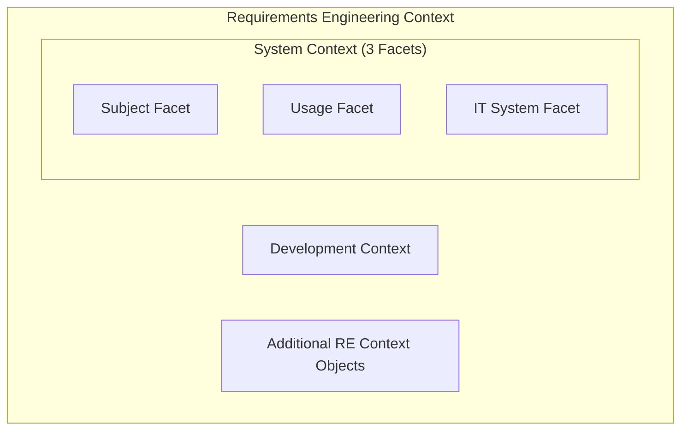

## 3.9 Involvement and Roles of Context Objects
An RE context object can be involved in more than one RE activity.
- **Active Involvement:** The object plays an active role in the RE process (e.g., a stakeholder being interviewed, validating requirements, or documenting requirements).
- **Passive Involvement:** The object is analyzed or referenced (e.g., a manual of a predecessor system being analyzed, or a standard predefining requirements).

> [!example] Example: Passive Involvement (Predecessor Manual)
> The manual of a predecessor system includes different information mapping to different context parts:
> - **Chapter 3** describes the hardware and software environment (IT System Facet).
> - **Chapter 4** specifies the database schema (Subject Facet).
> - **Chapter 2** describes the user interface (Usage Facet).
> - **Chapter 11** explains the restrictions/compiler to be used (Development Context).

> [!example] Example: Active Involvement (Insurance Merchant)
> An insurance merchant is interviewed for eliciting requirements for insurance software:
> - She describes customer data (Subject Facet).
> - She points out redundant steps in existing processes to eliminate (Usage Facet).
> - She desires only one user account for all systems (IT System Facet).
> - She names additional potential process improvements (Usage Facet).

- **Different Roles of Context Objects:** 
  - A system context object can have different roles in different facets (e.g., a *student* is both a subject about whom information is stored and a user in the usage facet; a *meta-search engine* is in the usage facet when it queries the system and in the IT system facet when viewed as an external interface).
  - A context object can play different roles in the system context vs. development context (e.g., a *student assistant* rents a book as a system context user, but works as a programmer/developer in the development context). Requirements engineers must not overlook these multiple roles.

## 3.10 System Boundary, Scope, and the Grey Zone

### 3.10.1 Context vs. Scope
- **Context:** Part of a system's environment relevant to understand the system and its requirements. Usually, the context cannot be changed by the project. Changing the system context boundary requires negotiation with interface partners due to external interface adjustments.
- **Scope:** The range of things that can be shaped and designed when developing a system. The scope can be changed by project decisions. Changes in the scope do not typically require consulting external interface partners.

- **System Definition:** The system subsumes all system context objects that **can be changed** during the development process (e.g., functions, processes, software & hardware components, organizational structures, rules, and guidelines).
- **System Boundary:** Separates objects that belong to the system (can be changed) and system context objects (cannot be changed).

> [!example] Example: System Objects vs. System Context Objects (Library System)
> - **System Objects (Can be changed):** User data, library item data, user interface, check-out terminal.
> - **System Context Objects (Cannot be changed):** Books and magazines, Marc Genaro (student), Jennifer Adrian (employee), workstations, students (user group), employees (user group), meta-search engine, user authorization service.

### 3.10.2 The Grey Zone
Typically, a **grey zone** exists between the system and the system context.
- **Definition:** The grey zone subsumes system context objects for which it is **not clear if they can be changed or not** (i.e., whether they are system objects or system context objects).
- **Boundary Dynamics:** During requirements engineering, the system boundary and the grey zone boundary are typically unstable and change frequently.

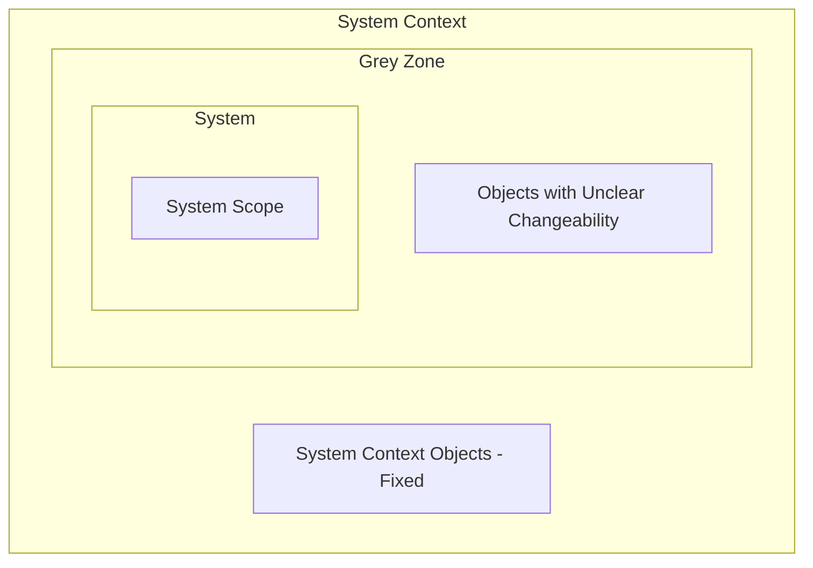

#### Transition Examples of Boundaries and Grey Zone (Library System)
1. **System objects $\to$ Grey zone:** To save costs, check-out terminals should no longer be developed from scratch, but reused. It is unclear if existing terminals can be adjusted or not. They are moved to the grey zone.
2. **System objects $\to$ System context:** The existing terminals cannot be changed (their interfaces are fixed). In this case, they are now considered system context objects.
3. **Grey zone object $\to$ System:** It turns out that the reused check-out terminals can and should be changed. They become system objects again.
4. **Grey zone object $\to$ System context:** After checking technical parts, it turns out old workstations can be reused as they are. The workstations become system context objects.
5. **System context object $\to$ System:** It turns out some very old workstations of librarians need to be updated to be reusable. Therefore, the old workstations become system objects.
6. **System context object $\to$ Grey zone:** Old workstations need to be adapted to be reused, but it is not clear if they can be changed accordingly. They become part of the grey zone.

- **Size of the Grey Zone:** 
  - If a context object cannot be classified, place it in the grey zone.
  - Don't move grey zone objects prematurely.
  - **Keep the grey zone as small as possible** by checking frequently for each grey zone object if a decision can be made.

### 3.10.3 System Interfaces
The system interacts via interfaces with the system context objects and vice versa. System interfaces typically change during requirements engineering and system development.
- **Facet Interaction:** The system can interact via a system interface with system context objects from each of the three facets:
  - *Subject facet:* Receive data, update data.
  - *Usage facet:* Provide output to the user.
  - *IT system facet:* Interfaces to the IT infrastructure.
- A single interface can define interactions with objects from all three facets.

> [!example] Example: System Interfaces of a Library System
> - **User interfaces:** for library users or library staff.
> - **Interfaces to other systems:** authorization systems, order management system.
> - **Interfaces to peripheral devices:** book scanner, printers.

- **Use Case Diagrams:** A use case diagram is commonly used to describe the system and context boundary:
  - The *System Boundary* box separates the system name and use cases (functions within the system scope) from actors.
  - *Actors* (representing passenger, carrier, etc.) represent the system context and define the communication relationship (usage relationship).

---

# Chapter 4: Elicitation

## 4.1 Introduction in Requirements Elicitation

> [!info] Definition: Goal of Requirements Elicitation
> Requirements elicitation is a core requirements engineering activity. The goal is threefold:
> 1. **Identify** relevant requirements sources.
> 2. **Elicit existing requirements** from the identified sources.
> 3. Develop **new and innovative requirements**.

## 4.2 Requirements Sources

> [!important] Importance of Identifying Sources
> - Some sources might be obvious, but **many are typically unknown** at the beginning.
> - Not identifying or considering relevant sources leads to:
>   - **Incomplete** requirements (overlooked requirements).
>   - **Insufficient agreement** or unrecognized conflicts.
>   - At the latest, overlooked requirements lead to **change requests** during system operation (and higher costs).
> - **Identifying all relevant requirements sources is thus essential!**

#### Three Types of Requirements Sources
1. **Stakeholders**
2. **Documents**
3. **Existing Systems**

#### 4.2.1.1 Stakeholders
> [!info] Definition: Stakeholder
> A stakeholder is either a person or an organization with **potential interest in the desired system**. Each typically has specific goals and requirements. A person can **represent the interest of different stakeholders**.

- A stakeholder is a **context object**.
- A stakeholder can belong to:
  - Any facet of the system context (subject, usage, or IT system).
  - The development context.
  - The requirements engineering context.
- A stakeholder typically has **knowledge about several context objects** and their relationships, across different facets of the system context and development context.

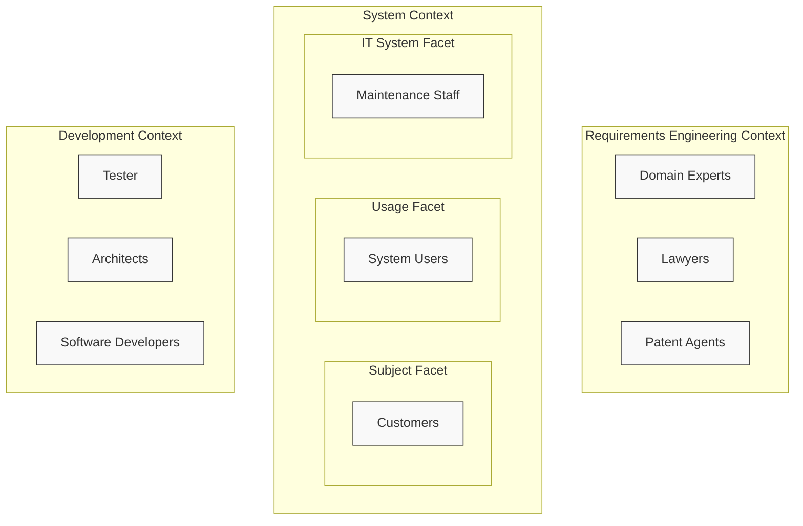

> [!example] Example: Stakeholders Across Context Compartments
> A single person can represent multiple stakeholders or have knowledge about multiple context facets:
> - **Dr. John (Lawyer):** Belongs to the **RE Context** (legal issues) and the **Development Context** (advising the project).
> - **Mr. Gron (Customer):** Belongs to both the **Subject Facet** (his domain data is represented) and the **Usage Facet** (he interacts with the system).
> - **Mr. Nigen (Architect):** Belongs to the **IT System Facet** (operational environment) and the **Development Context** (designing the system).

### 4.2.2 Documents
**Existing documents** contain relevant information to be considered when defining the requirements for the desired system. We differentiate between three types of potentially relevant documents:

1. **General binding documents:** Subsumes documents defined by standardization bodies, governments, special interest groups, trade or professional organizations, etc. Examples include laws and standards.
2. **Organization-specific documents:** Defined within an organization involved in the development or use of the desired system. Examples include development guidelines, product strategies, HCI guidelines, IT-strategies, security guidelines, business process documentation, and market analysis reports.
3. **Product-/System-specific documents:** Describe any kind of development artifact (e.g., requirements, code, architecture, test cases, use cases) of a predecessor system or similar system. Examples include change requests, error reports, user manuals, system architecture documents, requirements specifications, maintenance documents, test documentation, and marketing material.

### 4.2.3 Existing Systems
Existing systems are an excellent source for detecting and uncovering existing requirements.
- **Requirements realized** by the existing system might still be relevant for the new system.
- They should be analyzed to:
  - Elicit properties of the existing system.
  - Identify **required enhancements**.
  - Identify **known deficiencies** to be avoided in the future.
  - Identify **previous errors** already fixed to avoid repeating them.
- **Stakeholders using or involved** in the development/operation of existing systems are additional potential valuable sources.

We differentiate between three types of systems:
1. **Predecessor systems:** Similar purpose, typically replaced by the new system. Legacy systems typically have a similar purpose and are still in use (or have been in use) within an organization.
2. **Systems of competitors:** Essential to analyze to not oversee important requirements and to ensure the system offers differentiating features for its users.
3. **Systems from other domains:** Might offer properties, use innovative technology, or unique features relevant for the desired system. Such systems could be valuable sources for innovative requirements.

## 4.3 Identification of Requirements Sources
#### Two-Step Procedure
- **Step 1:** Identification of potential relevant requirements sources.
- **Step 2:** Selection of requirements sources to be considered.

#### Chapter 1: Potential Relevant Requirements Sources
**Goal:** Identify a large set of potential relevant sources.
**Activities:**
1.1 Use known sources and/or suitable checklists to **identify additional**, potential sources.
1.2 **Record newly identified**, potential relevant sources.
1.3 For each newly identified source, **perform activity 1.1 again**. Iterate until the set becomes (more or less) stable.

> [!tip] Extra Notes: Hints for Step 1
> - Consider **all parts of the RE context** for identifying potential requirement sources.
> - First, **identify relevant context objects**. Then identify sources potentially having **knowledge about those objects**.
> - Consider **all three types** of requirement sources (stakeholders, documents, and existing systems).
> - Use **domain and system-specific checklists** to support the identification of requirements context objects and requirement sources.

```
Template for Checklist:
---------------------------------------------------------------------------------------
| Category     | Usage Facet | Subject Facet | IT System Facet | Dev Context | RE Context |
|--------------|-------------|---------------|-----------------|-------------|------------|
| Stakeholders | ...         | ...           | ...             | ...         | ...        |
| Documents    | ...         | ...           | ...             | ...         | ...        |
| Systems      | ...         | ...           | ...             | ...         | ...        |
---------------------------------------------------------------------------------------
```

> [!example] Example: Context Object Checklist (Car Safety System)
> - **Usage Facet:** driver, ACC-function (Adaptive Cruise Control), maintenance staff, engine control, acceleration system.
> - **Subject Facet:** pedestrians, driver, vehicles in front, streets, objects on the streets.
> - **IT System Facet:** OSEK (operating system), Acceleration sensor, Rotation sensor, FlexRay communication system, car components.
> - **Development Context:** car engineer, sensor expert, HCI (Human Computer Interaction) expert, software architect.
> - **RE Context:** regulatory agencies, flight safety systems, car producer, legal expert.

> [!example] Example: Requirements Sources Checklist (Car Safety System)
> - **Stakeholders:** car driver, professional driver, accident assessor, physician, car technician, car engineer, maintenance staff, sensor expert, engineer, control unit display, safety experts, regulatory agencies, lawyers.
> - **Documents:** car manual, user interface descriptions, documents of the engine control, specification of analogue systems, AUTOSAR standard.
> - **Systems:** previous safety system, safety systems of competitors, sensors systems, HCI systems, systems interacting with safety system, flight safety systems, train safety systems, metro safety systems.

#### Chapter 2: Selection Requirements Sources
**Goal:** Select the most relevant sources from the identified sources.
- Execute a **100 Dollar Test** in a group meeting:
  - In a 100-dollar test each stakeholder metaphorically **spends 100 dollars** on the items (sources).
  - Each distributes the money to the sources they think are **relevant**.
  - The **amount of money** defines the **relative weighting** of this source.
  - The group **selects the highest weighted** sources to consider first. Remaining sources might be considered later.

> [!tip] Extra Notes: Hints for Selecting Sources
> - The **cut-off point** depends on the **project setting** (time, budget, availability of sources).
> - **Check if** selected sources **cover all relevant parts of the RE context**.
> - You might use the 100-dollar test separately for each **part of the RE context**.
> - When **selecting stakeholders** for assessment, ensure an **adequate representation of the RE context**.

## 4.4 Eliciting Existing Requirements vs. Creating Innovative Requirements
Besides identifying requirement sources, the goal of requirements elicitation is twofold:
1. **Elicit existing requirements** from relevant sources.
2. **Create** and develop **innovative (new) requirements**.

> [!note] Important
> Existing and innovative requirements are equally important for system success!

### 4.4.1 Eliciting Existing Requirements
- **From Stakeholders:** Elicited via questionnaires, interviews, workshops, etc.
  > [!example] Example: Questionnaire Elicitation
  > - **Question 12:** *How can the safety of a car during winter be improved?*
  >   - **Answer:** The car should display a warning when the outside temperature is below $3\text{ }^{\circ}\text{C}$ to indicate a high probability of icy roads.
  > - **Question 13:** *In your opinion, how can the risk of rear-end collisions be decreased?*
  >   - **Answer:** The safety system should warn the driver if the distance to the vehicle in front gets critically low – and even might initiate an emergency braking if required.
- **From Documents:** Elicited by analyzing regulations, laws, or error reports.
  > [!example] Example: Eliciting from Laws (Regulation 2010/156/EC)
  > "All electronic systems in a vehicle that directly or indirectly influence the occupants' safety or the safety of other traffic participants must be designed in such a way that failure of the electronic system has no negative effects on safety."
  > - *Derived Goals:*
  >   - **G1:** The driver shall be able to override the system actions at any time.
  >   - **G2:** The system must not disturb any other system even in the case of a system failure.
  
  > [!example] Example: Eliciting from Error Reports (Error FA-2003-1-10-F3)
  > - *Report:* The motor heat emission heats the sensor responsible for measuring the outside temperature. Therefore, the displayed outside temperature is incorrect (too high), especially when driving at low speed.
  > - *Correction:* The sensor was put in a new position which protects the temperature sensor from the engine's heat emission.
  > - *Derived Requirement:*
  >   - **Req-15:** Protect the temperature sensor from the heat emission of the engine.
- **From Existing Systems:** 
  1. The **incarnation of the existing system** is elicited (incarnation model of predecessor system).
  2. An **essential model** is created by **abstracting from the incarnation** (removing physical/organizational constraints to focus on logical essence).

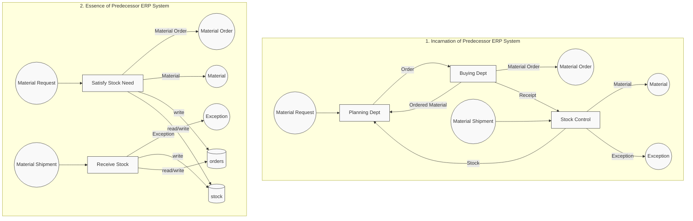

### 4.4.2 Creation of Innovative Requirements
- Innovative requirements **cannot** be elicited in the same way as existing ones.
- They must be created in **creative processes** using creativity techniques.

> [!info] Definition: Creativity
> Creativity is "the ability to produce work that is both **novel** (i.e., original, unexpected) and **appropriate** (i.e., useful, adapted to task constraints)" (Sternberg and Lubart 1999).

Three Categories of Creativity:
1. **Exploratory creativity:** Search space of partial and complete possibilities.
2. **Combinational creativity:** Make unfamiliar connections between familiar possibilities in the search space.
3. **Transformational creativity:** Challenge constraints on the search space to enlarge the space of possible ideas to explore.

- **With Stakeholders:** Brainstorming ideas.
  > [!example] Example: Brainstorming (HUD for Car)
  > During brainstorming for "What to display in the next generation of head up display for a car", ideas collected included: traffic signs, circumnavigating traffic jams, navigation instructions, proactive traffic light monitoring, current speed, and slippery road warnings. Proactive traffic light monitoring was selected as innovative.
- **Using Existing Documentation:** Analyzing specifications from different domains.
  > [!example] Example: Innovation from Existing Specs (Smart Refrigerator)
  > The vision is to build a smart refrigerator. The requirements engineer analyzes the specification of a food trader's ERP system and identifies the functionality to monitor "best before" dates as a potential innovative requirement.
- **Using Existing Systems:** Participating in demonstrations of other domains.
  > [!example] Example: Innovation from Competitor/Other Domains
  > Smart refrigerator stakeholders participate in a demonstration of smart TVs. They identify useful features: interacting with smartphones to suggest recipes based on diet and available food, and autonomously sending shopping lists to smartphones.

## 4.5 Common Elicitation Techniques

> [!info] Elicitation vs Assistance Techniques
> - **Elicitation techniques** support eliciting existing requirements, creating innovative requirements, and eliciting requirement sources.
> - **Assistance techniques** support elicitation techniques (e.g., by developing new ideas or experiencing features of the future system).

### 4.5.1 Classification of Elicitation Techniques
| Technique | Effort | Suited for: Identifying Sources | Suited for: Eliciting Existing | Suited for: Developing Innovative |
|---|---|---|---|---|
| **Interview** | Medium to High | Yes (X) | Yes (X) | Partially ((X)) |
| **Workshop** | High to Very High | Yes (X) | Yes (X) | Yes (X) |
| **Focus Groups** | Medium to High | | Yes (X) | Yes (X) |
| **Observation** | High to Very High | | Yes (X) | |
| **Questionnaire** | Low to Medium | Yes (X) | Yes (X) | |
| **Perspective-Based Reading** | Medium to High | | Yes (X) | |

### 4.5.2 Detailed Elicitation Techniques

#### 4.5.2.1 Interview
Goal is to elicit requirements and context information for the system to be developed from a stakeholder or a group of stakeholders.

##### Kinds of Interviews
- **Standardized Interview:** The interviewer strictly follows the prepared questions. No additional questions or adjustments are made during the interview. Results are easy to compare across many stakeholders.
- **Exploratory Interview:** The interviewer may deviate from prepared questions, e.g., to inquire further about specific answers. Results are harder to compare.
- **Unstructured Interview:** Typically, no detailed questions are prepared. The interviewer asks broad questions, and the interviewee leads the conversation. Best suited for exploratory settings, but results are very difficult to compare.

##### Process / Application:
1. **Preparation:**
   - Define the goal of the interview and types of requirements to be elicited.
   - Select and invite participants in due time, based on RE context coverage.
   - Communicate the goal and rationale in the invitation.
   - Choose a location providing an undisturbed environment.
   - Define interview questions (mix open and closed questions, keep context concrete, avoid leading questions).
   - Prepare by learning about the interview partner's role, responsibilities, and terminology.
2. **Execution:**
   - *Introduction:* Summarize the goal and rationale, provide additional info, and start with an introductory question.
   - *Main Activities:*
     - Summarize collected information to validate and clarify unclear issues.
     - For exploratory/unstructured interviews, create models and scenarios during the interview to validate/consolidate.
     - Pay attention to non-verbal communication.
     - Take regular breaks (every $45\text{ minutes}$).
     - Keep the focus on the topic.
     - Document results (use a minute-taker).
     - Avoid the groupthink effect (less dominant participants prematurely agreeing with dominant ones).
   - *Wrap-up:* Sum up knowledge, check statement correctness, and express gratitude to value contributions.
3. **Follow-Up:**
   - Finalize minutes, document elicited requirements, and revise models/scenarios.
   - Organize open issues in a to-do list and distribute results for interviewee confirmation.
   - Identify and document conflicts.
4. **Critical Success Factors:**
   - Communication skills of the interviewer.
   - Avoidance of leading questions.
   - Clearly defined goals and expected results.
   - Common terminology and knowing the interview partners.
   - Avoidance of groupthink.

#### 4.5.2.2 Workshop
A workshop aims to elicit and develop requirements with a group of stakeholders. Requirements are jointly developed, validated, detailed, and prioritized.

##### Process / Application:
1. **Preparation:**
   - Define the workshop goal and intended types of results.
   - Define the procedure (agenda, breaks) and select appropriate assistance techniques.
   - Choose $5\text{ to }15$ participants to ensure representative coverage of the RE context. Invite them $4\text{ to }6\text{ weeks}$ in advance with background material.
   - Choose a location with proper technical equipment (projector, whiteboards) and an undisturbed environment.
   - Appoint a neutral, authoritative moderator (to detect/resolve conflicts and steer activities) and a minute-taker.
2. **Execution:**
   - *Introduction:* Present the goal, expected results, agenda, and conversation rules (participants vote on rules).
   - *Main Activities:* Moderator ensures agenda/rule adherence; minute-taker documents results. Document conflicts and try to resolve them (e.g., Win-Win approach). Document decisions explicitly.
   - *Wrap-up:* Document open issues, define resolution procedures, collect feedback, and thank participants.
3. **Follow-Up:**
   - Consolidate results, organize open issues, list conflicts/arguments, and distribute results for participant approval.
4. **Critical Success Factors:**
   - An excellent moderator (neutral, skilled in conflict mediation).
   - Involving all participants and avoiding groupthink.
   - Undisturbed, creative workshop location with the right equipment.
   - Inviting the right participants (having expertise, context coverage, motivation, decision-making authority, and soft skills).

#### 4.5.2.3 Focus Groups
A group of stakeholders focuses on a specific item to identify requirements regarding that item. High to medium effort. Suited for eliciting existing and developing innovative requirements.

#### 4.5.2.4 Observation
An observer elicits requirements by observing stakeholders or existing systems. High to very high effort. Suited for eliciting existing requirements (e.g. capturing implicit processes or workarounds).

#### 4.5.2.5 Questionnaire
A stakeholder writes down their requirements by answering predefined questions. Low to medium effort. Suited for identifying sources and eliciting existing requirements from a large user base.

#### 4.5.2.6 Perspective-based Reading
A stakeholder reads a document from a previously defined perspective (e.g., user, tester) to identify gaps or requirements. Medium to high effort. Suited for eliciting existing requirements.

---

## 4.6 Assistance Techniques for Requirements Elicitation

Assistance techniques support elicitation techniques by helping stakeholders generate new ideas, structure information, or experience future system features.

### 4.6.1 Classification of Assistance Techniques
| Technique | Effort | Suited for: Identifying Sources | Suited for: Eliciting Existing | Suited for: Developing Innovative |
|---|---|---|---|---|
| **Brainstorming** | Very Low | Yes (X) | | Yes (X) |
| **Prototyping** | Variable (Depends on tech) | | Yes (X) | Yes (X) |
| **KJ Method** | Very Low | Yes (X) | Yes (X) | Partially ((X)) |
| **Mind Mapping** | Very Low | Yes (X) | Yes (X) | Yes (X) |
| **Checklists** | Very Low | Yes (X) | Yes (X) | Yes (X) |

### 4.6.2 Key Assistance Techniques

#### 4.6.2.1 Brainstorming
A creativity technique performed with a group of stakeholders to generate a large number of potentially new/innovative ideas and requirements.

##### Process / Application:
1. **Preparation:**
   - Define the subject/problem.
   - Select $5\text{ to }8$ participants covering all parts of the RE context.
   - Reserve a room, provide visualization media, and appoint a non-contributing moderator and a minute-taker.
2. **Execution:**
   - Present the goal and display it clearly.
   - Vote on and enforce the brainstorming rules:
     1. **Quantity over quality.**
     2. **Free association** and visionary thinking are desired.
     3. **Combining/building on ideas** is allowed and encouraged.
     4. **Criticism is strictly forbidden** (even if ideas seem absurd).
     5. Clarification questions are allowed.
     6. **Do not stop during deadlocks** (aim to overcome at least two long-lasting deadlocks of $30\text{ to }60\text{ seconds}$).
     7. Wait until the session comes to a natural end.
3. **Follow-Up:**
   - Review ideas, allow clarification questions, and categorize them into: **Usable**, **Not-decided** (need further work), and **Unusable**.
   - Discard unusable ideas, document minutes, distribute to participants, and collect feedback.
4. **Critical Success Factors:**
   - Adherence to rules, focus on ONE subject, contributions from shy people, small group size ($5\text{ to }8$), and succinct descriptions of ideas.

#### 4.6.2.2 KJ Method (Kawakita Jiro)
A card-based technique to support groups of stakeholders in eliciting, structuring, and prioritizing ideas or requirements. It increases input from shy participants but does not stimulate initial idea generation.

##### Process / Application:
1. **Preparation:**
   - Define the goal, appoint a room, select participants ($8\text{ to }10$ max), and provide cards, markers, and pin boards. Appoint a moderator and a minute-taker.
2. **Execution:**
   - *Card Writing:* Each participant writes down keywords characterizing requirements/sources on cards (one idea per card, $\sim 10\text{ minutes}$).
   - *Presentation:* Moderator collects, reads out, and numbers each card, pinning them unsorted. Participants explain unclear cards.
   - *Grouping:* Participants group cards on the board by subject. Duplicate cards are pinned on top of each other.
   - *Labeling & Analysis:* Participants identify headings for each group and analyze relationships.
3. **Follow-Up:**
   - Document results (e.g., take photos), document minutes with card references, define next steps, distribute, and collect feedback.

#### 4.6.2.3 Prototyping
Allows stakeholders to experience how the future system would look and behave.
> [!example] Example: TOXLAND Game Prototype
> Creating interactive storyboards or digital wireframes of the TOXLAND toxicology board game to let school children playtest the game rules and user interface. This elicits immediate feedback on usability and engagement.

#### 4.6.2.4 Mind Mapping
A graphical display of relationships and dependencies between terms, enabling structured presentation of information in graphical and textual form.

#### 4.6.2.5 Checklists
Document relevant items as questions or statements to support stakeholders (e.g., Osborn checklist for creativity).

---

## 4.7 Use of Goals and Scenarios in Elicitation

Using goals and scenarios significantly improves requirements elicitation by balancing abstract desires with concrete behaviors:

- **Eliciting Existing Requirements (Concrete $\to$ Abstract):**
  1. Elicit **scenarios first** (concrete interaction steps).
  2. Check scenarios to identify underlying functional/quality requirements.
  3. Identify the **goals** behind these requirements to understand "why" they exist.
- **Eliciting Innovative Requirements (Abstract $\to$ Concrete):**
  1. Elicit **goals first** (high-level wishes).
  2. Define **scenarios** for these goals to understand them, documenting concrete examples of satisfaction and dissatisfaction.
  3. Check scenarios to derive new goals and detailed solution-oriented requirements.

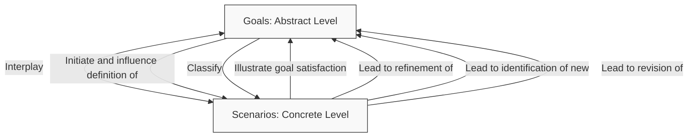

---

## 4.8 Kano Classification of Requirements

According to Noriaki Kano, requirements and system features should be classified based on their effect on **customer satisfaction**. This helps prioritize elicitation and find a balance between different types of customer needs.

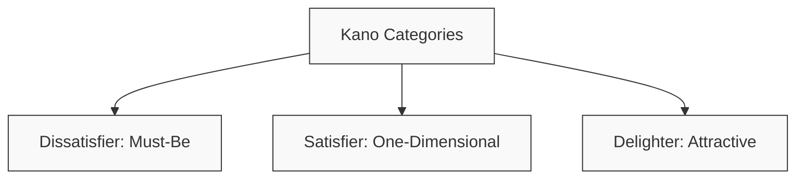

### 4.8.1 Kano Categories
1. **Dissatisfier (Must-Be Requirement):**
   - The system **must realize** this requirement to enable market entry.
   - Stakeholders take it for granted ("goes without saying") and are nearly not aware of it anymore.
   - They are **never communicated** explicitly.
   - **Missing one dissatisfier leads to extreme customer dissatisfaction**, but fulfilling them highly does not increase satisfaction.
2. **Satisfier (One-Dimensional Customer Requirement):**
   - The customer consciously demands the realization of these requirements.
   - They are in the focus of stakeholders and are **explicitly communicated**.
   - Fulfilling them **positively and linearly influences the degree of customer satisfaction**. Fulfilling them poorly reduces satisfaction.
3. **Delighter (Attractive Requirement):**
   - Unexpected and not yet conscious for the stakeholders.
   - They are **never communicated** because customers do not expect them.
   - Fulfilling them **increases customer satisfaction disproportionately (excitement)**. Not fulfilling them does not reduce satisfaction.

### 4.8.2 Evolution of Requirements over Time
Requirements are not static; their Kano classification shifts over time as technology matures:
- **Delighters $\to$ Satisfiers:** What was once exciting becomes a standard customer demand.
- **Satisfiers $\to$ Dissatisfiers:** What was once consciously demanded becomes taken for granted.

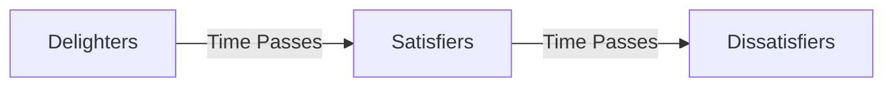

> [!example] Example: Evolution of the Antilock Braking System (ABS)
> - **1980s (Delighter):** ABS was a novel, unexpected safety feature. Having it excited car buyers.
> - **1990s (Satisfier):** Buyers consciously compared cars based on whether ABS was included.
> - **Nowadays (Dissatisfier):** ABS is taken for granted. No buyer asks if a new car has ABS; if it were missing, it would lead to immediate dissatisfaction and legal non-compliance.

### 4.8.3 Kano Classification Process
1. **Step 1:** Identify a set of requirements/features to be classified.
2. **Step 2:** Create a questionnaire to determine for each feature how a customer would feel if it is **realized** vs. if it is **not realized**.
3. **Step 3:** Analyze the answers and calculate average values.
4. **Step 4:** Classify each requirement accordingly.

> [!tip] Elicitation Hints from Kano Model
> - **Don't miss a dissatisfier!**
> - Collect a decent set of **satisfiers** (it is okay if you miss a few).
> - Make sure to include some **delighters** to stand out in the market.

### 4.8.4 Correlation of Elicitation Techniques with Kano Model
Different elicitation techniques are better suited for different Kano categories:
- **Basic factors (Dissatisfiers):** Best uncovered using **Observation** (since stakeholders take them for granted and don't speak about them) or **Document-centric** and **predecessor system analysis**.
- **Performance factors (Satisfiers):** Best uncovered using **Interviews** and **Questionnaires** (since stakeholders are conscious of them and explicitly communicate them).
- **Excitement factors (Delighters):** Best uncovered using **Creativity techniques** (brainstorming, workshops) and analyzing systems in **other domains**.

---

## 4.9 Additional Elicitation and Supporting Techniques

### 4.9.1 CRC Cards (Class-Responsibilities-Collaborators)
A technique adapted from object-oriented analysis and design.
- **Purpose:** Identifies attributes, relations, and responsibilities of business entities.
- **Process:** Stakeholders use cards to represent business entities (classes), their responsibilities (what they know or do), and collaborators (other classes they interact with).
- **Sources:** Derived from documents, manuals, dialogues, storyboards, use cases, and brainstorming.

### 4.9.2 Use Case Modeling
The definition of system functionality and interaction with the system based on external events.

### 4.9.3 Audio and Video Recording
- **Purpose:** Supports the detailed evaluation of statements and observations.
- **Important:** Stakeholder acceptance is critical, as they might feel uncomfortable or change their behavior when recorded.

### 4.9.4 Elicitation Techniques: Strengths vs. Weaknesses
| Technique | Strengths | Weaknesses |
|---|---|---|
| **Interview** | Yields deep information; permits verification of correct understanding; specific and actual results. | Time- and resource-intensive; restricted to a limited number of interview partners. |
| **Questionnaire** | Reaches a high number of participants in the target audience. | Low return rate; not suited for open questions; lacks feedback loops. |
| **Creativity Techniques** | Generates many ideas in a short time; excellent for establishing vision and features. | Not appropriate for complex problems and detailed, precise requirements. |
| **Observation** | Records real-life situations and workarounds; uncovers the obvious; shows perfecting potential. | Time- and resource-intensive; risks salvaging old and outdated processes. |
| **Document-centered** | Concentrated collection of info; independent of stakeholder availability; preserves knowledge. | Documentation is often incomplete or outdated; time- and resource-intensive. |
| **Reuse** | Low resource usage; avoids reinventing the wheel. | Requires upfront investment in creating high-quality, reusable requirements. |

---

## 4.10 Case Study: TOXLAND Game
> [!example] Case Study: TOXLAND Game
> **Background:** Pusat Racun Negara (PRN) [National Poison Centre] promotes awareness and understanding of the dangers of chemical exposure among children and young adults.
> **System Objectives:**
> 1. Make learning about toxicology more engaging via game learning.
> 2. Design educational and entertaining games that help students learn and retain important information about toxicology and chemical safety in a laboratory setting.
> - **Elicitation Techniques:** How to gather requirements? (e.g., workshops with teachers and PRN staff, observation of students playing existing games, focus groups with target age groups).

---

# Chapter 5: Documentation of Requirements

## 5.1 Introduction to Documentation

### 5.1.1 Importance of Documentation
Documentation is a critical activity in Requirements Engineering. It serves several purposes:
- **Persistence:** Elicited and developed information is easily forgotten without proper documentation. Proper documentation ensures that all project details are preserved.
- **Common Reference:** Establishes a shared understanding and common reference point for all stakeholders, including developers, testers, and clients.
- **Promotes Communication:** A common documented reference supports structured discussions and helps resolve conflicts.
- **Promotes Objectivity:** Written documentation is less amenable to unwanted alterations and subjective interpretations compared to verbal communication.
- **Supports Training:** Provides an excellent resource for bringing new team members up to speed.
- **Preserves Expert Knowledge:** Reduces project dependency on single experts by capturing and distributing technical and domain-specific knowledge.
- **Supports Problem Reflection:** The process of writing forces requirements engineers to structure their thoughts, helping them identify gaps, contradictions, and inconsistencies early.

### 5.1.2 What Should be Documented?
A comprehensive requirements document contains three types of information:
1. **Requirements:** Goals, scenarios, quality requirements, and solution-oriented requirements (across data, functional, and behavioral perspectives).
2. **Context Information:** Details about the system context (subject, usage, and IT facets), development context, and RE context.
3. **Additional Information:** Metadata about the RE process itself, such as minutes of meetings, decision rationales, change requests, and stakeholder lists.

### 5.1.3 Representation Formats
Information can be documented using different formats depending on the target audience and purpose:
- **Textual:** Natural language text, structured text, or tabular templates.
- **Model-based:** Conceptual models (e.g., DFDs, ERDs, Statecharts) capturing functional, data, or behavioral perspectives.
- **Combined:** Conceptual models with textual annotations or structured templates containing embedded models.

### 5.1.4 Documentation Templates
Templates provide a structured format (usually tabular) with predefined slots (attribute types) and values.
- **Advantages:**
  - Standardizes what information must be captured.
  - Ensures structured, consistent documentation.
  - Makes gaps and missing information easy to detect (empty slots).
  - Facilitates verification and comparison of requirements.
  - Clearly differentiates between mandatory and optional attributes.

> [!example] Example: Standard Tabular Requirements Template
> | Attribute | Description / Allowed Values |
> |---|---|
> | **Identifier** | E.g., `SR-L-<number>` |
> | **Name** | Name of the requirement |
> | **Author(s)** | Creator of the requirement |
> | **Version** | Version number |
> | **Change History** | Log of `<version>, <date>: <change description>` |
> | **Source(s)** | Name and function of the requirement source |
> | **Responsible Person** | Person in charge of implementing/managing the requirement |
> | **System Release** | Targeted release version and date |
> | **Validation Status** | `unchecked` \| `under examination` \| `partially checked` \| `checked` \| `in revision` \| `released` |
> | **Stability** | `stable` \| `probably stable` \| `volatile` |
> | **Priority** | `high` \| `medium` \| `low` |
> | **Short Description** | Brief summary of the requirement |
> | **Requirement Text** | Complete natural language statement of the requirement |
> | **Quality Requirements** | Linked quality requirements (`<identifier> <category>`) |
> | **Additional Trace Links**| Trace links to other artifacts (`<identifier> <name>, <relationship>`) |

---

## 5.2 Documents in Requirements Engineering

### 5.2.1 Definition
> [!info] Definition: Document in RE
> A document in requirements engineering serves a specific purpose. Depending on their purpose, documents differ in terms of **content** (level of detail, abstraction, structure), **format** (textual, model-based, combined), and **quality** (conformance to standards).

### 5.2.2 Purposes of Documents
Documents produced during RE are consumed by various activities:
- **Elicitation:** E.g., questionnaires for interviews, brainstorming agendas.
- **Negotiation:** E.g., argumentation documents, option comparisons.
- **Validation/Verification:** E.g., inspection protocols, validation scenarios.
- **Management:** E.g., minutes of meetings, status reports.
- **Non-RE Activities:** E.g., contract documents, design specifications, test cases.

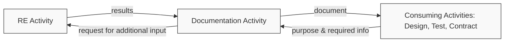

### 5.2.3 Requirements Specification Document
A requirements specification serves as input for detailed software design. It describes the system as a **white box**, defining detailed interactions and component behaviors across different abstraction layers. High quality is crucial, focusing on **completeness** and **consistency**.

---

## 5.3 Documentation of Additional Information

Additional information records the execution of RE activities to support verification, traceability, and future change management.

### 5.3.1 Elicitation & Negotiation Artifacts
- **Elicitation:** Typical info includes interview minutes, list of identified sources, brainstorming notes, and exploratory scenarios.
  - *Interview minutes* should use a predefined template:
    > [!example] Predefined Interview Minutes Template
    > - **Identifier:** `INT-<number>`
    > - **Date:** Date of interview
    > - **Goal:** Goal of the interview in one sentence
    > - **Interviewer:** Name of interviewer
    > - **Interviewee(s):** Name, function, and organization of interviewee(s)
    > - **Notes:** Bullet points detailing the discussion
- **Negotiation:** Records conflicts detected, arguments exchanged, resolutions reached, and final decisions.
  - *Decision Meetings* must document the project, date, participants, issues, voting counts, and the chosen/declined arguments.

### 5.3.2 Validation & Management Artifacts
- **Validation:** Typical info includes potential errors/defects detected and stakeholder lists.
  - *Inspection protocols* record reviewers, date, document under inspection, and reviewer comments (defect details and severity).
- **Management:** Typical info includes project plans, traceability links, change requests, and resource consumption logs.

---

## 5.4 Ambiguities in Natural Language Requirements

Natural language is inherently ambiguous. An ambiguously documented requirement has **more than one valid interpretation**, which can lead to costly defects during design and implementation.

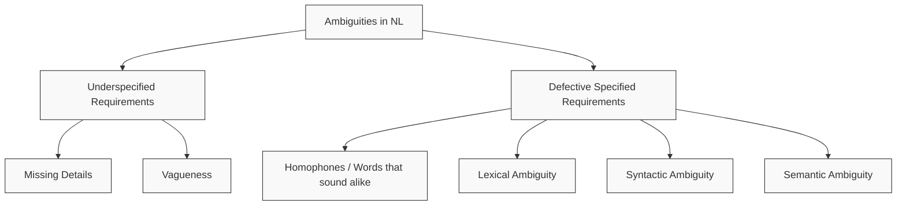

### 5.4.1 Underspecified Requirements
Underspecified requirements lack the necessary details or use vague language, leading to misinterpretation.
- **Vagueness:** A word is vague if it admits borderline cases where its applicability is uncertain.
  > [!example] Example: Vagueness
  > - **Vague Statement:** "R55: The system shall display the map **quickly**."
  > - **Problem:** A response time of $1\text{ second}$ is neither clearly fast nor slow. It might be fast for a desktop map, but slow for a car racing dashboard.
  > - **Improved Statement:** "The system shall display the map within $1.0\text{ second}$ after user selection."

### 5.4.2 Lexical Ambiguity
Lexical ambiguity occurs when a word has more than one meaning.
- **Synonyms:** Different words representing the same meaning (e.g., "car" and "automobile").
- **Homonyms:** Words spelled in the same way but having unrelated meanings (e.g., "Bank" as a financial institution vs. a river edge).
- **Polysemy:** Words with several related but different meanings sharing the same etymology.
  - **Systematic Polysemy:** Occurs due to a lack of distinction between concepts:
    - *Process vs. Product:* "Her writing was flawless" (the act of writing vs. the written product).
    - *Type vs. Unit:* "Please buy this vase" (a specific physical vase vs. a specific model of vase).

### 5.4.3 Syntactic (Structural) Ambiguity
Syntactic ambiguity occurs when a sentence can be assigned multiple syntax trees, resulting in different meanings.
1. **Analytical Ambiguity:** A word or phrase plays multiple possible grammatical roles.
   - *Example:* "The British race car driver did a good job."
     - *Interpretation 1:* The British [race car driver] (The driver is British).
     - *Interpretation 2:* The [British race car] driver (The car is British; driver's nationality is unknown).
2. **Attachment Ambiguity:** A modifier can attach to multiple parts of a sentence.
   - *Example:* "The user enters the access card with the access code."
     - *Interpretation 1:* The user enters [the access card] and [the access code].
     - *Interpretation 2:* The user enters [the access card containing the access code].
3. **Coordination Ambiguity:** Caused by combining multiple conjunctions (and, or) or using conjunctions with modifiers.
   - *Example (Conjunctions):* "If window is damaged **and** interior alarm detects intruder **or** door is opened, raise alarm."
     - *Interpretation 1:* $[(\text{window damaged} \land \text{intruder detected}) \lor \text{door opened}]$.
     - *Interpretation 2:* $[\text{window damaged} \land (\text{intruder detected} \lor \text{door opened})]$.
   - *Example (Modifier):* "The alarm shall consist of a **short** acoustic signal **and** visual signal."
     - *Interpretation 1:* A (short acoustic signal) and a (standard visual signal).
     - *Interpretation 2:* A short (acoustic signal and visual signal).
4. **Elliptical Ambiguity:** Occurs when it is unclear whether a sentence contains an ellipsis (omitted words).
   - *Example:* "Dave sees a taller man than Joe."
     - *Interpretation 1:* Dave sees a man who is taller than Joe is.
     - *Interpretation 2:* Dave sees a taller man than Joe sees.

### 5.4.4 Semantic Ambiguity
Semantic ambiguity occurs when a sentence has multiple interpretations in a specific context despite having clear grammar and vocabulary.
1. **Scope Ambiguity:** Caused by quantifiers (all, some, a) or negation operators.
   - *Example:* "All users enter a coupon code."
     - *Interpretation 1:* Every user enters the **same** coupon code.
     - *Interpretation 2:* **Each** user enters their own (different) coupon code.
2. **Referential Ambiguity:** Occurs when the antecedent of a pronoun (anaphora) is unclear.
   - *Example:* "The customer inserts the **access card** into the **card reader** and enters a **PIN**. If **this** is invalid, deny access."
     - *Problem:* Does "this" refer to the card, the reader, or the PIN?
3. **Deictic Ambiguity:** Occurs when a word has multiple reference points in the context.
   - *Example:* "Everyone thinks he is nice." (Does "he" refer to himself, or to a specific male person?).

---

## 5.5 Techniques for Avoiding Ambiguity

### 5.5.1 Glossaries
A glossary is a collection of technical terms with their specific meanings, related terms, and examples.
- **Structure of a Glossary Entry:**
  - **Term:** Name of the term (e.g., `Route`).
  - **Definition:** Explanation of the term (e.g., `A specific way from a starting point to a destination`).
  - **Synonyms:** Alternative terms (e.g., `Itinerary`).
  - **Related Terms:** Links to other terms (e.g., `Alternative route`).
  - **Examples / Counter-examples:** E.g., links to map screenshots.
- **Benefits:** Prevents different stakeholders from interpreting terms differently or using different terms for the same real-world object.

### 5.5.2 Syntactic Requirements Patterns
A requirements pattern defines a strict syntactic structure for documenting natural-language requirements and sets the meaning of keywords:
- **Rupp's Template (Rupp 2009):**
  $$\text{[<When?>]} \to \text{THE SYSTEM} \to \text{\{SHALL / SHOULD / MIGHT\}} \to \text{\{<process> / PROVIDE <whom?> WITH ABILITY TO <process> / BE ABLE TO <process>\}} \to \text{<object>}$$
- **Modifiers:**
  - `[]` represents optional constituents.
  - `{}` represents choosing one of the alternatives.
  - `<>` represents filling in the constituent.
- **Keywords:**
  - **Shall:** Mandatory requirement (must be implemented).
  - **Should:** Highly recommended.
  - **Might:** Optional / nice-to-have.
  
> [!example] Example: Applying Rupp's Template
> - *Original:* "If the glass break detector detects the damaging of a window, the system shall inform the operation office of the security service."
> - *Pattern Breakdown:*
>   - `[<When?>]`: If the glass break detector detects the damaging of a window
>   - `THE SYSTEM`
>   - `SHALL`
>   - `<process>`: inform
>   - `<object>`: the operation office of the security service

### 5.5.3 Controlled Languages
A controlled language restricts the natural-language grammar (syntax) and vocabulary for a specific domain to reduce ambiguity and support automated verification.

##### Steps to Define a Controlled Language:
1. **Elicitation of statements:** Compile colloquial domain statements.
   - *Predication:* E.g., "software is immaterial."
   - *Pointing action:* E.g., "this is a computer."
   - *Multiple predicates:* E.g., "a customer is a person who buys goods."
2. **Clarification and definition of technical terms:** Set rules for terms.
   - *Subordination:* E.g., $x \in \text{employee} \implies x \in \text{person}$.
   - *Equivalence:* E.g., $x \in \text{library card} \iff x \in \text{user card}$.
   - *Contrariness:* E.g., $x \in \text{software} \implies x \notin \text{hardware}$.
3. **Standardization of the statements:** Apply strict patterns:
   - *Participation:* `[object] HAS AN [object]` (e.g., user HAS A user status).
   - *Inclusion:* `[object] IS AN [object]` (e.g., periodical IS A collected edition).
   - *Partition:* `[object] CONSISTS OF [object]` (e.g., collected edition CONSISTS OF single editions).
   - *Ability:* `[person] CAN [action]` (e.g., user CAN borrow book).
   - *Process:* `[action] RESULTS FROM [action]` (e.g., indexing book RESULTS FROM inventorying book).
   - *Rule:* `IF [event] AND [condition] THEN [action]` (e.g., IF book returned AND period exceeded THEN remind charges).
4. **Classification of the statements:** Map statements to modeling concepts:
   - *Attribute:* E.g., user HAS A user status.
   - *Inheritance:* E.g., periodical IS A collected edition.
   - *Aggregation:* E.g., collected edition CONSISTS OF single editions.
   - *Method:* E.g., user CAN borrow book.

---

## 5.6 Transformation Defects in Natural-Language Requirements

During documentation, requirements engineers transform their perception of reality into a natural language representation, which introduces **transformation defects**.

```mermaid
graph TD
    classDef default fill:#f9f9f9,stroke:#333,stroke-width:1px;
    Reality[Universe of Discourse: Reality] -->|Engineer perceives| Perception[Perception]
    Perception -->|Engineer conceives| Conception[Notional Image / Conception]
    Conception -->|Engineer represents| Representation[Representation: NL Requirement]
    
    Representation -->|Interpreter perceives| InterpPerc[Perception]
    InterpPerc -->|Interpreter conceives| InterpConc[Notional Image / Conception]
    InterpConc -->|Interpreter associates| Reality
    
    style Representation fill:#ffcccc,stroke:#ff0000,stroke-width:1px;
```

### 5.6.1 Types of Transformation Effects
1. **Nominalization:**
   - Turning a process (verb) into a single event (noun), leading to information loss.
   - *Trigger words:* transmission, input, booking, acceptance, restart.
   - *Example:* "In case of crash, a **restart** shall be performed." (Loss of details on *how* to restart).
   - *Improved:* "If the system crashes, the user shall restart the system using the reset button on the front."
2. **Nouns without Reference Index:**
   - Using vaguely specified nouns without clear referents.
   - *Trigger words:* the user, the system, the data, the message.
   - *Example:* "The **data** shall be displayed." (Which specific data?).
   - *Improved:* "The system shall display the **billing data**."
3. **Universal Quantifiers:**
   - Overgeneralizing statements, leading to incorrect assumptions.
   - *Trigger words:* every, never, always, all, none.
   - *Example:* "The system shall process **all** input data." (Even invalid data?).
   - *Improved:* "The system shall process the **valid** input data according to schema A2."
4. **Incompletely Specified Conditions:**
   - Describing a condition but omitting the fallback action.
   - *Trigger words:* if...then, in case, whether, depending on.
   - *Example:* "The system shall offer beverages to registered guests over the age of 20." (What happens if guest is under 21?).
   - *Improved:* "The system shall offer alcohol-free beverages to users under 21, and all beverages to users over 20."
5. **Incompletely Specified Process Verbs:**
   - Using verbs that require multiple parameters without specifying them.
   - *Example:* "To log in, the login data **is entered**." (Who enters it? Where? How?).
   - *Improved:* "The system must allow the **user (Who?)** to enter **his username and password (What?)** using the **keyboard (How?)**."

---

# Chapter 6: Model-based Documentation of Requirements

## 6.1 Fundamentals of Conceptual Modelling

### 6.1.1 Model Definition
> [!info] Definition: Model (Stachowiak 1973)
> A **model** is an abstract representation of the universe of discourse created for a specific purpose (use).

> [!info] Definition: Universe of Discourse (Falkenberg et al. 1998)
> The **universe of discourse** comprises any part or aspect of the existing or conceived reality under consideration.

A model represents a purposeful abstraction:
- **Physical Models:** E.g., a physical 3D architectural model of a house.
- **Conceptual Models:** E.g., a blueprint or map (representing reality using abstract symbols and concepts).

### 6.1.2 Three Properties of Models
According to Herbert Stachowiak, any model must fulfill three properties:
1. **Representation Property:** The model maps/represents an existing reality (e.g., legacy system) or a reality to be created (e.g., system to be developed).
2. **Reduction Property:** The model is a reduced representation of reality. Only selected elements are represented, which are grouped or simplified.
3. **Pragmatic Property:** The model is constructed for a special purpose, oriented towards a specific user, use case, and time frame.

```mermaid
graph LR
    classDef default fill:#f9f9f9,stroke:#333,stroke-width:1px;
    R[Reality: Universe of Discourse] -->|Perceived by senses| P[Perception]
    P -->|Conceived| C[Notional Image / Conception]
    C -->|Represented| Model[Model Representation]
    
    style Model fill:#e1f5fe,stroke:#01579b,stroke-width:2px;
```

### 6.1.3 Data Modelling Process
- **Perceive World:** The modeler observes reality (requires domain knowledge).
- **Construct Model:** The modeler uses a modeling language and method knowledge to build the model in the model world.
- **Interpret Model:** Stakeholders read the model (requires language knowledge).
- **Associate:** Stakeholders associate the model concepts back with the real world, assessing whether it is a **good model** (useful) or a **bad model** (leads to incorrect associations).

### 6.1.4 Key Benefits of Conceptual Models
- **Focus:** Targets a specific purpose supported by a specific modeling language.
- **Comprehend:** Easier to understand and memorize than long natural-language texts.
- **Reduce Complexity:** Focuses only on relevant aspects and discards unnecessary details.
- **Foster Communication:** Provides purpose-based abstractions that bridge communication gaps.
- **Problem Solving:** Supports deep understanding and structured problem-solving.
- **Automation:** Enables automated checks and processing through partial formalization.

---

## 6.2 Goal Models

Goal models describe the system through the decomposition of high-level goals into sub-goals.
- **Vision Formulation:** Excellent for defining and communicating the system's vision.
- **Decomposition:** Goals are represented as **AND-OR-trees**:
  - **AND-Decomposition:** All sub-goals must be satisfied to satisfy the parent goal.
  - **OR-Decomposition:** At least one sub-goal must be satisfied to satisfy the parent goal.

```mermaid
graph TD
    classDef default fill:#f9f9f9,stroke:#333,stroke-width:1px;
    G1["Comfortable navigation to destination"]
    
    G1_1["Dynamic route calculation with respect to traffic congestion"]
    G1_2["Easy-to-use destination input"]
    G1_3["Well-equipped route guidance"]
    
    G1 -->|AND| G1_1
    G1 -->|AND| G1_2
    G1 -->|AND| G1_3
    
    G1_1_A["Manual input of traffic conditions"]
    G1_1_B["Automatic update of traffic data"]
    
    G1_1 -->|OR| G1_1_A
    G1_1 -->|OR| G1_1_B
```

---

## 6.3 Modelling from Three Perspectives

Conceptual models specify solution-oriented requirements from three complementary perspectives:

| Perspective | Description | Typical Models |
|---|---|---|
| **Functional** | Specifies the information manipulated by the system and the data transmitted to the system context. | Use Case Diagrams, Activity Diagrams, Data Flow Diagrams (DFDs) |
| **Data** | Specifies the structures of input/output data, static-structural aspects, and dependencies in the context. | Class Diagrams, Entity Relationship Diagrams (ERDs) |
| **Behavioural** | Documenting the reaction of the system to events, state-triggering conditions, and environmental effects. | State Machine Diagrams / Statecharts |

---

## 6.4 Use Case Modelling

Use cases were first proposed by **Ivar Jacobson (1992)** to document planned or existing system functionalities based on simple models.

### 6.4.1 Core Concepts
- **Definition:** A use case describes a completed, uninterrupted sequence of actions of an actor with the system, yielding an added value result.
- **Initiator:** An actor always starts a use case (can be a **Human**, an **Event**, or another **System**).
- **Viewpoint:** Described and named from the actor's viewpoint using a **verb** representing the action (e.g., `place order`, `calculate total`).

### 6.4.2 Scenarios and Use Cases
- Use cases are used to group and integrate related scenarios:
  - **Main Scenario:** Exactly one path representing the standard successful flow.
  - **Alternative Scenarios:** Zero to multiple paths representing alternative successful flows.
  - **Exception Scenarios:** Zero to multiple paths representing errors or failures.

```
Use Case Structure:
+-------------------------------------------------------+
| Use Case Name                                         |
|-------------------------------------------------------|
| Context (Goals, Pre-conditions, Post-conditions)       |
|-------------------------------------------------------|
| Main Scenario (Path 1)                                |
|-------------------------------------------------------|
| Alternative Scenarios (Path 2a, 2b...)                |
|-------------------------------------------------------|
| Exception Scenarios (Path e1, e2...)                  |
+-------------------------------------------------------+
```

### 6.4.3 Modelling Constructs

1. **Actor:** Covers external entities (roles, not specific instances) that interact with the system.
   - *Notation:* Stick figure (or rectangle with `<<actor>>`).
2. **Use Case:** A specific way of using the system by performing a part of the functionality.
   - *Notation:* Oval containing the name.
3. **System Boundary:** Separates the system (use cases inside) from its operational context (actors outside).
   - *Notation:* Rectangle containing system name.
4. **Association:** Represents bidirectional participation of an actor in a use case.
   - *Notation:* Solid line.
5. **Use Case Generalisation:** Specializes a general use case into more specific ones.
   - *Notation:* Solid line with a hollow triangle pointing to the general use case.
6. **Actor Generalisation:** Specializes a general actor role into specific roles.
   - *Notation:* Solid line with a hollow triangle pointing to the general actor.
7. **Relationships:**
   - `<<include>>`: Denotes that the source use case explicitly incorporates the behavior of another use case.
   - `<<extend>>`: Denotes that the source use case optionally extends the behavior of another use case.

```mermaid
graph LR
    subgraph "Online Shopping System (System Boundary)"
        UC1(View items)
        UC2(Make purchase)
        UC3(Complete checkout)
        UC4(Log in)
    end
    
    Cust((Customer)) --> UC1
    Cust --> UC2
    Cust --> UC4
    
    UC2 -->|includes| UC1
    UC2 -->|includes| UC3
    
    Auth((Authentication service)) --> UC1
    Auth --> UC3
    Auth --> UC4
    
    IdP((Identity Provider)) --> UC4
    IdP --> UC3
    
    CPS((Credit Payment Service)) --> UC3
    PP((PayPal)) --> UC3
```

> [!example] Example: Use Case Generalisation (Driver Assistance System)
> - General Use Case: `Communicate externally`
> - Specialised Use Cases: `Communicate via phone` $\to$ inherits from `Communicate externally`; `Communicate via email` $\to$ inherits from `Communicate externally`.
> - General Actor: `User`
> - Specialised Actors: `student` $\to$ inherits from `User`; `lecturer` $\to$ inherits from `User`.

> [!example] Case Study: Ticket Selling System Use Case Diagram
> - **System Boundary:** Ticket Selling System.
> - **Use Cases:** `Buy Subscription`, `Buy Tickets`, `Make Charges` (included by both `Buy Subscription` and `Buy Tickets`), `Survey Sales`.
> - **Actors:**
>   - `Ticket Vending Machine` (initiates `Buy Tickets`).
>   - `Clerk` (initiates `Buy Subscription`).
>   - `Supervisor` (initiates `Survey Sales`).
>   - `Credit Card Service` (participates in `Make Charges`).

> [!example] Exercise: Home-Baker's Ordering System
> A home-baker's ordering system allows customers to place orders for baked goods online.
> - **System Boundary:** Home-Baker's Ordering System.
> - **Actors:** `Customer`, `Baker` (or Supervisor), `Payment Service` \<\<system\>\>.
> - **Use Cases:** `Browse Menu`, `Fill Order Form` (includes `Browse Menu`), `Choose Delivery/Pickup`, `Make Payment` (includes `Fill Order Form`, associated with `Payment Service`), `Send Order Notification`, `Provide Feedback`..

### 6.4.4 Specifying Use Cases with Use Case Templates
Use case diagrams provide a visual overview of system functions and actors, but they lack detail. **Use case templates** provide structured, detailed textual descriptions (specifications) explaining the exact behavior of each use case.

> [!info] Purpose of Use Case Templates
> - Standardizes what information is captured for each use case.
> - Captures both high-level descriptions and detailed step-by-step interactions.
> - Clarifies pre-conditions, triggers, post-conditions, and alternative/exception scenarios.

#### Categories of Information in a Template
Common templates structure information into five main categories:
1. **Use Case Management Information:** ID, name, authors, version, priority, criticality.
2. **Use Case Diagram Information:** Activating actors, other participating actors, associated use cases.
3. **Contextual Information:** Sources, responsible stakeholders, pre-conditions, triggers, post-conditions.
4. **Scenario Information:** Main scenario (step-by-step normal flow), alternative scenarios, exception scenarios.
5. **References:** Links to related quality requirements, data models, or other documents.

Use case templates can be defined at two levels of detail:
- **High-level templates:** Focus on basic summaries, goals, pre-conditions, post-conditions, and actors (useful for early elicitation).
- **Detailed templates:** Include step-by-step scenario flows, triggers, results, and relationships (essential for design and testing).

#### High-Level Use Case Template
| Section | Field | Description / Content |
|---|---|---|
| **ID** | Identifier | Unique ID of the use case (e.g., `UC-10`). |
| | Name | Unique name of the use case (verb-noun). |
| **Management** | Author(s) | Names of the authors specifying the use case. |
| **Context** | Source | Reference to the stakeholder or document where it originates. |
| **Use Case Definition** | Short description | Concise summary of the use case's functionality. |
| | Goal(s) | Goal(s) satisfied by executing the use case. |
| | Actor(s) | Enumeration of all actors involved. |
| | Pre-condition(s) | Prerequisites that must hold before use case execution. |
| | Post-condition(s) | Conditions that must hold after successful execution. |
| **Relationships** | Relationship to other use cases | Description of include, extend, or generalization relationships. |

#### Detailed Use Case Template
A fully specified detailed template includes the following sections:

| Section | Field | Description / Explanation |
|---|---|---|
| **ID** | Identifier | Unique identifier of the use case. |
| | Name | Unique name for the use case. |
| **Management** | Author(s) | Name of the authors who have worked on the use case description. |
| | Version | Current version number of the documentation of the use case. |
| | Change history | List of changes (date, version, author, and reason/subject of change). |
| | Priority | Indication of importance according to prioritization technique. |
| | Criticality | Criticality of the use case for the overall success of the system. |
| **Context** | Source(s) | Denomination of the sources (stakeholder, document, system) from which it originates. |
| | Responsible stakeholder(s) | The stakeholders responsible for the use case. |
| **Use Case Definition** | Use case level | Characterisation of the current level of detail of the use case. |
| | Short description | Concise description of the use case (approximately 1/4 page). |
| | System under Discussion | Concise description of the system under discussion. |
| | Associated goal(s) | Goals satisfied by executing the use case (including goal IDs). |
| | Primary actor(s) | Indication of the primary actor. |
| | Other actor(s) | Determination of all other actors involved in the use case. |
| | Precondition | Prerequisites that need to be fulfilled before execution can be initiated. |
| | Trigger | A list of events which initiate the use case. |
| | Postcondition | A list of conditions that hold after execution of the use case. |
| | Result(s) | Description of the outputs that are created during execution. |
| | Main scenario | Description of the main scenario of the use case. |
| | Alternative scenario(s) | Description of alternative scenarios of the use case. |
| | Exception scenario(s) | Description of exception scenarios of the use case. |
| | Quality requirement(s) | Cross references to quality requirements. |
| **Relationships** | Goal(s) | Relationships of the use case to other goals than in "Associated goals". |
| | Use case(s) | Relationships to other use cases (include, extend, extensions points). |
| | Scenario(s) | Relationships of the use case to other scenarios. |
| | Solution-oriented requirement(s) | Relationships of the use case to solution-oriented requirements. |
| | Other artefact(s) | Relationships of the use case to other artefacts. |
| **Miscellaneous** | Supplementary information | Additional information regarding the use case. |
| | Open issues | A list of notes regarding the documentation of the use case. |

> [!example] Example: Detailed Use Case Template (Navigation System)
> - **Use Case ID:** `UC-04`
> - **Use Case Name:** `Navigate to destination`
> - **Author(s):** Peter Miller, Jane Smith
> - **Source:** L. White (domain expert for navigation systems)
> - **Responsible Stakeholder:** J. Smith
> - **Short Description:** The driver of the car enters the destination. The navigation system guides the driver to the desired destination.
> - **Associated Goal(s):** Entry of the destination, automatic navigation to destination.
> - **Primary Actor(s):** Driver
> - **Other Actor(s):** Driver, Information Server
> - **Precondition(s):** Driver is authenticated at the system.
> - **Postcondition:** The driver has reached the destination.
> - **Result:** The route to the destination.
> - **Main Scenario:**
>   1. The driver activates the navigation system.
>   2. The navigation system determines the current position of the car.
>   3. The navigation system asks for the desired destination.
>   4. The driver enters the destination using the control panel of the navigation system.
>   5. The navigation system displays the map of the target area.
>   6. The navigation system asks for the routing options.
>   7. The driver selects the desired routing options.
>   8. The navigation system calculates the route.
>   9. The navigation system informs the driver that the route has been calculated.
>   10. The navigation system creates a list of waypoints.
>   11. The navigation system directs the driver to the next waypoint.
> - **Alternative Scenario:**
>   - **4a:** The driver selects the destination by pointing on a map that the navigation system shows on the display.
>     - **4a1:** The driver searches the destination in the electronic maps.
>     - **4a2:** The driver marks the destination in the electronic maps.
>     - **4a3:** The navigation system identifies the coordinates of the destination.
>     - **4a4:** The navigation system displays a detailed map of the destination.
>     - **4a5:** The navigation system asks the driver to mark the destination on the detailed map.
>     - **4a6:** The driver marks the destination of the navigation.
>     - **4a7:** The navigation system identifies the street and house number.
>     - *Proceed with step 6 of the Main Scenario.*
> - **Exception Scenario:**
>   - **5a:** The navigation system cannot find the entered destination.
>     - **5a1:** The navigation system informs the driver that the entered destination is unknown.
>     - **5a2:** The navigation system asks the driver to choose another destination.
> - **Quality Requirement(s):**
>   - `Q-2-04` (Response time to user inputs)
>   - `Q-2-06` (Ease of use)

> [!example] Example: Use Case Template - Create Appointment Slot
> | Field | Content |
> |---|---|
> | **Use Case Name** | Create Appointment Slot |
> | **Scenario** | A veterinarian wants to create a new appointment slot for shelter owners to book. |
> | **Triggering Event** | Actor decides to create their availability schedule. |
> | **Brief Description** | When actor select a date on the calendar, the system prompts a message for the actor to choose available time slot. After finishing selecting the time slots, the slot is then added to the calendar and made available for booking. |
> | **Actor** | Veterinarian |
> | **Related use case** | None |
> | **Stakeholders** | Veterinarian |
> | **Preconditions** | Veterinarian must select at least one time slot. |
> | **Postconditions** | A new appointment slot is created and the calendar is updated so that it is available for booking. |
> | **Flow of activities** | **Actor:** <br>1. Veterinarian selects a date on the calendar.<br>2. Veterinarian inputs the available time slot.<br>3. Veterinarian clicks on the 'Save' button.<br><br>**System:**<br>1.1 System prompts a dialog box for user to select time slot.<br>3.1 System saves the appointment slot and updates the calendar. |
> | **Exception conditions** | If the user does not select any time slot, the system displays an error message and prompts the user to choose at least one time slot. |

> [!example] Example: Use Case Template - Edit Profile
> | Field | Content |
> |---|---|
> | **Use Case ID** | US05-MU |
> | **Use Case Name** | Edit profile |
> | **Triggering Event** | User wants to edit the profile |
> | **Brief Description** | User able to edit the profile details |
> | **Actors** | Tenant |
> | **Preconditions** | Actors have valid account |
> | **Postconditions** | Successfully login to the system |
> | **Flow Of Activities** | **Actor:**<br>1. Tenant and management enter valid email and password.<br>2. Tenant go to the profile page.<br>3. Tenant edit the profile details like change the password, name, house number.<br>4. Tenant click the save button.<br><br>**System:**<br>1. System verifies emails and password is valid.<br>2. System allow user to log in.<br>3. System able to save the data into the database. |
> | **Exception Conditions** | - User does not have an account.<br>- User enter invalid email or password.<br>- User do click the save button. |

---

# Chapter 7: Functional Modelling

## 7.1 Fundamentals of Functional Modelling
Functional modelling specifies solution-oriented requirements from the functional perspective. 

> [!info] Definition: Functional Modelling
> Functional modelling answers the following core questions about a system:
> 1. **What** are the main functions (processes) of the system?
> 2. **How** does data move (flow) between these functions and the environment?
> 3. **Where** is data stored (data stores) in the system?

### Concepts and Abstractions
- **Functional Modelling Languages:** Provide syntax and rules to document processes (functions), the manipulation of data by processes, and input-output data flow relationships among processes.
- **Functional Model:** Defines the types of functions, data flows, and data stores of a system.
- **Functional Model Instance:** Represents data about a concrete execution of a function, concrete interactions executed, and concrete data produced/consumed during execution.

```mermaid
graph TD
    classDef default fill:#f9f9f9,stroke:#333,stroke-width:1px;
    FML[Functional Modelling Language] -->|defines constructs for| FM[Functional Model: Types]
    FM -->|instantiated during runtime as| FMI[Functional Model Instance: Concrete Data/Runs]
```

### Four Modelling Layers
Functional modelling operates on four conceptual layers (from abstract grammar to concrete data):
1. **Meta-meta-model (M3):** The grammar used to build a modelling language. It defines what concepts we are allowed to model (e.g., UML meta-metamodel).
2. **Meta-model (M2):** A language that lets us describe system models (e.g., DFD elements like "Function", "Data Store").
3. **Model (M1):** The actual system model drawn (e.g., a specific DFD for a hotel booking system).
4. **Data / Instance (M0):** Actual real-world data created when the system runs.

| Layer | Flight Booking Example | Portal Login Example |
|---|---|---|
| **M3 (Meta-meta-model)** | Classifier | Classifier |
| **M2 (Meta-model)** | Function type, Data store type | Function, Data Store |
| **M1 (Model)** | `book flight`, `flight information` | `Login`, `Login detail` |
| **M0 (Data/Instance)** | Booking-2015-04-20: 3.15 PM, Flight DS18 | Login via eLearning Portal, CSE242 25.05.26 2PM |

---

## 7.2 Data Flow vs. Control Flow
A critical design decision in conceptual modeling is distinguishing between data-driven and control-driven processes:

| Feature | Data Flow | Control Flow |
|---|---|---|
| **Description** | Describes **pipelines** between processes. | Defines **process execution sequences**, events, and conditions. |
| **Transmission** | Packages of information (material or immaterial objects). | The passing of a **trigger** from one activity to the next. |
| **Concurrency** | **No explicit sequence.** All processes can, in principle, be active at the same time. | **Strict sequence.** Only one process can be active at one point in time (e.g., process 2 starts only after process 1 completes). |

> [!example] Exercise: Identifying Data Flow vs. Control Flow
> 1. *The lecturer sends the lecture notes to students via eLearning after class.* $\to$ **Data Flow** (information package is transmitted).
> 2. *The class starts automatically at exactly 0815 AM according to the system clock.* $\to$ **Control Flow** (temporal event trigger).
> 3. *A student submits a teaching assessment survey containing their thoughts about the class.* $\to$ **Data Flow** (survey document submission).
> 4. *Once 70 students have joined the Webex session, the "Start Recording" button becomes active.* $\to$ **Control Flow** (state transition condition).
> 5. *During the lecture, students type their questions into the Padlet.* $\to$ **Data Flow** (questions are typed into a store).
> 6. *If a student fails to sign in within the first 15 minutes, the attendance system locks access.* $\to$ **Control Flow** (time-out trigger).

---

## 7.3 Structured Analysis (SA) Overview
Structured Analysis (SA) is a classic software engineering method (DeMarco 1979) to analyze a problem and specify requirements.
- **Goal:** Support communication about a problem by structuring models of the problem from abstract to detailed.
- **Structured Specification Document:** The primary outcome of SA. It is highly maintainable, reduces complexity through partitioning, and uses graphical representations instead of narrative text.

### The Three Core Components of Structured Analysis (SA)
1. **Data Flow Diagrams (DFDs):** Define processes and data flows between processes and sources/sinks.
2. **Data Dictionaries:** Define the composition of the data in the stores and flows.
3. **Mini Specifications (Mini Specs):** Define primitive functions.

---

## 7.4 Data Flow Diagrams (DFDs)
Data Flow Diagrams visually represent how data is processed, moved, and stored.

### DFD Modelling Constructs
1. **Process (Function):** Represents a task or activity that transforms input data into output data.
   - *Notation:* Circle containing the process name (a verb phrase).
2. **Data Flow:** Describes the transportation of information packages of known composition.
   - *Notation:* Curved arrow labeled with the data name.
3. **Data Store:** Represents a physical or technical repository of data containing "data at rest" (e.g., file, folder, database).
   - *Notation:* Two parallel lines enclosing the store name.
4. **Source / Sink (Terminator):** External objects outside the system boundary that exchange data with the system.
   - **Source:** A terminator that provides information/services to the system.
   - **Sink:** A terminator that takes information/services from the system.
   - *Notation:* Rectangle containing the entity name.

> [!example] Example DFD 1: Hotel Room Booking System
> A simple DFD node for hotel booking:
> - **Process:** `Book Room`
> - **Source/Sinks:** `Guest` (sends `booking request`, receives `booking confirmation`), `Bank` (receives `payment validation request`, sends `booking payment validation`), `External Reservation System` (sends `booking confirmation`, receives `booking request`), `Time / Schedule` (sends `current time` to trigger booking expiry).
> - **Data Stores:** `Guests` (reads/writes `guest` info), `Bookings` (writes `booking payment validation`), `Rooms` (reads/writes `room` availability).
> 
> ```mermaid
> graph LR
>     Guest[Guest] -->|booking request| BR((Book Room))
>     BR -->|booking confirmation| Guest
>     BR -->|guest| Guests[(Guests)]
>     BR -->|booking request| Bookings[(Bookings)]
>     Rooms[(Rooms)] -->|room| BR
>     Time[Time / Schedule] -->|current time| BR
>     BR -->|payment validation request| Bank[Bank]
>     Bank -->|booking payment validation| BR
>     BR -->|booking request| ERS[External Reservation System]
>     ERS -->|booking confirmation| BR
> ```

> [!example] Quick Activity: E-Commerce DFD Order Processing
> Consider the order processing system with three processes:
> 1. **E-Commerce Process Order (Process 1):** Receives `order` from `Customer` (Source), reads/writes `customer and order information` to/from `Customer Database` (D1), and sends an `acknowledgement` back to the Customer.
> 2. **Verify Credit Card (Process 2):** Takes `credit card number and order amount` from D1, sends it to `Credit Card Company` (Secondary Actor/Sink), receives `approval or rejection`, and writes status back to D1.
> 3. **Ship Order (Process 3):** Takes `product type and amount` from the `Inventory` (D2), sends `confirmation and delivery date` to Customer.
> 
> *Key Analysis Questions:*
> - **Rejection effect:** If the credit card is rejected in Process 2, the payment flow stops. A rejection status is written to D1, which prevents Process 3 from executing.
> - **Flow categories:** `order` and `product type and amount` are data flows (containing information/material). The `approval or rejection` and the start-recording activation represent control flows (triggering processes).

---

## 7.5 Data Dictionaries
Because DFDs can be ambiguous, a **data dictionary** is used to formally define the exact structure of each data flow and data store in a DFD. 

> [!info] Definition: Data Dictionary
> The entries of a data dictionary are typically defined in an **EBNF** (Extended Backus-Naur Form) language to specify composition. It does not aim to define the actual implementation data structures, but rather their conceptual content.

### EBNF Operators for Data Dictionaries
| Operator | Meaning | Explanation | Example |
|---|---|---|---|
| **`=`** | Equivalence | "Is equivalent to" / defines a data element. | `name = given name + family name` |
| **`+`** | AND | Composition of data elements (concatenation). | `address = street + city` |
| **`(...)`** | Optional | Zero or one occurrence of the elements in brackets. | `address = street + city + (+ country)` |
| **`[...]`** | Selection | Choice of exactly one of several possible alternatives, separated by `\|`. | `address type = ["home" \| "parents" \| "emergency contact"]` |
| **`{...}`** | Iteration | Selection/repetition of 0 to $N$ elements. | `students = {student}` |
| **`x{...}y`** | Bounded Iteration | Repetition with a lower boundary $x$ and upper boundary $y$. | `pet = 1{dog \| cat \| bird}2` (at least 1, at most 2) |
| **`"..."`** | Data Primitive | Primitive data value which is not further decomposed. | `gender = ["M" \| "F"]` |
| **`*...*`** | Comment | Textual description or explanation. | `*student since registration*` |

> [!example] Example 1: Student Graduation Status
> ```
> students        = {student}               *A set of student records*
> student         = studentID 
>                   + degree program 
>                   + degree progress 
>                   + student profile
> degree program  = degree name 
>                   + {course to take + course description}
> degree progress = {course passed} + {course failed}
> student profile = name 
>                   + {address} 
>                   + date of registration 
>                   *student since registration date*
> address         = street + zip + city + country + address type
> address type    = ["home" | "parents" | "emergency contact"]
> ```

> [!example] Example 2: Assignment Submission checking
> ```
> assignments      = {assignment}
> assignment       = assignmentID 
>                    + course 
>                    + submission 
>                    + grading
> course           = courseCode + courseName + lecturer
> submission       = file + submissionDate + submissionStatus
> grading          = score + feedback + gradedBy + gradingDate
> file             = filename + filetype + filesize
> submissionStatus = ["submitted" | "pending" | "late" | "missing"]
> score            = mark + maxMark
> mark             = integer (0–100)
> maxMark          = integer (e.g., 100)
> feedback         = comment + feedbackDate
> comment          = string
> lecturer         = lecturerID + name + email
> gradedBy         = lecturerID
> ```

### Practical Hints for Data Dictionaries
- **Avoid redundancies:** Reuse already defined data elements where possible.
- **Adopt terms:** Use terms known to the stakeholders to improve understanding.
- **Avoid circular definitions:** Do not define elements in a loop.
- **Define synonyms:** Explicitly note naming conflicts as synonyms in comments.
- **Stop defining:** Stop decomposing terms when your user clearly understands their meaning.

---

## 7.6 Hierarchization of DFDs (Levelling)
To manage system complexity, Structured Analysis uses **levelling** to partition a complex system into a hierarchy of DFDs:

1. **Context Diagram (Level Context):** Represents the entire system as a single process node (labeled `0`) interacting with external sources and sinks. It establishes the system context boundary.
2. **Level 0 Diagram:** Decomposes the Context process `0` into major subsystems or functional areas (labeled `1, 2, 3, ...`).
3. **Level 1, 2, ... Diagrams:** Successively partition parent process nodes (e.g., process `4` is decomposed into `4.1, 4.2, 4.3`) until reaching **functional primitives** (processes that do not need further decomposition).

---

## 7.7 Balancing of DFDs
To ensure consistency across the DFD hierarchy, strict **balancing rules** are applied:

1. **Visible Balancing:** Every input and output data flow of a parent process node must also be directly visible in the child data flow diagram.
2. **Data Dictionary Balancing:** A data flow can be split up into multiple flows at the lower level, provided that the breakdown is clearly defined in the data dictionary (e.g., parent has flow `N`, child has flows `K` and `L`, with `N = K + L` in the dictionary).
3. **Visual Data Store Balancing:** If a data store is used at the parent level, every child diagram must show which subprocesses read from or write to it.
4. **Data Dictionary Data Store Balancing:** You do not need to show the entire data store everywhere, but you must show all its components in child diagrams (if it is defined in the data dictionary as `store 1 = a + b`, you can show access to component `a` in one child diagram and component `b` in another).

---

## 7.8 Mini Specifications (Mini Specs)
Functional primitives (processes that are not further decomposed in the DFD hierarchy) are defined in detail using **Mini Specifications**.

- **Purpose:** Describes how a primitive process (function) produces its outputs based on its inputs in terms of a coarse strategy.
- **Format:** Typically written using structured natural language or decision tables.
- **Length:** Recommended length is $\frac{1}{2}$ to $1\text{ page}$. Longer indicates too complex (needs decomposition); shorter indicates too fine-grained.

> [!example] Example: Mini Spec of "Calculate Price"
> **DFD Excerpt:**
> - Process: `calculate price`
> - Inputs: `book order` (flow), `price list` (data store), `customer file` (data store)
> - Outputs: `order price` (flow), `discount category` (flow)
> 
> **Data Dictionary Excerpt:**
> ```
> book order    = customer number + { book number }
> customer file = customer number + discount category
> price list    = book number + discount category + price
> price         = ...
> ```
> 
> **Mini Specification of the process "calculate price":**
> For each book order, do the following:
> 1. Look up the discount category in the customer file for the customer number from the book order.
> 2. For each book number in the book order, do the following:
>    - Look up the price in the price list for the combination of book number and discount category.
> 3. Add all prices to determine the sum.
> 4. If the sum is higher than \$100, subtract 10% to calculate the final order price.

### Hints for Writing Mini Specs
- Use an unambiguous style of writing.
- Reference terms defined in the data dictionary.
- Keep sentences short.
- Use positive active/passive formulations.
- Specify conditions before successive actions.

---

# Chapter 8: Data Modelling

Data modelling is the process of defining and specifying solution-oriented requirements from the **data perspective**, capturing the static-structural aspects of a system.

## 8.1 Solution-Oriented Requirements (SOR)
Solution-oriented requirements (SOR) represent the most detailed level of requirements. They define the system's structure and behavior across three perspectives:
1. **Data perspective:** Specifies input/output data structures and dependencies (static-structural aspects).
2. **Functional perspective:** Specifies functions, processes, and data flows.
3. **Behavioural perspective:** Specifies system reactions to events and state changes.

### Characteristics of SOR
- **Arrangement:** Must be agreed upon by all stakeholders.
- **Completeness:** Should define all details necessary for implementation and testing.
- **Conflict Resolution:** Stakeholders must resolve conflicts that emerge during requirements engineering and agree on the requirements to be fulfilled.
- **Level of Detail:** Should facilitate unambiguous realization of the system.
- **Intended Solution:** Specifies the intended solution, restricting the solution space to facilitate implementation or even automatic generation on specific platforms.

### Requirements Types: Level of Agreement vs. Level of Detail
We can categorize requirements based on their level of detail and stakeholder agreement:
- **Goals (Low detail, low agreement):** High-level intentions or objectives concerning system usage and properties. They are abstract and contain few details.
- **Scenarios (Medium detail, medium agreement):** Concrete examples of satisfying or failing to satisfy goals, structured as a sequence of interaction steps.
- **Solution-oriented Requirements (High detail, high agreement):** Highly detailed requirements specifying data, functional, and behavioral perspectives, as well as quality requirements and constraints.

```mermaid
graph TD
    classDef default fill:#f9f9f9,stroke:#333,stroke-width:1px;
    G["Goals<br/>(Low Detail / High Abstraction)"] --> S["Scenarios<br/>(Medium Detail / Sequence of Steps)"]
    S --> SOR["Solution-Oriented Requirements<br/>(High Detail / Multi-Perspective)"]
```

---

## 8.2 Entity-Relationship (ER) Modelling Language
Entity-Relationship (ER) modeling is a widespread, standard language for documenting static aspects of the system context on the conceptual level.

### 8.2.1 Entity Type
An **entity type** represents a set of physical or conceptual objects (entities) with similar properties.
- **Concept:** It abstracts from concrete instances. Entities can be material (e.g., `BOOK`) or immaterial (e.g., `LIBRARY USER`).
- **Notation:** Represented as a rectangle containing the entity type name (usually in uppercase).

### 8.2.2 Relationship Type
A **relationship type** relates two or more entity types to each other.
- **Concept:** Represents a set of similar relationship instances relevant to the system.
- **Notation:** Represented as a diamond connected to the participating entity types, labeled with the relationship name (typically a verb in uppercase). Role names can optionally be written along the connection lines.
- **Kinds of Relationship Types:**
  - **Binary Relationship:** Relates exactly two entity types.
    - *Example:* `STUDENT` -- attends --> `LECTURE`
  - **Reflexive Relationship:** Relates an entity type to itself.
    - *Example:* `PERSON` (Wife) -- married to --> `PERSON` (Husband)
  - **Ternary Relationship:** Relates three entity types.
    - *Example:* `COMPANY` and `PRODUCT` and `PERSON` related by `PROVIDES`

### 8.2.3 Attribute
An **attribute** defines a property of an entity type or relationship type.
- **Concept:** Can be defined for both entities and relationships (representing properties of the association).
- **Notation:** Represented as an oval/ellipse connected to the corresponding entity or relationship type, containing the attribute name. Alternatively, listed as a line label.
  - *Example:* `LIBRARY USER` has attributes `ID`, `First name`, `Last name`. The relationship `BORROWS` has the attribute `Period`.

### 8.2.4 Cardinality Constraint
A **cardinality constraint** restricts the permissible number of entities of a certain type that may participate in a relationship instance.
- **Concept:** Documented as a pair `(min, max)` where:
  - `min` is the minimum number of relationships an entity must participate in. A `min = 0` denotes an optional relationship.
  - `max` is the maximum number of relationships an entity can participate in.
- **Notation:** Placed near the entity type line.
  - *Example:* `LIBRARY USER` `(0, 20)` ----- `BORROWS` ----- `(0, 1)` `Book`
    - *Interpretation:* A library user may borrow 0 to 20 books (layer M1 model). A book may be borrowed by 0 or 1 library users.
  - **Valid Instantiation (Layer M0):** Cardinality constraints restrict which runtime instances (M0) are valid for a given model (M1).

> [!example] ER Modelling Constructs Summary
> ```mermaid
> graph LR
>     classDef entity fill:#e3f2fd,stroke:#1565c0,stroke-width:2px;
>     classDef rel fill:#f1f8e9,stroke:#558b2f,stroke-width:2px;
>     
>     U["LIBRARY USER"]:::entity ---|"(0,20)<br/>Borrower"| B{{"BORROWS"}}:::rel
>     B ---|"(0,1)<br/>Borrowed item"| BK["BOOK"]:::entity
>     
>     %% Attributes
>     U --- U_ID([ID])
>     U --- U_LN([Last name])
>     U --- U_FN([First name])
>     
>     B --- B_P([Period])
>     
>     BK --- BK_ID([ID])
>     BK --- BK_T([Title])
> ```

---

## 8.3 UML Class Diagrams
Unified Modeling Language (UML) Class Diagrams are a widespread, object-oriented language for specifying static system structures.

### 8.3.1 Class
A **class** describes a static structural element of the system.
- **Notation:** A box divided into three compartments:
  1. **Top Compartment:** Name of the class (mandatory).
  2. **Middle Compartment:** Attributes of the class.
  3. **Bottom Compartment:** Methods/operations of the class.
- *Example Option 1 (Mermaid Diagram - Recommended):*
  ```mermaid
  classDiagram
      class LibraryUser {
          lastName
          firstName
          dateOfBirth
      }
  ```

- *Example Option 2 (Corrected Markdown Table):*

| `LibraryUser` |
| :--- |
| lastName<br/>firstName<br/>dateOfBirth |
| |

- *Example Option 3 (HTML Table):*
  <table>
    <tr><th align="left">LibraryUser</th></tr>
    <tr><td>lastName<br/>firstName<br/>dateOfBirth</td></tr>
    <tr><td>&nbsp;</td></tr>
  </table>


### 8.3.2 Attributes
Attributes represent properties of a class.
- **Basic Elements Syntax:** `[visibility] name: [type] [[multiplicity]] = [default] {[property-string]}`
- **Basic Properties:**
  - **Name:** Labels the attribute.
  - **Type:** Defines the data or object type.
  - **Multiplicity:** Restricts the number of values (e.g., `[1..1]`, `[1..*]`).
- **Advanced Elements:**
  - **Visibility:**
    - Public (`+`)
    - Private (`-`)
    - Protected (`#`)
    - Derived (`/`)
  - **Default:** Pre-defined value (e.g., `= "New user"`).
  - **Property-string:** Additional characteristics (e.g., `{ordered}`).
- *Example:* `+ lastName: String [1..1] = "New user" {ordered}`

### 8.3.3 Association
An **association** represents a relationship between classes.
- **Notation:** A line connecting the classes, with:
  - **Name:** Labels the association.
  - **Multiplicities:** Placed at each end to indicate min/max instances.
  - **RoleName:** Placed at each end to indicate the class's role in the relationship.
  - **Property String:** E.g., `{ordered}`.
- *Example:* `LibraryUser` `(0..1 borrower)` ------ borrows ------> `(0..20 borrowedItem)` `Book`

### 8.3.4 Association Class
An **association class** documents properties and operations that belong to the *existence* of the association itself (rather than to either of the participating classes).
- **Concept:** Necessary when the information depends on the association and cannot be stored in either class.
- **Notation:** A dashed line connecting the association line to a class box.
- *Example:* A library loan has a return date. This return date is stored in an association class `Lending` with the attribute `returnDate: Date` connecting `LibraryUser` and `Book`.

### 8.3.5 Aggregation
An **aggregation** represents a hierarchical, whole-part relationship between an aggregate class and its part classes.
- **Concept:** The lifetime of the parts is **independent** of the whole. A part can belong to multiple wholes or change owners.
- **Notation:** An open/white diamond at the aggregate (whole) end of the connection line.
- *Example:* `Course` `<>`-------- `Student` (a student's lifetime does not depend on the course, and they can be enrolled in other courses).

### 8.3.6 Composition
A **composition** is a strong form of aggregation representing a strict whole-part relationship.
- **Concept:** The lifetime of the parts is **dependent** on the whole. The parts cannot exist without the composite, and a part can belong to only one composite at a time. The multiplicity at the composite end is always `1` or `0..1`.
- **Notation:** A filled/black diamond at the composite (whole) end of the connection line.
- *Example:* `Series` `{filled diamond}`-------- `Volume` (a volume of a series cannot exist without the series itself).

### 8.3.7 Generalisation
A **generalisation** relates a subclass to a superclass, representing inheritance.
- **Concept:** Subclasses inherit all attributes, operations, and relationships from the superclass. They can also define additional attributes/operations/relationships or override inherited ones.
- **Notation:** An arrow with an open/white triangular head pointing to the superclass.
- *Example:* `Book` is a superclass for `Textbook` and `Dictionary`.

### Generalisation Sets
A generalisation set classifies how subclasses partition the superclass space based on two dimensions:
1. **Disjoint vs. Overlapping:**
   - **Disjoint (D):** An object of the superclass can belong to **only one** subclass.
   - **Overlapping (O):** An object of the superclass may belong to **two or more** subclasses.
2. **Complete vs. Incomplete:**
   - **Complete (C):** Every object of the superclass must belong to **at least one** subclass.
   - **Incomplete (I):** There can be objects of the superclass that **do not belong to any** subclass.

#### Four Combinations:
- **Disjoint & Complete (DC):** Subclasses cover the entire superclass, and have no common instances.
  - *Example:* `LibraryUser` partitioned into `Adult` and `Teenager` with `{complete, disjoint}`.
- **Disjoint & Incomplete (DI):** Subclasses do not cover the entire superclass, but have no common instances.
  - *Example:* `Vehicle` partitioned into `Motorcycle` and `Passenger Car` with `{incomplete, disjoint}`.
- **Overlapping & Complete (OC):** Subclasses cover the entire superclass, and can share common instances.
  - *Example:* `Bank Customer` partitioned into `Private Customer` and `Business Customer` with `{complete, overlapping}`.
- **Overlapping & Incomplete (OI):** Subclasses do not cover the entire superclass, and can share common instances.
  - *Example:* `Vehicle` partitioned into `Landcraft` and `Seacraft` with `{incomplete, overlapping}`.

> [!example] UML Class Diagram Constructs Summary
> ```mermaid
> classDiagram
>     class LibraryUser {
>         +lastName: String [1..1]
>         +firstName: String [1..*]
>         +dateOfBirth: Date
>     }
>     class Book {
>         +shelfmark: String
>     }
>     class Textbook
>     class Dictionary
>     class Lending {
>         +returnDate: Date
>     }
>     
>     LibraryUser "0..1" --> "0..20" Book : borrows
>     (LibraryUser, Book) .. Lending
>     
>     Book <|-- Textbook
>     Book <|-- Dictionary
>     
>     LibraryUser <|-- Adult
>     LibraryUser <|-- Teenager
>     note for Adult "Generalization Set:\n{complete, disjoint}"
> ```

---

## 8.4 Practical Hints for Data Modelling

### 8.4.1 Class vs. Attribute
- **Rule:** A class represents an object with its own identity. An attribute represents a property of a class.
- **Guideline:** If a potential class has only **one attribute** and is related to another class, it is usually better to model it as a simple attribute of that other class.
- *Example:*
  - *Initial:* `Student` (name, address) --owns--> `Student ID Card` (studentID)
  - *Improved:* `Student` (name, address, studentID)

### 8.4.2 Attribute vs. Relationship Type
- **Rule:** If an attribute of a class $C_1$ is actually a reference to another class $C_2$, model it as an **association/relationship** between $C_1$ and $C_2$.
- *Example:*
  - *Initial:* `Invoice` has attribute `customer` (holding customer information).
  - *Improved:* `Invoice` connected via association `has invoice` to `Customer` class.

### 8.4.3 Entity Type vs. Relationship Type
- **Rule:** An entity type represents an object with an independent identity. A relationship type represents an association whose identity is derived from the participating entities.
- *Example:* The relationship `BORROWS` derives its identity from the participating `LIBRARY USER` and `BOOK` instances. If the relationship itself has complex behavior or independent identity, consider using an Association Class (or reifying it as a separate entity).


