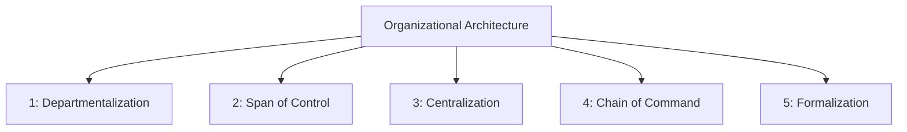
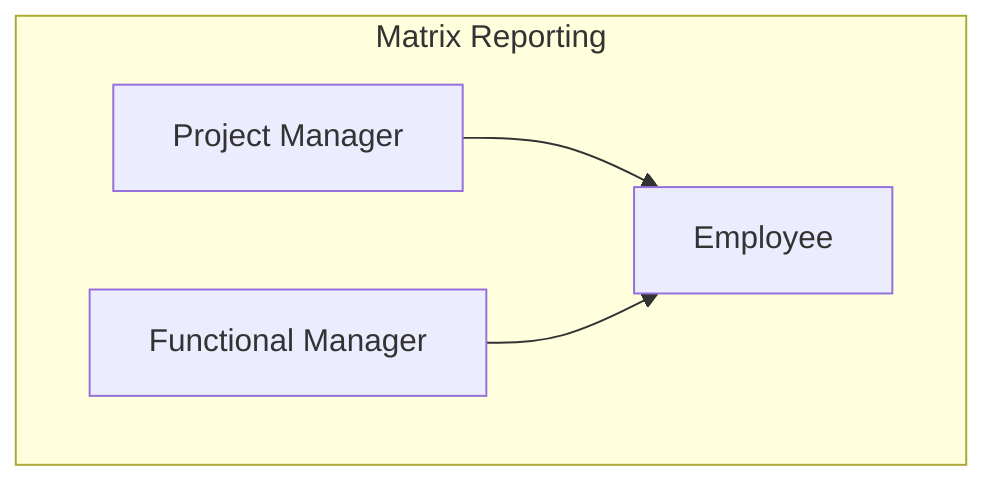
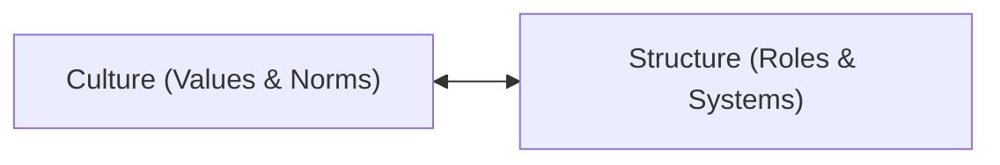
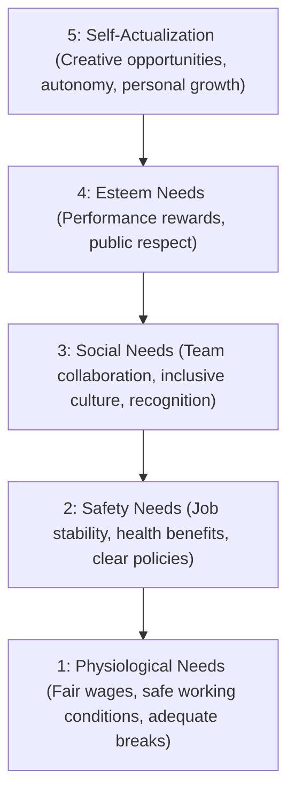
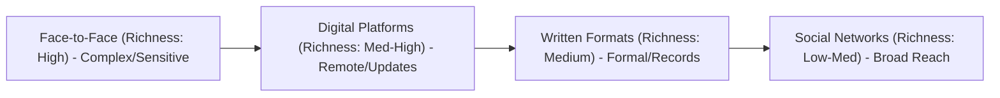

# Chapter 11: Organisation Structure and Design

## 11.1 Introduction to Organizational Design
Organizational design is the strategic process of aligning an organization's structure with its purpose, enabling it to achieve its long-term goals through systematic coordination and efficient resource allocation.
- **Within the P-O-L-C Framework:** While *Planning* sets the strategic direction, *Organizing* establishes the structural foundation required to coordinate tasks, allocate resources, and support the *Leading* and *Controlling* functions.
- **Design as a Strategic Lever:** Effective design goes beyond arranging boxes on a chart; it improves communication flow, clarifies roles, accelerates decision-making, and fosters innovation in dynamic business environments.

## 11.2 Defining Organizational Structure
> [!info] Definition: Organizational Structure
> The formal system of task and reporting relationships that controls, coordinates, and motivates employees to work together to achieve organizational goals.

Structure serves as the operational blueprint, defining:
- **Roles & Responsibilities:** Clarifying who does what.
- **Communication Channels:** Establishing how information travels across the organization.
- **Task Coordination:** Setting up mechanisms to integrate activities across different departments.

## 11.3 The Strategic Purpose of Design
Organizational design is implemented to achieve four primary strategic objectives:
1. **Operational Excellence:** Minimizes redundancy, eliminates duplicate functions, and streamlines workflows across departments.
2. **Decision Agility:** Establishes clear authority lines and reduces approval layers, enabling faster response times.
3. **Cultural Reinforcement:** Aligns the formal structure with desired organizational values, behaviors, and employee engagement strategies.
4. **Strategic Adaptability:** Balances stability with flexibility, maintaining operational consistency while enabling rapid market responsiveness.

> [!important] Strategic Design Principle
> Structure is not static; it is a primary source of strategic competitive advantage. It must adapt dynamically to changes in strategy and environment.

## 11.4 Five Key Elements of Structure
The architecture of any organization is built on five foundational structural decisions:

1. **Departmentalization:** The basis by which individual jobs are grouped together into departments or units.
2. **Span of Control:** The number of subordinates reporting directly to a single manager.
3. **Centralization:** The degree to which decision-making authority is concentrated at higher levels of the organization.
4. **Chain of Command:** The continuous line of authority that extends from upper organizational levels to the lowest levels, clarifying reporting lines.
5. **Formalization:** The extent to which policies, procedures, job descriptions, and rules are written and standardized.

## 11.5 Departmentalization Models
Organizations group jobs using different models depending on their size, strategy, and environmental complexity:

### 1. Functional Structure
Groups employees based on specialized functions or expertise (e.g., Marketing, Finance, Operations, HR).
- **Strengths:** Deep functional expertise, clear career progression paths, high resource utilization efficiency, and economies of scale.
- **Challenges:** Creation of functional silos (departments working in isolation), slower cross-departmental response times, reduced customer focus, and communication barriers.

### 2. Product-Based Structure
Organizes units around specific products, services, or business lines.
- **Advantages:** Enhanced product focus, faster decision-making within divisions, clear accountability for product performance, and specialized product expertise.
- **Key Challenge:** *Resource Duplication.* Each product division requires its own HR, IT, and marketing support, which increases overhead and operational costs.
- **Ideal For:** Large diversified firms (e.g., consumer electronics, pharmaceutical firms, automotive manufacturers).

### 3. Geographic Structure
Organizes activities by territory, country, or region (e.g., Asia-Pacific, Europe, Americas divisions).
- **Benefits:** Enables local market adaptation, cultural sensitivity, local regulatory compliance, and regional competitive responsiveness.
- **Ideal For:** Multinational corporations operating in highly varied global markets.

### 4. Process Structure
Groups activities along the sequence of the workflow or production stages (e.g., Raw Material Sourcing $\rightarrow$ Manufacturing $\rightarrow$ Distribution $\rightarrow$ Customer Sales).
- **Benefits:** Streamlines production flow, enhances process efficiency, and creates clear workflows.

### 5. Customer-Centric Departmentalization
Places specific customer segments at the center of the structural design.
- **Strategic Advantages:** Enhanced service quality, tailored solutions for distinct user needs, and improved customer satisfaction and loyalty.
- **Common Applications:**
  - *Banking:* Separating retail banking from corporate/investment banking.
  - *Healthcare:* Dividing pediatric care from geriatric care.
  - *Technology:* Structuring B2B (business-to-business) separately from B2C (business-to-consumer) divisions.

## 11.6 Centralization vs. Decentralization
The distribution of decision-making authority significantly shapes organizational speed and control:

### Centralization (Authority at the Top)
Decision-making authority remains concentrated at upper management levels.
- **Pros:** Consistent policy implementation, strong organizational control and oversight, reduced internal conflict, and a unified strategic direction.
- **Cons:** Bureaucratic delays, decision-making bottlenecks, and low employee empowerment.
- **Best Suited For:** Stable environments, highly regulated industries, and large-scale standardized operations.

### Decentralization (Empowering Lower Levels)
Authority is delegated to lower-level and frontline managers.
- **Pros:** Enhanced agility, quick response to market and customer shifts, faster decision-making (fewer approval layers), greater employee motivation, and leverage of local frontline insights.
- **Cons:** Risk of inconsistent customer experiences and potential duplicate efforts.
- **Key Philosophy:** Local teams respond faster than centralized commands.

## 11.7 Span of Control: Narrow vs. Wide
The span of control determines the shape of the organizational hierarchy:

| Feature | Narrow Span of Control | Wide Span of Control |
| :--- | :--- | :--- |
| **Hierarchy** | Tall structure (many management layers). | Flat structure (few management layers). |
| **Autonomy** | Close supervision and mentorship. | Greater employee autonomy and empowerment. |
| **Communication** | Multi-layered, slower feedback loops. | Faster, more direct communication flow. |
| **Overhead** | High management overhead and costs. | Reduced management overhead. |
| **Strengths** | Enhanced quality control, clear accountability. | Encourages employee initiative, reduces bureaucracy. |

### Factors Determining the Optimal Span
Effective span determination requires a balanced analysis of three critical factors:
1. **Subordinate Skill Level:** Highly skilled, experienced, and professional employees require less supervision, supporting a wider span.
2. **Task Complexity:** Routine, standardized tasks support wider spans, whereas complex, highly specialized work requires closer oversight and a narrower span.
3. **Management Support Systems:** The presence of robust digital communication systems, clear procedures, and automated tracking extends a manager's reach, enabling wider spans.

## 11.8 Formalization and Standardization
Formalization balances rule-following compliance with operational flexibility:
- **High Formalization (Compliance Focus):** Characterized by detailed written procedures, standardized processes, clear compliance guidelines, and consistent outcomes. It reduces ambiguity and is essential for quality control in safety-critical sectors.
- **Low Formalization (Innovation Focus):** Emphasizes flexible guidelines, adaptive processes, employee autonomy, and creative problem-solving. It enhances rapid response capabilities and is critical for innovation-driven cultures.

## 11.9 Organizational Charts and Chart Types
Organizational charts are visual management tools used to depict formal hierarchies, clarify chains of command, facilitate communication, support onboarding, and enable strategic planning.

### Four Advanced Chart Types
- **Vertical (Hierarchical):** Traditional pyramid model showing defined authority levels and a clear top-down chain of command. *Best for: Established corporations, manufacturing.*
- **Horizontal (Lateral):** Flat model that minimizes management layers, prioritizing collaboration and cross-functional teamwork over strict hierarchy. *Best for: Startups, creative agencies.*
- **Matrix Structure:** Dual-reporting model where employees report to both a functional manager (e.g., Head of Engineering) and a project/product manager. *Best for: Project-based firms, consulting.*
- **Circular (Network):** A decentralized model consisting of concentric circles, emphasizing equal access to leadership, collaborative decision-making, and open information sharing. *Best for: Innovation labs, research centers.*

## 11.10 Designing for Change: Agile and Project-Based Structures
To survive in dynamic markets, modern organizations adopt adaptive designs:
- **Agile Structures:** Cross-functional teams organized around projects or customer needs rather than rigid departments. They iterate rapidly through short feedback cycles and operate with high autonomy.
- **Project-Based Teams:** Dynamic groups formed to achieve specific objectives within set timelines. Once the project concludes, the teams dissolve and reform elsewhere, ensuring optimal resource allocation.
- **Benefits:** Faster market response, enhanced innovation, and reduced bureaucratic delays.

## 11.11 Network and Virtual Organizations
Network structures create decentralized ecosystems that extend beyond traditional physical boundaries:
- **Core Strategy:** Outsource non-core functions to specialized external partners, replacing rigid hierarchies with strategic alliances.
- **Benefits:** Minimizes fixed infrastructure costs, scales operations up or down instantly based on demand, and provides access to global talent.
- **Example:** *GitLab* operates with 1,300+ employees across 65+ countries with no physical headquarters.

## 11.12 Technology's Impact on Structure
Technology acts as a primary enabler of structural flattening and agility:
- **Digital Collaboration Revolution:** Platforms like Slack, Microsoft Teams, and Asana remove communication barriers, allowing instant coordination across time zones and departments.
- **Cloud-Enabled Flexibility:** Cloud-based repositories allow seamless, secure access to shared resources, reducing dependency on physical offices.
- **Structural Transformation:** Organizations adopting integrated digital platforms and flatter reporting structures report up to **40% faster decision-making** and accelerated innovation cycles.

## 11.13 Remote Work and Data-Driven Design
As physical presence becomes optional, design shifts toward data-driven optimization:
- **Outcome-Based Management:** Management focus shifts from physical presence to performance. Results-driven KPIs replace time-based tracking, and trust becomes a structural pillar.
- **AI-Driven Analytics:** Machine learning models analyze collaboration patterns, identify communication bottlenecks, and optimize team compositions.
- **Smart Structural Optimization:** Continuous refinement of reporting lines and spans of control through automated data-feedback loops.

## 11.14 Cultural Alignment and Structure Fit
Culture and structure share a symbiotic relationship; each shapes and reinforces the other.

### Three Key Cultural Alignments
1. **Innovation Culture:** Requires a **flat, decentralized structure** with cross-functional teams to support autonomy and experimentation.
2. **Stability Culture:** Requires a **hierarchical, centralized, and highly formalized structure** to ensure consistency, control, and compliance.
3. **Inclusion Culture:** Requires a **matrix or network structure** with transparent communication to promote equity, voice, and collaborative leadership.

## 11.15 Global Considerations in Design
Multinational structures must balance the tension between global integration and local responsiveness:
- **Global Integration Benefits:** Standardized processes, consistent brand identity worldwide, economies of scale, and cross-regional knowledge sharing.
- **Local Responsiveness Needs:** Customizing products to local customer preferences, adapting to regional competitive dynamics, and complying with local regulations.
- **Structural Models:**
  - *Regional Divisions:* Provide high local autonomy.
  - *Global Product Lines:* Enforce a unified global strategy.
  - *Global Matrix:* Combines both to manage complex dual demands.

## 11.16 Common Pitfalls and Best Practices
### Structural Pitfalls to Avoid
- **Over-Structuring:** Excessive hierarchy and bureaucracy that slows decision-making and stifles innovation.
- **Under-Structuring:** Unclear roles, lack of accountability, and coordination chaos.
- **Strategy Misalignment:** A structure that fails to support organizational goals, leading to conflicting priorities and resource inefficiencies.

### Design Excellence Principles
- **Start with Strategy:** Align the organizational structure directly with strategic objectives, and conduct regular strategy-structure reviews.
- **Involve Employees:** Gather frontline insights during structural changes, build buy-in through participation, and test designs.
- **Keep It Simple:** Minimize unnecessary complexity, ensure clear reporting lines, and create an intuitive organizational flow.

---

# Chapter 13: Human Resource Management

## 13.1 Introduction to Strategic HRM
Modern Human Resource Management (HRM) has evolved from a traditional administrative department into a core strategic business partnership:
- **The Strategic Shift:** Moving beyond basic payroll, compliance, and record-keeping (cost-center model) to act as a primary value creator.
- **Strategic Integration:** Aligning human capital strategies directly with overall organizational objectives.
- **Competitive Advantage:** Developing the workforce as a source of sustainable, inimitable differentiation.
- **Performance Alignment:** Connecting individual employee performance directly to business outcomes.

## 13.2 The Strategic Role of HR
Modern HR acts as a cornerstone of organizational success by fulfilling four distinct roles:
1. **Culture Architect:** Shapes values, expectations, employee behaviors, and organizational identity.
2. **Innovation Catalyst:** Drives creative thinking, adaptability, and organizational change management.
3. **Performance Partner:** Aligns human capital capabilities with business goals, optimizing productivity.
4. **Competitive Advantage Developer:** Builds unique, valuable organizational capabilities through targeted talent acquisition and growth.

## 13.3 HRM in the USM APEX Context
In institutions like Universiti Sains Malaysia (USM), the APEX initiative integrates values-driven management with HR excellence:
- **Excellence:** Fostering continuous improvement in recruitment, data-driven strategic workforce planning, and innovation in career development.
- **Harmony:** Creating inclusive environments, building cross-departmental collaboration, and supporting work-life balance.
- **Togetherness:** Developing leaders who unite people around shared institutional goals and strengthen cross-functional partnerships.

> [!tip] APEX HR Impact
> By embedding Excellence, Harmony, and Togetherness into daily HR practices, USM builds a values-driven culture that supports both individual growth and institutional excellence.

## 13.4 Core Functions of HRM
The HR value chain relies on five essential pillars:
1. **Recruitment:** Strategic talent acquisition through competency-based hiring and cultural alignment.
2. **Training & Development:** Enhancing capabilities through structured learning and skill advancement.
3. **Performance Management:** Evaluating and providing feedback systematically to drive excellence.
4. **Compensation & Benefits:** Designing fair, competitive reward systems to attract and motivate talent.
5. **Employee Relations:** Fostering a positive workplace culture through communication and conflict resolution.

## 13.5 Recruitment and Competency-Based Hiring
Traditional recruitment focused heavily on credentials and experience. Today’s strategic approach prioritizes **competencies** and **cultural fit**:
- **Job Analysis:** Thoroughly examining role responsibilities to determine required competencies.
- **Person Specifications:** Creating detailed profiles of the ideal candidate's behaviors and attributes.
- **Behavioral Interviews:** Utilizing structured questions about past behavior to predict future performance.
- **Assessment Centers:** Applying multi-method evaluations, including role-play simulations and group exercises.

> [!note] Hiring Impact
> Competency-based hiring increases employee retention by **40%** and improves performance alignment by **60%** compared to traditional hiring methods.

## 13.6 Strategic Training and Development (T&D)
T&D builds long-term organizational capability through continuous learning.

### Training Needs Analysis (TNA) Framework
Before launching training, HR must apply the TNA framework:
- Identify skill gaps between current employee capabilities and required competencies.
- Align training objectives with organizational strategic goals.
- Assess learning needs across individual, team, and organizational levels.
- Evaluate the anticipated return on investment (ROI) for training initiatives.

### Strategic Training Programs
- **Leadership Development:** Cultivating next-generation leaders.
- **Technical Upskilling:** Helping employees adapt to technological changes.
- **Cross-functional Training:** Building organizational flexibility.
- **Cultural Competency:** Enhancing global collaboration.
- *Impact:* Investing in structured T&D programs reports **40% higher employee retention** and a **25% improvement in operational efficiency**.

## 13.7 Workforce Planning and Forecasting
Workforce planning ensures the organization has the *right people, in the right roles, at the right time*.
- **The Delphi Method:** A strategic forecasting technique where a panel of experts answers questionnaires in multiple anonymous rounds. A facilitator summarizes the responses and feeds them back, allowing experts to reach a consensus. It eliminates bias and is ideal for long-term planning under uncertainty.
- **Trend Analysis:** Utilizing historical operational data to recognize patterns, model future staffing needs, and integrate promotion and departure trends.
- **Benefits:** Reduced recruitment costs, shorter time-to-fill, and enhanced organizational agility.

## 13.8 Key HR Metrics for Forecasting
HR professionals use data-driven metrics to anticipate staffing gaps:

1. **Turnover Rate:**
   $$\text{Turnover Rate (\%)} = \left( \frac{\text{Number of separations during period}}{\text{Average number of employees during period}} \right) \times 100$$
   *Purpose:* Identifies retention risks and predicts future hiring needs.
2. **Absenteeism Rate:**
   $$\text{Absenteeism Rate (\%)} = \left( \frac{\text{Total days absent}}{\text{Total possible workdays}} \right) \times 100$$
   *Purpose:* Assesses workforce reliability and productivity patterns.
3. **Time-to-Hire:**
   $$\text{Time-to-Hire (Days)} = \text{Date of offer acceptance} - \text{Date of job posting}$$
   *Purpose:* Measures recruitment efficiency and process bottlenecks.
4. **Employee-to-Manager Ratio:**
   $$\text{Employee-to-Manager Ratio} = \frac{\text{Total number of employees}}{\text{Total number of managers}}$$
   *Purpose:* Evaluates structural flatness and organizational scalability.

## 13.9 Succession Planning and Continuity
Succession planning ensures leadership continuity and prevents knowledge loss:
- **Talent Identification:** Systematically assessing high-potential employees using performance data and leadership competencies.
- **Development Pathways:** Constructing structured mentoring, cross-functional assignments, and leadership training.
- **Knowledge Transfer:** Documenting critical processes and client relationships.
- **Transition Planning:** Designing clear timelines and support systems for smooth leadership changes.
- *Impact:* Robust succession planning reduces leadership gaps by **75%** and maintains operational continuity.

## 13.10 Employment Law in Malaysia
HR practices must align with Malaysia's foundational employment laws:
- **Employment Act 1955:** Governs basic terms of employment, including minimum wage, working hours, and leave entitlements, establishing fundamental employee protections.
- **Industrial Relations Act 1967:** Regulates relationship standards between employers, employees, and trade unions, outlining collective bargaining and peaceful dispute resolution.
- **Occupational Safety and Health Act (OSHA) 1994:** Mandates employer responsibility to ensure safe, healthy work environments through risk assessments and training.

## 13.11 Legal Compliance & Employee Rights
Key compliance standards in Malaysia include:
- **Minimum Wage:** Under the Minimum Wage Act 2018, the current rate is **RM 1,500 per month** (as of 2024), covering all skilled and semi-skilled workers.
- **Working Hours:** Daily limit of **8 hours** and a weekly limit of **48 hours**, with mandatory rest break intervals.
- **Leave Entitlements:** Minimum of **12 days annual leave** (after 1 year of service), **14 days sick leave**, and **60 days paid maternity leave**.
- **Anti-Discrimination:** Protects employees from discrimination based on race, gender, religion, or disability during hiring, promotion, and termination under the Employment Act 1955.

## 13.12 Strategic Diversity & Inclusion (D&I)
- **Strategic Value:** Inclusive organizations outperform competitors by leveraging diverse perspectives to drive innovation, enhance decision-making, and reduce groupthink.
- **Talent Magnet:** Attracting top performers from all backgrounds, improving market intelligence.
- *D&I Advantage:* Organizations with diverse leadership teams are **70% more likely to capture new markets** and report higher employee engagement (Malaysian Diversity Research, 2023).

## 13.13 Malaysian Workforce Demographics and the Leadership Gap
Despite progress, a significant gap remains between general workforce participation and senior leadership representation:
- **Gender Split:** The general labor force is almost equal (**Male 51% \| Female 49%**), but senior management remains heavily skewed (**Male 82% \| Female 18%**).
- **Ethnic Breakdown:** The labor force consists of **Malay 69%**, **Chinese 23%**, **Indian 7%**, and **Others 1%**. In senior management, the split is **Malay 72%**, **Chinese 21%**, **Indian 4%**, and **Others/PWD < 1%**.
- **Persons with Disabilities (PWD):** Make up **2.4%** of the general workforce but hold **less than 1%** of senior management roles.

> [!warning] The Gap Challenge
> Despite near-equal workforce participation, women hold only 18% of senior roles, while ethnic minorities and PWD face significant leadership representation barriers.

## 13.14 Digital Transformation in HR
Organizations leverage technology to achieve administrative excellence:
- **HR Information Systems (HRIS):** Integrate databases, automate workflows, and provide self-service employee portals.
- **Cloud-Based Advantages:** Reduce IT infrastructure costs, enhance data security, and enable remote access.
- **Streamlined Operations:** Automate payroll, track digital attendance, and monitor statutory compliance.
- *Impact:* Malaysian SMEs report a **40% reduction in HR administrative workloads** after implementing an HRIS.

## 13.15 AI and Automation in Recruitment
AI tools improve efficiency but require ethical safeguards:
- **AI-Driven Tools:** Resume screening algorithms (reduce time-to-hire by up to 75%), video interview analyzers (speech/facial pattern metrics), and chatbot pre-screening.
- **Algorithmic Bias Risks:** Risks of cultural, linguistic, gender, or age-related bias.
- **Critical Safeguards:** Final decisions must require human judgment, regular bias audits must be conducted, and candidates must retain the right to human review.

## 13.16 Industrial Relations and Collective Bargaining
Building sustainable labor agreements requires trust and collaboration:
- **The Collective Bargaining Process:**
  $$\text{Preparation \& Research} \longrightarrow \text{Formal Negotiations} \longrightarrow \text{Agreement Drafting} \longrightarrow \text{Implementation \& Monitoring}$$
- **Success Story:** In the Malaysian palm oil sector, open dialogue and data-driven proposals led to mutually beneficial wage agreements, reducing labor tensions while improving productivity.

## 13.17 Dispute Resolution and Industrial Action
The Industrial Relations Act 1967 requires a structured process to resolve disputes:
1. **Initial Dispute:** Workplace conflict emerges.
2. **Mediation & Dialogue:** Joint consultative committees engage to resolve the issue.
3. **Ministry Intervention:** The Ministry of Human Resources steps in for formal mediation.
4. **Resolution:** A sustainable agreement is reached.
*Note:* Unauthorized strikes carry strict legal consequences; mandatory notice and ministry approval are required before industrial action.

## 13.18 Employee Well-being and Mental Health
- **Strategic Integration:** Employee mental health is treated as a strategic priority under Malaysia's National Mental Health Policy (2022).
- **Core Components:** Confidential Employee Assistance Programs (EAPs), mental health awareness campaigns, manager training to recognize distress, and flexible leave policies (mental health days).
- *Impact:* Organizations prioritizing mental health see **21% higher profitability** and **40% lower turnover rates** (WHO Global Health Observatory, 2023).

## 13.19 Leadership and Emotional Intelligence (EI) in HR
HR leaders must possess high emotional intelligence to navigate complex interpersonal dynamics:
- **Self-Awareness:** Recognizing personal emotions and biases.
- **Self-Regulation:** Maintaining composure under pressure.
- **Motivation:** Driving excellence and inspiring teams.
- **Empathy:** Understanding employee perspectives.
- **Social Skills:** Facilitating effective communication and conflict resolution.
- *Applications:* 360-degree feedback, mindfulness training, and mentoring programs.

## 13.20 Global HRM and Expatriate Management
Managing international talent requires a structured expatriate framework:
- **International Staffing Challenges:** Assessing cultural intelligence (CQ), providing language and cultural pre-departure preparation, managing culture shock, and designing strategic repatriation to prevent reverse culture shock and retain talent.

## 13.21 Ethics and Data Privacy (PDPA)
Malaysia’s Personal Data Protection Act (PDPA) 2010 mandates transparent data processing:
- **Key Principles:** Consent (explicit permission), Purpose Limitation (use data only for specific HR purposes), Data Accuracy, Security Safeguards (encrypted storage), and Retention Limits.
- *Compliance:* Employees have the right to access, correct, and request deletion of personal information, which must be addressed within 30 days.

## 13.22 HRM from an Islamic Perspective
In the Malaysian context, Islamic management principles provide ethical foundations:
- **Amanah (Trust):** Sacred responsibility to manage human resources with transparency, accountability, and ethical stewardship.
- **Adl (Justice):** Providing equitable treatment, fair compensation, and balanced decision-making.
- **Sidq (Truthfulness):** Promoting honest communication, authentic feedback, and integrity across all HR processes.

## 13.23 Future Trends and Reflections
- **Emerging Trends:** The evolution of the gig economy requiring adaptive strategies, green HR practices (aligning operations with environmental stewardship), and AI-human partnerships.
- **Final Reflection:**
  > [!quote] Reflective Insight
  > "The future of HRM lies not in systems alone—it is in the human spirit that transforms organizations into communities where every individual thrives."
  > — Dr. Ainul Mohsein Abdul Mohsin

---

# Chapter 14: Elements of Behaviour in Organisation

## 14.1 Introduction to Organisational Behaviour
> [!info] Definition: Organisational Behaviour (OB)
> The systematic study of how individuals and groups interact within workplace settings, and how these interactions influence organizational effectiveness, culture, and ethical environments.

### Core Focus Areas of OB
- **Individual Dynamics:** Psychological foundations that shape individual workplace behaviors.
- **Group Interactions:** How teams and social structures influence performance and collaboration.
- **Organizational Systems:** Cultural and structural factors that guide employee conduct.
- **Ethical Framework:** Responsible decision-making and value-driven leadership.

## 14.2 Psychological Foundations of Individual Behavior
Understanding what drives individual behavior begins with examining the internal psychological drivers that shape how employees think, feel, and act:
- **Perception:** How individuals interpret and organize sensory information from their environment to create their personal lens of organizational reality.
- **Attitudes:** Learned evaluations (positive or negative) that influence behavior toward people, objects, and situations, directly impacting job satisfaction and commitment.
- **Personality:** Stable mental and behavioral traits that predict behavior patterns, leadership potential, and team compatibility.
- **Values:** Fundamental, enduring beliefs that guide behavior and decisions, determining what individuals consider important and worthwhile.

## 14.3 Perception and Perceptual Distortions
Perception shapes how we view workplace reality, but cognitive shortcuts can lead to unfair judgments and biased decisions:
- **Halo Effect:** When one positive characteristic (e.g., physical attractiveness, speaking skill) influences the overall evaluation of an individual, leading to assumptions of high competency.
- **Stereotyping:** Assigning generalized characteristics to an individual based solely on their membership in a specific demographic group (e.g., assuming older workers lack technology skills).
- **Selective Perception:** The tendency to focus only on information that confirms existing beliefs while ignoring contradictory, objective performance data.

> [!warning] Biases in the Workplace
> Perceptual distortions undermine organizational fairness, reduce employee trust, and contribute significantly to workplace conflict.

## 14.4 Personality: The Big Five Model
Five core personality dimensions shape individual behavior in the workplace:

| Trait | Description | Workplace Impact |
| :--- | :--- | :--- |
| **Openness** | Curiosity, creativity, and willingness to embrace new experiences. | Challenges established processes; highly effective in innovative roles. |
| **Conscientiousness** | High organization, dependability, and goal-directed behavior. | Strong predictor of job performance; reliable and consistent team member. |
| **Extraversion** | Sociability, assertiveness, and high energy levels. | Effective in leadership roles; thrives in collaborative team settings. |
| **Agreeableness** | Cooperation, trust, empathy, and kindness. | Promotes conflict resolution and acts as a team harmony builder. |
| **Neuroticism** | Emotional instability, anxiety, and stress-prone response patterns. | High levels make performance under pressure difficult. |

## 14.5 Motivation: Maslow's Hierarchy of Needs
Maslow's model proposes that individuals are motivated by a hierarchy of five progressive needs:

> [!note] Adaptation Note
> In multicultural and remote work environments, the hierarchy remains highly relevant but requires adaptive management to address isolation and diverse cultural values.

## 14.6 Motivation: Herzberg's Two-Factor Theory
Frederick Herzberg posits that job satisfaction and dissatisfaction are driven by two independent sets of factors:

### 1. Hygiene Factors (Extrinsic) - *Dissatisfaction Preventers*
- These factors do not create motivation, but their absence causes high dissatisfaction.
- *Examples:* Salary and benefits, job security, working conditions, company policies, quality of supervision, and interpersonal relations.
- *Rule:* Absence = Dissatisfaction; Presence = Neutrality (no dissatisfaction, but no motivation).

### 2. Motivators (Intrinsic) - *Satisfaction Creators*
- These factors drive genuine job satisfaction and high performance.
- *Examples:* Achievement, recognition, meaningful work, responsibility, autonomy, personal growth, and advancement opportunities.
- *Rule:* Presence = High motivation; Absence = Neutrality (no motivation, but no dissatisfaction).

## 14.7 Group Dynamics: Tuckman's Five Stages of Group Formation
Teams develop through five distinct stages, requiring different leadership styles at each phase:
1. **Forming (Getting Acquainted):** Team members meet,Cautious, polite interactions. High dependence on the leader for guidance.
2. **Storming (Working Through Conflicts):** Interpersonal conflicts emerge over roles, responsibilities, and leadership. A critical phase requiring skilled conflict resolution.
3. **Norming (Establishing Trust):** Mutual trust, group norms, and team cohesion develop. Collaborative problem-solving begins.
4. **Performing (Peak Performance):** High autonomy and coordination. The team focuses on goal achievement, effective communication, and rapid adaptation.
5. **Adjourning (Closure and Reflection):** Task completion and team dissolution, accompanied by recognition of achievements and learning consolidation.

## 14.8 Group Roles and Norms
- **Role Clarity Benefits:** Eliminates task overlap and responsibility gaps, reduces stress caused by ambiguous expectations, enhances individual accountability, and prevents boundary conflicts.
- **Shared Norms Benefits:** Establishes common standards for behavior, creates predictable group interaction patterns, and builds psychological safety, trust, and mutual respect.

> [!quote] Group Transformation
> "When everyone knows their role and shares common expectations, groups transform from collections of individuals into cohesive teams."

## 14.9 Organizational Culture: The Invisible Architecture
Organizational culture is the shared values, beliefs, assumptions, and practices that define how members interact and make decisions:
- **Values & Beliefs:** Guide decision-making processes, shape organizational priorities, and define ethical standards.
- **Shared Practices:** Include daily rituals, routines, communication patterns, and problem-solving approaches.
- **Behavioral Impact:** Determines employee engagement levels, innovation capacity, and resistance or acceptance of change.

## 14.10 Hofstede's Cultural Dimensions in the Workplace
National culture shapes communication and workplace dynamics across three primary dimensions:
- **Power Distance:**
  - *High Power Distance:* Hierarchical structures and top-down decisions (e.g., Malaysia).
  - *Low Power Distance:* Equality emphasis and participative management (e.g., Sweden).
- **Individualism vs. Collectivism:**
  - *Individualistic:* Prioritizes personal goals, autonomy, and individual achievement (e.g., USA).
  - *Collectivistic:* Prioritizes in-group harmony, loyalty, and consensus (e.g., Japan).
- **Uncertainty Avoidance:**
  - *High Avoidance:* Relies on clear rules, structured environments, and stability (e.g., Germany).
  - *Low Avoidance:* Embraces innovation, risk-taking, and change (e.g., Singapore).

## 14.11 Sources of Power in Organizations
Power is the capacity to influence the behavior of others. Managers draw power from six sources:
1. **Legitimate Power:** Formal authority derived from position within the hierarchy.
2. **Reward Power:** The authority to distribute positive reinforcement (promotions, bonuses, recognition).
3. **Coercive Power:** The authority to apply disciplinary actions, penalties, or sanctions (damages long-term trust).
4. **Expert Power:** Influence built on specialized knowledge, skills, and expertise.
5. **Referent Power:** Influence based on personal charisma, respect, and admiration.
6. **Information Power:** Influence stemming from control over access to critical information.

## 14.12 Organizational Politics and Influence Tactics
- **Positive Influence Tactics:** Focus on inspirational appeals (building vision), rational persuasion (using data and facts), consultation (involving others), and coalition building (creating supportive alliances).
- **Negative Political Behaviors:** Involve manipulation (deception), intimidation (creating fear), information hoarding, and blame-shifting (avoiding accountability).

> [!note] Politics and Trust
> Ethical influence tactics build organizational trust and drive change, whereas negative politics erodes corporate culture and performance.

## 14.13 Communication Channels and Media Richness
Media Richness Theory states that the choice of communication channel must match the complexity of the message:

- **Face-to-Face:** Provides rich non-verbal cues, immediate feedback, and trust. Best for complex discussions.
- **Digital Platforms (Video/Chat):** Real-time interaction, visual/audio cues. Best for remote collaboration.
- **Written Formats (Reports/Emails):** Permanent record, detailed information. Best for formal announcements and instructions.
- **Social Networks:** Broad reach, rapid dissemination. Best for brand building and team engagement.

## 14.14 Barriers to Effective Communication
- **Digital Age Challenges:** Information overload (constant notifications, reduced attention span) and technical barriers (platform incompatibility, connectivity issues).
- **Remote Work Complications:** Loss of non-verbal cues (missing facial expressions, higher risk of misinterpretation) and time zone gaps (delayed responses, reduced spontaneous collaboration).

## 14.15 Ethical Behavior and Decision-Making
- **Core Principles:** Integrity (actions aligned with values), transparency (open processes), accountability (taking responsibility), and fairness (equity for stakeholders).
- **Impact:** Builds long-term trust, enhances brand reputation, reduces compliance risks, and creates a sustainable competitive advantage.

## 14.16 Ethical Theories in Practice
Managers use four primary ethical frameworks to resolve workplace dilemmas:
- **Utilitarianism:** Focuses on consequences. The goal is to maximize overall happiness and utility (e.g., cost-benefit analysis for restructuring to save the majority of jobs).
- **Deontology:** Focuses on moral duty and universal rules regardless of outcomes (e.g., refusing to manipulate financial data even if it prevents a stock decline).
- **Virtue Ethics:** Focuses on character, integrity, and moral virtues (e.g., demonstrating courage and fairness in daily leadership decisions).
- **Justice Theory:** Focuses on fairness and equitable distribution of opportunities, resources, and benefits (e.g., implementing unbiased hiring and promotions).

## 14.17 Managing Change and Resistance
Resistance is a natural psychological reaction to organizational transitions.

### Core Reasons for Resistance
- **Fear of the Unknown:** Uncertainty about job security, skill adequacy, and new processes.
- **Loss of Control:** Disruption to established routines, decision-making power, and reporting structures.
- **Perceived Inequity:** Uneven distribution of benefits, favoritism concerns, or inconsistent communication.
- *Example:* A Malaysian manufacturing firm's ERP implementation faced major resistance due to job redundancy fears and inadequate training.

## 14.18 Kotter's 8-Step Change Model
To overcome resistance, Kotter provides a behaviorally grounded framework:
1. **Create Urgency:** Highlight the risks of inaction with compelling stories.
2. **Form a Coalition:** Assemble influential leaders as change champions.
3. **Create a Vision:** Develop a clear, values-aligned direction.
4. **Communicate the Vision:** Use multiple channels for consistent messaging.
5. **Empower Action:** Remove structural obstacles and provide training.
6. **Generate Wins:** Celebrate early successes to build momentum.
7. **Sustain Acceleration:** Use credibility from wins to tackle bigger challenges.
8. **Anchor Changes:** Embedded new approaches into organizational culture.

## 14.19 Leadership Influence and Models
- **Trait Leadership (Who Leaders *Are*):** Predicts potential based on innate qualities like confidence, integrity, decisiveness, and intelligence.
- **Behavioral Leadership (What Leaders *Do*):** Focuses on learnable behaviors, balancing Task Orientation (results-focused) with Relationship Orientation (people-focused).
- **Situational Leadership (How Leaders *Adapt*):** Styles must match follower readiness:
  - *Directing:* Low competence, low commitment.
  - *Coaching:* Low competence, high commitment.
  - *Supporting:* High competence, low commitment.
  - *Delegating:* High competence, high commitment.

## 14.20 Transformational Leadership: The Four I's
Transformational leadership drives high performance and innovation through four behaviors:
1. **Idealized Influence:** Acting as ethical role models, demonstrating integrity, and building authentic trust.
2. **Inspirational Motivation:** Articulating a compelling vision and communicating optimism to energize teams.
3. **Intellectual Stimulation:** Challenging the status quo and encouraging creative, out-of-the-box problem-solving.
4. **Individualized Consideration:** Providing personalized coaching, mentoring, and support based on unique needs.
5. *Impact:* Transformational leaders increase employee engagement by up to **40%** and foster innovation.

## 14.21 Workplace Diversity and Inclusion
To enhance innovation and agility, organizations must implement the full D&I framework:
- **Diversity:** Ensuring representation of different backgrounds, experiences, and perspectives.
- **Inclusion:** Fostering a sense of belonging, equal voice in decisions, and psychological safety.
- **Equity:** Ensuring fair access to opportunities and eliminating systemic barriers.
- *Benefits:* Diverse thinking enhances creativity, improves decision-making, increases retention, and helps understand diverse customer needs.

## 14.22 Stress and Employee Well-being
- **Stressors:** Excessive workload, role ambiguity, job insecurity, poor work-life balance, and interpersonal conflict.
- **Individual Coping:** Problem-focused coping (time management, boundary setting) and emotion-focused coping (mindfulness, resilience building).
- **Organizational Well-being Programs:** Employee Assistance Programs (EAPs), flexible work arrangements, mental health training, and creating psychologically safe spaces.
- *Impact:* Comprehensive well-being programs lead to **25% lower turnover** and higher engagement.

## 14.23 Team Performance and Virtual Teams
- **Team Effectiveness Model:** Relies on *Inputs* (composition, skills, resources), *Processes* (communication, decision-making, conflict resolution), and *Outputs* (performance, innovation, quality).
- **Virtual Team Challenges:**
  - *Trust Building:* Requires deliberate transparency, consistent follow-through, and regular check-ins.
  - *Technology Integration:* Using Slack/Teams for collaboration, video conferencing for connection, and project management tools for accountability.

## 14.24 Synthesis: The Human Element in Progress
Sustainable organizational success depends on the dynamic interplay of individual behavior, group dynamics, and ethical leadership:
- **Individual Foundations:** Perception, personality, and motivation form the base of effective management.
- **Group Dynamics:** Teams that navigate formation stages and establish role clarity achieve peak performance.
- **Cultural Architecture:** Organizational culture acts as the invisible force guiding behavior and change.
- **Ethical Leadership:** Prioritizing integrity and adaptability builds trust and drives transformation.
- *Conclusion:* The science of organizational behavior continues to evolve, but people remain at the heart of all progress.
